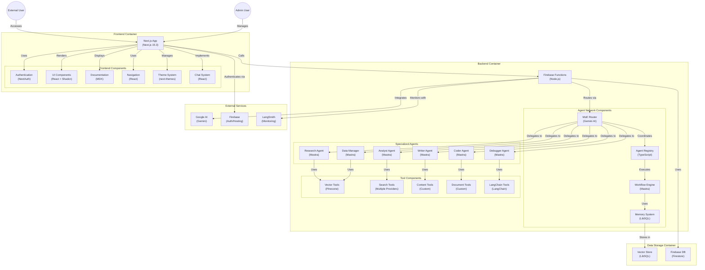

# Current High Level Architecture

- This isnt exact but should give you atleast a overall visual of workspace.

```mermaid
graph TB
    User((External User))
    Admin((Admin User))

    subgraph "Frontend Container"
        NextApp["Next.js App<br>(Next.js 15.3)"]

        subgraph "Frontend Components"
            AuthComponents["Authentication<br>(NextAuth)"]
            UIComponents["UI Components<br>(React + Shadcn)"]
            DocComponents["Documentation<br>(MDX)"]
            NavComponents["Navigation<br>(React)"]
            ThemeSystem["Theme System<br>(next-themes)"]
            StreamChat["Chat System<br>(React)"]
        end
    end

    subgraph "Backend Container"
        FirebaseFunctions["Firebase Functions<br>(Node.js)"]

        subgraph "Agent Network Components"
            MoERouter["MoE Router<br>(Gemini AI)"]
            AgentRegistry["Agent Registry<br>(TypeScript)"]
            WorkflowEngine["Workflow Engine<br>(Mastra)"]
            MemorySystem["Memory System<br>(LibSQL)"]
        end

        subgraph "Specialized Agents"
            ResearchAgent["Research Agent<br>(Mastra)"]
            AnalystAgent["Analyst Agent<br>(Mastra)"]
            WriterAgent["Writer Agent<br>(Mastra)"]
            CoderAgent["Coder Agent<br>(Mastra)"]
            DebuggerAgent["Debugger Agent<br>(Mastra)"]
            DataManagerAgent["Data Manager<br>(Mastra)"]
        end

        subgraph "Tool Components"
            VectorTools["Vector Tools<br>(Pinecone)"]
            SearchTools["Search Tools<br>(Multiple Providers)"]
            ContentTools["Content Tools<br>(Custom)"]
            DocumentTools["Document Tools<br>(Custom)"]
            LangChainTools["LangChain Tools<br>(LangChain)"]
        end
    end

    subgraph "Data Storage Container"
        LibSQLStore["Vector Store<br>(LibSQL)"]
        FirebaseDB["Firebase DB<br>(Firestore)"]
    end

    subgraph "External Services"
        GoogleAI["Google AI<br>(Gemini)"]
        Firebase["Firebase<br>(Auth/Hosting)"]
        LangSmith["LangSmith<br>(Monitoring)"]
    end

    User -->|Accesses| NextApp
    Admin -->|Manages| NextApp

    NextApp -->|Uses| AuthComponents
    NextApp -->|Renders| UIComponents
    NextApp -->|Displays| DocComponents
    NextApp -->|Uses| NavComponents
    NextApp -->|Manages| ThemeSystem
    NextApp -->|Implements| StreamChat

    NextApp -->|Calls| FirebaseFunctions

    FirebaseFunctions -->|Routes via| MoERouter
    MoERouter -->|Coordinates| AgentRegistry
    AgentRegistry -->|Executes| WorkflowEngine
    WorkflowEngine -->|Uses| MemorySystem

    MoERouter -->|Delegates to| ResearchAgent
    MoERouter -->|Delegates to| AnalystAgent
    MoERouter -->|Delegates to| WriterAgent
    MoERouter -->|Delegates to| CoderAgent
    MoERouter -->|Delegates to| DebuggerAgent
    MoERouter -->|Delegates to| DataManagerAgent

    ResearchAgent -->|Uses| VectorTools
    AnalystAgent -->|Uses| SearchTools
    WriterAgent -->|Uses| ContentTools
    CoderAgent -->|Uses| DocumentTools
    DebuggerAgent -->|Uses| LangChainTools
    DataManagerAgent -->|Uses| VectorTools

    MemorySystem -->|Stores in| LibSQLStore
    FirebaseFunctions -->|Uses| FirebaseDB

    FirebaseFunctions -->|Integrates| GoogleAI
    NextApp -->|Authenticates via| Firebase
    FirebaseFunctions -->|Monitors with| LangSmith
```
