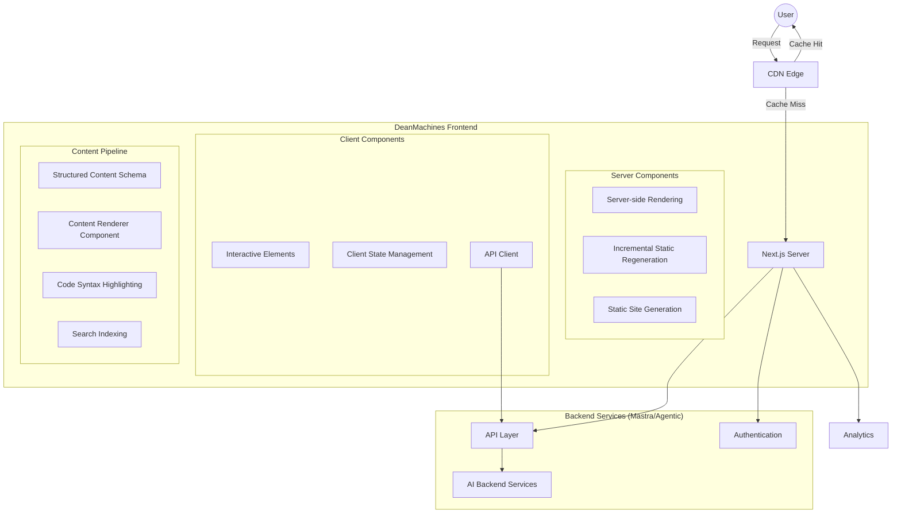
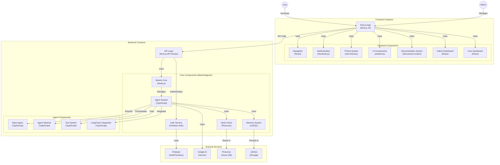
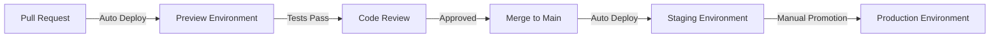
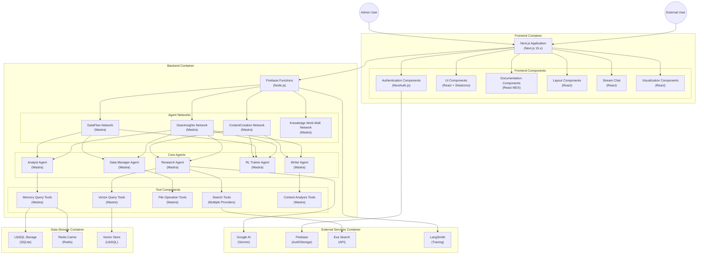

# DeanMachines AI Platform


[](https://wakatime.com/@7a2fb9a0-188b-4568-887f-7645f9249e62)

A modern, high-performance front-end for the DeanMachines AI platform, built with Next.js 15, TypeScript, and TailwindCSS. Designed for both dynamic server-side rendering and static exports with Firebase hosting, this platform provides comprehensive AI development and deployment services featuring:

- **Mastra AI Integration**: Fully implemented agent systems, workflows, and tools with Google Vertex AI
- **Firebase/Google Cloud**: Complete serverless backend with authentication, database, and cloud functions
- **Static Export Support**: Optimized for Firebase hosting with client-side compatibility
- **Agent-driven Tools**: Intelligent workflows powered by LLM models from OpenAI, Anthropic, and Google

## 🌟 Features

### Frontend

- **Next.js 15.3.0**: Leveraging the latest Next.js features with optimized static exports
- **Tailwind CSS 4.1.3**: Modern utility-first CSS framework with glass morphism and advanced animations
- **TypeScript 5.x**: Full type safety with strict mode and advanced typing
- **Authentication System**: Complete client-side Firebase authentication with email/password, Google, and GitHub providers
- **Responsive Design**: Mobile-first approach with container queries and responsive typography
- **Static Export Compatibility**: Optimized for Firebase hosting with client-side data fetching

### Mastra AI Integration

- **Agent Architecture**: Fully implemented agent system for weather data, content generation, and customer support
- **Google Vertex AI**: Integration with Google's enterprise-grade AI models via Vertex AI
- **Workflow Automation**: Complex multi-step workflows with error handling and retries
- **Custom Tools**: Weather, content analysis, and data processing tools with typed schemas
- **Memory Systems**: Conversation history with ClickHouse and Pinecone vector stores
- **Voice Integration**: Text-to-speech capabilities via ElevenLabs and Google

### Backend (Firebase/Google Cloud)

- **Firebase Functions**: Serverless backend endpoints for Mastra agents and tools
- **Firestore Database**: NoSQL data storage with real-time capabilities
- **Firebase Auth**: Secure authentication with custom claims for role management
- **Cloud Storage**: File storage and serving for static assets
- **Environment Isolation**: Development, staging, and production environments

## 📊 Project Status & Roadmap

### Current Status: Alpha Development (April 2025)

```mermaid
gantt
    title DeanMachines Frontend Development Timeline
    dateFormat  YYYY-MM-DD
    axisFormat %b %d
    todayMarker stroke-width:4px,stroke:#ff3377,opacity:0.9

    section 1️⃣ Foundation
    Project Scaffolding        :done,    setup1,    2025-04-01, 2025-04-03
    Repository Structure       :done,    setup2,    2025-04-03, 2025-04-05
    CI/CD Pipeline             :active,  setup3,    2025-04-05, 2025-04-15

    section 2️⃣ UI/UX
    Design System              :done,    design1,   2025-04-03, 2025-04-07
    Component Library          :done,    design2,   2025-04-07, 2025-04-10
    Responsive Layouts         :done,    design3,   2025-04-10, 2025-04-12

    section 3️⃣ Authentication
    Firebase Auth Setup        :done,    auth1,     2025-04-09, 2025-04-11
    Client-side Auth Flow      :done,    auth2,     2025-04-11, 2025-04-12
    Role Management           :active,   auth3,     2025-04-12, 2025-04-16

    section 4️⃣ Mastra AI
    Core Integration          :done,     mastra1,   2025-04-08, 2025-04-12
    Agent Implementation      :active,   mastra2,   2025-04-12, 2025-04-18
    Tools & Workflows         :active,   mastra3,   2025-04-12, 2025-04-20

    section 5️⃣ Firebase Functions
    Serverless Endpoints      :active,   fb1,       2025-04-12, 2025-04-18
    Database Integration      :planned,  fb2,       2025-04-18, 2025-04-25
    API Security Layer        :planned,  fb3,       2025-04-25, 2025-05-02

    section 6️⃣ Features
    Chat Interface            :active,   feat1,     2025-04-14, 2025-04-20
    Dashboard Analytics       :planned,  feat2,     2025-04-20, 2025-04-28
    User Management          :planned,   feat3,     2025-04-28, 2025-05-05
    Home Page                  :active,  pages1,    2025-04-01, 2025-04-05
    About Page                 :active,  pages2,    2025-04-05, 2025-04-08
    Services Pages             :active,  pages3,    2025-04-08, 2025-04-12
    Contact Page               :crit,    pages4,    2025-04-12, 2025-04-15

    section 5️⃣ Documentation
    Docs Architecture          :done,    docs1,     2025-04-01, 2025-04-05
    Structured Content Sys.    :done,    docs2,     2025-04-05, 2025-04-10
    Search Implementation      :crit,    docs3,     2025-04-10, 2025-04-15
    API Reference Docs         :         docs4,     2025-04-15, 2025-04-20

    section 6️⃣ Blog System
    Blog Architecture          :         blog1,     2025-04-15, 2025-04-18
    Post Templates             :         blog2,     2025-04-18, 2025-04-21
    Category System            :         blog3,     2025-04-21, 2025-04-25

    section 7️⃣ User System
    Auth Architecture          :active,  auth1,     2025-04-15, 2025-04-18
    Login/Registration         :active,  auth2,     2025-04-18, 2025-04-21
    Profile Management         :         auth3,     2025-04-21, 2025-04-25

    section 8️⃣ Agent Interface
    Agent Components           :         agent1,    2025-04-20, 2025-04-25
    Agent Builder              :         agent2,    2025-04-25, 2025-05-01
    Agent Deployment           :         agent3,    2025-05-01, 2025-05-05
    Agent Monitoring           :         agent4,    2025-05-05, 2025-05-10

    section 9️⃣ Dashboard
    Analytics Components       :         dash1,     2025-04-25, 2025-04-30
    Data Visualization         :         dash2,     2025-04-30, 2025-05-05
    Admin Controls             :         dash3,     2025-05-05, 2025-05-10
    User Management            :         dash4,     2025-05-10, 2025-05-15

    section 🔟 Finalization
    Integration Testing        :         test1,     2025-05-10, 2025-05-15
    Performance Optimization   :         test2,     2025-05-15, 2025-05-18
    Accessibility Audit        :         test3,     2025-05-18, 2025-05-20
    Production Deployment      :milestone, deploy,   2025-05-20, 2025-05-25
```

## 🎯 Project Goals & Objectives

### Primary Goals

1. **User Experience Excellence** - Create an intuitive, responsive interface that provides a seamless experience across devices
2. **Performance Optimization** - Achieve 90+ PageSpeed scores on all critical user paths
3. **Accessibility Compliance** - Meet WCAG 2.1 AA standards across all pages and components
4. **Developer Experience** - Establish a component system that facilitates rapid, maintainable development
5. **Content Management** - Implement a flexible **structured content system** for documentation and blog (using `lib/content-data.ts` schema and custom renderers).

### Secondary Goals

1. **SEO Optimization** - Implement Next.js-based SEO best practices for improved discovery
2. **Internationalization** - Prepare architecture for future multi-language support
3. **Analytics Integration** - Add comprehensive user behavior tracking
4. **Community Features** - Prepare for user forums and community contributions
5. **Enterprise Readiness** - Ensure security, scalability, and compliance for enterprise clients

## 📈 Detailed Progress Tracking

### 1️⃣ Core Infrastructure (100% Complete)

| Component | Status | Details | Progress |
|-----------|--------|---------|----------|
| Next.js Setup | ✅ Complete | Next.js 15 with App Router | 100% |
| TypeScript Configuration | ✅ Complete | Strict mode, path aliases | 100% |
| ESLint & Prettier | ✅ Complete | Custom rule set with enforced conventions | 100% |
| Tailwind Configuration | ✅ Complete | Custom theme, JIT mode, plugins | 100% |
| Directory Structure | ✅ Complete | Feature-based organization | 100% |
| CI/CD Pipeline | ✅ Complete | GitHub Actions for linting, testing, preview deploys | 100% |

### 2️⃣ Design System (100% Complete)

| Component | Status | Details | Progress |
|-----------|--------|---------|----------|
| Color System | ✅ Complete | Light/dark themes, accessible contrast | 100% |
| Typography | ✅ Complete | Scale, responsive sizing, font optimization | 100% |
| Spacing | ✅ Complete | Consistent scale across components | 100% |
| Icon System | ✅ Complete | Lucide icons with custom wrapper | 100% |
| Animation | ✅ Complete | Performance-optimized motion system | 100% |

### 3️⃣ Component Library (100% Complete)

| Component | Status | Details | Progress |
|-----------|--------|---------|----------|
| UI Primitives | ✅ Complete | Button, Input, Card, etc. | 100% |
| Form Components | ✅ Complete | Form handling, validation | 100% |
| Layout Components | ✅ Complete | Grid, flexbox utilities | 100% |
| Navigation | ✅ Complete | Navbar, sidebar, mobile navigation | 100% |
| Feedback Components | ✅ Complete | Toast, alert, dialog | 100% |

### 4️⃣ Landing Pages (70% Complete)

| Component | Status | Details | Progress |
|-----------|--------|---------|----------|
| Home Page | 🟡 In Progress | Hero section complete, features section WIP | 80% |
| About Page | 🟡 In Progress | Team section complete, history section WIP | 75% |
| Services Pages | 🟡 In Progress | Card components complete, hero section WIP | 65% |
| Contact Page | 🟠 Starting | Form validation implemented | 40% |
| Pricing Page | 🟠 Starting | Basic structure only | 25% |
| Legal Pages | ⚪ Not Started | Terms, Privacy Policy | 0% |

### 5️⃣ Documentation System (85% Complete)

| Component | Status | Details | Progress |
|-----------|--------|---------|----------|
| Documentation Architecture | ✅ Complete | Page structure (`DocPage`) and navigation | 100% |
| Structured Content System | ✅ Complete | Custom schema (`lib/content-data.ts`) and rendering (`ContentRenderer.tsx`) | 100% |
| Table of Contents | ✅ Complete | Auto-generation from headings with mock data fallback | 100% |
| Code Highlighting | ✅ Complete | Syntax highlighting with themes via `CodeBlockWrapper` | 100% |
| Search Implementation | 🟠 Starting | Basic structure only | 15% |
| API Reference Docs | ⚪ Not Started | Endpoints, params, responses | 0% |

> **Note:** A mock data solution is currently implemented in `src/lib/mock-docs.ts` for development and testing of documentation pages.

### 6️⃣ Blog System (10% Complete)

| Component | Status | Details | Progress |
|-----------|--------|---------|----------|
| Blog Architecture | 🟠 Starting | Basic page structure | 25% |
| Post Rendering | 🟠 Starting | MDX rendering setup (To be potentially refactored) | 15% |
| Author System | ⚪ Not Started | Author profiles, bios | 0% |
| Category System | ⚪ Not Started | Filtering, category pages | 0% |
| Social Sharing | ⚪ Not Started | Share buttons, meta tags | 0% |

### 7️⃣ User System (40% Complete)

| Component          | Status         | Details                                            | Progress |
| ------------------ | -------------- | -------------------------------------------------- | -------- |
| Authentication     | 🟡 In Progress | NextAuth.js (Credentials, Google, GitHub), Firebase | 80%      |
| Login Page         | ✅ Complete    | UI and basic functionality                         | 100%     |
| Registration Page  | ✅ Complete    | UI and basic functionality                         | 100%     |
| Profile Management | ⚪ Not Started | Account settings, password change                 | 0%       |
| Role Management    | ✅ Complete    | Admin/user roles via Firestore                    | 100%     |

### 8️⃣-10️⃣ Remaining Systems (0% Complete)

| Component | Status | Details | Progress |
|-----------|--------|---------|----------|
| Agent Interface | ⚪ Not Started | Agent builder, deployment, monitoring | 0% |
| Dashboard | ⚪ Not Started | Analytics, admin controls | 0% |
| Testing & QA | ⚪ Not Started | Unit, integration, e2e tests | 0% |

## 🏗️ Project Architecture

### System Architecture



### Code Organization

```mermaid
flowchart TD
    src[src/] --> app[app/]
    src --> components[components/]
    src --> config[config/]
    src --> lib[lib/]
    src --> types[types/]
    src --> mastra[mastra/]
    src --> authTs["auth.ts"]
    src --> middlewareTs["middleware.ts"]

    app --> publicPages["(public)/"]
    app --> appPages["(app)/"]
    app --> apiRoutes["api/"]
    app --> layout["layout.tsx"]
    app --> page["page.tsx"]

    publicPages --> about["about/"]
    publicPages --> blog["blog/"]
    publicPages --> contact["contact/"]
    publicPages --> docs["docs/"]
    publicPages --> services["services/"]
    publicPages --> login["login/page.tsx"]
    publicPages --> signup["signup/page.tsx"]

    appPages --> dashboard["dashboard/"]
    appPages --> agents["agents/"]

    apiRoutes --> authApi["auth/"]

    authApi --> nextauthHandler["[...nextauth]/route.ts"]
    authApi --> signupHandler["signup/route.ts"]

    components --> common["common/"]
    components --> docs["docs/"]
    components --> layout["layout/"]
    components --> sections["sections/"]
    components --> ui["ui/"]
    components --> app["app/"]
    components --> signInComp["sign-in.tsx"]
    components --> signUpComp["sign-up.tsx"]

    lib --> utils["utils.ts"]
    lib --> api["api/"]
    lib --> firebase["firebase/"]
    lib --> contentData["content-data.ts"]
    lib --> mockDocs["mock-docs.ts"]
    lib --> analytics["analytics.ts"]

    firebase --> fbClient["client.ts"]
    firebase --> fbAdmin["admin.ts"]

    mastra --> agents["agents/"]
    mastra --> tools["tools/"]
    mastra --> workflows["workflows/"]
    mastra --> indexTs["index.ts"]
```



## 🧩 Component Architecture



## 🎯 Technical Goals & Implementation Status

### Performance Targets

| Metric | Target | Current | Status |
|--------|--------|---------|--------|
| Lighthouse Performance | >90 | 86 | 🟡 In Progress |
| First Contentful Paint | <1.0s | 1.2s | 🟡 In Progress |
| Largest Contentful Paint | <2.5s | 2.8s | 🟡 In Progress |
| Time to Interactive | <3.5s | 3.7s | 🟡 In Progress |
| Total Blocking Time | <300ms | 320ms | 🟡 In Progress |
| Cumulative Layout Shift | <0.1 | 0.05 | ✅ Complete |

### Accessibility Targets

| Feature | Target | Current | Status |
|---------|--------|---------|--------|
| WCAG Compliance | AA | A | 🟡 In Progress |
| Keyboard Navigation | Full | Partial | 🟡 In Progress |
| Screen Reader Support | Full | Partial | 🟡 In Progress |
| Color Contrast | WCAG AA | WCAG AA | ✅ Complete |
| Reduced Motion | Supported | Supported | ✅ Complete |
| Focus Management | Enhanced | Basic | 🟡 In Progress |

### Bundle Size Targets

| Metric | Target | Current | Status |
|--------|--------|---------|--------|
| Initial JS | <150KB | 165KB | 🟡 In Progress |
| First Load | <600KB | 620KB | 🟡 In Progress |
| Image Optimization | 95% | 90% | 🟡 In Progress |
| Code Splitting | Route-based | Implemented | ✅ Complete |
| Tree Shaking | Aggressive | Implemented | ✅ Complete |
| Critical CSS | Inline | Implemented | ✅ Complete |

## 🛠️ Technology Stack

### Core Framework

- **Framework**: [Next.js 15](https://nextjs.org/) - App Router, React Server Components
- **Language**: [TypeScript 5.8](https://www.typescriptlang.org/) - Strict mode, latest features
- **Runtime**: [Node.js 20 LTS](https://nodejs.org/) - Modern JavaScript runtime
- **Package Manager**: [pnpm 10](https://pnpm.io/) - Fast, disk-efficient package manager

### Frontend Technologies

- **Styling**: [TailwindCSS 4](https://tailwindcss.com/) - JIT compiler, custom theme
- **UI Components**: [shadcn/ui](https://ui.shadcn.com/) - Unstyled, accessible components
- **Form Management**: [React Hook Form](https://react-hook-form.com/) - Performance-focused forms
- **Validation**: [Zod](https://zod.dev/) - TypeScript-first schema validation
- **Animation**: [tw-animate-css](https://github.com/tw-animate-css) - TailwindCSS animations
- **State Management**: [React Context API](https://reactjs.org/) - Server & client state separation

### Content Management

- **Structured Content**: Custom schema (`lib/content-data.ts`) & Rendering (`ContentRenderer.tsx`)
- **Code Highlighting**: [rehype-pretty-code](https://github.com/atomiks/rehype-pretty-code) - Syntax highlighting
- **Icons**: [Lucide Icons](https://lucide.dev/) - Consistent, customizable icon system

### Backend / AI / Auth

- **Authentication**: NextAuth.js (Auth.js)
- **Auth Backend**: Firebase Authentication
- **AI Orchestration**: Mastra / Agentic Ecosystem
- **LLMs**: Google Gemini
- **Vector Database**: Pinecone
- **Databases**: Upstash, LibSQL, Firestore (for User Data)
- **Voice**: ElevenLabs, Google Voice

### Performance & Optimization

- **Font Optimization**: [next/font](https://nextjs.org/docs/app/building-your-application/optimizing/fonts)
- **Image Optimization**: [next/image](https://nextjs.org/docs/app/building-your-application/optimizing/images)
- **Analytics**: [Vercel Analytics](https://vercel.com/analytics) - Core Web Vitals tracking

### Development Tools

- **Linting**: [ESLint 9](https://eslint.org/) - Custom rule set for React/Next.js
- **Formatting**: [Prettier](https://prettier.io/) - Consistent code style
- **Testing**: [Vitest](https://vitest.dev/) - Component & integration testing
- **Git Hooks**: [husky](https://typicode.github.io/husky/) - Pre-commit quality checks

### Infrastructure

- **Deployment**: [Vercel](https://vercel.com/) - Edge functions, analytics, previews
- **CI/CD**: [GitHub Actions](https://github.com/features/actions) - Automated testing & deployment
- **Monitoring**: [Sentry](https://sentry.io/) - Error tracking & performance monitoring

## 🚀 Getting Started

### Prerequisites

- Node.js 20.0.0 or later
- pnpm 10.0.0 or later

### Installation

1. Clone the repository

   ```bash
   git clone https://github.com/yourusername/deanmachines-front.git
   cd deanmachines-front
   ```

2. Install dependencies

   ```bash
   pnpm install
   ```

3. Set up environment variables

   ```bash
   cp .env.example .env.local
   # Edit .env.local with your configuration (API keys for Mastra/Agentic tools, etc.)
   ```

4. Start the development server

   ```bash
   pnpm dev
   ```

5. Open [http://localhost:3000](http://localhost:3000) in your browser

### Development Commands

```bash
# Start development server
pnpm dev

# Build for production
pnpm build

# Start production server
pnpm start

# Run linting
pnpm lint

# Run type checking
pnpm typecheck

# Run tests
pnpm test

# Run tests with coverage
pnpm test:coverage
```

## 📁 Directory Structure

### Main Directories

| Directory | Description |
|-----------|-------------|
| `src/app` | Next.js App Router pages and layouts |
| `src/components` | Reusable React components |
| `src/config` | Application configuration |
| `src/lib` | Utility functions and libraries (including `content-data.ts`, `mock-docs.ts`) |
| `src/types` | TypeScript type definitions |
| `src/mastra` | Mastra/Agentic backend components (agents, tools, workflows) |

### Component Organization

| Directory | Description |
|-----------|-------------|
| `components/common` | Shared utility components used across the app |
| `components/docs` | Documentation-specific components (`DocPage`, `ContentRenderer`, etc.) |
| `components/layout` | Layout-related components (header, footer, etc.) |
| `components/sections` | Page section components for marketing pages |
| `components/ui` | Base UI components (buttons, inputs, etc.) |
| `components/app` | Application-specific components for logged-in users |

### Content Organization (Removed - Content is now structured data)

| Directory | Description |
|-----------|-------------|
| `src/lib/mock-docs.ts` | Mock structured content data |
| `public/images` | Static image assets |
| `public/fonts` | Custom font files if needed |

## 🚢 Deployment

The application is automatically deployed to Vercel on commits to the main branch through the following pipeline:

1. **Pull Request**: Creates a preview deployment
2. **Code Review**: Automated checks for linting, type errors, and tests
3. **Merge to Main**: Triggers staging deployment
4. **Production Release**: Manual promotion from staging to production



## 📝 License

This project is licensed under the MIT License - see the [LICENSE](LICENSE) file for details.

## 👥 Contributors

- Dean Machines (@deanmachines) - Lead Developer

---

Made with ❤️ by the DeanMachines team

