# DeanMachines AI Platform


A modern, high-performance front-end for the DeanMachines AI platform, built with Next.js 15, TypeScript, and TailwindCSS. This platform provides comprehensive AI development and deployment services, intelligent agent systems, and workflow automation tools for businesses and developers.

## 📊 Project Status & Roadmap

### Current Status: Beta Development (Q2 2025)

```mermaid
gantt
    title DeanMachines Frontend Development Timeline
    dateFormat  YYYY-MM-DD
    axisFormat %b %d
    todayMarker stroke-width:4px,stroke:#ff3377,opacity:0.9

    section 1️⃣ Foundation
    Project Scaffolding        :done,    setup1,    2025-03-01, 2025-03-03
    Repository Structure       :done,    setup2,    2025-03-03, 2025-03-05
    CI/CD Pipeline             :done,    setup3,    2025-03-05, 2025-03-07

    section 2️⃣ Design System
    Color Palette              :done,    design1,   2025-03-07, 2025-03-09
    Typography                 :done,    design2,   2025-03-09, 2025-03-11
    Spacing & Grid             :done,    design3,   2025-03-11, 2025-03-13
    Responsive Breakpoints     :done,    design4,   2025-03-13, 2025-03-15

    section 3️⃣ Component Library
    UI Primitives              :done,    comps1,    2025-03-15, 2025-03-20
    Form Components            :done,    comps2,    2025-03-20, 2025-03-25
    Layout Components          :done,    comps3,    2025-03-25, 2025-04-01

    section 4️⃣ Content Pages
    Home Page                  :active,  pages1,    2025-04-01, 2025-04-05
    About Page                 :active,  pages2,    2025-04-05, 2025-04-08
    Services Pages             :active,  pages3,    2025-04-08, 2025-04-12
    Contact Page               :crit,    pages4,    2025-04-12, 2025-04-15

    section 5️⃣ Documentation
    Docs Architecture          :active,  docs1,     2025-04-01, 2025-04-05
    Contentlayer Integration   :active,  docs2,     2025-04-05, 2025-04-10
    Search Implementation      :crit,    docs3,     2025-04-10, 2025-04-15
    API Reference Docs         :         docs4,     2025-04-15, 2025-04-20

    section 6️⃣ Blog System
    Blog Architecture          :         blog1,     2025-04-15, 2025-04-18
    Post Templates             :         blog2,     2025-04-18, 2025-04-21
    Category System            :         blog3,     2025-04-21, 2025-04-25

    section 7️⃣ User System
    Auth Architecture          :         auth1,     2025-04-15, 2025-04-18
    Login/Registration         :         auth2,     2025-04-18, 2025-04-21
    Profile Management         :         auth3,     2025-04-21, 2025-04-25

    section 8️⃣ Agent Interface
    Agent Components           :         agent1,    2025-04-20, 2025-04-25
    Agent Builder              :         agent2,    2025-04-25, 2025-05-01
    Agent Deployment           :         agent3,    2025-05-01, 2025-05-05
    Agent Monitoring           :         agent4,    2025-05-05, 2025-05-10

    section 9️⃣ Dashboard
    Analytics Components       :         dash1,     2025-04-25, 2025-04-30
    Data Visualization         :         dash2,     2025-04-30, 2025-05-05
    Admin Controls             :         dash3,     2025-05-05, 2025-05-10
    User Management            :         dash4,     2025-05-10, 2025-05-15

    section 🔟 Finalization
    Integration Testing        :         test1,     2025-05-10, 2025-05-15
    Performance Optimization   :         test2,     2025-05-15, 2025-05-18
    Accessibility Audit        :         test3,     2025-05-18, 2025-05-20
    Production Deployment      :milestone, deploy,   2025-05-20, 2025-05-25
```



## 🎯 Project Goals & Objectives

### Primary Goals

1. **User Experience Excellence** - Create an intuitive, responsive interface that provides a seamless experience across devices
2. **Performance Optimization** - Achieve 90+ PageSpeed scores on all critical user paths
3. **Accessibility Compliance** - Meet WCAG 2.1 AA standards across all pages and components
4. **Developer Experience** - Establish a component system that facilitates rapid, maintainable development
5. **Content Management** - Implement a flexible MDX-based content system for documentation and blog

### Secondary Goals

1. **SEO Optimization** - Implement Next.js-based SEO best practices for improved discovery
2. **Internationalization** - Prepare architecture for future multi-language support
3. **Analytics Integration** - Add comprehensive user behavior tracking
4. **Community Features** - Prepare for user forums and community contributions
5. **Enterprise Readiness** - Ensure security, scalability, and compliance for enterprise clients

## 📈 Detailed Progress Tracking

### 1️⃣ Core Infrastructure (100% Complete)

| Component | Status | Details | Progress |
|-----------|--------|---------|----------|
| Next.js Setup | ✅ Complete | Next.js 15 with App Router | 100% |
| TypeScript Configuration | ✅ Complete | Strict mode, path aliases | 100% |
| ESLint & Prettier | ✅ Complete | Custom rule set with enforced conventions | 100% |
| Tailwind Configuration | ✅ Complete | Custom theme, JIT mode, plugins | 100% |
| Directory Structure | ✅ Complete | Feature-based organization | 100% |
| CI/CD Pipeline | ✅ Complete | GitHub Actions for linting, testing, preview deploys | 100% |

### 2️⃣ Design System (100% Complete)

| Component | Status | Details | Progress |
|-----------|--------|---------|----------|
| Color System | ✅ Complete | Light/dark themes, accessible contrast | 100% |
| Typography | ✅ Complete | Scale, responsive sizing, font optimization | 100% |
| Spacing | ✅ Complete | Consistent scale across components | 100% |
| Icon System | ✅ Complete | Lucide icons with custom wrapper | 100% |
| Animation | ✅ Complete | Performance-optimized motion system | 100% |

### 3️⃣ Component Library (100% Complete)

| Component | Status | Details | Progress |
|-----------|--------|---------|----------|
| UI Primitives | ✅ Complete | Button, Input, Card, etc. | 100% |
| Form Components | ✅ Complete | Form handling, validation | 100% |
| Layout Components | ✅ Complete | Grid, flexbox utilities | 100% |
| Navigation | ✅ Complete | Navbar, sidebar, mobile navigation | 100% |
| Feedback Components | ✅ Complete | Toast, alert, dialog | 100% |

### 4️⃣ Landing Pages (70% Complete)

| Component | Status | Details | Progress |
|-----------|--------|---------|----------|
| Home Page | 🟡 In Progress | Hero section complete, features section WIP | 80% |
| About Page | 🟡 In Progress | Team section complete, history section WIP | 75% |
| Services Pages | 🟡 In Progress | Card components complete, hero section WIP | 65% |
| Contact Page | 🟠 Starting | Form validation implemented | 40% |
| Pricing Page | 🟠 Starting | Basic structure only | 25% |
| Legal Pages | ⚪ Not Started | Terms, Privacy Policy | 0% |

### 5️⃣ Documentation System (60% Complete)

| Component | Status | Details | Progress |
|-----------|--------|---------|----------|
| Documentation Architecture | 🟡 In Progress | Page structure and navigation | 85% |
| Contentlayer Integration | 🟡 In Progress | MDX processing pipeline | 70% |
| Table of Contents | 🟡 In Progress | Auto-generation from headings | 90% |
| Code Highlighting | 🟡 In Progress | Syntax highlighting with themes | 80% |
| Search Implementation | 🟠 Starting | Basic structure only | 15% |
| API Reference Docs | ⚪ Not Started | Endpoints, params, responses | 0% |

### 6️⃣ Blog System (10% Complete)

| Component | Status | Details | Progress |
|-----------|--------|---------|----------|
| Blog Architecture | 🟠 Starting | Basic page structure | 25% |
| Post Rendering | 🟠 Starting | MDX rendering setup | 15% |
| Author System | ⚪ Not Started | Author profiles, bios | 0% |
| Category System | ⚪ Not Started | Filtering, category pages | 0% |
| Social Sharing | ⚪ Not Started | Share buttons, meta tags | 0% |

### 7️⃣-10️⃣ Remaining Systems (0% Complete)

| Component | Status | Details | Progress |
|-----------|--------|---------|----------|
| Authentication | ⚪ Not Started | Login, registration, profiles | 0% |
| Agent Interface | ⚪ Not Started | Agent builder, deployment, monitoring | 0% |
| Dashboard | ⚪ Not Started | Analytics, admin controls | 0% |
| Testing & QA | ⚪ Not Started | Unit, integration, e2e tests | 0% |

## 🏗️ Project Architecture

### System Architecture


### Code Organization


## 🧩 Component Architecture


## 🎯 Technical Goals & Implementation Status

### Performance Targets

| Metric | Target | Current | Status |
|--------|--------|---------|--------|
| Lighthouse Performance | >90 | 86 | 🟡 In Progress |
| First Contentful Paint | <1.0s | 1.2s | 🟡 In Progress |
| Largest Contentful Paint | <2.5s | 2.8s | 🟡 In Progress |
| Time to Interactive | <3.5s | 3.7s | 🟡 In Progress |
| Total Blocking Time | <300ms | 320ms | 🟡 In Progress |
| Cumulative Layout Shift | <0.1 | 0.05 | ✅ Complete |

### Accessibility Targets

| Feature | Target | Current | Status |
|---------|--------|---------|--------|
| WCAG Compliance | AA | A | 🟡 In Progress |
| Keyboard Navigation | Full | Partial | 🟡 In Progress |
| Screen Reader Support | Full | Partial | 🟡 In Progress |
| Color Contrast | WCAG AA | WCAG AA | ✅ Complete |
| Reduced Motion | Supported | Supported | ✅ Complete |
| Focus Management | Enhanced | Basic | 🟡 In Progress |

### Bundle Size Targets

| Metric | Target | Current | Status |
|--------|--------|---------|--------|
| Initial JS | <150KB | 165KB | 🟡 In Progress |
| First Load | <600KB | 620KB | 🟡 In Progress |
| Image Optimization | 95% | 90% | 🟡 In Progress |
| Code Splitting | Route-based | Implemented | ✅ Complete |
| Tree Shaking | Aggressive | Implemented | ✅ Complete |
| Critical CSS | Inline | Implemented | ✅ Complete |

## 🛠️ Technology Stack

### Core Framework

- **Framework**: [Next.js 15](https://nextjs.org/) - App Router, React Server Components
- **Language**: [TypeScript 5.8](https://www.typescriptlang.org/) - Strict mode, latest features
- **Runtime**: [Node.js 20 LTS](https://nodejs.org/) - Modern JavaScript runtime
- **Package Manager**: [pnpm 10](https://pnpm.io/) - Fast, disk-efficient package manager

### Frontend Technologies

- **Styling**: [TailwindCSS 4](https://tailwindcss.com/) - JIT compiler, custom theme
- **UI Components**: [shadcn/ui](https://ui.shadcn.com/) - Unstyled, accessible components
- **Form Management**: [React Hook Form](https://react-hook-form.com/) - Performance-focused forms
- **Validation**: [Zod](https://zod.dev/) - TypeScript-first schema validation
- **Animation**: [tw-animate-css](https://github.com/tw-animate-css) - TailwindCSS animations
- **State Management**: [React Context API](https://reactjs.org/) - Server & client state separation

### Content Management

- **Content Framework**: [Contentlayer](https://contentlayer.dev/) - Type-safe content management
- **Markdown**: [MDX](https://mdxjs.com/) - JSX in Markdown for interactive docs
- **Code Highlighting**: [rehype-pretty-code](https://github.com/atomiks/rehype-pretty-code) - Syntax highlighting
- **Icons**: [Lucide Icons](https://lucide.dev/) - Consistent, customizable icon system

### Performance & Optimization

- **Font Optimization**: [next/font](https://nextjs.org/docs/app/building-your-application/optimizing/fonts)
- **Image Optimization**: [next/image](https://nextjs.org/docs/app/building-your-application/optimizing/images)
- **Analytics**: [Vercel Analytics](https://vercel.com/analytics) - Core Web Vitals tracking

### Development Tools

- **Linting**: [ESLint 9](https://eslint.org/) - Custom rule set for React/Next.js
- **Formatting**: [Prettier](https://prettier.io/) - Consistent code style
- **Testing**: [Vitest](https://vitest.dev/) - Component & integration testing
- **Git Hooks**: [husky](https://typicode.github.io/husky/) - Pre-commit quality checks

### Infrastructure

- **Deployment**: [Vercel](https://vercel.com/) - Edge functions, analytics, previews
- **CI/CD**: [GitHub Actions](https://github.com/features/actions) - Automated testing & deployment
- **Monitoring**: [Sentry](https://sentry.io/) - Error tracking & performance monitoring

## 🚀 Getting Started

### Prerequisites

- Node.js 20.0.0 or later
- pnpm 10.0.0 or later

### Installation

1. Clone the repository

   ```bash
   git clone https://github.com/yourusername/deanmachines-front.git
   cd deanmachines-front
   ```

2. Install dependencies

   ```bash
   pnpm install
   ```

3. Set up environment variables

   ```bash
   cp .env.example .env.local
   # Edit .env.local with your configuration
   ```

4. Start the development server

   ```bash
   pnpm dev
   ```

5. Open [http://localhost:3000](http://localhost:3000) in your browser

### Development Commands

```bash
# Start development server
pnpm dev

# Build for production
pnpm build

# Start production server
pnpm start

# Run linting
pnpm lint

# Run type checking
pnpm typecheck

# Run tests
pnpm test

# Run tests with coverage
pnpm test:coverage
```

## 📁 Directory Structure

### Main Directories

| Directory | Description |
|-----------|-------------|
| `src/app` | Next.js App Router pages and layouts |
| `src/components` | Reusable React components |
| `src/config` | Application configuration |
| `src/content` | MDX content (blog posts, documentation) |
| `src/hooks` | Custom React hooks |
| `src/lib` | Utility functions and libraries |
| `src/types` | TypeScript type definitions |

### Component Organization

| Directory | Description |
|-----------|-------------|
| `components/common` | Shared utility components used across the app |
| `components/docs` | Documentation-specific components |
| `components/layout` | Layout-related components (header, footer, etc.) |
| `components/sections` | Page section components for marketing pages |
| `components/ui` | Base UI components (buttons, inputs, etc.) |
| `components/app` | Application-specific components for logged-in users |

### Content Organization

| Directory | Description |
|-----------|-------------|
| `content/docs` | Documentation pages organized by category |
| `content/blog` | Blog posts with frontmatter metadata |
| `public/images` | Static image assets |
| `public/fonts` | Custom font files if needed |

## 🚢 Deployment

The application is automatically deployed to Vercel on commits to the main branch through the following pipeline:

1. **Pull Request**: Creates a preview deployment
2. **Code Review**: Automated checks for linting, type errors, and tests
3. **Merge to Main**: Triggers staging deployment
4. **Production Release**: Manual promotion from staging to production


## 📝 License

This project is licensed under the MIT License - see the [LICENSE](LICENSE) file for details.

## 👥 Contributors

- Dean Machines (@deanmachines) - Lead Developer

---

Made with ❤️ by the DeanMachines team
