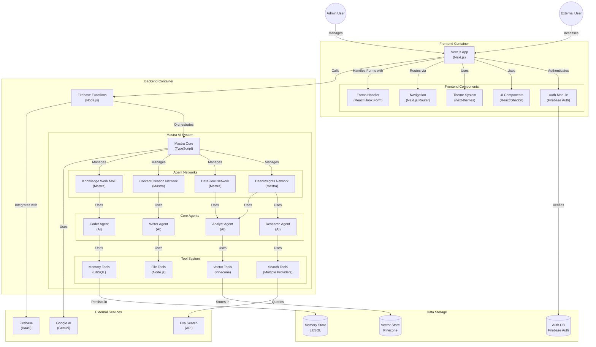

This file is a merged representation of the entire codebase, combined into a single document by Repomix.
The content has been processed where content has been formatted for parsing in markdown style, content has been compressed (code blocks are separated by ⋮---- delimiter).

# File Summary

## Purpose
This file contains a packed representation of the entire repository's contents.
It is designed to be easily consumable by AI systems for analysis, code review,
or other automated processes.

## File Format
The content is organized as follows:
1. This summary section
2. Repository information
3. Directory structure
4. Multiple file entries, each consisting of:
  a. A header with the file path (## File: path/to/file)
  b. The full contents of the file in a code block

## Usage Guidelines
- This file should be treated as read-only. Any changes should be made to the
  original repository files, not this packed version.
- When processing this file, use the file path to distinguish
  between different files in the repository.
- Be aware that this file may contain sensitive information. Handle it with
  the same level of security as you would the original repository.

## Notes
- Some files may have been excluded based on .gitignore rules and Repomix's configuration
- Binary files are not included in this packed representation. Please refer to the Repository Structure section for a complete list of file paths, including binary files
- Files matching patterns in .gitignore are excluded
- Files matching default ignore patterns are excluded
- Content has been formatted for parsing in markdown style
- Content has been compressed - code blocks are separated by ⋮---- delimiter
- Files are sorted by Git change count (files with more changes are at the bottom)

## Additional Info

# Directory Structure
```
functions/src/mastra/tools/client/
src/content/
.gitignore
apphosting.yaml
auth.ts
CHANGELOG.md
components.json
eslint.config.mjs
firebase.json
firestore.indexes.json
firestore.rules
fix.md
functions/.eslintrc.js
functions/.gitignore
functions/mastra.config.ts
functions/package.json
functions/src/genkit-content-analyzer.ts
functions/src/genkit-sample.ts
functions/src/index.ts
functions/src/mastra/agents/agentic.agent.ts
functions/src/mastra/agents/analyst.agent.ts
functions/src/mastra/agents/architect.agent.ts
functions/src/mastra/agents/base.agent.ts
functions/src/mastra/agents/codeDocumenter.agent.ts
functions/src/mastra/agents/coder.agent.ts
functions/src/mastra/agents/config/agentic.config.ts
functions/src/mastra/agents/config/analyst.config.ts
functions/src/mastra/agents/config/architect.config.ts
functions/src/mastra/agents/config/codeDocumenter.config.ts
functions/src/mastra/agents/config/coder.config.ts
functions/src/mastra/agents/config/config.types.ts
functions/src/mastra/agents/config/copywriter.config.ts
functions/src/mastra/agents/config/dataManager.config.ts
functions/src/mastra/agents/config/debugger.config.ts
functions/src/mastra/agents/config/index.ts
functions/src/mastra/agents/config/marketResearch.config.ts
functions/src/mastra/agents/config/model.utils.ts
functions/src/mastra/agents/config/provider.utils.ts
functions/src/mastra/agents/config/research.config.ts
functions/src/mastra/agents/config/rlTrainer.config.ts
functions/src/mastra/agents/config/seoAgent.config.ts
functions/src/mastra/agents/config/socialMedia.config.ts
functions/src/mastra/agents/config/uiUxCoder.config.ts
functions/src/mastra/agents/config/writer.config.ts
functions/src/mastra/agents/copywriter.agent.ts
functions/src/mastra/agents/dataManager.agent.ts
functions/src/mastra/agents/debugger.agent.ts
functions/src/mastra/agents/index.ts
functions/src/mastra/agents/marketResearch.agent.ts
functions/src/mastra/agents/research.agent.ts
functions/src/mastra/agents/rlTrainer.agent.ts
functions/src/mastra/agents/seoAgent.agent.ts
functions/src/mastra/agents/socialMedia.agent.ts
functions/src/mastra/agents/uiUxCoder.agent.ts
functions/src/mastra/agents/writer.agent.ts
functions/src/mastra/database/examples.ts
functions/src/mastra/database/index.ts
functions/src/mastra/database/vector-store.ts
functions/src/mastra/hooks/index.ts
functions/src/mastra/index.ts
functions/src/mastra/integrations/index.ts
functions/src/mastra/services/exasearch.ts
functions/src/mastra/services/hyperbrowser.ts
functions/src/mastra/services/langchain.ts
functions/src/mastra/services/langfuse.ts
functions/src/mastra/services/langsmith.ts
functions/src/mastra/tools/ai-sdk.ts
functions/src/mastra/tools/arxiv.ts
functions/src/mastra/tools/bing-client.ts
functions/src/mastra/tools/brave-search.ts
functions/src/mastra/tools/calculator.ts
functions/src/mastra/tools/contentTools.ts
functions/src/mastra/tools/document-tools.ts
functions/src/mastra/tools/document.ts
functions/src/mastra/tools/e2b.ts
functions/src/mastra/tools/exasearch.ts
functions/src/mastra/tools/genkit.ts
functions/src/mastra/tools/github.ts
functions/src/mastra/tools/google-docs-client.ts
functions/src/mastra/tools/google-drive-client.ts
functions/src/mastra/tools/google-search.ts
functions/src/mastra/tools/graphRag.ts
functions/src/mastra/tools/hyper-functionCalls.ts
functions/src/mastra/tools/index.ts
functions/src/mastra/tools/jina-client.ts
functions/src/mastra/tools/llamaindex.ts
functions/src/mastra/tools/llmchain.ts
functions/src/mastra/tools/mastra.ts
functions/src/mastra/tools/mcp.ts
functions/src/mastra/tools/mcptools.ts
functions/src/mastra/tools/memoryQueryTool.ts
functions/src/mastra/tools/midjourney-client.ts
functions/src/mastra/tools/notion-client.ts
functions/src/mastra/tools/notion.ts
functions/src/mastra/tools/paginate.ts
functions/src/mastra/tools/readwrite.ts
functions/src/mastra/tools/rlFeedback.ts
functions/src/mastra/tools/rlReward.ts
functions/src/mastra/tools/stdlib.ts
functions/src/mastra/tools/tavily.ts
functions/src/mastra/tools/types.ts
functions/src/mastra/tools/utils.ts
functions/src/mastra/tools/vectorquerytool.ts
functions/src/mastra/tools/wikibase.ts
functions/src/mastra/tools/wikidata-client.ts
functions/src/mastra/utils/index.ts
functions/src/mastra/utils/memory-diagnostics.ts
functions/src/mastra/utils/thread-manager.ts
functions/src/mastra/voice/elevenlabs.ts
functions/src/mastra/voice/googlevoice.ts
functions/src/mastra/voice/index.ts
functions/src/mastra/workflows/index.ts
functions/src/mastra/workflows/Networks/agentNetwork.ts
functions/src/mastra/workflows/Networks/knowledgeWorkMoE.network.ts
functions/src/mastra/workflows/Networks/productLaunchNetwork.ts
functions/src/mastra/workflows/workflowFactory.ts
functions/tsconfig.dev.json
functions/tsconfig.json
Mastra-firebase.md
Mastra-Server.md
middleware.ts
next.config.ts
package.json
postcss.config.mjs
README.md
src/app/(admin)/analytics/page.tsx
src/app/(admin)/dashboard/page.tsx
src/app/(admin)/layout.tsx
src/app/(admin)/notifications/page.tsx
src/app/(admin)/settings/page.tsx
src/app/(admin)/users/page.tsx
src/app/(public)/about/page.tsx
src/app/(public)/blog/page.tsx
src/app/(public)/contact/page.tsx
src/app/(public)/docs/api-reference/agent/page.tsx
src/app/(public)/docs/api-reference/cli/page.tsx
src/app/(public)/docs/api-reference/deployment/page.tsx
src/app/(public)/docs/api-reference/memory/page.tsx
src/app/(public)/docs/api-reference/network/page.tsx
src/app/(public)/docs/api-reference/page.tsx
src/app/(public)/docs/core-concepts/agents/page.tsx
src/app/(public)/docs/core-concepts/deployment/page.tsx
src/app/(public)/docs/core-concepts/memory/page.tsx
src/app/(public)/docs/core-concepts/networks/page.tsx
src/app/(public)/docs/core-concepts/page.tsx
src/app/(public)/docs/getting-started/configuration/page.tsx
src/app/(public)/docs/getting-started/installation/page.tsx
src/app/(public)/docs/getting-started/page.tsx
src/app/(public)/docs/guides/monitoring/page.tsx
src/app/(public)/docs/guides/page.tsx
src/app/(public)/docs/guides/scaling/page.tsx
src/app/(public)/docs/guides/security/page.tsx
src/app/(public)/docs/guides/testing/page.tsx
src/app/(public)/docs/layout.tsx
src/app/(public)/docs/page.tsx
src/app/(public)/features/agents/page.tsx
src/app/(public)/features/memory/page.tsx
src/app/(public)/features/page.tsx
src/app/(public)/features/tools/page.tsx
src/app/(public)/features/visualization/page.tsx
src/app/(public)/features/workflow/page.tsx
src/app/(public)/login/page.tsx
src/app/(public)/pricing/page.tsx
src/app/(public)/privacy/page.tsx
src/app/(public)/services/page.tsx
src/app/(public)/signup/page.tsx
src/app/(public)/solutions/[slug]/page.tsx
src/app/(public)/solutions/customer-service/page.tsx
src/app/(public)/solutions/data-processing/page.tsx
src/app/(public)/solutions/enterprise/page.tsx
src/app/(public)/solutions/page.tsx
src/app/(public)/terms/page.tsx
src/app/(user)/chat/page.tsx
src/app/(user)/dashboard/page.tsx
src/app/(user)/documents/page.tsx
src/app/(user)/layout.tsx
src/app/(user)/projects/page.tsx
src/app/(user)/settings/page.tsx
src/app/actions.ts
src/app/api/auth/[...nextauth]/route.ts
src/app/api/auth/signup/route.ts
src/app/api/chat/route.ts
src/app/globals.css
src/app/layout.tsx
src/app/page.tsx
src/app/robots.ts
src/app/sitemap.ts
src/components/admin/AdminHeader.tsx
src/components/admin/AdminSidebar.tsx
src/components/common/breadcrumb.tsx
src/components/common/CallToAction.tsx
src/components/common/IconWrapper.tsx
src/components/common/SearchInput.tsx
src/components/common/ThemeToggle.tsx
src/components/docs/Callout.tsx
src/components/docs/Card.tsx
src/components/docs/CodeBlockWrapper.tsx
src/components/docs/ContentRenderer.tsx
src/components/docs/DocPage.tsx
src/components/docs/DocsLayoutWrapper.tsx
src/components/docs/DocsPageLayout.tsx
src/components/docs/DocsPagination.tsx
src/components/docs/DocsSearch.tsx
src/components/docs/DocsSidebar.tsx
src/components/docs/mdx.tsx
src/components/docs/Toc.tsx
src/components/layout/Footer.tsx
src/components/layout/MobileNav.tsx
src/components/layout/NavBar.tsx
src/components/mastra/Weather.tsx
src/components/sections/FaqAccordion.tsx
src/components/sections/FeatureGrid.tsx
src/components/sections/HeroSection.tsx
src/components/sections/PricingTable.tsx
src/components/sections/ServiceCard.tsx
src/components/sections/TeamSection.tsx
src/components/sections/TestimonialSlider.tsx
src/components/sign-in.tsx
src/components/sign-up.tsx
src/components/stream-chat.tsx
src/components/ui/accordion.tsx
src/components/ui/alert-dialog.tsx
src/components/ui/alert.tsx
src/components/ui/aspect-ratio.tsx
src/components/ui/avatar.tsx
src/components/ui/badge.tsx
src/components/ui/breadcrumb.tsx
src/components/ui/button.tsx
src/components/ui/calendar.tsx
src/components/ui/card.tsx
src/components/ui/carousel.tsx
src/components/ui/chart.tsx
src/components/ui/checkbox.tsx
src/components/ui/collapsible.tsx
src/components/ui/command.tsx
src/components/ui/context-menu.tsx
src/components/ui/dialog.tsx
src/components/ui/drawer.tsx
src/components/ui/dropdown-menu.tsx
src/components/ui/form.tsx
src/components/ui/hover-card.tsx
src/components/ui/input-otp.tsx
src/components/ui/input.tsx
src/components/ui/label.tsx
src/components/ui/menubar.tsx
src/components/ui/navigation-menu.tsx
src/components/ui/pagination.tsx
src/components/ui/popover.tsx
src/components/ui/progress.tsx
src/components/ui/radio-group.tsx
src/components/ui/resizable.tsx
src/components/ui/scroll-area.tsx
src/components/ui/select.tsx
src/components/ui/separator.tsx
src/components/ui/sheet.tsx
src/components/ui/sidebar.tsx
src/components/ui/skeleton.tsx
src/components/ui/slider.tsx
src/components/ui/sonner.tsx
src/components/ui/switch.tsx
src/components/ui/table.tsx
src/components/ui/tabs.tsx
src/components/ui/textarea.tsx
src/components/ui/toggle-group.tsx
src/components/ui/toggle.tsx
src/components/ui/tooltip.tsx
src/components/user/UserHeader.tsx
src/components/user/UserNav.tsx
src/components/user/UserSidebar.tsx
src/components/visualization/AIActivityHeatmap.tsx
src/components/visualization/MLMetricsPlot.tsx
src/components/visualization/ResourceUtilization.tsx
src/config/docs.ts
src/config/site.ts
src/config/solutions.ts
src/config/theme.ts
src/hooks/use-mobile.ts
src/hooks/use-toc-highlighting.ts
src/lib/api/mastra/index.ts
src/lib/auth-client.ts
src/lib/content-data.ts
src/lib/firebase/admin.ts
src/lib/firebase/client.ts
src/lib/lib/utils.ts
src/lib/mastra.ts
src/lib/mock-data.ts
src/lib/mock-docs.ts
src/lib/toc.ts
src/lib/utils.ts
src/types/api.ts
src/types/docs.ts
src/types/nav.ts
src/types/next-auth.d.ts
src/types/theme.ts
src/types/toc.ts
storage.rules
tsconfig.json
```

# Files

## File: apphosting.yaml
````yaml
# Settings for Backend (on Cloud Run).
# See https://firebase.google.com/docs/app-hosting/configure#cloud-run
runConfig:
  minInstances: 0
  # maxInstances: 100
  # concurrency: 80
  # cpu: 1
  # memoryMiB: 512

# Environment variables and secrets.
# env:
  # Configure environment variables.
  # See https://firebase.google.com/docs/app-hosting/configure#user-defined-environment
  # - variable: MESSAGE
  #   value: Hello world!
  #   availability:
  #     - BUILD
  #     - RUNTIME

  # Grant access to secrets in Cloud Secret Manager.
  # See https://firebase.google.com/docs/app-hosting/configure#secret-parameters
  # - variable: MY_SECRET
  #   secret: mySecretRef
````

## File: components.json
````json
{
  "$schema": "https://ui.shadcn.com/schema.json",
  "style": "new-york",
  "rsc": true,
  "tsx": true,
  "tailwind": {
    "config": "",
    "css": "src/app/globals.css",
    "baseColor": "zinc",
    "cssVariables": true,
    "prefix": ""
  },
  "aliases": {
    "components": "@/components",
    "utils": "@/lib/utils",
    "ui": "@/components/ui",
    "lib": "@/lib",
    "hooks": "@/hooks"
  },
  "iconLibrary": "lucide"
}
````

## File: eslint.config.mjs
````
const __filename = fileURLToPath(import.meta.url);
const __dirname = dirname(__filename);
⋮----
const compat = new FlatCompat({
⋮----
...compat.extends("next/core-web-vitals", "next/typescript"),
````

## File: firestore.indexes.json
````json
{
  "indexes": [],
  "fieldOverrides": []
}
````

## File: fix.md
````markdown
Trace
Trace Id
Started Total Duration

stream   (failure)
680858f85cb431f7b19e9b0aebb6360d 4/11/2025, 6:42:39 PM 1484.625ms

__registerMastra
1a6a0549b9a3ccddde7366fb221d368b 4/11/2025, 6:41:57 PM 0.014ms

__registerMastra
f99ca4964c0e8f3664cd75a2fabf1fa4 4/11/2025, 6:41:57 PM 0.022ms

__registerMastra
3e9326882243649ae787224dd01d99ac 4/11/2025, 6:41:57 PM 0.017ms

__registerPrimitives
3b34fb10203914695c1aba8ed0bbbd59 4/11/2025, 6:41:57 PM 0.265ms

__registerMastra
c6b3acce7c11bd5f9e80be485292ab60 4/11/2025, 6:41:57 PM 1.638ms

__registerMastra
e78a2c74f903cf68d0ae78b207507612 4/11/2025, 6:41:44 PM 0.005ms

__registerMastra
347ada4b5b0c3aa75c6fbc66a817195e 4/11/2025, 6:41:44 PM 0.005ms

__registerMastra
4550a1d1078e054943cb540262a8324d 4/11/2025, 6:41:44 PM 0.022ms

__registerPrimitives
6f51bf42b8d3d524b7dde6c04289069b 4/11/2025, 6:41:44 PM 0.168ms

__registerMastra
7335f14928094819c05ec7362c0f3388 4/11/2025, 6:41:44 PM 0.727ms


Trace
Trace Id
Started Total Duration

stream   (failure)
f725d5b7fc1c818fa5950b5ddf44d10d 4/11/2025, 6:45:28 PM 3.656ms

stream   (failure)
ca202d24dbc25d59cdd941b85a73fe98 4/11/2025, 6:45:21 PM 2.934ms

__registerMastra
d0de03af8485f5c81114748a80f29e2a 4/11/2025, 6:41:57 PM 0.013ms

__registerMastra
5f804eb8661daa53a777bd3d4d2dbd18 4/11/2025, 6:41:57 PM 0.017ms

__registerMastra
a78060cd2e037e93f2f206f6030181bf 4/11/2025, 6:41:57 PM 0.021ms

__registerMastra
ef4daea40fbe4c9fa8c99690dbad9af9 4/11/2025, 6:41:57 PM 0.045ms

__registerPrimitives
b2137d250e041b97a95e562a1c85e777 4/11/2025, 6:41:57 PM 0.120ms

__registerMastra
ad77919626805884d7e666b8c623da6e 4/11/2025, 6:41:44 PM 0.005ms

__registerMastra
2ac983d29685e16ac92866eab8100bcf 4/11/2025, 6:41:44 PM 0.006ms

__registerMastra
c8c396c3da19b67f117c6e07be8068eb 4/11/2025, 6:41:44 PM 0.005ms

__registerMastra
4f1308f69f5c69dbdda2d21bfd4ff17f 4/11/2025, 6:41:44 PM 0.031ms

__registerPrimitives
d28c547f8522fdab26f600e21b015f71 4/11/2025, 6:41:44 PM 0.080ms
````

## File: functions/.eslintrc.js
````javascript
"/lib/**/*", // Ignore built files.
"/generated/**/*", // Ignore generated files.
````

## File: functions/.gitignore
````
# Compiled JavaScript files
lib/**/*.js
lib/**/*.js.map

# TypeScript v1 declaration files
typings/

# Node.js dependency directory
node_modules/
*.local
````

## File: functions/mastra.config.ts
````typescript
import { Mastra } from "@mastra/core";
import { createLogger } from "@mastra/core/logger";
import agents from "./src/mastra/agents";
import { ragWorkflow, networks } from "./src/mastra/workflows";
⋮----
// Export telemetry configuration to fix the dev server error
⋮----
// Track request timing for RL metrics
````

## File: functions/src/genkit-content-analyzer.ts
````typescript
import { genkit, z } from "genkit";
import { vertexAI } from "@genkit-ai/vertexai";
import { onCallGenkit } from "firebase-functions/v2/https";
import { defineSecret } from "firebase-functions/params";
⋮----
// Define secrets for API keys
⋮----
/**
 * Interface defining content metadata for analysis
 */
interface ContentMetadata {
  title: string;
  description: string;
  keywords: string[];
  sentiment: 'positive' | 'neutral' | 'negative';
  readabilityScore: number;
  suggestedImprovements: string[];
}
⋮----
/**
 * Type representing a content analysis result
 */
type ContentAnalysisResult = {
  metadata: ContentMetadata;
  summary: string;
  keyInsights: string[];
  contentQuality: {
    score: number;
    explanation: string;
  };
};
⋮----
// Initialize GenKit with Vertex AI plugin
⋮----
// Use application default credentials in production
// Project ID will be auto-detected from environment
⋮----
// Define Gemini 2.0 models
// Note: Using proper model IDs for Gemini 2.0 models
⋮----
/**
 * Content analyzer flow that performs deep content analysis using Gemini 2.0 models
 *
 * This flow analyzes content to extract metadata, generate summaries, identify key
 * insights, and assess content quality. It uses a combination of structured prompting
 * and streaming responses.
 */
⋮----
// Create analysis configuration based on depth
⋮----
// Select model based on analysis depth
⋮----
// Track overall progress
⋮----
/**
   * Updates progress and sends progress notification chunk
   *
   * @param stage - Current processing stage
   * @param message - Status message
   * @param progressIncrement - How much to increment progress
   */
const updateProgress = (stage: string, message: string, progressIncrement: number): void =>
⋮----
overallProgress = Math.min(overallProgress, 100); // Cap at 100%
⋮----
// Begin analysis
⋮----
// Phase 1: Extract metadata
⋮----
temperature: 0.1, // Low temperature for factual extraction
⋮----
// Phase 2: Generate summary and key insights
⋮----
// Phase 3: Quality assessment and improvement suggestions
⋮----
// Phase 4: Final analysis streaming
⋮----
// Handle any unexpected errors in the flow
⋮----
/**
 * Exports a Firebase Function that provides content analysis capabilities
 * using GenKit and Vertex AI with Gemini 2.0 models.
 *
 * @example
 * // Client-side invocation:
 * const result = await firebase.functions().httpsCallable('contentAnalyzer')({
 *   content: "Article text goes here...",
 *   contentType: "article",
 *   analysisDepth: "standard"
 * });
 */
⋮----
/**
 * Example of a streaming flow that demonstrates Gemini 2.0's capabilities
 * for interactive content generation with real-time feedback.
 */
⋮----
// Set appropriate length based on lengthGuide
⋮----
// Create audience segment string if provided
⋮----
// Use streaming generation with Gemini 2.0 Flash
⋮----
// Stream the content as it's generated
⋮----
// Calculate approximate completion percentage
⋮----
99 // Cap at 99% until fully complete
⋮----
// Send incremental content to the client
⋮----
// Send final content with 100% completion
⋮----
/**
 * Exports a Firebase Function for interactive content creation
 * using Gemini 2.0 models with streaming capabilities.
 */
````

## File: functions/src/mastra/agents/agentic.agent.ts
````typescript
/**
 * Agentic-style Agent Implementation
 *
 * This module implements an advanced agent using Mastra's core functionality,
 * combining multiple tools for enhanced capabilities.
 */
⋮----
import { createLogger } from "@mastra/core/logger";
import { sharedMemory } from "../database";
import { createAgentFromConfig } from "./base.agent";
import { agenticAssistantConfig, agenticResponseSchema } from "./config";
⋮----
// Initialize logger for this module
⋮----
/**
 * Agentic-style Agent with data analysis capabilities
 *
 * @remarks
 * This agent is agentic in nature, capable of analyzing information,
 * identifying trends and patterns, and extracting meaningful insights from data sources.
 * It can also generate structured responses based on the provided schema.
 * The agent is designed to be flexible and adaptable, allowing for various use cases.
 * It also supports integration with external APIs for enhanced functionality.
 */
⋮----
memory: sharedMemory, // Following RULE-MemoryInjection
⋮----
export type AgenticAgent = typeof agenticAssistant;
⋮----
/**
 * Example usage:
 *
 * ```typescript
 * import { agenticAssistant, getStructuredResponse } from "./agents/agentic.agent";
 *
 * // Simple text response
 * const response = await agenticAssistant.generate("What's the weather like today?");
 * console.log(response.text);
 *
 * // Structured response with schema validation
 * const structuredResponse = await getStructuredResponse(
 *   "Analyze the current trends in renewable energy"
 * );
 * console.log(structuredResponse.answer);
 * console.log(structuredResponse.sources);
 * ```
 */
````

## File: functions/src/mastra/agents/analyst.agent.ts
````typescript
/**
 * Analyst Agent Implementation
 *
 * This agent is specialized in interpreting data, identifying patterns,
 * and extracting meaningful insights from information.
 */
⋮----
import { createAgentFromConfig } from "./base.agent";
import { analystAgentConfig } from "./config";
import { sharedMemory } from "../database";
import { createLogger } from "@mastra/core/logger";
⋮----
/**
 * Analyst Agent with data analysis capabilities
 *
 * @remarks
 * This agent can analyze information, identify trends and patterns,
 * and extract meaningful insights from data sources.
 */
⋮----
memory: sharedMemory, // Following RULE-MemoryInjection
⋮----
export type AnalystAgent = typeof analystAgent;
````

## File: functions/src/mastra/agents/architect.agent.ts
````typescript
/**
 * Architecture Agent Implementation
 *
 * This module implements the Architecture Agent based on its configuration.
 */
⋮----
import { sharedMemory } from "../database";
import { createAgentFromConfig } from "./base.agent";
import {architectConfig} from "./config";
import { createLogger } from "@mastra/core/logger";
⋮----
/**
 * Architecture Agent
 *
 * Specializes in system design, architecture decisions, and technical planning.
 *
 * @remarks
 * This agent is responsible for creating architecture diagrams, making technical
 * decisions, and providing guidance on system design and implementation.
 */
⋮----
memory: sharedMemory, // Following RULE-MemoryInjection
⋮----
export type ArchitectAgent = typeof architectAgent;
````

## File: functions/src/mastra/agents/base.agent.ts
````typescript
/**
 * Base Agent Implementation
 *
 * This module provides utility functions to create agents from configurations,
 * ensuring consistent agent creation patterns across the application.
 */
⋮----
import { Agent } from "@mastra/core/agent";
import { Tool } from "@mastra/core/tools";
import { createLogger } from "@mastra/core/logger";
import { sharedMemory } from "../database";
import {
  BaseAgentConfig,
  defaultErrorHandler,
  DEFAULT_MODEL_ID,
  DEFAULT_MAX_TOKENS,
  DEFAULT_MAX_CONTEXT_TOKENS,
  defaultResponseValidation,
  type ResponseHookOptions,
  createModelInstance
} from "./config/index";
import { createResponseHook } from "../hooks";
import { allToolsMap } from "../tools";
⋮----
// Configure logger for agent initialization
⋮----
/**
 * Creates an agent instance from a configuration object and options
 *
 * @param params - Object containing configuration and agent options
 * @param params.config - The agent configuration object
 * @param params.memory - The memory instance to be injected into the agent (following RULE-MemoryInjection)
 * @param params.onError - Optional error handler callback function
 * @returns A configured Agent instance
 * @throws Error if required tools are not available
 */
export function createAgentFromConfig({
  config,
  memory,
  onError,
}: {
  config: BaseAgentConfig;
  memory: typeof sharedMemory;
onError?: (error: Error) => Promise<
⋮----
// Validate configuration
⋮----
// Resolve tools from toolIds
⋮----
// Log and throw error for missing tools
⋮----
// Create response hook if validation options are provided
⋮----
// Create and return the agent instance
⋮----
// Create model instance using the new modelConfig property
⋮----
memory, // Using injected memory instead of global reference
⋮----
...(onError ? { onError } : {}), // Add error handler if provided
````

## File: functions/src/mastra/agents/codeDocumenter.agent.ts
````typescript
/**
 * Code Documenter Agent Implementation
 *
 * This module implements the Code Documenter Agent based on its configuration.
 */
⋮----
import { sharedMemory } from "../database";
import { createAgentFromConfig } from "./base.agent";
import { codeDocumenterConfig } from "./config/"; // Import directly
import { createLogger } from "@mastra/core/logger";
⋮----
/**
 * Code Documenter Agent
 *
 * Specializes in creating comprehensive code documentation.
 *
 * @remarks
 * This agent is responsible for creating API documentation, writing code comments,
 * generating user guides, and ensuring documentation stays synchronized with code.
 * @version 1.0.0
 */
⋮----
memory: sharedMemory, // Following RULE-MemoryInjection
⋮----
export type CodeDocumenterAgent = typeof codeDocumenterAgent;
````

## File: functions/src/mastra/agents/coder.agent.ts
````typescript
/**
 * Coder Agent Implementation
 *
 * This module implements the Coder Agent responsible for code generation,
 * analysis, and refactoring tasks within the DeanmachinesAI system.
 */
⋮----
import { Agent } from "@mastra/core/agent";
import { createAgentFromConfig } from "./base.agent";
import { coderAgentConfig } from "./config";
import { createLogger } from "@mastra/core/logger";
import { sharedMemory } from "../database";
⋮----
// Configure logger for the coder agent
⋮----
/**
 * Initialize the coder agent instance using its configuration
 *
 * @returns The initialized coder agent instance
 */
export function initializeCoderAgent(): Agent
⋮----
memory: sharedMemory, // Following RULE-MemoryInjection
⋮----
/**
 * Singleton instance of the coder agent
 */
⋮----
export type CoderAgent = typeof coderAgent;
````

## File: functions/src/mastra/agents/config/agentic.config.ts
````typescript
/**
 * Agentic-style Agent Configuration
 *
 * This file configures a Mastra agent with advanced capabilities,
 * leveraging Mastra's core features and compatible tools.
 */
⋮----
import { z, type ZodTypeAny } from "zod";
import type { Tool } from "@mastra/core/tools";
import {
  BaseAgentConfig,
  DEFAULT_MODELS,
  defaultResponseValidation,
} from "./config.types";
⋮----
/**
 * Configuration for retrieving relevant tools for the agent
 *
 * @param toolIds - Array of tool identifiers to include
 * @param allTools - Map of all available tools
 * @returns Record of tools mapped by their IDs
 * @throws {Error} When required tools are missing
 */
export function getToolsFromIds(
  toolIds: string[],
  allTools: ReadonlyMap<
    string,
    Tool<z.ZodTypeAny | undefined, z.ZodTypeAny | undefined>
  >
): Record<string, Tool<z.ZodTypeAny | undefined, z.ZodTypeAny | undefined>>
⋮----
/**
 * Configuration for the agentic assistant
 */
⋮----
/**
 * Schema for structured agent responses
 */
⋮----
/**
 * Type for structured responses from the agent
 */
export type AgenticResponse = z.infer<typeof agenticResponseSchema>;
⋮----
export type AgenticAssistantConfig = typeof agenticAssistantConfig;
````

## File: functions/src/mastra/agents/config/analyst.config.ts
````typescript
/**
 * Analyst Agent Configuration
 *
 * This module defines the specific configuration for the Analyst Agent,
 * which specializes in interpreting data, identifying patterns,
 * and extracting meaningful insights.
 */
⋮----
import { z, type ZodTypeAny } from "zod";
import type { Tool } from "@mastra/core/tools";
import {
  BaseAgentConfig,
  DEFAULT_MODELS,
  defaultResponseValidation,
} from "./config.types";
⋮----
/**
 * Configuration for retrieving relevant tools for the agent
 *
 * @param toolIds - Array of tool identifiers to include
 * @param allTools - Map of all available tools
 * @returns Record of tools mapped by their IDs
 * @throws {Error} When required tools are missing
 */
export function getToolsFromIds(
  toolIds: string[],
  allTools: ReadonlyMap<
    string,
    Tool<ZodTypeAny | undefined, ZodTypeAny | undefined>
  >
): Record<string, Tool<ZodTypeAny | undefined, ZodTypeAny | undefined>>
⋮----
/**
 * Configuration for the Analyst Agent
 *
 * @remarks
 * The Analyst Agent focuses on analyzing information, identifying trends and patterns,
 * and extracting meaningful insights from various data sources.
 */
⋮----
"filtered-vector-query", // Corrected ID
⋮----
"analyze-content", // Added based on role
⋮----
/**
 * Schema for structured analyst responses
 */
⋮----
/**
 * Type for structured responses from the Analyst agent
 */
export type AnalystResponse = z.infer<typeof analystResponseSchema>;
⋮----
export type AnalystAgentConfig = typeof analystAgentConfig;
````

## File: functions/src/mastra/agents/config/architect.config.ts
````typescript
/**
 * Architecture Agent Configuration
 *
 * This module defines the configuration for the Architecture Agent,
 * which specializes in system design, architecture decisions, and technical planning.
 */
⋮----
import { z, type ZodTypeAny } from "zod";
import type { Tool } from "@mastra/core/tools";
import {
  BaseAgentConfig,
  DEFAULT_MODELS,
  defaultResponseValidation,
} from "./config.types";
⋮----
/**
 * Configuration for retrieving relevant tools for the agent
 *
 * @param toolIds - Array of tool identifiers to include
 * @param allTools - Map of all available tools
 * @returns Record of tools mapped by their IDs
 * @throws {Error} When required tools are missing
 */
export function getToolsFromIds(
  toolIds: string[],
  allTools: ReadonlyMap<
    string,
    Tool<ZodTypeAny | undefined, ZodTypeAny | undefined>
  >
): Record<string, Tool<ZodTypeAny | undefined, ZodTypeAny | undefined>>
⋮----
/**
 * Architecture Agent Configuration
 *
 * @remarks
 * The Architecture Agent focuses on system design, technical decision making,
 * and creating architectural plans. It analyzes requirements and provides
 * guidance on component structures, interactions, and technical trade-offs.
 */
⋮----
export type ArchitectConfig = typeof architectConfig;
````

## File: functions/src/mastra/agents/config/codeDocumenter.config.ts
````typescript
/**
 * Code Documenter Agent Configuration
 *
 * This module defines the configuration for the Code Documenter Agent,
 * which specializes in creating comprehensive code documentation.
 */
⋮----
import { z, type ZodTypeAny } from "zod";
import type { Tool } from "@mastra/core/tools";
import {
  BaseAgentConfig,
  DEFAULT_MODELS,
  defaultResponseValidation,
} from "./config.types";
⋮----
// Note: This function might be redundant if tool resolution happens centrally in base.agent.ts
export function getToolsFromIds(
  toolIds: string[],
  allTools: ReadonlyMap<
    string,
    Tool<ZodTypeAny | undefined, ZodTypeAny | undefined>
  >
): Record<string, Tool<ZodTypeAny | undefined, ZodTypeAny | undefined>>
⋮----
/**
 * Detailed instructions for the Code Documenter Agent.
 */
⋮----
/**
 * Configuration object for the Code Documenter Agent.
 * THIS IS THE VALUE BEING EXPORTED.
 */
// --- ENSURE 'export' IS PRESENT HERE ---
⋮----
//"github",
⋮----
/**
 * Schema for structured code documenter responses
 * THIS IS A VALUE, BUT NOT EXPORTED (to fix TS6133).
 */
// --- ENSURE 'export' IS REMOVED HERE ---
⋮----
/**
 * Type for structured responses from the Code Documenter agent
 * THIS IS A TYPE BEING EXPORTED.
 */
// --- Use PascalCase ---
export type CodeDocumenterResponse = z.infer<
  typeof codeDocumenterResponseSchema
>;
⋮----
/**
 * Type derived from the config object
 * THIS IS A TYPE BEING EXPORTED.
 */
// --- Use PascalCase ---
export type CodeDocumenterConfig = typeof codeDocumenterConfig;
````

## File: functions/src/mastra/agents/config/coder.config.ts
````typescript
/**
 * Coder Agent Configuration
 *
 * This module defines the configuration for the Coder Agent, which specializes in
 * generating, analyzing, and refactoring code in various programming languages.
 */
⋮----
import { z, type ZodTypeAny } from "zod";
import type { Tool } from "@mastra/core/tools";
import {
  BaseAgentConfig,
  DEFAULT_MODELS,
  defaultResponseValidation,
} from "./config.types";
⋮----
/**
 * Configuration for retrieving relevant tools for the agent
 *
 * @param toolIds - Array of tool identifiers to include
 * @param allTools - Map of all available tools
 * @returns Record of tools mapped by their IDs
 * @throws {Error} When required tools are missing
 */
export function getToolsFromIds(
  toolIds: string[],
  allTools: ReadonlyMap<
    string,
    Tool<ZodTypeAny | undefined, ZodTypeAny | undefined>
  >
): Record<string, Tool<ZodTypeAny | undefined, ZodTypeAny | undefined>>
⋮----
/**
 * Configuration for the Coder Agent.
 *
 * @remarks
 * The Coder Agent focuses on code generation, refactoring, and analysis
 * using code manipulation tools, file operations, and GitHub integration.
 *
 * @property {string[]} toolIds - The list of tool IDs required by the agent.
 */
⋮----
"read-file",         // Correct ID for reading files
"write-file",        // Correct ID for writing files
"search-documents",  // For searching relevant code snippets/docs
// "github",         // Omitted - Needs clarification on how GitHub tools are registered in tools/index.ts
"memory-query",      // Correct ID for querying conversation memory
"analyze-content",   // For understanding code/text content
"calculator",        // Correct ID for calculations (e.g., complexity analysis)              // For executing code snippets safely
// Add other relevant tools like specific search tools if needed
⋮----
/**
 * Schema for structured coder agent responses
 */
⋮----
/**
 * Type for structured responses from the Coder agent
 */
export type CoderResponse = z.infer<typeof coderResponseSchema>;
⋮----
/**
 * Type for the Coder Agent configuration
 */
export type CoderAgentConfig = typeof coderAgentConfig;
````

## File: functions/src/mastra/agents/config/config.types.ts
````typescript
/**
 * Agent Configuration Type Definitions
 *
 * This module defines shared types and interfaces for agent configurations,
 * ensuring consistent typing across the agent configuration system.
 *
 * @module config.types
 */
⋮----
import { Tool } from "@mastra/core/tools";
⋮----
/**
 * Supported AI model providers
 */
export type ModelProvider = "google" | "vertex" | "openai";
⋮----
/** Default Maximum Tokens for Model Output */
⋮----
/** Default Maximum Context Tokens for Model Input */
⋮----
/**
 * Model capabilities and features supported
 * These represent the different capabilities models may have
 */
export interface ModelCapabilities {
  /** Maximum context window size in tokens */
  maxContextTokens: number;
  /** Whether the model supports multimodal inputs (images, audio, video) */
  multimodalInput: boolean;
  /** Whether the model supports image generation output */
  imageGeneration: boolean;
  /** Whether the model supports audio output */
  audioOutput: boolean;
  /** Whether the model supports function/tool calling */
  functionCalling: boolean;
  /** Whether the model supports structured output (JSON, etc) */
  structuredOutput: boolean;
  /** Whether the model has enhanced reasoning/thinking capabilities */
  enhancedThinking: boolean;
  /** Whether the model supports grounding to reduce hallucinations */
  grounding: boolean;
  /** Whether the model supports response caching for efficiency */
  responseCaching: boolean;
}
⋮----
/** Maximum context window size in tokens */
⋮----
/** Whether the model supports multimodal inputs (images, audio, video) */
⋮----
/** Whether the model supports image generation output */
⋮----
/** Whether the model supports audio output */
⋮----
/** Whether the model supports function/tool calling */
⋮----
/** Whether the model supports structured output (JSON, etc) */
⋮----
/** Whether the model has enhanced reasoning/thinking capabilities */
⋮----
/** Whether the model supports grounding to reduce hallucinations */
⋮----
/** Whether the model supports response caching for efficiency */
⋮----
/**
 * Default model configurations for different use cases
 * Based on https://ai.google.dev/gemini-api/docs/models
 */
⋮----
// GOOGLE PROVIDER MODELS
⋮----
// Standard Google model - fast, versatile
⋮----
// Premium Google model - enhanced reasoning and capability
⋮----
// Cost-efficient Google model - better for bulk processing
⋮----
// Enhanced thinking experimental model - special capabilities
⋮----
// VERTEX AI PROVIDER MODELS
⋮----
// Vertex AI model - for enterprise features and security
⋮----
// Advanced Vertex model - for enterprise use cases
⋮----
// Premium Vertex model - highest capability enterprise model
⋮----
/**
 * Type for accessing default model configurations
 */
export type DefaultModelKey = keyof typeof DEFAULT_MODELS;
⋮----
/** Default Google AI Model ID */
⋮----
/**
 * Function calling configuration for Vertex AI models
 * Based on https://cloud.google.com/vertex-ai/generative-ai/docs/model-reference/function-calling
 */
export interface FunctionCallingConfig {
  /**
   * Function calling mode
   * - AUTO: Default model behavior, can respond with function call or natural language
   * - NONE: Model doesn't make predictions as function calls
   * - ANY: Model is constrained to always predict a function call
   */
  mode: "AUTO" | "NONE" | "ANY";

  /**
   * List of function names that the model is allowed to call
   * Only set when mode is ANY
   * Empty array means the model can choose from all available functions
   */
  allowedFunctionNames: string[];
}
⋮----
/**
   * Function calling mode
   * - AUTO: Default model behavior, can respond with function call or natural language
   * - NONE: Model doesn't make predictions as function calls
   * - ANY: Model is constrained to always predict a function call
   */
⋮----
/**
   * List of function names that the model is allowed to call
   * Only set when mode is ANY
   * Empty array means the model can choose from all available functions
   */
⋮----
/**
 * Model configuration options
 */
export interface ModelConfig {
  /** The provider to use for this agent */
  provider: ModelProvider;

  /** Model ID to use (e.g., "gemini-2.0-flash") */
  modelId: string;

  /** Maximum tokens to generate */
  maxTokens?: number;

  /** Temperature for generation (0-1) */
  temperature?: number;

  /** Top-p for sampling */
  topP?: number;

  /**
   * Function calling configuration
   * - For Google models: true/false to enable/disable function calling
   * - For Vertex AI models: FunctionCallingConfig object with mode and allowed function names
   */
  functionCalling?: boolean | FunctionCallingConfig;

  /** Provider-specific options */
  providerOptions?: Record<string, unknown>;
}
⋮----
/** The provider to use for this agent */
⋮----
/** Model ID to use (e.g., "gemini-2.0-flash") */
⋮----
/** Maximum tokens to generate */
⋮----
/** Temperature for generation (0-1) */
⋮----
/** Top-p for sampling */
⋮----
/**
   * Function calling configuration
   * - For Google models: true/false to enable/disable function calling
   * - For Vertex AI models: FunctionCallingConfig object with mode and allowed function names
   */
⋮----
/** Provider-specific options */
⋮----
/**
 * Response hook options interface
 */
export interface ResponseHookOptions {
  minResponseLength?: number;
  maxAttempts?: number;
  validateResponse?: (response: unknown) => boolean;
}
⋮----
/**
 * Base configuration interface for all agent configs
 *
 * @interface BaseAgentConfig
 */
export interface BaseAgentConfig {
  /** Unique identifier for the agent */
  id: string;

  /** Display name of the agent */
  name: string;

  /** Brief description of the agent's purpose and capabilities */
  description: string;

  /**
   * Model configuration for creating the model dynamically
   * This is used to initialize the appropriate model (Google or Vertex AI)
   */
  modelConfig: ModelConfig;

  /** Main instructions that define the agent's behavior */
  instructions: string;

  /** Tool IDs that this agent has access to */
  toolIds: string[];

  /** Optional response validation settings */
  responseValidation?: ResponseHookOptions;

  /** Optional tools configuration */
  tools?: Tool[];
}
⋮----
/** Unique identifier for the agent */
⋮----
/** Display name of the agent */
⋮----
/** Brief description of the agent's purpose and capabilities */
⋮----
/**
   * Model configuration for creating the model dynamically
   * This is used to initialize the appropriate model (Google or Vertex AI)
   */
⋮----
/** Main instructions that define the agent's behavior */
⋮----
/** Tool IDs that this agent has access to */
⋮----
/** Optional response validation settings */
⋮----
/** Optional tools configuration */
⋮----
/**
 * Helper function to get a model configuration by key with optional overrides
 *
 * @param modelKey - The key of the default model to use
 * @param overrides - Optional properties to override in the default configuration
 * @returns A model configuration
 */
export function getModelConfig(
  modelKey: DefaultModelKey,
  overrides?: Partial<Omit<ModelConfig, "provider">>
): ModelConfig
⋮----
// Create a new object to avoid modifying the default
⋮----
// Apply any overrides
⋮----
/**
 * Helper function to configure function calling for Vertex AI models
 *
 * @param mode - Function calling mode (AUTO, NONE, or ANY)
 * @param allowedFunctionNames - Optional list of allowed function names
 * @returns FunctionCallingConfig object
 */
export function createFunctionCallingConfig(
  mode: "AUTO" | "NONE" | "ANY" = "AUTO",
  allowedFunctionNames: string[] = []
): FunctionCallingConfig
⋮----
/**
 * Standard response validation options
 */
⋮----
/**
 * Standard error handler function for agents
 */
export const defaultErrorHandler = async (
  error: Error
): Promise<Record<string, unknown>> =>
⋮----
export type BaseAgentConfigType = BaseAgentConfig;
````

## File: functions/src/mastra/agents/config/copywriter.config.ts
````typescript
/**
 * Copywriter Agent Configuration
 *
 * This module defines the configuration for the Copywriter Agent, which specializes in
 * creating compelling marketing copy and content for various channels.
 */
⋮----
import { z, type ZodTypeAny } from "zod";
import type { Tool } from "@mastra/core/tools";
import {
  BaseAgentConfig,
  DEFAULT_MODELS,
  defaultResponseValidation,
} from "./config.types";
⋮----
/**
 * Configuration for retrieving relevant tools for the agent
 *
 * @param toolIds - Array of tool identifiers to include
 * @param allTools - Map of all available tools
 * @returns Record of tools mapped by their IDs
 * @throws {Error} When required tools are missing
 */
export function getToolsFromIds(
  toolIds: string[],
  allTools: ReadonlyMap<
    string,
    Tool<ZodTypeAny | undefined, ZodTypeAny | undefined>
  >
): Record<string, Tool<ZodTypeAny | undefined, ZodTypeAny | undefined>>
⋮----
/**
 * Configuration for the Copywriter Agent.
 *
 * @remarks
 * The Copywriter Agent focuses on creating marketing copy and content,
 * adapting to different brand voices, and optimizing messaging for various channels.
 *
 * @property {string[]} toolIds - The list of tool IDs required by the agent.
 */
⋮----
"tavily-search", // Corrected ID
⋮----
/**
 * Schema for structured copywriter agent responses
 */
⋮----
/**
 * Type for structured responses from the Copywriter agent
 */
export type CopywriterResponse = z.infer<typeof copywriterResponseSchema>;
⋮----
/**
 * Type for the Copywriter Agent configuration
 */
export type CopywriterAgentConfig = typeof copywriterAgentConfig;
````

## File: functions/src/mastra/agents/config/dataManager.config.ts
````typescript
/**
 * Data Manager Agent Configuration
 *
 * This module defines the specific configuration for the Data Manager Agent,
 * which specializes in managing data operations, file organization,
 * storage, and retrieval of information.
 */
⋮----
import { z, type ZodTypeAny } from "zod";
import type { Tool } from "@mastra/core/tools";
import {
  BaseAgentConfig,
  DEFAULT_MODELS,
  defaultResponseValidation,
} from "./config.types";
⋮----
/**
 * Configuration for retrieving relevant tools for the agent
 *
 * @param toolIds - Array of tool identifiers to include
 * @param allTools - Map of all available tools
 * @returns Record of tools mapped by their IDs
 * @throws {Error} When required tools are missing
 */
export function getToolsFromIds(
  toolIds: string[],
  allTools: ReadonlyMap<
    string,
    Tool<ZodTypeAny | undefined, ZodTypeAny | undefined>
  >
): Record<string, Tool<ZodTypeAny | undefined, ZodTypeAny | undefined>>
⋮----
/**
 * Configuration for the Data Manager Agent
 *
 * @remarks
 * The Data Manager Agent focuses on organizing, storing, retrieving, and managing
 * data assets across the system, including file operations and vector database management.
 */
⋮----
"filtered-vector-query", // Corrected ID
⋮----
"graph-rag", // Alias exists
⋮----
/**
 * Schema for structured data manager agent responses
 */
⋮----
/**
 * Type for structured responses from the Data Manager agent
 */
export type DataManagerResponse = z.infer<typeof dataManagerResponseSchema>;
⋮----
/**
 * Type for the Data Manager Agent configuration
 */
export type DataManagerAgentConfig = typeof dataManagerAgentConfig;
````

## File: functions/src/mastra/agents/config/debugger.config.ts
````typescript
/**
 * Debugger Agent Configuration
 *
 * This module defines the configuration for the Debugger Agent,
 * which specializes in identifying and fixing code issues and bugs.
 */
⋮----
import { z, type ZodTypeAny } from "zod";
import type { Tool } from "@mastra/core/tools";
import {
  BaseAgentConfig,
  DEFAULT_MODELS,
  defaultResponseValidation,
} from "./config.types";
⋮----
/**
 * Configuration for retrieving relevant tools for the agent
 *
 * @param toolIds - Array of tool identifiers to include
 * @param allTools - Map of all available tools
 * @returns Record of tools mapped by their IDs
 * @throws {Error} When required tools are missing
 */
export function getToolsFromIds(
  toolIds: string[],
  allTools: ReadonlyMap<
    string,
    Tool<ZodTypeAny | undefined, ZodTypeAny | undefined>
  >
): Record<string, Tool<ZodTypeAny | undefined, ZodTypeAny | undefined>>
⋮----
/**
 * Debugger Agent Configuration
 *
 * @remarks
 * The Debugger Agent focuses on troubleshooting, debugging, and resolving
 * technical issues in code. It analyzes error logs, traces execution paths,
 * and proposes fixes for bugs.
 */
⋮----
// "github", // Removed - clarify registration if needed
//"e2b",
⋮----
"analyze-content", // Added based on role
⋮----
/**
 * Schema for structured debugger agent responses
 */
⋮----
/**
 * Type for structured responses from the Debugger agent
 */
export type DebuggerResponse = z.infer<typeof debuggerResponseSchema>;
⋮----
/**
 * Type for the Debugger agent configuration
 */
export type DebuggerConfig = typeof debuggerConfig;
````

## File: functions/src/mastra/agents/config/index.ts
````typescript
/**
 * Agent Configuration Module
 *
 * This module exports all agent configurations and configuration types.
 * Each agent has its own configuration file, and this module serves as
 * the central export point.
 */
⋮----
// Export core configuration types and utilities
⋮----
// Base configurations removed as part of refactoring
⋮----
// Export specific agent configurations without the common utility functions
// This prevents name conflicts from multiple exports of getToolsFromIds
import { analystAgentConfig, analystResponseSchema } from "./analyst.config";
import { architectConfig } from "./architect.config";
import {
  agenticAssistantConfig,
  agenticResponseSchema,
} from "./agentic.config";
import { coderAgentConfig, coderResponseSchema } from "./coder.config";
import {
  codeDocumenterConfig

} from "./codeDocumenter.config";
import {
  copywriterAgentConfig,
  copywriterResponseSchema,
} from "./copywriter.config";
import {
  dataManagerAgentConfig,
  dataManagerResponseSchema,
} from "./dataManager.config";
import { debuggerConfig, debuggerResponseSchema } from "./debugger.config";
import {
  marketResearchAgentConfig,
  marketResearchResponseSchema,
} from "./marketResearch.config";
import { researchAgentConfig, researchResponseSchema } from "./research.config";
import {
  rlTrainerAgentConfig,
  rlTrainerResponseSchema,
} from "./rlTrainer.config";
import { seoAgentConfig, seoResponseSchema } from "./seoAgent.config";
import {
  socialMediaAgentConfig,
  socialMediaResponseSchema,
} from "./socialMedia.config";
import { uiUxCoderConfig, uiUxCoderResponseSchema } from "./uiUxCoder.config";
import { writerAgentConfig, writerResponseSchema } from "./writer.config";
⋮----
// Re-export specific configurations
⋮----
// Agent configurations
⋮----
// All agent configurations are now exported here
````

## File: functions/src/mastra/agents/config/marketResearch.config.ts
````typescript
/**
 * Market Research Agent Configuration
 *
 * This module defines the configuration for the Market Research Agent,
 * which specializes in analyzing markets, competitors, and user needs.
 */
⋮----
import { z, type ZodTypeAny } from "zod";
import type { Tool } from "@mastra/core/tools";
import {
  BaseAgentConfig,
  DEFAULT_MODELS,
  defaultResponseValidation,
} from "./config.types";
⋮----
/**
 * Configuration for retrieving relevant tools for the agent
 *
 * @param toolIds - Array of tool identifiers to include
 * @param allTools - Map of all available tools
 * @returns Record of tools mapped by their IDs
 * @throws {Error} When required tools are missing
 */
export function getToolsFromIds(
  toolIds: string[],
  allTools: ReadonlyMap<
    string,
    Tool<ZodTypeAny | undefined, ZodTypeAny | undefined>
  >
): Record<string, Tool<ZodTypeAny | undefined, ZodTypeAny | undefined>>
⋮----
/**
 * Market Research Agent Configuration
 *
 * @remarks
 * The Market Research Agent focuses on gathering and analyzing market data,
 * competitive intelligence, and user feedback to inform product and marketing strategies.
 */
⋮----
"google-search", // Corrected ID
"tavily-search", // Corrected ID
"brave-search", // Correct ID for Exa search
⋮----
"calculate-reward", // For analyzing metrics
⋮----
/**
 * Schema for structured market research agent responses
 */
⋮----
/**
 * Type for structured responses from the Market Research agent
 */
export type MarketResearchResponse = z.infer<
  typeof marketResearchResponseSchema
>;
⋮----
/**
 * Type for the Market Research agent configuration
 */
export type MarketResearchAgentConfig = typeof marketResearchAgentConfig;
````

## File: functions/src/mastra/agents/config/model.utils.ts
````typescript
/**
 * Model Utility Functions
 *
 * This module provides utility functions for creating AI model instances
 * based on configuration settings, supporting multiple providers.
 *
 * @module model.utils
 */
⋮----
import { google } from "@ai-sdk/google";
import { vertex } from "@ai-sdk/google-vertex";
import { ModelConfig, ModelProvider } from "./config.types";
⋮----
/**
 * Model creation options
 */
export interface ModelCreationOptions {
  /** Project ID for Vertex AI */
  vertexProjectId?: string;

  /** Location for Vertex AI */
  vertexLocation?: string;

  /** Google API key */
  googleApiKey?: string;
}
⋮----
/** Project ID for Vertex AI */
⋮----
/** Location for Vertex AI */
⋮----
/** Google API key */
⋮----
/**
 * Creates a model instance based on the provided configuration
 *
 * @param modelConfig - Configuration for the model
 * @param options - Additional options for model creation
 * @returns A model instance compatible with @mastra/core/agent
 * @throws {Error} If the model provider is unsupported or configuration is invalid
 */
export function createModelFromConfig(
  modelConfig: ModelConfig,
  options: ModelCreationOptions = {}
): ReturnType<typeof google> | ReturnType<typeof vertex>
⋮----
// Create and return Google model instance using the @ai-sdk/google format
⋮----
// Create and return Vertex model instance
⋮----
/**
 * Creates a Google AI model instance with default settings
 *
 * @param modelId - Model ID to use
 * @param apiKey - Optional Google API key (otherwise uses environment variable)
 * @param options - Additional model options
 * @returns A Google AI model instance
 */
export function createGoogleModel(
  modelId: string,
  apiKey?: string,
  options?: Record<string, unknown>
): ReturnType<typeof google>
⋮----
/**
 * Creates a Google Vertex AI model instance with default settings
 *
 * @param modelId - Model ID to use
 * @param projectId - Optional Vertex project ID (otherwise uses GOOGLE_VERTEX_PROJECT env var)
 * @param location - Optional Vertex location (otherwise uses GOOGLE_VERTEX_LOCATION env var or default)
 * @param options - Additional model options
 * @returns A Google Vertex AI model instance
 */
export function createVertexModel(
  modelId: string,
  projectId?: string,
  location?: string,
  options?: Record<string, unknown>
): ReturnType<typeof vertex>
⋮----
/**
 * Creates a model instance based on the model configuration
 * This is an alias for createModelFromConfig with a more concise name
 *
 * @param config - Model configuration
 * @param options - Optional creation options
 * @returns A model instance for the specified provider
 */
export function createModelInstance(
  config: ModelConfig,
  options: ModelCreationOptions = {}
): ReturnType<typeof google> | ReturnType<typeof vertex>
````

## File: functions/src/mastra/agents/config/provider.utils.ts
````typescript
/**
 * Model Provider Utilities
 *
 * This module provides utilities for setting up and configuring AI model providers.
 * It handles provider client setup and credential management, but NOT model instantiation.
 *
 * @module provider.utils
 */
⋮----
import { google } from "@ai-sdk/google";
import { createVertex } from "@ai-sdk/google-vertex";
import { env } from "process";
import { util } from "zod";
⋮----
/** Supported model providers */
export type ModelProvider = "google" | "vertex";
⋮----
/** Options for configuring the Google AI provider setup */
export type GoogleOptions = Partial<Pick<GoogleProviderConfig, 'apiKey'>>;
⋮----
/** Options for configuring the Google Vertex AI provider setup */
export type GoogleVertexOptions = Partial<Pick<VertexProviderConfig, 'projectId' | 'location'>>;
⋮----
/** Union type for all provider setup options */
export type ProviderSetupOptions = GoogleOptions | GoogleVertexOptions;
⋮----
/**
 * Configuration for Google AI provider
 */
export interface GoogleProviderConfig {
  /** API Key for Google AI */
  apiKey: string;
}
⋮----
/** API Key for Google AI */
⋮----
/**
 * Configuration for Google Vertex AI provider
 */
export interface VertexProviderConfig {
  /** Project ID for Vertex AI */
  projectId: string;
  /** Location for Vertex AI */
  location: string;
  /** Credentials for Vertex AI */
  credentials: Record<string, unknown>;
}
⋮----
/** Project ID for Vertex AI */
⋮----
/** Location for Vertex AI */
⋮----
/** Credentials for Vertex AI */
⋮----
/**
 * Generic provider configuration type
 */
export type ProviderConfig = GoogleProviderConfig | VertexProviderConfig;
⋮----
/**
 * Sets up the Google AI provider configuration
 *
 * @param options - Google AI specific options
 * @returns Google AI provider configuration
 * @throws {Error} If API key is not provided and not available in environment
 */
export function setupGoogleProvider(
  options?: GoogleOptions
): GoogleProviderConfig
⋮----
// Use API key from options, environment variable, or throw error
⋮----
/**
 * Creates a Google AI client configuration object
 *
 * @param config - Google provider configuration
 * @param config - Google provider configuration (contains validated apiKey)
 * @returns Google AI client configuration for @ai-sdk/google
 */
export function createGoogleClientConfig(
  // config parameter is currently unused as the SDK reads the API key from the environment.
  // It's kept for potential future configuration options.
  config: GoogleProviderConfig
): Parameters<typeof google>[1]
⋮----
// config parameter is currently unused as the SDK reads the API key from the environment.
// It's kept for potential future configuration options.
⋮----
// The @ai-sdk/google provider automatically uses the
// GOOGLE_GENERATIVE_AI_API_KEY environment variable.
// The config object passed here is for other settings (e.g., baseURL, headers).
// setupGoogleProvider ensures the API key exists in the environment or options.
⋮----
/**
 * Sets up the Google Vertex AI provider configuration
 *
 * @param options - Vertex AI specific options
 * @returns Vertex AI provider configuration
 * @throws {Error} If required environment variables are not available
 */
export function setupVertexProvider(
  options?: GoogleVertexOptions
): VertexProviderConfig
⋮----
// Get project ID from options or environment
⋮----
// Get location from options or environment
⋮----
// Use service account credentials from environment if available
⋮----
// For direct usage without a JSON file, we may need just the key parts
// or rely on application default credentials when deployed
⋮----
/**
 * Creates a Vertex AI client configuration
 *
 * @param config - Vertex provider configuration
 * @returns Vertex AI client configuration for @ai-sdk/google-vertex
 */
export function createVertexClientConfig(
  config: VertexProviderConfig
): ReturnType<typeof createVertex>
⋮----
// Credentials are often handled via environment variables (GOOGLE_APPLICATION_CREDENTIALS)
// or Application Default Credentials (ADC) when running on GCP.
// Explicitly passing credentials here might be needed in specific scenarios.
// If config.credentials contains the necessary structure, pass it here.
// Example (if credentials are a service account key object):
// credentials: config.credentials,
⋮----
/**
 * Gets the appropriate provider configuration based on provider type
 *
 * @param provider - The model provider to configure
 * @param options - Provider-specific options
 * @returns Provider configuration object
 * @throws {Error} If provider is unsupported
 */
export function getProviderConfig(
  provider: ModelProvider,
  options?: Record<string, unknown>
): ProviderConfig
````

## File: functions/src/mastra/agents/config/research.config.ts
````typescript
/**
 * Research Agent Configuration
 *
 * This module defines the configuration for the Research Agent, which specializes in
 * gathering, synthesizing, and analyzing information from various sources.
 */
⋮----
import { z, type ZodTypeAny } from "zod";
import type { Tool } from "@mastra/core/tools";
import {
  BaseAgentConfig,
  DEFAULT_MODELS,
  defaultResponseValidation,
} from "./config.types";
⋮----
/**
 * Configuration for retrieving relevant tools for the agent
 *
 * @param toolIds - Array of tool identifiers to include
 * @param allTools - Map of all available tools
 * @returns Record of tools mapped by their IDs
 * @throws {Error} When required tools are missing
 */
export function getToolsFromIds(
  toolIds: string[],
  allTools: ReadonlyMap<
    string,
    Tool<ZodTypeAny | undefined, ZodTypeAny | undefined>
  >
): Record<string, Tool<ZodTypeAny | undefined, ZodTypeAny | undefined>>
⋮----
/**
 * Configuration for the Research Agent.
 *
 * @remarks
 * The Research Agent focuses on information gathering and synthesis
 * using web searches, document analysis, and file operations.
 *
 * @property {string[]} toolIds - The list of tool IDs required by the agent.
 */
⋮----
"read-file", // Corrected ID
"write-file", // Corrected ID
"google-search", // Specific search tool
"tavily-search", // Specific search tool
"brave-search", // Specific search tool
"vector-query", // Specific vector tool
"google-vector-query", // Specific vector tool
"filtered-vector-query", // Specific vector tool
"search-documents", // Specific document tool
"memory-query", // Specific memory tool
⋮----
/**
 * Schema for structured research agent responses
 */
⋮----
/**
 * Type for structured responses from the Research agent
 */
export type ResearchResponse = z.infer<typeof researchResponseSchema>;
⋮----
/**
 * Type for the Research Agent configuration
 */
export type ResearchAgentConfig = typeof researchAgentConfig;
````

## File: functions/src/mastra/agents/config/rlTrainer.config.ts
````typescript
/**
 * RL Trainer Agent Configuration
 *
 * This module defines the specific configuration for the RL Trainer Agent,
 * which specializes in reinforcement learning, collecting and analyzing
 * feedback, and optimizing agent behaviors.
 *
 * @module rlTrainer.config
 */
⋮----
import { z } from "zod";
import { Tool } from "@mastra/core/tools";
import {
  BaseAgentConfig,
  DEFAULT_MODELS,
  defaultResponseValidation,
} from "./config.types";
⋮----
/**
 * Configuration for retrieving relevant tools for the agent
 *
 * @param toolIds - Array of tool identifiers to include
 * @param allTools - Map of all available tools
 * @returns Record of tools mapped by their IDs
 * @throws {Error} When required tools are missing
 */
export function getToolsFromIds(
  toolIds: string[],
  allTools: ReadonlyMap<
    string,
    Tool<z.ZodTypeAny | undefined, z.ZodTypeAny | undefined>
  >
): Record<string, Tool<z.ZodTypeAny | undefined, z.ZodTypeAny | undefined>>
⋮----
/**
 * Configuration for the RL Trainer Agent
 *
 * @remarks
 * The RL Trainer Agent focuses on collecting user feedback, analyzing agent performance,
 * and implementing reinforcement learning techniques to improve agent behaviors.
 */
⋮----
/**
 * Schema for structured RL Trainer agent responses
 */
⋮----
/**
 * Type for structured responses from the RL Trainer agent
 */
export type RLTrainerResponse = z.infer<typeof rlTrainerResponseSchema>;
⋮----
/**
 * Type for the RL Trainer Agent configuration
 */
export type RLTrainerAgentConfig = typeof rlTrainerAgentConfig;
````

## File: functions/src/mastra/agents/config/seoAgent.config.ts
````typescript
/**
 * SEO Agent Configuration
 *
 * This module defines the configuration for the SEO Agent,
 * which specializes in search engine optimization strategies and implementation.
 */
⋮----
import { z, type ZodTypeAny } from "zod";
import type { Tool } from "@mastra/core/tools";
import {
  BaseAgentConfig,
  DEFAULT_MODELS,
  defaultResponseValidation,
} from "./config.types";
⋮----
/**
 * Configuration for retrieving relevant tools for the agent
 *
 * @param toolIds - Array of tool identifiers to include
 * @param allTools - Map of all available tools
 * @returns Record of tools mapped by their IDs
 * @throws {Error} When required tools are missing
 */
export function getToolsFromIds(
  toolIds: string[],
  allTools: ReadonlyMap<
    string,
    Tool<ZodTypeAny | undefined, ZodTypeAny | undefined>
  >
): Record<string, Tool<ZodTypeAny | undefined, ZodTypeAny | undefined>>
⋮----
/**
 * SEO Agent Configuration
 *
 * @remarks
 * The SEO Agent focuses on optimizing content for search engines,
 * analyzing keywords, and improving website visibility and rankings.
 */
⋮----
"google-search", // Corrected ID
"tavily-search", // Corrected ID
"brave-search", // Corrected ID
⋮----
/**
 * Schema for structured SEO agent responses
 */
⋮----
/**
 * Type for structured responses from the SEO agent
 */
export type SeoResponse = z.infer<typeof seoResponseSchema>;
⋮----
/**
 * Type for the SEO Agent configuration
 */
export type SeoAgentConfig = typeof seoAgentConfig;
````

## File: functions/src/mastra/agents/config/socialMedia.config.ts
````typescript
/**
 * Social Media Agent Configuration
 *
 * This module defines the configuration for the Social Media Agent,
 * which specializes in creating and managing social media content and campaigns.
 */
⋮----
import { z, type ZodTypeAny } from "zod";
import type { Tool } from "@mastra/core/tools";
import {
  BaseAgentConfig,
  DEFAULT_MODELS,
  defaultResponseValidation,
} from "./config.types";
⋮----
/**
 * Configuration for retrieving relevant tools for the agent
 *
 * @param toolIds - Array of tool identifiers to include
 * @param allTools - Map of all available tools
 * @returns Record of tools mapped by their IDs
 * @throws {Error} When required tools are missing
 */
export function getToolsFromIds(
  toolIds: string[],
  allTools: ReadonlyMap<
    string,
    Tool<ZodTypeAny | undefined, ZodTypeAny | undefined>
  >
): Record<string, Tool<ZodTypeAny | undefined, ZodTypeAny | undefined>>
⋮----
/**
 * Social Media Agent Configuration
 *
 * @remarks
 * The Social Media Agent focuses on creating engaging social media content,
 * planning campaigns, and analyzing social engagement metrics to optimize reach.
 */
⋮----
"google-search", // Corrected ID
"tavily-search", // Corrected ID
"brave-search", // Corrected ID
⋮----
"calculate-reward", // For analyzing engagement metrics
⋮----
/**
 * Schema for structured social media agent responses
 */
⋮----
/**
 * Type for structured responses from the Social Media agent
 */
export type SocialMediaResponse = z.infer<typeof socialMediaResponseSchema>;
⋮----
/**
 * Type for the Social Media Agent configuration
 */
export type SocialMediaAgentConfig = typeof socialMediaAgentConfig;
````

## File: functions/src/mastra/agents/config/uiUxCoder.config.ts
````typescript
/**
 * UI/UX Coder Agent Configuration
 *
 * This module defines the configuration for the UI/UX Coder Agent,
 * which specializes in frontend development and user experience implementation.
 */
⋮----
import { z, type ZodTypeAny } from "zod";
import type { Tool } from "@mastra/core/tools";
import {
  BaseAgentConfig,
  DEFAULT_MODELS,
  defaultResponseValidation,
} from "./config.types";
⋮----
/**
 * Configuration for retrieving relevant tools for the agent
 *
 * @param toolIds - Array of tool identifiers to include
 * @param allTools - Map of all available tools
 * @returns Record of tools mapped by their IDs
 * @throws {Error} When required tools are missing
 */
export function getToolsFromIds(
  toolIds: string[],
  allTools: ReadonlyMap<
    string,
    Tool<ZodTypeAny | undefined, ZodTypeAny | undefined>
  >
): Record<string, Tool<ZodTypeAny | undefined, ZodTypeAny | undefined>>
⋮----
/**
 * UI/UX Coder Agent Configuration
 *
 * @remarks
 * The UI/UX Coder Agent focuses on implementing user interfaces and user experience designs.
 * It specializes in frontend technologies, responsive design, and creating intuitive user interactions.
 */
⋮----
//"github",
//"e2b", // For previewing UI components
⋮----
/**
 * Schema for structured UI/UX coder agent responses
 */
⋮----
/**
 * Type for structured responses from the UI/UX Coder agent
 */
export type UiUxCoderResponse = z.infer<typeof uiUxCoderResponseSchema>;
⋮----
/**
 * Type for the UI/UX Coder Agent configuration
 */
export type UIUXCoderConfig = typeof uiUxCoderConfig;
````

## File: functions/src/mastra/agents/config/writer.config.ts
````typescript
/**
 * Writer Agent Configuration
 *
 * This module defines the specific configuration for the Writer Agent,
 * which specializes in creating clear, engaging, and well-structured
 * documentation from complex information.
 */
⋮----
import { z, type ZodTypeAny } from "zod";
import type { Tool } from "@mastra/core/tools";
import {
  BaseAgentConfig,
  DEFAULT_MODELS,
  defaultResponseValidation,
} from "./config.types";
⋮----
/**
 * Configuration for retrieving relevant tools for the agent
 *
 * @param toolIds - Array of tool identifiers to include
 * @param allTools - Map of all available tools
 * @returns Record of tools mapped by their IDs
 * @throws {Error} When required tools are missing
 */
export function getToolsFromIds(
  toolIds: string[],
  allTools: ReadonlyMap<
    string,
    Tool<ZodTypeAny | undefined, ZodTypeAny | undefined>
  >
): Record<string, Tool<ZodTypeAny | undefined, ZodTypeAny | undefined>>
⋮----
/**
 * Configuration for the Writer Agent
 *
 * @remarks
 * The Writer Agent focuses on transforming complex information into accessible content,
 * adapting tone and style for different audiences, and maintaining consistency across documents.
 */
⋮----
/**
 * Schema for structured writer agent responses
 */
⋮----
/**
 * Type for structured responses from the Writer agent
 */
export type WriterResponse = z.infer<typeof writerResponseSchema>;
⋮----
/**
 * Type for the Writer Agent configuration
 */
export type WriterAgentConfig = typeof writerAgentConfig;
````

## File: functions/src/mastra/agents/copywriter.agent.ts
````typescript
/**
 * Copywriter Agent Implementation
 *
 * This module implements the Copywriter Agent responsible for creating
 * marketing copy and content within the DeanmachinesAI system.
 */
⋮----
import { Agent } from "@mastra/core/agent";
import { createAgentFromConfig } from "./base.agent";
import {copywriterAgentConfig }from "./config";
import { createLogger } from "@mastra/core/logger";
import { sharedMemory } from "../database";
⋮----
// Configure logger for the copywriter agent
⋮----
/**
 * Initialize the copywriter agent instance using its configuration
 *
 * @returns The initialized copywriter agent instance
 */
export function initializeCopywriterAgent(): Agent
⋮----
memory: sharedMemory, // Following RULE-MemoryInjection
⋮----
/**
 * Singleton instance of the copywriter agent
 */
````

## File: functions/src/mastra/agents/dataManager.agent.ts
````typescript
/**
 * Data Manager Agent Implementation
 *
 * This agent is specialized in managing data operations, file organization,
 * storage, and retrieval of information across the system.
 */
⋮----
import { createAgentFromConfig } from "./base.agent";
import { dataManagerAgentConfig } from "./config";
import { sharedMemory } from "../database";
import { createLogger } from "@mastra/core/logger";
⋮----
/**
 * Data Manager Agent with file and storage management capabilities
 *
 * @remarks
 * This agent specializes in organizing, storing, retrieving, and managing
 * data assets across the system, including file operations and vector database management.
 */
⋮----
memory: sharedMemory, // Following RULE-MemoryInjection
````

## File: functions/src/mastra/agents/debugger.agent.ts
````typescript
/**
 * Debugger Agent Implementation
 *
 * This module implements the Debugger Agent based on its configuration.
 */
⋮----
import { sharedMemory } from "../database";
import { createAgentFromConfig } from "./base.agent";
import {debuggerConfig} from "./config";
import { createLogger } from "@mastra/core/logger";
⋮----
/**
 * Debugger Agent
 *
 * Specializes in identifying and fixing code issues and bugs.
 *
 * @remarks
 * This agent is responsible for analyzing error logs, debugging code execution,
 * and proposing fixes for bugs and performance issues.
 */
⋮----
memory: sharedMemory, // Following RULE-MemoryInjection
⋮----
export type DebuggerAgent = typeof debuggerAgent;
````

## File: functions/src/mastra/agents/index.ts
````typescript
/**
 * Agents Module
 *
 * This module exports all agent implementations from their individual files.
 * Each agent is specialized for a particular role in the system and is configured
 * with specific tools, memory settings, and instructions.
 */
⋮----
// Import agent instances from their modular files
import { researchAgent } from "./research.agent";
import { analystAgent } from "./analyst.agent";
import { writerAgent } from "./writer.agent";
import { rlTrainerAgent } from "./rlTrainer.agent";
import { dataManagerAgent } from "./dataManager.agent";
import { agenticAssistant } from "./agentic.agent";
import { coderAgent } from "./coder.agent";
import { copywriterAgent } from "./copywriter.agent";
⋮----
// Import coding team agents
import { architectAgent } from "./architect.agent";
import { debuggerAgent } from "./debugger.agent";
import { uiUxCoderAgent } from "./uiUxCoder.agent";
import { codeDocumenterAgent } from "./codeDocumenter.agent";
⋮----
// Import marketing team agents
import { marketResearchAgent } from "./marketResearch.agent";
import { socialMediaAgent } from "./socialMedia.agent";
import { seoAgent } from "./seoAgent.agent";
// Export individual agents
⋮----
// Core agents
⋮----
// Coding team agents
⋮----
// Marketing team agents
⋮----
// Define the agents object
⋮----
// Core agents
⋮----
rlTrainerAgent, // RL Trainer agent included
dataManagerAgent, // Data Manager agent included
⋮----
// Coding team agents
⋮----
// Marketing team agents
⋮----
// Export agents object for Mastra configuration
⋮----
// Export type for OpenAPI/Swagger documentation
export type AgentIds = keyof typeof agents;
````

## File: functions/src/mastra/agents/marketResearch.agent.ts
````typescript
/**
 * Market Research Agent Implementation
 *
 * This module implements the Market Research Agent based on its configuration.
 */
⋮----
import { sharedMemory } from "../database";
import { createAgentFromConfig } from "./base.agent";
import {marketResearchAgentConfig} from "./config";
import { createLogger } from "@mastra/core/logger";
⋮----
/**
 * Market Research Agent
 *
 * Specializes in analyzing markets, competitors, and user needs.
 *
 * @remarks
 * This agent is responsible for gathering and analyzing market data,
 * conducting competitive analysis, and providing actionable insights.
 */
⋮----
memory: sharedMemory, // Following RULE-MemoryInjection
⋮----
export type MarketResearchAgent = typeof marketResearchAgent;
````

## File: functions/src/mastra/agents/research.agent.ts
````typescript
/**
 * Research Agent Implementation
 *
 * This agent is specialized in finding, gathering, and synthesizing information
 * from various sources including web searches, document repositories, and files.
 */
⋮----
import { createAgentFromConfig } from "./base.agent";
import { researchAgentConfig } from "./config";
import { sharedMemory } from "../database";
import { createLogger } from "@mastra/core/logger";
⋮----
/**
 * Research Agent with web search capabilities
 *
 * @remarks
 * This agent can perform web searches, read and write files, and maintain
 * research context across interactions using semantic memory.
 */
⋮----
memory: sharedMemory, // Following RULE-MemoryInjection
⋮----
export type ResearchAgent = typeof researchAgent;
````

## File: functions/src/mastra/agents/rlTrainer.agent.ts
````typescript
/**
 * RL Trainer Agent Implementation
 *
 * This agent is specialized in reinforcement learning, collecting and analyzing
 * feedback, and optimizing agent behaviors based on performance data.
 */
⋮----
import { createAgentFromConfig } from "./base.agent";
import { rlTrainerAgentConfig } from "./config";
import { sharedMemory } from "../database";
import { createLogger } from "@mastra/core/logger";
⋮----
/**
 * RL Trainer Agent with reinforcement learning capabilities
 *
 * @remarks
 * This agent specializes in collecting user feedback, analyzing agent performance,
 * and implementing reinforcement learning techniques to improve agent behaviors.
 */
⋮----
memory: sharedMemory, // Following RULE-MemoryInjection
⋮----
/**
 * RL Trainer Agent with reinforcement learning capabilities
 *
 * @remarks
 * This agent specializes in collecting user feedback, analyzing agent performance,
 * and implementing reinforcement learning techniques to improve agent behaviors.
 */
export type RLTrainerAgent = typeof rlTrainerAgent;
````

## File: functions/src/mastra/agents/seoAgent.agent.ts
````typescript
/**
 * SEO Agent Implementation
 *
 * This module implements the SEO Agent based on its configuration.
 */
⋮----
import { sharedMemory } from "../database";
import { createAgentFromConfig } from "./base.agent";
import { seoAgentConfig } from "./config";
import { createLogger } from "@mastra/core/logger";
⋮----
/**
 * SEO Agent
 *
 * Specializes in search engine optimization strategies and implementation.
 *
 * @remarks
 * This agent is responsible for keyword research, content optimization,
 * and improving website visibility and rankings in search engines.
 */
⋮----
memory: sharedMemory, // Following RULE-MemoryInjection
⋮----
export type SEOAgent = typeof seoAgent;
````

## File: functions/src/mastra/agents/socialMedia.agent.ts
````typescript
/**
 * Social Media Agent Implementation
 *
 * This module implements the Social Media Agent based on its configuration.
 */
⋮----
import { sharedMemory } from "../database";
import { createAgentFromConfig } from "./base.agent";
import { socialMediaAgentConfig } from "./config";
import { createLogger } from "@mastra/core/logger";
⋮----
/**
 * Social Media Agent
 *
 * Specializes in creating and managing social media content and campaigns.
 *
 * @remarks
 * This agent is responsible for creating platform-specific content,
 * planning social media campaigns, and analyzing engagement metrics.
 */
⋮----
memory: sharedMemory, // Following RULE-MemoryInjection
⋮----
export type SocialMediaAgent = typeof socialMediaAgent;
````

## File: functions/src/mastra/agents/uiUxCoder.agent.ts
````typescript
/**
 * UI/UX Coder Agent Implementation
 *
 * This module implements the UI/UX Coder Agent based on its configuration.
 */
⋮----
import { sharedMemory } from "../database";
import { createAgentFromConfig } from "./base.agent";
import { uiUxCoderConfig } from "./config";
import { createLogger } from "@mastra/core/logger";
⋮----
/**
 * UI/UX Coder Agent
 *
 * Specializes in frontend development and user experience implementation.
 *
 * @remarks
 * This agent is responsible for implementing user interfaces based on designs,
 * creating responsive layouts, and implementing intuitive user interactions.
 */
⋮----
memory: sharedMemory, // Following RULE-MemoryInjection
````

## File: functions/src/mastra/agents/writer.agent.ts
````typescript
/**
 * Writer Agent Implementation
 *
 * This agent is specialized in creating clear, engaging, and well-structured
 * documentation from complex information.
 */
⋮----
import { createAgentFromConfig } from "./base.agent";
import { writerAgentConfig as writerConfig } from "./config";
import { sharedMemory } from "../database";
import { createLogger } from "@mastra/core/logger";
⋮----
/**
 * Writer Agent with content formatting capabilities
 *
 * @remarks
 * This agent can transform complex information into accessible content,
 * adapt tone and style for different audiences, and maintain consistency
 * across documents.
 */
⋮----
memory: sharedMemory, // Following RULE-MemoryInjection
````

## File: functions/src/mastra/database/examples.ts
````typescript
/**
 * Example usage of memory persistence in agents
 *
 * This file demonstrates how to use memory persistence to maintain context
 * across multiple interactions with the same user or topic.
 */
⋮----
import { randomUUID } from "crypto";
import { researchAgent, writerAgent } from "../agents";
import { threadManager } from "../utils";
⋮----
/**
 * Demonstrates how to use memory persistence in a conversation with proper thread management
 */
export async function memoryConversationExample()
⋮----
// Generate a consistent user ID (in a real app, this would be your actual user ID)
⋮----
// Get or create a thread for this user - ensures consistent thread ID
⋮----
// Use the consistent thread ID for all interactions
⋮----
// Follow-up message using the same thread ID
⋮----
// Simulate returning later - retrieve the same thread
⋮----
// Get the same thread for the returning user
⋮----
// The agent will have access to the previous conversation history
⋮----
/**
 * Demonstrates how memory can be shared between different agent types with consistent thread IDs
 */
export async function multiAgentMemoryExample()
⋮----
// Create a consistent thread for multi-agent workflow
⋮----
// First agent (Research) gathers information
⋮----
threadId: threadInfo.id, // Use the same thread ID for all agents
⋮----
// Second agent (Writer) uses the same memory context to continue the work
⋮----
threadId: threadInfo.id, // Same thread ID ensures memory continuity
⋮----
/**
 * Helper function to test if memory is correctly reading from the database
 *
 * @param threadId - Thread ID to debug
 * @param userId - User ID associated with the thread
 */
export async function debugMemoryReading(threadId: string, userId: string)
⋮----
// Direct memory verification via agent
⋮----
// Use explicit memory options to ensure reading happens
⋮----
lastMessages: 50, // Request a larger message history
⋮----
topK: 10, // Request more semantic matches
````

## File: functions/src/mastra/database/index.ts
````typescript
/**
 * Database configuration for memory persistence using LibSQL.
 *
 * This module sets up the LibSQL adapter for Mastra memory persistence,
 * allowing agent conversations and context to be stored reliably.
 */
⋮----
import { LibSQLStore } from "@mastra/core/storage/libsql";
import { LibSQLVector } from "@mastra/core/vector/libsql";
import { Memory } from "@mastra/memory";
import type { MastraStorage, MastraVector } from "@mastra/core";
⋮----
// Define the memory configuration type
export interface MemoryConfig {
  lastMessages: number;
  semanticRecall: {
    topK: number;
    messageRange: {
      before: number;
      after: number;
    };
  };
  workingMemory: {
    enabled: boolean;
    type: "text-stream";
  };
  threads: {
    generateTitle: boolean;
  };
}
⋮----
// Default memory configuration that works well for most agents
⋮----
/**
 * Creates a new Memory instance with LibSQL storage and vector capabilities.
 * @param options Memory configuration options
 * @returns Configured Memory instance
 */
export function createMemory(
  options: Partial<MemoryConfig> = defaultMemoryConfig
): Memory
⋮----
// Initialize LibSQL storage
⋮----
// Initialize LibSQL vector store for semantic search
⋮----
// Export shared memory instance
⋮----
// Re-export Memory type for convenience
````

## File: functions/src/mastra/database/vector-store.ts
````typescript
/**
 * Vector store configuration for document embedding and retrieval.
 *
 * This module configures Pinecone as the primary vector database for
 * semantic search and RAG functionality with fallback to Upstash.
 */
⋮----
import { PineconeStore } from "@langchain/pinecone";
import { GoogleGenerativeAIEmbeddings } from "@langchain/google-genai";
import { env } from "process";
import { Pinecone } from "@pinecone-database/pinecone";
import { EmbeddingModelV1, EmbeddingModelV1Embedding } from "@ai-sdk/provider";
⋮----
/**
 * Adapter class that extends GoogleGenerativeAIEmbeddings to implement the EmbeddingModelV1 interface
 * required by Mastra's Memory system.
 */
export class MastraEmbeddingAdapter
extends GoogleGenerativeAIEmbeddings
⋮----
/**
   * Version of the embedding specification
   */
⋮----
/**
   * Provider of the embedding model
   */
⋮----
/**
   * ID of the embedding model being used
   */
⋮----
/**
   * Maximum number of embeddings allowed per API call
   */
⋮----
/**
   * Maximum input token length for the model
   */
⋮----
/**
   * Dimensionality of the embedding vectors
   */
⋮----
/**
   * Creates a new Mastra embedding adapter
   *
   * @param options - Configuration options for the embeddings model
   */
constructor(options: {
    apiKey?: string;
    modelName?: string;
    maxEmbeddingsPerCall?: number;
    dimensions?: number;
})
⋮----
// Assume false by default unless underlying implementation confirms otherwise
⋮----
doEmbed(options: { values: string[]; abortSignal?: AbortSignal; headers?: Record<string, string | undefined>; }): PromiseLike<{ embeddings: Array<EmbeddingModelV1Embedding>; usage? /** Pinecone environment (e.g., 'us-east-1') */: { tokens: number; }; rawResponse?: { headers?: Record<string, string>; }; }> {
⋮----
/**
 * Configuration for Pinecone vector store
 */
export interface PineconeConfig {
  /** Pinecone API key from environment */
  apiKey: string;
  /** Pinecone environment (e.g., 'us-east-1') */
  environment: string;
  /** Pinecone index name */
  index: string;
  /** Optional namespace for organization */
  namespace?: string;
  /** Dimension size for embeddings */
  dimension?: number;
  /** Distance metric for similarity search */
  metric?: "cosine" | "euclidean" | "dotproduct";
}
⋮----
/** Pinecone API key from environment */
⋮----
/** Pinecone environment (e.g., 'us-east-1') */
⋮----
/** Pinecone index name */
⋮----
/** Optional namespace for organization */
⋮----
/** Dimension size for embeddings */
⋮----
/** Distance metric for similarity search */
⋮----
/**
 * Creates and initializes a Pinecone vector store
 *
 * @param embeddings - GoogleGenerativeAIEmbeddings instance for embedding generation
 * @param config - Pinecone configuration options
 * @returns An initialized PineconeStore instance
 * @throws If Pinecone client initialization fails
 */
export async function createPineconeVectorStore(
  embeddings: GoogleGenerativeAIEmbeddings | MastraEmbeddingAdapter,
  config?: Partial<PineconeConfig>
)
⋮----
// Validate environment variables and configuration
⋮----
// Initialize Pinecone client
⋮----
/**
 * Creates and initializes embeddings model for vector storage
 *
 * @param apiKey - Google API key for generating embeddings
 * @param modelName - Name of the embedding model to use
 * @returns MastraEmbeddingAdapter instance that implements all required interface properties
 */
export function createEmbeddings(
  apiKey?: string,
  modelName?: string
): MastraEmbeddingAdapter
⋮----
/**
 * Creates a vector store backup using Upstash
 * Uses Upstash as a fallback if Pinecone is unavailable
 *
 * @param embeddings - Embeddings to use with Upstash
 * @returns Upstash vector store instance or undefined if not configured
 */
export function createUpstashBackup(embeddings: MastraEmbeddingAdapter)
⋮----
// Note: The Upstash integration would need actual implementation
// based on the specific Upstash client for Mastra
⋮----
return undefined; // Replace with actual implementation when needed
````

## File: functions/src/mastra/hooks/index.ts
````typescript
// Define the AgentResponse type locally based on usage
interface AgentResponse {
  text?: string;
  object?: unknown; // Consider using a more specific type if the object structure is known
  error?: string;
  // Include other potential properties if needed based on the agent's actual response structure
}
⋮----
object?: unknown; // Consider using a more specific type if the object structure is known
⋮----
// Include other potential properties if needed based on the agent's actual response structure
⋮----
/**
 * Response hook configuration interface
 */
interface ResponseHookConfig {
  minResponseLength?: number;
  maxAttempts?: number;
  validateResponse?: (response: AgentResponse) => boolean;
}
⋮----
/**
 * Creates an onResponse hook for handling agent responses
 * @param config - Configuration options for the response hook
 */
export function createResponseHook(config: ResponseHookConfig =
⋮----
// Check if response is valid according to custom validation
⋮----
// Handle empty or invalid responses
⋮----
// Check response length if text is present
````

## File: functions/src/mastra/index.ts
````typescript
/**
 * DeanMachines AI Platform - Mastra Core Instance
 *
 * This file initializes the central Mastra instance that powers the AI capabilities
 * of the DeanMachines platform. It registers all agents, workflows, networks, and
 * configures shared services like logging.
 *
 * Note: After updating this file with new agents or networks, you can generate
 * an updated OpenAPI specification by running the Mastra CLI command:
 * `npx mastra openapi --output ./api.json`
 */
⋮----
import { Mastra } from "@mastra/core";
import { createLogger } from "@mastra/core/logger";
import agents from "./agents"; // Central agent registry map
import { ragWorkflow } from "./workflows";
// Import agent networks from the networks file
import { networks } from "./workflows/Networks/agentNetwork";
⋮----
// Configure logger with appropriate level based on environment
⋮----
// Initialize the central Mastra instance with all registered components
⋮----
agents: agents, // All registered agents
networks: networks, // All registered agent networks
workflows: { ragWorkflow }, // Workflows from workflows/index.ts
logger: logger, // Configured logger
// Add other global configs as needed (storage, vectors, telemetry, etc.)
⋮----
// Log initialization status for monitoring
````

## File: functions/src/mastra/integrations/index.ts
````typescript
import { GithubIntegration } from "@mastra/github";
````

## File: functions/src/mastra/services/exasearch.ts
````typescript
/**
 * Exa Search service for Mastra AI.
 *
 * Provides utility functions to integrate Exa search capabilities
 * with Mastra agents and workflows.
 */
⋮----
import Exa from "exa-js";
import { env } from "process";
⋮----
/**
 * Configuration options for Exa search
 */
export interface ExaSearchConfig {
  /** API key for Exa (defaults to environment variable) */
  apiKey?: string;
  /** Number of search results to return */
  numResults?: number;
  /** Whether to use highlights in search results */
  useHighlights?: boolean;
  /** Whether to include query in search results */
  includeQuery?: boolean;
  /** Whether to include raw content in search results */
  includeRawContent?: boolean;
}
⋮----
/** API key for Exa (defaults to environment variable) */
⋮----
/** Number of search results to return */
⋮----
/** Whether to use highlights in search results */
⋮----
/** Whether to include query in search results */
⋮----
/** Whether to include raw content in search results */
⋮----
/**
 * Search result from Exa
 */
export interface ExaSearchResult {
  /** Title of the search result */
  title: string;
  /** URL of the search result */
  url: string;
  /** Text content of the search result */
  text: string;
  /** Highlighted text snippets (if enabled) */
  highlights?: string[];
  /** Score/relevance of the result */
  score?: number;
  /** Published date of the content (if available) */
  published?: string;
}
⋮----
/** Title of the search result */
⋮----
/** URL of the search result */
⋮----
/** Text content of the search result */
⋮----
/** Highlighted text snippets (if enabled) */
⋮----
/** Score/relevance of the result */
⋮----
/** Published date of the content (if available) */
⋮----
/**
 * Creates an Exa client with the provided configuration
 *
 * @param config - Configuration options for Exa
 * @returns An initialized Exa client
 */
export function createExaClient(config: ExaSearchConfig =
⋮----
/**
 * Performs a web search using Exa
 *
 * @param query - The search query
 * @param config - Configuration options for the search
 * @returns Array of search results
 */
export async function searchWeb(
  query: string,
  config: ExaSearchConfig = {}
): Promise<ExaSearchResult[]>
⋮----
// Use the correct method signature for search based on exa-js documentation
⋮----
// The useHighlights property is not supported in RegularSearchOptions
⋮----
// Get content for each result
⋮----
// Use getContents with the correct parameter (ID from the result)
⋮----
highlights: [], // Exa SearchResult type doesn't include highlights
⋮----
highlights: [], // Exa SearchResult type doesn't include highlights
⋮----
/**
 * Performs a search with specific filters using Exa
 *
 * @param query - The search query
 * @param filters - Filters to apply to the search (e.g., site, date)
 * @param config - Configuration options for the search
 * @returns Array of search results
 */
export async function searchWithFilters(
  query: string,
  filters: {
    site?: string;
    startDate?: string;
    endDate?: string;
    recentOnly?: boolean;
  },
  config: ExaSearchConfig = {}
): Promise<ExaSearchResult[]>
⋮----
// Set up search parameters
⋮----
// The useHighlights property is not supported in RegularSearchOptions
⋮----
// Add filters if provided
⋮----
// If recentOnly is true, set startPublishedDate to 30 days ago if not already set
⋮----
// Use the correct method signature for search
⋮----
// Get content for each result
⋮----
// Use getContents with the correct parameter (ID from the result)
⋮----
highlights: [], // Exa SearchResult type doesn't include highlights
⋮----
/**
 * Performs a search and returns results formatted for RAG (Retrieval Augmented Generation)
 *
 * @param query - The search query
 * @param config - Configuration options for the search
 * @returns Formatted text for RAG
 */
export async function searchForRAG(
  query: string,
  config: ExaSearchConfig = {}
): Promise<string>
⋮----
// Format results for RAG
⋮----
// If no highlights but we have text, use a snippet
⋮----
/**
 * Example function showing how to use the Exa search service
 *
 * @param query - The search query
 * @returns Formatted search results
 */
export async function exampleSearch(query: string): Promise<string>
⋮----
// Basic search
⋮----
// Filtered search (last 30 days)
⋮----
// RAG-formatted results
````

## File: functions/src/mastra/services/hyperbrowser.ts
````typescript
import { connect } from "puppeteer-core";
import { Hyperbrowser } from "@hyperbrowser/sdk";
import dotenv from "dotenv";
⋮----
// Create a new page
⋮----
// Navigate to a website
````

## File: functions/src/mastra/services/langchain.ts
````typescript
/**
 * LangChain integration service for Mastra AI.
 *
 * Provides utility functions to integrate LangChain functionalities
 * with Mastra agents and workflows.
 */
⋮----
import { BaseCallbackHandler } from "@langchain/core/callbacks/base";
import { ChatOpenAI } from "@langchain/openai";
import { ChatGoogleGenerativeAI } from "@langchain/google-genai";
import { ChatAnthropic } from "@langchain/anthropic";
import { ConversationChain } from "langchain/chains";
import { SystemMessage } from "@langchain/core/messages";
import { PromptTemplate, ChatPromptTemplate } from "@langchain/core/prompts";
import { env } from "process";
import { configureLangSmithTracing } from "./langsmith";
⋮----
/**
 * Model provider options for LangChain
 */
export type ModelProvider = "openai" | "google" | "anthropic";
⋮----
/**
 * Configuration options for LangChain models
 */
export interface LangChainConfig {
  /** The model provider to use */
  provider?: ModelProvider;
  /** Specific model name to use */
  modelName?: string;
  /** Whether to enable tracing with LangSmith */
  enableTracing?: boolean;
  /** Temperature setting for model responses (0-1) */
  temperature?: number;
  /** Maximum number of tokens in response */
  maxTokens?: number;
  /** Custom callback handlers for LangChain */
  callbacks?: BaseCallbackHandler[];
}
⋮----
/** The model provider to use */
⋮----
/** Specific model name to use */
⋮----
/** Whether to enable tracing with LangSmith */
⋮----
/** Temperature setting for model responses (0-1) */
⋮----
/** Maximum number of tokens in response */
⋮----
/** Custom callback handlers for LangChain */
⋮----
/**
 * Creates a configured LangChain chat model based on provider
 *
 * @param config - Configuration options for the LangChain model
 * @returns A configured chat model ready for use with LangChain
 * @throws {Error} When required API keys are missing
 */
export function createLangChainModel(config: LangChainConfig =
⋮----
// Set up LangSmith tracing if enabled
⋮----
// Create model based on provider
⋮----
/**
 * Creates a conversation chain with system instructions
 *
 * @param systemPrompt - System instructions for the conversation
 * @param config - LangChain model configuration
 * @returns A configured conversation chain
 */
export function createConversationChain(
  systemPrompt: string,
  config?: LangChainConfig
)
⋮----
/**
 * Creates a chain using LangChain Expression Language (LCEL) with a custom prompt template
 *
 * @param promptTemplate - The prompt template string with {variables}
 * @param config - LangChain model configuration
 * @returns A configured LCEL chain
 */
export function createLLMChain(
  promptTemplate: string,
  config?: LangChainConfig
)
⋮----
// Using LCEL pipe pattern instead of deprecated LLMChain
````

## File: functions/src/mastra/services/langfuse.ts
````typescript
import { z } from "zod";
import { Langfuse } from "langfuse";
import { createLogger } from "@mastra/core/logger";
import { env } from "process";
⋮----
/**
 * Langfuse Integration Service
 *
 * This module provides integration with Langfuse for observability and analytics
 * in Mastra agents. It enables tracing, scoring, and monitoring of LLM operations
 * to improve reliability and performance tracking.
 */
⋮----
// Configure logger for Langfuse service
⋮----
/**
 * Environment validation schema for Langfuse
 */
⋮----
/**
 * Validate environment configuration for Langfuse
 *
 * @returns Validated environment configuration
 * @throws {Error} If validation fails (missing API keys)
 */
function validateEnv()
⋮----
// Validate environment at module load time
⋮----
/**
 * Create a Langfuse client instance
 *
 * @throws {Error} If creation fails due to invalid configuration
 */
function createLangfuseClient()
⋮----
// Initialize Langfuse client once
⋮----
/**
 * Langfuse service for observability and analytics
 */
export class LangfuseService {
⋮----
constructor()
⋮----
/**
   * Create a new trace to track a user session or request
   *
   * @param name - Name of the trace
   * @param options - Additional options for the trace
   * @returns Trace object
   */
createTrace(name: string, options?: {
    userId?: string;
    metadata?: Record<string, unknown>;
    tags?: string[];
})
⋮----
/**
   * Log a span within a trace to measure a specific operation
   *
   * @param name - Name of the span
   * @param options - Configuration options for the span
   * @returns Span object
   */
createSpan(name: string, options: {
    traceId: string;
    parentSpanId?: string;
    input?: unknown;
    metadata?: Record<string, unknown>;
    tags?: string[];
})
⋮----
/**
   * Log a generation event (e.g., LLM call)
   *
   * @param name - Name of the generation
   * @param options - Configuration options for the generation
   * @returns Generation object
   */
logGeneration(name: string, options: {
    traceId: string;
    input: unknown;
    output?: unknown;
    promptTokens?: number;
    completionTokens?: number;
    model?: string;
    metadata?: Record<string, unknown>;
    tags?: string[];
})
⋮----
/**
   * Score a trace, span, or generation for quality evaluation
   *
   * @param options - Configuration options for the score
   * @returns Score object
   * @throws {Error} If no target ID (traceId, spanId, or generationId) is provided
   */
createScore(options: {
    name: string;
    value: number;
    traceId?: string;
    spanId?: string;
    generationId?: string;
    comment?: string;
})
⋮----
// Ensure at least one of traceId, spanId, or generationId is provided
⋮----
// TypeScript type assertion to satisfy the compiler
⋮----
/**
   * Flush all pending Langfuse events
   *
   * @returns Promise that resolves when all events have been flushed
   */
async flush(): Promise<void>
⋮----
// Export a singleton instance for use throughout the application
````

## File: functions/src/mastra/services/langsmith.ts
````typescript
/**
 * LangSmith integration service for Mastra AI.
 *
 * Provides tracing and evaluation capabilities for monitoring and
 * improving LLM interactions within Mastra agents.
 */
⋮----
import { Client as LangSmithClient } from "langsmith";
import { env } from "process";
import { v4 as uuidv4 } from "uuid";
⋮----
/**
 * Configuration options for LangSmith tracing
 */
export interface LangSmithConfig {
  /** API key for LangSmith access */
  apiKey?: string;
  /** LangSmith API endpoint URL */
  endpoint?: string;
  /** Project name for organizing traces */
  projectName?: string;
  /** Whether to enable tracing */
  enabled?: boolean;
}
⋮----
/** API key for LangSmith access */
⋮----
/** LangSmith API endpoint URL */
⋮----
/** Project name for organizing traces */
⋮----
/** Whether to enable tracing */
⋮----
/**
 * Global LangSmith client instance
 */
⋮----
/**
 * Configures LangSmith tracing for the application
 *
 * @param config - Configuration options for LangSmith
 * @returns The configured LangSmith client
 * @throws If LangSmith configuration fails due to missing API key
 */
export function configureLangSmithTracing(
  config?: LangSmithConfig
): LangSmithClient | null
⋮----
// Skip if explicitly disabled
⋮----
// Use existing client if available
⋮----
// Set environment variables that LangSmith SDK relies on
⋮----
// Create LangSmith client
⋮----
/**
 * Creates a new LangSmith run for tracking a specific operation
 *
 * @param name - Name of the operation to trace
 * @param tags - Optional tags for categorizing the run
 * @returns A Promise resolving to the run ID for tracking the operation, or a fallback UUID
 */
export async function createLangSmithRun(
  name: string,
  tags?: string[]
): Promise<string>
⋮----
// Fallback to generating a UUID if LangSmith is unavailable
⋮----
// Generate a UUID locally to use as the run ID
⋮----
// Attempt to create the run in LangSmith, potentially passing the generated ID
// Note: createRun might return void, so we don't rely on its return value for the ID.
⋮----
id: runId, // Pass the generated UUID as the run ID if supported
⋮----
inputs: {}, // Add required inputs property
⋮----
// Return the locally generated UUID
⋮----
return uuidv4(); // Fallback UUID on error
⋮----
/**
 * Tracks feedback for a specific operation in LangSmith
 *
 * @param runId - The ID of the run to attach feedback to
 * @param feedback - Feedback information (rating, comment, etc.)
 * @returns Boolean indicating success or failure
 */
export async function trackFeedback(
  runId: string,
  feedback: {
    score?: number;
    comment?: string;
    key?: string;
    value?: any;
  }
): Promise<boolean>
⋮----
// Initialize LangSmith on module import
````

## File: functions/src/mastra/tools/ai-sdk.ts
````typescript
import {
  type AIFunctionLike,
  AIFunctionSet,
  asAgenticSchema,
  isZodSchema,
} from "@agentic/core";
import { createMastraTools } from "@agentic/mastra";
import { jsonSchema, tool } from "ai";
⋮----
/**
 * Converts a set of Agentic stdlib AI functions to an object compatible with
 * the Vercel AI SDK's `tools` parameter.
 *
 * Note: This function returns AI SDK-compatible tools that should be wrapped with
 * `createMastraTools` from @agentic/mastra when added to extraTools in index.ts.
 *
 * @param aiFunctionLikeTools - Agentic functions to convert
 * @returns An object with AI SDK compatible tools
 */
export function createAISDKTools(...aiFunctionLikeTools: AIFunctionLike[])
⋮----
/**
 * Helper function to create Mastra-compatible AI SDK tools
 *
 * @param aiFunctionLikeTools - Agentic functions to convert and adapt
 * @returns An array of Mastra-compatible tools
 */
export function createMastraAISDKTools(
  ...aiFunctionLikeTools: AIFunctionLike[]
)
⋮----
// createMastraTools expects AIFunctionLike arguments directly
⋮----
// Export adapter for convenience
````

## File: functions/src/mastra/tools/arxiv.ts
````typescript
import {
  aiFunction,
  AIFunctionsProvider,
  pruneEmpty,
  sanitizeSearchParams,
} from "@agentic/core";
import { XMLParser } from "fast-xml-parser";
import defaultKy, { type KyInstance } from "ky";
import { z } from "zod";
⋮----
import { castArray, getProp } from "./utils";
import { createMastraTools } from "@agentic/mastra";
⋮----
export type ValueOf<T extends NonNullable<unknown>> = T[keyof T];
⋮----
export interface ArXivResponse {
    totalResults: number;
    startIndex: number;
    itemsPerPage: number;
    entries: {
      id: string;
      title: string;
      summary: string;
      published: string;
      updated: string;
      authors: { name: string; affiliation: string[] }[];
      doi: string;
      comment: string;
      journalReference: string;
      primaryCategory: string;
      categories: string[];
      links: string[];
    }[];
  }
⋮----
export const extractId = (value: string)
⋮----
export type SearchParams = z.infer<typeof SearchParamsSchema>;
⋮----
/**
 * Lightweight wrapper around ArXiv for academic / scholarly research articles.
 *
 * @see https://arxiv.org
 */
export class ArXivClient extends AIFunctionsProvider {
⋮----
constructor({
    apiBaseUrl = arxiv.API_BASE_URL,
    ky = defaultKy,
  }: {
    apiKey?: string;
    apiBaseUrl?: string;
    ky?: KyInstance;
})
⋮----
/**
   * Searches for research articles published on arXiv.
   */
⋮----
async search(queryOrOpts: string | arxiv.SearchParams)
⋮----
/**
 * Creates a configured ArXiv client
 *
 * Note: The returned client should be wrapped with `createMastraTools` from
 * @agentic/mastra when added to extraTools in index.ts.
 *
 * @param config - Configuration options for the ArXiv client
 * @returns An ArXiv client instance
 */
export function createArxivClient(config: {
  apiBaseUrl?: string;
  ky?: KyInstance;
} =
⋮----
/**
 * Helper function to create a Mastra-wrapped ArXiv client
 *
 * @param config - Configuration options for the ArXiv client
 * @returns An array of Mastra-compatible tools
 */
export function createMastraArxivTools(config: {
  apiBaseUrl?: string;
  ky?: KyInstance;
} =
⋮----
// Export adapter for convenience
````

## File: functions/src/mastra/tools/bing-client.ts
````typescript
import {
  aiFunction,
  AIFunctionsProvider,
  assert,
  getEnv,
  omit
} from '@agentic/core'
import defaultKy, { type KyInstance } from 'ky'
import { z } from 'zod'
⋮----
export interface SearchQuery {
    q: string
    mkt?: string
    offset?: number
    count?: number
    safeSearch?: 'Off' | 'Moderate' | 'Strict'
    textDecorations?: boolean
    textFormat?: 'Raw' | 'HTML'
  }
⋮----
export interface SearchResponse {
    _type: string
    entities: Entities
    images: Images
    places: Places
    queryContext: QueryContext
    rankingResponse: RankingResponse
    relatedSearches: RelatedSearches
    videos: Videos
    webPages: WebPages
  }
⋮----
interface Entities {
    value: EntitiesValue[]
  }
⋮----
interface EntitiesValue {
    bingId: string
    contractualRules: PurpleContractualRule[]
    description: string
    entityPresentationInfo: EntityPresentationInfo
    id: string
    image: Image
    name: string
    webSearchUrl: string
  }
⋮----
interface PurpleContractualRule {
    _type: string
    license?: DeepLink
    licenseNotice?: string
    mustBeCloseToContent: boolean
    targetPropertyName: string
    text?: string
    url?: string
  }
⋮----
interface DeepLink {
    name: string
    url: string
  }
⋮----
interface EntityPresentationInfo {
    entityScenario: string
    entityTypeHints: string[]
  }
⋮----
interface Image {
    height: number
    hostPageUrl: string
    name: string
    provider: Provider[]
    sourceHeight: number
    sourceWidth: number
    thumbnailUrl: string
    width: number
  }
⋮----
interface Provider {
    _type: string
    url: string
  }
⋮----
interface Images {
    id: string
    isFamilyFriendly: boolean
    readLink: string
    value: ImagesValue[]
    webSearchUrl: string
  }
⋮----
interface ImagesValue {
    contentSize: string
    contentUrl: string
    encodingFormat: string
    height: number
    hostPageDisplayUrl: string
    hostPageUrl: string
    name: string
    thumbnail: Thumbnail
    thumbnailUrl: string
    webSearchUrl: string
    width: number
  }
⋮----
interface Thumbnail {
    height: number
    width: number
  }
⋮----
interface Places {
    value: PlacesValue[]
  }
⋮----
interface PlacesValue {
    _type: string
    address: Address
    entityPresentationInfo: EntityPresentationInfo
    id: string
    name: string
    telephone: string
    url: string
    webSearchUrl: string
  }
⋮----
interface Address {
    addressCountry: string
    addressLocality: string
    addressRegion: string
    neighborhood: string
    postalCode: string
  }
⋮----
interface QueryContext {
    askUserForLocation: boolean
    originalQuery: string
  }
⋮----
interface RankingResponse {
    mainline: Mainline
    sidebar: Mainline
  }
⋮----
interface Mainline {
    items: Item[]
  }
⋮----
interface Item {
    answerType: string
    resultIndex?: number
    value?: ItemValue
  }
⋮----
interface ItemValue {
    id: string
  }
⋮----
interface RelatedSearches {
    id: string
    value: RelatedSearchesValue[]
  }
⋮----
interface RelatedSearchesValue {
    displayText: string
    text: string
    webSearchUrl: string
  }
⋮----
interface Videos {
    id: string
    isFamilyFriendly: boolean
    readLink: string
    scenario: string
    value: VideosValue[]
    webSearchUrl: string
  }
⋮----
interface VideosValue {
    allowHttpsEmbed: boolean
    allowMobileEmbed: boolean
    contentUrl: string
    creator: Creator
    datePublished: Date
    description: string
    duration: string
    embedHtml: string
    encodingFormat: EncodingFormat
    height: number
    hostPageDisplayUrl: string
    hostPageUrl: string
    isAccessibleForFree: boolean
    isSuperfresh: boolean
    motionThumbnailUrl: string
    name: string
    publisher: Creator[]
    thumbnail: Thumbnail
    thumbnailUrl: string
    viewCount: number
    webSearchUrl: string
    width: number
  }
⋮----
interface Creator {
    name: string
  }
⋮----
enum EncodingFormat {
    Mp4 = 'mp4'
  }
⋮----
interface WebPages {
    totalEstimatedMatches: number
    value: WebPagesValue[]
    webSearchUrl: string
  }
⋮----
interface WebPagesValue {
    dateLastCrawled: Date
    deepLinks?: DeepLink[]
    displayUrl: string
    id: string
    isFamilyFriendly: boolean
    isNavigational: boolean
    language: string
    name: string
    snippet: string
    thumbnailUrl?: string
    url: string
    contractualRules?: FluffyContractualRule[]
  }
⋮----
interface FluffyContractualRule {
    _type: string
    license: DeepLink
    licenseNotice: string
    mustBeCloseToContent: boolean
    targetPropertyIndex: number
    targetPropertyName: string
  }
⋮----
/**
 * Bing web search client.
 *
 * @see https://www.microsoft.com/en-us/bing/apis/bing-web-search-api
 */
export class BingClient extends AIFunctionsProvider {
⋮----
constructor({
    apiKey = getEnv('BING_API_KEY'),
    apiBaseUrl = bing.API_BASE_URL,
    ky = defaultKy
  }: {
    apiKey?: string
    apiBaseUrl?: string
    ky?: KyInstance
} =
⋮----
/**
   * Searches the web using the Bing search engine to return the most relevant web pages for a given query. Can also be used to find up-to-date news and information about many topics.
   */
⋮----
async search(queryOrOpts: string | bing.SearchQuery)
⋮----
// console.log(searchParams)
````

## File: functions/src/mastra/tools/brave-search.ts
````typescript
import { createTool } from "@mastra/core/tools";
import { z } from "zod";
import { BraveSearchClient } from "@agentic/brave-search";
import { env } from "process";
⋮----
/**
 * Configuration for Brave search
 */
interface BraveSearchConfig {
  apiKey?: string;
  maxResults?: number;
  timeout?: number;
}
⋮----
/**
 * Creates a configured Brave search tool
 *
 * Note: This function returns a standard Mastra tool that should be wrapped with
 * `createMastraTools` from @agentic/mastra when added to extraTools in index.ts.
 *
 * @param config - Configuration options for the Brave search
 * @returns A Mastra tool that should be wrapped with createMastraTools
 */
export function createBraveSearchTool(config: BraveSearchConfig =
⋮----
// BraveSearchClient.search only accepts query string
⋮----
// Filter results after receiving them
⋮----
// score is optional and not directly provided by this API result structure
````

## File: functions/src/mastra/tools/calculator.ts
````typescript
import { createTool } from "@mastra/core/tools";
import { z } from "zod";
import { calculator } from "@agentic/calculator";
⋮----
/**
 * Configuration for the calculator tool.
 *
 * @interface CalculatorConfig
 */
export interface CalculatorConfig {
  maxRetries?: number;
  timeout?: number;
}
⋮----
/**
 * Creates a configured calculator client.
 *
 * Note: This function returns a standard Mastra tool that should be wrapped with
 * `createMastraTools` from @agentic/mastra when added to extraTools in index.ts.
 *
 * @param _config Calculator configuration options.
 * @returns A tool instance that performs mathematical calculations.
 * @throws {Error} If the calculation fails.
 */
export function createCalculatorTool(_config: CalculatorConfig =
⋮----
// Use the validated input from context
⋮----
steps: [], // Calculator doesn't return steps
````

## File: functions/src/mastra/tools/contentTools.ts
````typescript
/**
 * Content Tools Module
 *
 * This module defines tools that process content such as analyzing and formatting text.
 *
 * @module ContentTools
 */
⋮----
import { createTool } from "@mastra/core/tools";
import { z } from "zod";
⋮----
/**
 * Analyze Content Tool
 *
 * Analyzes the input content and returns analysis results.
 *
 * @remarks
 * Replace the stub analysis logic with a proper NLP or analysis algorithm.
 *
 * @param input.content - The text content to analyze.
 * @returns An object containing the analysis result.
 * @throws {Error} When analysis execution fails.
 */
⋮----
// Placeholder analysis: count words and characters.
⋮----
/**
 * Format Content Tool
 *
 * Formats the input content into a specified structure.
 *
 * @remarks
 * Replace the stub formatting logic with your desired formatting operations.
 *
 * @param input.content - The text content to format.
 * @returns An object containing the formatted content.
 * @throws {Error} When formatting fails.
 */
⋮----
// Example formatting: trim whitespace and normalize spacing.
````

## File: functions/src/mastra/tools/document-tools.ts
````typescript
// filepath: c:\Users\dm\Documents\DeanmachinesAI\src\mastra\tools\document-tools.ts
/**
 * Document Tools Module
 *
 * This module defines tools that work with documents such as searching within repositories and embedding documents.
 *
 * @module DocumentTools
 */
⋮----
import { createTool } from "@mastra/core/tools";
import { z } from "zod";
⋮----
/**
 * Search Documents Tool
 *
 * Searches document repositories for documents matching the query criteria.
 *
 * @remarks
 * Replace the stub search logic with an actual document search implementation.
 *
 * @param input.query - The search query string.
 * @returns An object containing an array of found documents.
 * @throws {Error} When the search execution fails.
 */
/**
 * Document interface representing a searchable document.
 */
export interface Document {
  id: string;
  title: string;
  content: string;
}
⋮----
/**
 * Simulated document repository.
 *
 * In a real application, replace this in-memory array with calls to a database or external API.
 */
⋮----
/**
 * Search Documents Tool
 *
 * Searches document repositories for documents matching the query criteria.
 *
 * @remarks
 * This implementation performs a case-insensitive search over the document titles and content.
 *
 * @param input.query - The search query string.
 * @returns An object containing an array of found documents.
 * @throws {Error} When the search execution fails.
 */
⋮----
// Extract the query and sanitize it for case insensitive search.
⋮----
// Filter the repository for documents where either the title or content includes the query.
⋮----
/**
 * Embed Document Tool
 *
 * Generates an embedding vector representing the document content.
 *
 * @remarks
 * Replace the stub embedding logic with an actual embedding generator (e.g., a neural network model).
 *
 * @param input.document - The text content of the document.
 * @returns An object containing the embedding vector.
 * @throws {Error} When embedding computation fails.
 */
⋮----
// Example stub: simple transformation using character codes.
````

## File: functions/src/mastra/tools/document.ts
````typescript
/**
 * Document processing tools for Mastra AI.
 *
 * This module provides tools for document chunking, parsing, and embedding
 * to support various document-based operations within Mastra agents.
 */
⋮----
import { createTool } from "@mastra/core/tools";
import { z } from "zod";
import { RecursiveCharacterTextSplitter } from "langchain/text_splitter";
import { Document } from "langchain/document";
import { Pinecone } from "@pinecone-database/pinecone"; // Import the main Pinecone client
import { PineconeStore } from "@langchain/pinecone"; // Import the LangChain Pinecone vector store
import { createEmbeddings } from "../database/vector-store";
import { createLangSmithRun, trackFeedback } from "../services/langsmith";
import { env } from "process";
⋮----
/**
 * Options for chunking documents
 */
interface ChunkingOptions {
  /** Maximum size of each chunk in characters */
  chunkSize?: number;
  /** Overlap between chunks to maintain context */
  chunkOverlap?: number;
  /** Minimum chunk size to include */
  minChunkSize?: number;
}
⋮----
/** Maximum size of each chunk in characters */
⋮----
/** Overlap between chunks to maintain context */
⋮----
/** Minimum chunk size to include */
⋮----
/**
 * Chunks text into smaller segments for processing
 *
 * @param text - The text content to chunk
 * @param options - Chunking configuration options
 * @returns Array of document chunks
 */
async function chunkText(
  text: string,
  options: ChunkingOptions = {}
): Promise<Document[]>
⋮----
/**
 * Tool for embedding documents into the vector store
 */
⋮----
// Create embeddings for vector store
⋮----
// Create document chunks
⋮----
// Enrich chunks with metadata
⋮----
// Initialize Pinecone client
⋮----
// Store document in vector database
⋮----
// Track successful embedding in LangSmith
⋮----
// Track failure in LangSmith
⋮----
/**
 * Tool for retrieving documents from vector storage
 */
⋮----
// Initialize Pinecone client
⋮----
// Perform similarity search with metadata filter if provided
⋮----
// Format results
⋮----
score: (doc as any).score ?? (doc.metadata as any)?.score, // Attempt to get score if available
⋮----
// Track successful retrieval in LangSmith
⋮----
// Track failure in LangSmith
⋮----
}, // Added comma here
````

## File: functions/src/mastra/tools/e2b.ts
````typescript
import { createAIFunction, getEnv } from "@agentic/core";
import { createMastraTools } from "@agentic/mastra";
import { Sandbox } from "@e2b/code-interpreter";
import { z } from "zod";
⋮----
/**
 * E2B Python code interpreter sandbox.
 *
 * @see https://e2b.dev
 */
⋮----
/**
 * Creates a configured E2B sandbox tool
 *
 * Note: This function returns a standard AIFunction that should be wrapped
 * with `createMastraTools` from @agentic/mastra when added to extraTools in index.ts.
 *
 * @param config - Configuration options for the E2B sandbox
 * @returns An E2B sandbox tool
 */
export function createE2BSandboxTool(config: {
  apiKey?: string;
} =
⋮----
/**
 * Helper function to create a Mastra-compatible E2B sandbox tool
 *
 * @param config - Configuration options for the E2B sandbox
 * @returns An array of Mastra-compatible tools
 */
export function createMastraE2BTools(config: {
  apiKey?: string;
} =
⋮----
// Export adapter for convenience
````

## File: functions/src/mastra/tools/exasearch.ts
````typescript
import { aiFunction, AIFunctionsProvider } from "@agentic/core";
import { z } from "zod";
import { createMastraTools } from "@agentic/mastra";
⋮----
import {
  searchWeb,
  searchWithFilters,
  searchForRAG,
  type ExaSearchResult,
  type ExaSearchConfig as ExaConfig
} from "../services/exasearch";
// Export types for consumers
⋮----
type ExaSearchInput = z.infer<typeof ExaSearchInputSchema>;
⋮----
/**
 * Provides Exa search functionality as an AI function provider.
 */
export class ExaSearchProvider extends AIFunctionsProvider {
⋮----
/**
   * Initializes the ExaSearchProvider.
   * @param {object} [config] - Configuration options.
   * @param {string} [config.apiKey] - The Exa API key. If not provided, it might be sourced from environment variables within the service layer.
   */
constructor(config?:
⋮----
// Note: The actual use of the apiKey needs to happen within the search methods,
// potentially by passing it to the underlying service functions (searchWeb, etc.)
// or by configuring an Exa client instance here.
// This example assumes the service functions are adapted to receive the key
// or that a shared configuration mechanism exists.
⋮----
/**
   * Performs web searches using the Exa search API with various filtering options.
   * @param input - The search parameters.
   * @returns An object containing the search results or an error message.
   */
⋮----
async search(
    input: ExaSearchInput
): Promise<
⋮----
// Prepare config for service calls, including the API key if available
⋮----
apiKey: this.apiKey, // Pass the API key
⋮----
useHighlights: input.useRAG, // Assuming useHighlights corresponds to RAG usage
⋮----
// Assuming searchForRAG accepts ExaConfig
⋮----
// Assuming searchWithFilters accepts ExaConfig
⋮----
// Assuming searchWeb accepts ExaConfig
⋮----
/**
 * Creates an instance of the ExaSearchProvider.
 *
 * @param {object} [config] - Optional configuration parameters.
 * @param {string} [config.apiKey] - The API key for Exa search.
 * @returns {ExaSearchProvider} An instance of ExaSearchProvider.
 */
export function createExaSearchProvider(config?:
⋮----
// Pass the config (containing the apiKey) to the provider's constructor.
⋮----
/**
 * Helper function to create Mastra-compatible Exa search tools.
 *
 * This function creates an Exa search provider and wraps it with `createMastraTools`
 * to ensure compatibility with the Mastra framework.
 *
 * @returns {ReturnType<typeof createMastraTools>} An array of Mastra-compatible tools
 */
export function createMastraExaSearchTools(config?:
⋮----
// Pass config if needed by the provider in the future, or handle API key logic here/within the provider.
// For now, createExaSearchProvider doesn't accept config.
⋮----
// If the provider needs the API key, it should be passed during its instantiation.
// Example: const exaSearchProvider = createExaSearchProvider(config);
⋮----
// Export adapter for convenience
⋮----
// Default export for easier importing
````

## File: functions/src/mastra/tools/genkit.ts
````typescript
import type { Genkit } from 'genkit'
import {
  type AIFunctionLike,
  AIFunctionSet,
  asZodOrJsonSchema,
  isZodSchema
} from '@agentic/core'
import { z } from 'zod'
⋮----
/**
 * Converts a set of Agentic stdlib AI functions to an array of Genkit-
 * compatible tools.
 */
export function createGenkitTools(
  genkit: Genkit,
  ...aiFunctionLikeTools: AIFunctionLike[]
)
````

## File: functions/src/mastra/tools/github.ts
````typescript
import { aiFunction, AIFunctionsProvider, assert, getEnv } from "@agentic/core";
import { createMastraTools } from "@agentic/mastra";
import { Octokit } from "octokit";
import { z } from "zod";
⋮----
export interface User {
    id: number;
    login: string;
    name: string;
    bio: string;
    node_id: string;
    gravatar_id: string;
    type: string;
    site_admin: boolean;
    company: string;
    blog?: string;
    location?: string;
    hireable?: boolean;
    twitter_username?: string;
    email?: string;
    public_repos: number;
    public_gists: number;
    followers: number;
    following: number;
    avatar_url: string;
    url: string;
    html_url: string;
    followers_url: string;
    following_url: string;
    gists_url: string;
    starred_url: string;
    subscriptions_url: string;
    organizations_url: string;
    repos_url: string;
    events_url: string;
    received_events_url: string;
    created_at: string;
    updated_at: string;
  }
⋮----
/**
 * Agentic GitHub client.
 */
export class GitHubClient extends AIFunctionsProvider {
⋮----
constructor({
    apiKey = getEnv("GITHUB_API_KEY"),
  }: {
    apiKey?: string;
} =
⋮----
/**
   * Get a user by username.
   */
⋮----
async getUserByUsername(
    usernameOrOpts: string | { username: string }
): Promise<github.User>
⋮----
/**
 * Creates a configured GitHub client
 *
 * Note: This function returns a standard AIFunctionsProvider that should be
 * wrapped with `createMastraTools` from @agentic/mastra when added to extraTools in index.ts.
 *
 * @param config - Configuration options for the GitHub client
 * @returns A GitHubClient instance
 */
export function createGitHubClient(
  config: {
    apiKey?: string;
  } = {}
)
⋮----
/**
 * Helper function to create a Mastra-compatible GitHub client
 *
 * @param config - Configuration options for the GitHub client
 * @returns An array of Mastra-compatible tools
 */
export function createMastraGitHubTools(
  config: {
    apiKey?: string;
  } = {}
)
⋮----
// Export adapter for convenience
````

## File: functions/src/mastra/tools/google-docs-client.ts
````typescript
import type { SetNonNullable, Simplify } from 'type-fest'
import {
  aiFunction,
  AIFunctionsProvider,
  pruneNullOrUndefinedDeep,
  type SetRequired
} from '@agentic/core'
import { z } from 'zod'
⋮----
export type Document = Simplify<
    SetNonNullable<google.docs_v1.Schema$Document>
  >
⋮----
/**
 * Simplified Google Docs API client.
 *
 * @see https://developers.google.com/workspace/drive/api
 *
 * @example
 * ```ts
 * import { GoogleDocsClient } from '@agentic/google-docs'
 * import { authenticate } from '@google-cloud/local-auth'
 * import { google } from 'googleapis'
 *
 * // (in a real app, store these auth credentials and reuse them)
 * const auth = await authenticate({
 *   scopes: ['https://www.googleapis.com/auth/documents.readonly'],
 *   keyfilePath: process.env.GOOGLE_CREDENTIALS_PATH
 * })
 * const docs = google.docs({ version: 'v1', auth })
 * const client = new GoogleDocsClient({ docs })
 * ```
 */
export class GoogleDocsClient extends AIFunctionsProvider {
⋮----
constructor(
⋮----
/**
   * Gets a Google Docs document by ID.
   */
⋮----
async getDocument(
    args: Simplify<
      SetRequired<google.docs_v1.Params$Resource$Documents$Get, 'documentId'>
    >
): Promise<googleDocs.Document>
⋮----
function convertDocument(
  data: google.docs_v1.Schema$Document
): googleDocs.Document
````

## File: functions/src/mastra/tools/google-drive-client.ts
````typescript
import type { SetNonNullable, Simplify } from 'type-fest'
import {
  aiFunction,
  AIFunctionsProvider,
  pick,
  pruneNullOrUndefined,
  pruneNullOrUndefinedDeep
} from '@agentic/core'
import { z } from 'zod'
⋮----
export type File = Simplify<
    SetNonNullable<
      Pick<
        google.drive_v3.Schema$File,
        | 'id'
        | 'name'
        | 'mimeType'
        | 'webViewLink'
        | 'webContentLink'
        | 'size'
        | 'createdTime'
        | 'modifiedTime'
        | 'parents'
      >
    >
  >
⋮----
export interface ListFilesResponse {
    files: File[]
    nextPageToken?: string
  }
⋮----
export interface DownloadResponse {
    content: string
    metadata: File
  }
⋮----
/**
 * Simplified Google Drive API client.
 *
 * @see https://developers.google.com/workspace/drive/api
 *
 * @example
 * ```ts
 * import { GoogleDriveClient } from '@agentic/google-drive'
 * import { GoogleAuth } from 'google-auth-library'
 * import { google } from 'googleapis'
 *
 * const auth = new GoogleAuth({ scopes: 'https://www.googleapis.com/auth/drive' })
 * const drive = google.drive({ version: 'v3', auth })
 * const client = new GoogleDriveClient({ drive })
 * ```
 */
export class GoogleDriveClient extends AIFunctionsProvider {
⋮----
constructor(
⋮----
/**
   * Lists files and folders in a Google Drive folder.
   */
⋮----
async listFiles(
    args: {
      folderId?: string
      query?: string
    } & google.drive_v3.Params$Resource$Files$Get
): Promise<googleDrive.ListFilesResponse>
⋮----
// Build the query conditions
const conditions = ['trashed = false'] // Always exclude trashed files
⋮----
// Combine all conditions with AND
⋮----
/**
   * Gets a file's metadata from Google Drive.
   */
⋮----
async getFile(
    opts: google.drive_v3.Params$Resource$Files$Get
): Promise<googleDrive.File>
⋮----
/**
   * Exports a file from Google Drive.
   */
⋮----
async exportFile(
    opts: google.drive_v3.Params$Resource$Files$Export
): Promise<unknown>
⋮----
async createFolder(
    opts: Omit<
      google.drive_v3.Params$Resource$Files$Create,
      'media' | 'requestBody'
    > & {
      name: string
      parentId?: string
    }
): Promise<googleDrive.File>
⋮----
function convertFile(data: google.drive_v3.Schema$File): googleDrive.File
````

## File: functions/src/mastra/tools/google-search.ts
````typescript
import { createTool } from "@mastra/core/tools";
import { z } from "zod";
import { GoogleCustomSearchClient } from "@agentic/google-custom-search"; // Fixed: correct client name
import { env } from "process";
⋮----
/**
 * Configuration for Google Custom Search
 */
interface GoogleSearchConfig {
  apiKey?: string;
  searchEngineId?: string;
  maxResults?: number;
  timeout?: number;
}
⋮----
/**
 * Creates a configured Google Custom Search tool
 *
 * Note: This function returns a standard Mastra tool that should be wrapped with
 * `createMastraTools` from @agentic/mastra when added to extraTools in index.ts.
 *
 * @param config - Configuration options for Google Custom Search
 * @returns A Mastra tool that should be wrapped with createMastraTools
 */
export function createGoogleSearchTool(config: GoogleSearchConfig =
⋮----
cseId: config.searchEngineId ?? env.GOOGLE_CSE_ID, // Fixed: property name is cseId
⋮----
// Updated to match correct search parameters - search method expects only query
// Options like num and safe might need to be handled post-retrieval or
// might not be directly supported by this client's search method signature.
⋮----
// Manually limit results if maxResults is provided
⋮----
// Note: Safe search filtering needs to be configured in the CSE control panel
// or handled by filtering results if the API/client doesn't support it directly.
````

## File: functions/src/mastra/tools/graphRag.ts
````typescript
/**
 * Graph-based Retrieval Augmented Generation (GraphRAG) tools for Mastra AI.
 *
 * This module provides advanced document retrieval that leverages graph relationships
 * between documents to improve context and relevance of retrieved information.
 */
⋮----
import { createTool } from "@mastra/core/tools";
import { z } from "zod";
import { Pinecone } from "@pinecone-database/pinecone";
import { PineconeStore } from "@langchain/pinecone";
import { GoogleGenerativeAIEmbeddings } from "@langchain/google-genai";
import { Document } from "langchain/document";
import { createEmbeddings } from "../database/vector-store";
import { createLangSmithRun, trackFeedback } from "../services/langsmith";
import { createLangChainModel } from "../services/langchain";
import { env } from "process";
// Import Langfuse service for observability.
import { langfuse } from "../services/langfuse";
⋮----
/**
 * Graph node representing a document or chunk with its connections.
 */
export interface GraphNode {
  /** Unique identifier for the node */
  id: string;
  /** Document content */
  content: string;
  /** Metadata about the document */
  metadata: Record<string, unknown>;
  /** IDs of connected nodes */
  connections: string[];
  /** Connection weights/strengths (0-1) */
  connectionWeights: Record<string, number>;
}
⋮----
/** Unique identifier for the node */
⋮----
/** Document content */
⋮----
/** Metadata about the document */
⋮----
/** IDs of connected nodes */
⋮----
/** Connection weights/strengths (0-1) */
⋮----
/**
 * GraphDocument augments a LangChain Document with GraphNode metadata.
 */
export type GraphDocument = Document & { metadata: GraphNode };
⋮----
/**
 * Creates graph relationships between documents based on semantic similarity.
 *
 * @param documents - List of documents to create relationships between.
 * @param embeddings - Embeddings model for calculating similarity.
 * @param threshold - Similarity threshold for creating connections (default 0.7).
 * @returns Documents enriched with graph relationship metadata.
 * @throws {Error} If vector dimensions mismatch.
 */
async function createGraphRelationships(
  documents: Document[],
  embeddings: GoogleGenerativeAIEmbeddings,
  threshold: number = 0.7
): Promise<GraphDocument[]>
⋮----
// Map input documents to GraphDocuments ensuring metadata conforms to GraphNode.
⋮----
// Create embeddings for all documents.
⋮----
// Calculate similarity between all pairs of documents.
⋮----
// Create a connection if similarity exceeds threshold.
⋮----
/**
 * Calculates cosine similarity between two vectors.
 *
 * @param vec1 - First vector.
 * @param vec2 - Second vector.
 * @returns Similarity score between 0 and 1.
 * @throws {Error} If vector lengths differ.
 */
function calculateCosineSimilarity(vec1: number[], vec2: number[]): number
⋮----
/**
 * Tool for creating a graph-based document store with relationships.
 */
⋮----
// Create embeddings model.
⋮----
// Convert input to GraphDocuments.
⋮----
// Create graph relationships.
⋮----
// Count total connections (edges).
⋮----
// Store graph in vector database.
⋮----
// Track success in LangSmith.
⋮----
/**
 * Tool for graph-based document retrieval with relationship exploration.
 *
 * Now uses createLangChainModel to ensure the LangChain model is instantiated and functional,
 * and logs a generation event via Langfuse.
 */
⋮----
// Instantiate LangChain model to ensure createLangChainModel is read and functional.
⋮----
// Log model instantiation via Langfuse.
⋮----
// Initialize Pinecone client.
⋮----
// Connect to vector store.
⋮----
// Initial document retrieval.
⋮----
// Process and normalize results.
⋮----
// Explore graph up to maxHopCount.
⋮----
// Format and sort results.
⋮----
// Log generation event using Langfuse.
````

## File: functions/src/mastra/tools/hyper-functionCalls.ts
````typescript
import { google } from "@ai-sdk/google";
import { Hyperbrowser } from "@hyperbrowser/sdk";
import {
  WebsiteCrawlTool,
  WebsiteScrapeTool,
  WebsiteExtractTool,
} from "@hyperbrowser/sdk/tools";
import { env } from "process";
⋮----
/**
 * Initialize Hyperbrowser and Google AI clients
 */
⋮----
interface ToolCall {
  id: string;
  function: {
    name: string;
    arguments: string;
  };
}
⋮----
/**
 * Handles tool calls from the AI and executes corresponding actions
 */
async function handleToolCall(tc: ToolCall)
⋮----
/**
 * Runs an interactive chat session with AI using website tools
 */
async function chat()
⋮----
// Start the chat session
````

## File: functions/src/mastra/tools/index.ts
````typescript
/**
 * Tool Registry and Management
 *
 * This module serves as the central registry for all available tools,
 * handling their initialization, configuration, and export. It assembles
 * core, optional, additional, and extra tools into a lookup map so that agents
 * can easily find and use them.
 *
 * @module Tools
 */
⋮----
// === Standard library imports ===
import { env } from "process";
⋮----
// === Third-party imports ===
import { z } from "zod";
import { Tool, createTool } from "@mastra/core/tools";
import { createLogger } from "@mastra/core/logger";
import { createMastraTools } from "@agentic/mastra";
⋮----
// === Internal tool imports ===
import {
  vectorQueryTool,
  googleVectorQueryTool,
  filteredQueryTool,
} from "./vectorquerytool";
import { createBraveSearchTool } from "./brave-search";
import { createGoogleSearchTool } from "./google-search";
import { createTavilySearchTool } from "./tavily";
import { createMastraExaSearchTools } from "./exasearch";
import { readFileTool, writeToFileTool } from "./readwrite";
import {
  collectFeedbackTool,
  analyzeFeedbackTool,
  applyRLInsightsTool,
} from "./rlFeedback";
import {
  calculateRewardTool,
  defineRewardFunctionTool,
  optimizePolicyTool,
} from "./rlReward";
import { memoryQueryTool } from "./memoryQueryTool";
⋮----
// --- Import additional tools from new modules ---
import { analyzeContentTool, formatContentTool } from "./contentTools";
import { searchDocumentsTool, embedDocumentTool } from "./document-tools";
⋮----
// --- Import extra modules that return or represent tool instances ---
import { GitHubClient } from "./github";
import { GraphNode } from "./graphRag";
import { createCalculatorTool } from "./calculator";
import { createLlamaIndexTools } from "./llamaindex";
import { McpTools } from "./mcptools";
import { arxiv } from "./arxiv";
import { WikipediaClient } from "./wikibase";
import { createAISDKTools } from "./ai-sdk";
import { e2b } from "./e2b";
// Import GraphRag tools so that they are read and fully functional.
import { createGraphRagTool, graphRagQueryTool } from "./graphRag";
import { llmChainTool, aiSdkPromptTool } from "./llmchain";
import { github } from "../integrations";
// === Export all tool modules ===
⋮----
// === Configure Logger ===
⋮----
// === Environment Configuration ===
⋮----
/**
 * Schema for environment variables used to initialize tools.
 */
⋮----
// API keys for extra tools
⋮----
/**
 * Type alias for the validated environment configuration.
 */
export type EnvConfig = z.infer<typeof envSchema>;
⋮----
/**
 * Validates the environment configuration.
 *
 * @returns {EnvConfig} The validated environment configuration.
 * @throws {Error} When validation fails.
 */
function validateConfig(): EnvConfig
⋮----
// === Initialize Environment Configuration ===
⋮----
// === Search Tools Initialization ===
⋮----
/**
 * Record type for search tools.
 */
interface SearchToolRecord {
  [key: string]: Tool<z.ZodTypeAny, z.ZodTypeAny> | undefined;
}
⋮----
/**
 * Initializes search tools based on available API keys.
 * Each tool is wrapped with createMastraTools to ensure proper adapter implementation.
 */
⋮----
// createMastraExaSearchTools returns an object like { 'exa_search': Tool }, extract the tool.
⋮----
) // Ensure schema and access the specific tool
⋮----
// === Core Tools Initialization ===
⋮----
/**
 * Core tools that are always available.
 */
⋮----
// === Additional Tools from contentTools and document-tools ===
⋮----
// === Extra Tools Initialization ===
/**
 * Extra tools aggregated from modules that expose tool instances.
 * NOTE: Some imports (like GraphNode, CalculatorConfig, WikipediaClient) are types or configurations,
 * so only tool instances are added to the tools map.
 */
⋮----
/**
 * Helper function to ensure a tool has a valid Zod output schema.
 * If the output schema is undefined, it defaults to `z.object({})`.
 *
 * @template TInput - The Zod type of the input schema.
 * @template TOutput - The Zod type of the output schema (can be undefined).
 * @param {Tool<TInput, TOutput>} tool - The tool to process.
 * @returns {Tool<TInput, z.ZodTypeAny>} - The tool with a guaranteed valid output schema.
 */
function ensureToolOutputSchema<
  TInput extends z.ZodTypeAny,
  TOutput extends z.ZodTypeAny | undefined
>(tool: Tool<TInput, TOutput>): Tool<TInput, z.ZodTypeAny>
⋮----
// If outputSchema is already a ZodType, return the tool as is, but typed correctly.
⋮----
// Otherwise, provide a default schema and return the modified tool.
// Use 'unknown' in the cast as the exact TInput is generic here.
⋮----
// Instantiate GitHub client using the provided API key.
⋮----
// Instantiate (or use) the E2B tool if it is already an instance.
⋮----
// Assuming e2b conforms to AIFunctionsProvider
⋮----
// Create and add LlamaIndex tools.
// Assuming createLlamaIndexTools returns Tool[] directly
⋮----
// Ensure schema for LlamaIndex tools as well, casting to satisfy the map function's parameter type
⋮----
// Initialize MCP tools to connect to Docker socat bridge
// This can work with: docker run -i --rm alpine/socat STDIO TCP:host.docker.internal:8811
import { createMcpTools } from "@agentic/mcp";
⋮----
// Initialize MCP tools asynchronously and add them to extraTools later
⋮----
// Connect to external TCP server using serverUrl
⋮----
// Wrap with createMastraTools and add to extraTools
⋮----
// Add to extraTools
⋮----
// Include 'arxiv' tool if it is a valid tool instance.
// Assuming 'arxiv' is a provider-like object
⋮----
...arxiv, // Spread properties if arxiv is an object
id: String(arxiv.id || "arxiv-fallback-id"), // Ensure id is a string
description: (arxiv as any).description || "Arxiv Tool", // Ensure description exists
// Ensure 'arxiv' conforms to AIFunctionsProvider structure if needed by createMastraTools
⋮----
// Cast to 'any' to bypass strict type check if the exact structure of 'arxiv' is uncertain but expected to work at runtime.
⋮----
// Create and add AISDK tools.
// Assuming createAISDKTools returns Tool[] directly
⋮----
// Instantiate Wikipedia client.
⋮----
// Instantiate Calculator tool.
// createCalculatorTool returns a Tool instance directly.
⋮----
// Ensure the schema is valid and add it directly.
⋮----
// Add GraphRag tools to the extra tools array.
// Assuming createGraphRagTool and graphRagQueryTool are Tool instances.
// If they are providers, they should be wrapped like other providers.
// If they are Tool instances, add them directly.
⋮----
// Create an alias tool for "graph-rag" required by data-manager-agent.
// This alias uses the properties of createGraphRagTool but overrides the id.
// Ensure createGraphRagTool is a valid Tool object before spreading.
⋮----
...(createGraphRagTool as Tool<any, any>), // Spread properties of the original tool
id: "graph-rag", // Override the id
⋮----
// Add LLM chain tools for AI model interactions
// Assuming llmChainTool and aiSdkPromptTool are providers or provider-like objects
// that createMastraTools can handle.
⋮----
// === Filter Optional Search Tools ===
⋮----
// === Aggregate All Tools ===
⋮----
/**
 * Complete collection of all available tools (core + optional + additional + extra).
 */
⋮----
/**
 * Map for efficient lookup of tools by their ID.
 */
⋮----
/**
 * Grouped tools by category for easier access.
 */
⋮----
// === Log Initialization Results ===
⋮----
// For backward compatibility.
````

## File: functions/src/mastra/tools/jina-client.ts
````typescript
import {
  aiFunction,
  AIFunctionsProvider,
  getEnv,
  pruneNullOrUndefined,
  throttleKy
} from '@agentic/core'
import defaultKy, { type KyInstance } from 'ky'
import pThrottle from 'p-throttle'
import { z } from 'zod'
⋮----
export type ReaderFormat = z.infer<typeof ReaderFormatSchema>
⋮----
export type ReaderOptions = z.infer<typeof ReaderOptionsSchema>
⋮----
export type SearchOptions = z.infer<typeof SearchOptionsSchema>
⋮----
export interface JinaResponse {
    code: number
    status: number
    data: unknown
  }
⋮----
export interface ReaderResponse extends JinaResponse {
    data: ReaderData
  }
⋮----
export interface ReaderResponseScreenshot extends JinaResponse {
    data: {
      screenshotUrl: string
    }
  }
⋮----
export interface ReaderResponseHtml extends JinaResponse {
    data: {
      html: string
    }
  }
⋮----
export interface SearchResponse extends JinaResponse {
    data: ReaderData[]
  }
⋮----
export interface ReaderData {
    url: string
    title: string
    content: string
    description?: string
    publishedTime?: string
    favicon?: string
  }
⋮----
/**
 * LLM-friendly URL reader and search client by Jina AI.
 *
 * - Includes a small free tier.
 * - Does not support "stream mode".
 * - Results default to markdown text format.
 * - To return JSON (especially useful for `search`), set `json: true` in the
 *   options.
 *
 * @see https://jina.ai/reader
 */
export class JinaClient extends AIFunctionsProvider {
⋮----
constructor({
    apiKey = getEnv('JINA_API_KEY'),
    timeoutMs = 60_000,
    throttle = true,
    ky = defaultKy
  }: {
    apiKey?: string
    timeoutMs?: number
    throttle?: boolean
    ky?: KyInstance
} =
⋮----
interval: 60 * 60 * 1000 // 60 minutes
⋮----
interval: 60 * 60 * 1000 // 60 minutes
⋮----
/**
   * Reads the contents of the given URL and returns it's main contents in a clean, LLM-friendly format.
   */
⋮----
async readUrl<T extends string | jina.ReaderOptions>(
    urlOrOptions: T
  ): Promise<
    T extends string
      ? string
      : T extends jina.ReaderOptions
        ? T['json'] extends true
          ? T['returnFormat'] extends 'screenshot'
            ? jina.ReaderResponseScreenshot
            : T['returnFormat'] extends 'html'
              ? jina.ReaderResponseHtml
              : jina.ReaderResponse
          : T['returnFormat'] extends 'screenshot'
            ? ArrayBuffer
            : string
        : never
  > {
    const { url, ...opts } =
      typeof urlOrOptions === 'string'
        ? { url: urlOrOptions }
        : jina.ReaderOptionsSchema.parse(pruneNullOrUndefined(urlOrOptions))
    const headers = this._getHeadersFromOptions(opts)

    const res = this.kyReader.get(url, { headers })

if (opts.json)
⋮----
/**
   * Searches the web for the given query and returns the top-5 results including their page contents in a clean, LLM-friendly format.
   */
⋮----
async search<T extends string | jina.SearchOptions>(
    queryOrOptions: T
  ): Promise<
    T extends string
      ? string
      : T extends jina.SearchOptions
        ? T['json'] extends true
          ? jina.SearchResponse
          : string
        : never
  > {
    const { query, ...opts } =
      typeof queryOrOptions === 'string'
        ? { query: queryOrOptions }
        : jina.SearchOptionsSchema.parse(pruneNullOrUndefined(queryOrOptions))
    const headers = this._getHeadersFromOptions(opts)

    const res = this.kySearch.get(query, { headers })

if (opts.json)
⋮----
protected _getHeadersFromOptions(
    options: Record<string, string | boolean | number>
)
````

## File: functions/src/mastra/tools/llamaindex.ts
````typescript
import {
  type AIFunctionLike,
  AIFunctionSet,
  asZodOrJsonSchema,
} from "@agentic/core";
import { createMastraTools } from "@agentic/mastra";
import { FunctionTool } from "llamaindex";
⋮----
/**
 * Converts a set of Agentic stdlib AI functions to an array of LlamaIndex-
 * compatible tools.
 *
 * Note: The returned tools should be wrapped with `createMastraTools` from
 * @agentic/mastra when added to extraTools in index.ts like:
 * `extraTools.push(...createMastraTools(...llamaIndexArray));`
 *
 * @param aiFunctionLikeTools - Agentic functions to convert to LlamaIndex tools
 * @returns An array of LlamaIndex compatible tools
 */
export function createLlamaIndexTools(
  ...aiFunctionLikeTools: AIFunctionLike[]
)
⋮----
// TODO: Investigate types here
⋮----
/**
 * Helper function to create Mastra-compatible LlamaIndex tools
 *
 * @param aiFunctionLikeTools - Agentic functions to convert and adapt
 * @returns An array of Mastra-compatible tools
 */
export function createMastraLlamaIndexTools(
  ...aiFunctionLikeTools: AIFunctionLike[]
)
⋮----
// Adapt the original AIFunctionLike tools directly for Mastra
⋮----
// Export adapter for convenience
````

## File: functions/src/mastra/tools/llmchain.ts
````typescript
/**
 * LLM Chain Tool for Mastra AI.
 *
 * This module provides tools for creating and running language model chains
 * using AI SDK and other providers, with integration to Mastra's agent ecosystem.
 *
 * Note: The tools exported from this file should be wrapped with `createMastraTools`
 * from @agentic/mastra when added to extraTools in index.ts.
 *
 * @module LLMChainTool
 */
⋮----
import { createAIFunction, type AIFunctionInputSchema } from "@agentic/core";
import { z } from "zod";
import { openai } from "@ai-sdk/openai";
import { google } from "@ai-sdk/google";
import { anthropic } from "@ai-sdk/anthropic";
import { createLLMChain } from "../services/langchain";
import { createLangSmithRun, trackFeedback } from "../services/langsmith";
import { env } from "process";
⋮----
import { createLogger } from "@mastra/core/logger";
import { createMastraTools } from "@agentic/mastra";
⋮----
/**
 * Provider options for the LLM chain
 */
export type LLMProvider = "openai" | "google" | "anthropic";
⋮----
/**
 * LLM Configuration options
 */
export interface LLMChainConfig {
  /** The model provider to use */
  provider?: LLMProvider;
  /** Specific model name to use */
  modelName?: string;
  /** Temperature setting for model responses (0-1) */
  temperature?: number;
  /** Maximum number of tokens in response */
  maxTokens?: number;
  /** Whether to enable LangSmith tracing */
  enableTracing?: boolean;
  /** Whether to use LangChain for processing */
}
⋮----
/** The model provider to use */
⋮----
/** Specific model name to use */
⋮----
/** Temperature setting for model responses (0-1) */
⋮----
/** Maximum number of tokens in response */
⋮----
/** Whether to enable LangSmith tracing */
⋮----
/** Whether to use LangChain for processing */
⋮----
/**
 * Creates an AI SDK model instance based on provider
 *
 * @param config - Configuration options for the AI SDK model
 * @returns A configured AI SDK model instance that supports both completion and chat interfaces
 * @throws {Error} When an unsupported provider is specified or when required API keys are missing
 */
/**
 * Creates an AI SDK model instance based on provider
 *
 * @param config - Configuration options for the AI SDK model
 * @returns A configured AI SDK model instance that supports both completion and chat interfaces
 * @throws {Error} When an unsupported provider is specified or when required API keys are missing
 */
function createAiSdkModel(config: LLMChainConfig =
⋮----
// Create model based on provider
⋮----
/**
 * Input schema for the llmChainTool.
 */
⋮----
/**
 * Tool for executing an LLM chain with a prompt template
 */
⋮----
const startTime = Date.now(); // Create run for LangSmith tracing
⋮----
// Extract variables from context
⋮----
// Configure LLM
⋮----
// Execute chain based on selected implementation
⋮----
// Use LangChain implementation
⋮----
// Use AI SDK implementation
⋮----
// Replace template variables manually
⋮----
// Handle different providers with appropriate API calls
⋮----
// Type assertion to access the chat method for OpenAI - using double casting for safety
⋮----
// Type assertion to access the messages method for Anthropic
⋮----
// Google implementation
// Type assertion to access the generateContent method for Google
⋮----
// Track success in LangSmith
⋮----
// Return successful result
⋮----
// Track failure in LangSmith
⋮----
// Return error result
⋮----
/**
 * Input schema for the aiSdkPromptTool.
 */
⋮----
// Add threadId and resourceId to the input schema if they are needed by the execute logic
⋮----
/**
 * Tool for executing a structured prompt with the AI SDK
 */
⋮----
const startTime = Date.now(); // Create run for LangSmith tracing
⋮----
// Extract threadId and resourceId from context if they exist
⋮----
// Extract other variables from context
⋮----
// Configure LLM
⋮----
// Create model
const model = createAiSdkModel(llmConfig); // Prepare messages
⋮----
// Add system prompt if provided
⋮----
// Add history if provided
⋮----
// Add the current prompt
⋮----
// Handle different providers
⋮----
// OpenAI implementation with thread and resource management
⋮----
// Add threadId if provided for conversation history
⋮----
// Add resourceId if provided for observability
⋮----
// Add schema for structured output if provided
⋮----
// Make API call with options
⋮----
// Extract structured output from OpenAI tool calls
⋮----
// Anthropic implementation with proper thread management
⋮----
// Add threadId if provided to maintain conversation context
⋮----
// Add resourceId if provided for observability
⋮----
// Handle structured output via tool calling
⋮----
// Type assertion to access the messages method for Anthropic
⋮----
// Extract structured output properly based on Claude's format
⋮----
// Type assertion to access the messages method for Anthropic
⋮----
// Google implementation with thread and resource management
⋮----
// Add threadId for conversation history management if provided
⋮----
// Add resource tracking metadata if provided
⋮----
// Add schema for structured output if provided
⋮----
// Make API call with proper options
⋮----
// Extract structured output from tool calls for Google
⋮----
// Find function call in the parts
interface FunctionCallPart {
            functionCall?: {
              name: string;
              args: string;
            };
            text?: string;
          }
⋮----
// Track success in LangSmith
⋮----
// Return successful result
⋮----
// Track failure in LangSmith
⋮----
// Return error result
⋮----
/**
 * Creates a Mastra-compatible LLM chain tool
 *
 * @returns An array of Mastra-compatible LLM chain tools
 */
export function createMastraLLMChainTools()
⋮----
// Export adapter for convenience
````

## File: functions/src/mastra/tools/mastra.ts
````typescript
import { type AIFunctionLike, AIFunctionSet, isZodSchema } from '@agentic/core'
import { createTool } from '@mastra/core/tools'
⋮----
/**
 * Converts a set of Agentic stdlib AI functions to an object compatible with
 * the Mastra Agent `tools` format.
 */
export function createMastraTools(...aiFunctionLikeTools: AIFunctionLike[])
````

## File: functions/src/mastra/tools/mcp.ts
````typescript
import { createAISDKTools } from "@agentic/ai-sdk";
import { createMastraTools } from "@agentic/mastra";
import { createMcpTools } from "@agentic/mcp";
import { google } from "@ai-sdk/google";
import { generateText } from "ai";
⋮----
async function main()
⋮----
// Create MCP tools provider for socat bridge server at 8811
// This can work with: docker run -i --rm alpine/socat STDIO TCP:host.docker.internal:8811
⋮----
// Connect to external TCP server using serverUrl
⋮----
// Adapt the MCP tools provider directly for the AI SDK.
````

## File: functions/src/mastra/tools/mcptools.ts
````typescript
import type { Transport } from "@modelcontextprotocol/sdk/shared/transport.js";
import type {
  CallToolResult,
  ListToolsResult,
} from "@modelcontextprotocol/sdk/types.js";
import {
  AIFunctionSet,
  AIFunctionsProvider,
  assert,
  createAIFunction,
  createJsonSchema,
} from "@agentic/core";
import { createMastraTools } from "@agentic/mastra";
import { Client as McpClient } from "@modelcontextprotocol/sdk/client/index.js";
import { type z, type ZodTypeAny } from "zod";
import type { Tool } from "@mastra/core/tools";
⋮----
import type { McpToolsFilter, McpToolsOptions } from "./types";
import { paginate } from "./paginate";
⋮----
/**
 * Agentic tools provider wrapping an MCP client.
 *
 * You likely want to use `createMcpTools` to create an instance of `McpTools`
 * which enables exposing MCP server tools to the agentic ecosystem.
 *
 * @see https://modelcontextprotocol.io
 */
export class McpTools extends AIFunctionsProvider {
⋮----
protected constructor({
    name,
    client,
    toolsFilter,
    rawToolResponses = false,
  }: {
    client: McpClient;
} & McpToolsOptions)
⋮----
override get functions(): AIFunctionSet
⋮----
/**
   * Initialize the McpTools instance by fetching all available tools from the MCP client.
   * This method must be called before using this class' tools.
   * It is called automatically when using `McpTools.from()`.
   */
protected async _init()
⋮----
// TODO: handle prompts, resources, etc.
⋮----
protected async _initTools()
⋮----
protected _updateFunctions()
⋮----
async callTool(name: string, args: z.infer<z.ZodObject<any>>)
⋮----
/**
   * Creates a new McpTools instance from an existing, fully initialized
   * MCP client.
   *
   * You probably want to use `createMcpTool` instead, which makes initializing
   * the MCP client and connecting to its transport easier.
   *
   * All tools within the `McpTools` instance will be namespaced under the given
   * `name`.
   */
static async fromMcpClient(params:
⋮----
/**
 * Creates a new McpTools instance by connecting to an MCP server. You must
 * provide either an existing `transport`, an existing `serverUrl`, or a
 * `serverProcess` to spawn.
 *
 * All tools within the `McpTools` instance will be namespaced under the given
 * `name`.
 */
export async function createMcpTools(
  params: McpToolsOptions
): Promise<McpTools>
⋮----
/**
 * Creates a new MCP transport from either an existing `transport`, an existing
 * `serverUrl`, or a `serverProcess` to spawn.
 */
export async function createMcpTransport(
  params: McpToolsOptions
): Promise<Transport>
⋮----
function toText(c: CallToolResult["content"])
⋮----
function processToolCallResult(result: CallToolResult)
⋮----
/**
 * Helper function to create Mastra-compatible MCP tools
 * @param params - Configuration options for MCP tools
 * @returns A promise resolving to an array of Mastra-compatible tools.
 * @throws {Error} If MCP tool creation or Mastra tool adaptation fails.
 */
export async function createMastraMcpTools(
  params: McpToolsOptions
): Promise<Tool<ZodTypeAny, ZodTypeAny>[]>
⋮----
// Adapt the McpTools provider to the Mastra tool format.
// createMastraTools returns an object map, convert it to an array.
⋮----
// Cast the result as the output schema might be undefined, but the interface expects ZodTypeAny
// Cast through unknown first to satisfy the compiler's strict overlap check.
⋮----
// Export adapter for convenience
// Export adapter for convenience
````

## File: functions/src/mastra/tools/memoryQueryTool.ts
````typescript
import { createTool } from "@mastra/core/tools";
import { createLogger } from "@mastra/core/logger";
import { z } from "zod";
// Assuming sharedMemory is an instance of the Memory class from @mastra/memory
import { sharedMemory } from "../database";
// Import specific types if available and known, otherwise use general types
import type { CoreMessage, ToolExecutionContext } from "@mastra/core"; // Assuming CoreMessage type exists
⋮----
/**
 * Schema for selecting messages by specific IDs with context.
 */
⋮----
/**
 * Schema for selecting messages based on various criteria.
 * Aligns with the `selectBy` parameter of `memory.query()`.
 */
⋮----
/**
 * Input schema for the Memory Query Tool, aligned with `memory.query()`.
 */
⋮----
// resourceId: z.string().optional().describe("Optional ID of the resource owning the thread for validation."),
// threadConfig: z.any().optional().describe("Optional memory configuration overrides for this query."), // Type depends on MemoryConfig definition
⋮----
/**
 * Output schema for the Memory Query Tool.
 * Returns an array of matching messages found in memory.
 */
⋮----
// Using z.unknown() for messages as CoreMessage structure might be complex or not fully defined here
⋮----
// uiMessages: z.array(z.unknown()).optional().describe("Optional array of messages formatted for UI display."), // Include if needed
⋮----
/**
 * Creates a tool for querying messages stored in the Mastra Memory system for a specific thread.
 *
 * @remarks
 * This tool allows agents to retrieve messages based on criteria like recency,
 * semantic similarity, or specific IDs. It interacts directly with the
 * configured memory provider (LibSQL) via the `memory.query()` method.
 * Retrieving specific structured data (like feedback or rewards) depends on that
 * data being present within the message content/metadata or discoverable via semantic search.
 * This tool does *not* query arbitrary structured data types directly.
 *
 * @param {ToolExecuteParams<typeof memoryQueryInputSchema>} params - The parameters object, conforming to the input schema.
 * @param {string} params.threadId - The ID of the thread to query.
 * @param {object} params.selectBy - The criteria for selecting messages.
 * @returns {Promise<{messages: Array<any>}>} A promise resolving to the query results.
 * @throws {Error} If the memory system is unavailable or the query fails.
 */
⋮----
id: "memory-query", // Unique ID for the tool
⋮----
// Access the validated input from context
⋮----
// Use the documented memory.query() method
const { messages /*, uiMessages */ } = await sharedMemory.query({
⋮----
// resourceId, // Pass if needed/available
// threadConfig, // Pass if needed/available
⋮----
// Ensure messages is always an array
⋮----
// Return structure matching the output schema
⋮----
// --- Integration into tools/index.ts (Reminder) ---
// 1. Import `memoryQueryTool` in `src/mastra/tools/index.ts`.
// 2. Add it to `allToolsArray` and `allToolsMap`.
// 3. Consider adding it to `utilityTools` or a new `memoryTools` group.
// 4. Add its ID ('memory-query') to the `toolIds` array in the configuration
//    of any agent that needs to use it (e.g., rlTrainerAgent, analystAgent).
````

## File: functions/src/mastra/tools/midjourney-client.ts
````typescript
import {
  aiFunction,
  AIFunctionsProvider,
  assert,
  delay,
  getEnv,
  pruneNullOrUndefined,
  TimeoutError
} from '@agentic/core'
import defaultKy, { type KyInstance } from 'ky'
import { z } from 'zod'
⋮----
// TODO: add additional methods for upscaling, variations, etc.
⋮----
export type JobStatus = 'pending' | 'in-progress' | 'completed' | 'failed'
⋮----
export interface ImagineResponse {
    data: Job
  }
⋮----
export interface Job {
    id: string
    prompt: string
    status: JobStatus
    user_created: string
    date_created: string
    results?: string
    progress?: string
    url?: string
    error?: string
    upscaled_urls?: string[]
    ref?: string
    upscaled?: string[]
  }
⋮----
export interface JobOptions {
    wait?: boolean
    timeoutMs?: number
    intervalMs?: number
  }
⋮----
/**
 * Unofficial Midjourney API client for generative images.
 *
 * @see https://www.imagineapi.dev
 */
export class MidjourneyClient extends AIFunctionsProvider {
⋮----
constructor({
    apiKey = getEnv('MIDJOURNEY_IMAGINE_API_KEY'),
    apiBaseUrl = midjourney.API_BASE_URL,
    ky = defaultKy
  }: {
    apiKey?: string
    apiBaseUrl?: string
    ky?: KyInstance
} =
⋮----
/**
   * Creates 4 images from a prompt using the Midjourney API. Useful for generating images on the fly.
   */
⋮----
async imagine(
    promptOrOptions:
      | string
      | ({
          prompt: string
        } & midjourney.JobOptions)
): Promise<midjourney.Job>
⋮----
async getJobById(
    jobIdOrOptions:
      | string
      | ({
          jobId: string
        } & midjourney.JobOptions)
): Promise<midjourney.Job>
⋮----
async waitForJobById(
    jobId: string,
    {
      timeoutMs = 5 * 60 * 1000, // 5 minutes
      intervalMs = 1000
    }: Omit<midjourney.JobOptions, 'wait'> = {}
): Promise<midjourney.Job>
⋮----
timeoutMs = 5 * 60 * 1000, // 5 minutes
⋮----
function checkForTimeout()
````

## File: functions/src/mastra/tools/notion-client.ts
````typescript
import {
  aiFunction,
  AIFunctionsProvider,
  assert,
  getEnv,
  pick,
  sanitizeSearchParams
} from '@agentic/core'
import defaultKy, { type KyInstance } from 'ky'
⋮----
import { notion } from './notion'
⋮----
/**
 * Agentic Notion client.
 */
export class NotionClient extends AIFunctionsProvider {
⋮----
constructor({
    apiKey = getEnv('NOTION_API_KEY'),
    apiBaseUrl = notion.apiBaseUrl,
    ky = defaultKy
  }: {
    apiKey?: string
    apiBaseUrl?: string
    ky?: KyInstance
} =
⋮----
/**
   * Get current user.
   */
⋮----
async getSelf(
    _params: notion.GetSelfParams
): Promise<notion.GetSelfResponse>
⋮----
/**
   * Get user.
   */
⋮----
async getUser(params: notion.GetUserParams): Promise<notion.GetUserResponse>
⋮----
/**
   * List users.
   */
⋮----
async listUsers(
    params: notion.ListUsersParams
): Promise<notion.ListUsersResponse>
⋮----
/**
   * Create page.
   */
⋮----
async createPage(
    params: notion.CreatePageParams
): Promise<notion.CreatePageResponse>
⋮----
/**
   * Get page.
   */
⋮----
async getPage(params: notion.GetPageParams): Promise<notion.GetPageResponse>
⋮----
/**
   * Update page.
   */
⋮----
async updatePage(
    params: notion.UpdatePageParams
): Promise<notion.UpdatePageResponse>
⋮----
/**
   * Get page property.
   */
⋮----
async getPageProperty(
    params: notion.GetPagePropertyParams
): Promise<notion.GetPagePropertyResponse>
⋮----
/**
   * Get block.
   */
⋮----
async getBlock(
    params: notion.GetBlockParams
): Promise<notion.GetBlockResponse>
⋮----
/**
   * Delete block.
   */
⋮----
async deleteBlock(
    params: notion.DeleteBlockParams
): Promise<notion.DeleteBlockResponse>
⋮----
/**
   * Update block.
   */
⋮----
async updateBlock(
    params: notion.UpdateBlockParams
): Promise<notion.UpdateBlockResponse>
⋮----
/**
   * List block children.
   */
⋮----
async listBlockChildren(
    params: notion.ListBlockChildrenParams
): Promise<notion.ListBlockChildrenResponse>
⋮----
/**
   * Append block children.
   */
⋮----
async appendBlockChildren(
    params: notion.AppendBlockChildrenParams
): Promise<notion.AppendBlockChildrenResponse>
⋮----
/**
   * Get database.
   */
⋮----
async getDatabase(
    params: notion.GetDatabaseParams
): Promise<notion.GetDatabaseResponse>
⋮----
/**
   * Update database.
   */
⋮----
async updateDatabase(
    params: notion.UpdateDatabaseParams
): Promise<notion.UpdateDatabaseResponse>
⋮----
/**
   * Query database.
   */
⋮----
async queryDatabase(
    params: notion.QueryDatabaseParams
): Promise<notion.QueryDatabaseResponse>
⋮----
/**
   * List databases.
   */
⋮----
async listDatabases(
    params: notion.ListDatabasesParams
): Promise<notion.ListDatabasesResponse>
⋮----
/**
   * Create database.
   */
⋮----
async createDatabase(
    params: notion.CreateDatabaseParams
): Promise<notion.CreateDatabaseResponse>
⋮----
/**
   * Search.
   */
⋮----
async search(params: notion.SearchParams): Promise<notion.SearchResponse>
⋮----
/**
   * List comments.
   */
⋮----
async listComments(
    params: notion.ListCommentsParams
): Promise<notion.ListCommentsResponse>
⋮----
/**
   * Create comment.
   */
⋮----
// TODO: Improve handling of union params
⋮----
async createComment(
    params: notion.CreateCommentParams
): Promise<notion.CreateCommentResponse>
⋮----
/**
   * OAuth token.
   */
⋮----
async oauthToken(
    params: notion.OauthTokenParams
): Promise<notion.OauthTokenResponse>
````

## File: functions/src/mastra/tools/notion.ts
````typescript
import { z } from 'zod'
⋮----
// -----------------------------------------------------------------------------
// Component schemas
// -----------------------------------------------------------------------------
⋮----
export type UserObjectResponse = z.infer<typeof UserObjectResponseSchema>
⋮----
export type AnnotationRequest = z.infer<typeof AnnotationRequestSchema>
⋮----
export type DateRequest = z.infer<typeof DateRequestSchema>
⋮----
export type PageObjectResponse = z.infer<typeof PageObjectResponseSchema>
⋮----
export type PartialPageObjectResponse = z.infer<
    typeof PartialPageObjectResponseSchema
  >
⋮----
export type PropertyItemObjectResponse = z.infer<
    typeof PropertyItemObjectResponseSchema
  >
⋮----
export type PartialBlockObjectResponse = z.infer<
    typeof PartialBlockObjectResponseSchema
  >
⋮----
export type BlockObjectResponse = z.infer<typeof BlockObjectResponseSchema>
⋮----
export type TitlePropertyResponse = z.infer<
    typeof TitlePropertyResponseSchema
  >
⋮----
export type RichTextPropertyResponse = z.infer<
    typeof RichTextPropertyResponseSchema
  >
⋮----
export type NumberPropertyResponse = z.infer<
    typeof NumberPropertyResponseSchema
  >
⋮----
export type SelectOption = z.infer<typeof SelectOptionSchema>
⋮----
export type DatePropertyResponse = z.infer<typeof DatePropertyResponseSchema>
⋮----
export type PeoplePropertyResponse = z.infer<
    typeof PeoplePropertyResponseSchema
  >
⋮----
export type FilePropertyResponse = z.infer<typeof FilePropertyResponseSchema>
⋮----
export type CheckboxPropertyResponse = z.infer<
    typeof CheckboxPropertyResponseSchema
  >
⋮----
export type UrlPropertyResponse = z.infer<typeof UrlPropertyResponseSchema>
⋮----
export type EmailPropertyResponse = z.infer<
    typeof EmailPropertyResponseSchema
  >
⋮----
export type PhoneNumberPropertyResponse = z.infer<
    typeof PhoneNumberPropertyResponseSchema
  >
⋮----
export type FormulaPropertyResponse = z.infer<
    typeof FormulaPropertyResponseSchema
  >
⋮----
export type RelationPropertyResponse = z.infer<
    typeof RelationPropertyResponseSchema
  >
⋮----
export type RollupPropertyResponse = z.infer<
    typeof RollupPropertyResponseSchema
  >
⋮----
export type CreatedTimePropertyResponse = z.infer<
    typeof CreatedTimePropertyResponseSchema
  >
⋮----
export type CreatedByPropertyResponse = z.infer<
    typeof CreatedByPropertyResponseSchema
  >
⋮----
export type LastEditedTimePropertyResponse = z.infer<
    typeof LastEditedTimePropertyResponseSchema
  >
⋮----
export type LastEditedByPropertyResponse = z.infer<
    typeof LastEditedByPropertyResponseSchema
  >
⋮----
export type PartialUserObjectResponse = z.infer<
    typeof PartialUserObjectResponseSchema
  >
⋮----
export type AnnotationResponse = z.infer<typeof AnnotationResponseSchema>
⋮----
export type DateResponse = z.infer<typeof DateResponseSchema>
⋮----
export type PropertyUpdateSchema = z.infer<typeof PropertyUpdateSchemaSchema>
⋮----
export type TextPropertyFilter = z.infer<typeof TextPropertyFilterSchema>
⋮----
export type NumberPropertyFilter = z.infer<typeof NumberPropertyFilterSchema>
⋮----
export type CheckboxPropertyFilter = z.infer<
    typeof CheckboxPropertyFilterSchema
  >
⋮----
export type SelectPropertyFilter = z.infer<typeof SelectPropertyFilterSchema>
⋮----
export type MultiSelectPropertyFilter = z.infer<
    typeof MultiSelectPropertyFilterSchema
  >
⋮----
export type DatePropertyFilter = z.infer<typeof DatePropertyFilterSchema>
⋮----
export type PeoplePropertyFilter = z.infer<typeof PeoplePropertyFilterSchema>
⋮----
export type FilesPropertyFilter = z.infer<typeof FilesPropertyFilterSchema>
⋮----
export type RelationPropertyFilter = z.infer<
    typeof RelationPropertyFilterSchema
  >
⋮----
export type PropertySchema = z.infer<typeof PropertySchemaSchema>
⋮----
export type SearchParameters = z.infer<typeof SearchParametersSchema>
⋮----
export type PartialCommentObjectResponse = z.infer<
    typeof PartialCommentObjectResponseSchema
  >
⋮----
export type OauthTokenParameters = z.infer<typeof OauthTokenParametersSchema>
⋮----
export type ListUsersResponse = z.infer<typeof ListUsersResponseSchema>
⋮----
export type PropertyItemListResponse = z.infer<
    typeof PropertyItemListResponseSchema
  >
⋮----
export type SelectPropertyResponse = z.infer<
    typeof SelectPropertyResponseSchema
  >
⋮----
export type MultiSelectPropertyResponse = z.infer<
    typeof MultiSelectPropertyResponseSchema
  >
⋮----
export type TextRichTextItemResponse = z.infer<
    typeof TextRichTextItemResponseSchema
  >
⋮----
export type EquationRichTextItemResponse = z.infer<
    typeof EquationRichTextItemResponseSchema
  >
⋮----
export type ListBlockChildrenResponse = z.infer<
    typeof ListBlockChildrenResponseSchema
  >
⋮----
export type AppendBlockChildrenResponse = z.infer<
    typeof AppendBlockChildrenResponseSchema
  >
⋮----
export type QueryDatabaseResponse = z.infer<
    typeof QueryDatabaseResponseSchema
  >
⋮----
export type OauthTokenResponse = z.infer<typeof OauthTokenResponseSchema>
⋮----
export type RichTextItemRequest = z.infer<typeof RichTextItemRequestSchema>
⋮----
export type CreatePageParameters = z.infer<typeof CreatePageParametersSchema>
⋮----
export type UpdatePageParameters = z.infer<typeof UpdatePageParametersSchema>
⋮----
export type UpdateBlockParameters = z.infer<
    typeof UpdateBlockParametersSchema
  >
⋮----
// TODO: Support recursive types for `BlockObjectRequestSchema`.
⋮----
// TODO: Support recursive types for `BlockObjectRequestSchema`.
⋮----
export type BlockObjectRequest = z.infer<typeof BlockObjectRequestSchema>
⋮----
export type MentionRichTextItemResponse = z.infer<
    typeof MentionRichTextItemResponseSchema
  >
⋮----
export type CreateCommentParameters = z.infer<
    typeof CreateCommentParametersSchema
  >
⋮----
export type AppendBlockChildrenParameters = z.infer<
    typeof AppendBlockChildrenParametersSchema
  >
⋮----
export type UpdateDatabaseParameters = z.infer<
    typeof UpdateDatabaseParametersSchema
  >
⋮----
export type CreateDatabaseParameters = z.infer<
    typeof CreateDatabaseParametersSchema
  >
⋮----
export type RichTextItemResponse = z.infer<typeof RichTextItemResponseSchema>
⋮----
export type CommentObjectResponse = z.infer<
    typeof CommentObjectResponseSchema
  >
⋮----
export type PropertyFilter = z.infer<typeof PropertyFilterSchema>
⋮----
export type ListCommentsResponse = z.infer<typeof ListCommentsResponseSchema>
⋮----
export type CompoundFilter = z.infer<typeof CompoundFilterSchema>
⋮----
export type QueryDatabaseParameters = z.infer<
    typeof QueryDatabaseParametersSchema
  >
⋮----
export type DatabasePropertyConfigResponse = z.infer<
    typeof DatabasePropertyConfigResponseSchema
  >
⋮----
export type PartialDatabaseObjectResponse = z.infer<
    typeof PartialDatabaseObjectResponseSchema
  >
⋮----
export type DatabaseObjectResponse = z.infer<
    typeof DatabaseObjectResponseSchema
  >
⋮----
export type ListDatabasesResponse = z.infer<
    typeof ListDatabasesResponseSchema
  >
⋮----
export type SearchResponse = z.infer<typeof SearchResponseSchema>
⋮----
// -----------------------------------------------------------------------------
// Operation schemas
// -----------------------------------------------------------------------------
⋮----
export type GetSelfParams = z.infer<typeof GetSelfParamsSchema>
⋮----
export type GetSelfResponse = z.infer<typeof GetSelfResponseSchema>
⋮----
export type GetUserParams = z.infer<typeof GetUserParamsSchema>
⋮----
export type GetUserResponse = z.infer<typeof GetUserResponseSchema>
⋮----
export type ListUsersParams = z.infer<typeof ListUsersParamsSchema>
⋮----
export type CreatePageParams = z.infer<typeof CreatePageParamsSchema>
⋮----
export type CreatePageResponse = z.infer<typeof CreatePageResponseSchema>
⋮----
export type GetPageParams = z.infer<typeof GetPageParamsSchema>
⋮----
export type GetPageResponse = z.infer<typeof GetPageResponseSchema>
⋮----
export type UpdatePageParams = z.infer<typeof UpdatePageParamsSchema>
⋮----
export type UpdatePageResponse = z.infer<typeof UpdatePageResponseSchema>
⋮----
export type GetPagePropertyParams = z.infer<
    typeof GetPagePropertyParamsSchema
  >
⋮----
export type GetPagePropertyResponse = z.infer<
    typeof GetPagePropertyResponseSchema
  >
⋮----
export type GetBlockParams = z.infer<typeof GetBlockParamsSchema>
⋮----
export type GetBlockResponse = z.infer<typeof GetBlockResponseSchema>
⋮----
export type DeleteBlockParams = z.infer<typeof DeleteBlockParamsSchema>
⋮----
export type DeleteBlockResponse = z.infer<typeof DeleteBlockResponseSchema>
⋮----
export type UpdateBlockParams = z.infer<typeof UpdateBlockParamsSchema>
⋮----
export type UpdateBlockResponse = z.infer<typeof UpdateBlockResponseSchema>
⋮----
export type ListBlockChildrenParams = z.infer<
    typeof ListBlockChildrenParamsSchema
  >
⋮----
export type AppendBlockChildrenParams = z.infer<
    typeof AppendBlockChildrenParamsSchema
  >
⋮----
export type GetDatabaseParams = z.infer<typeof GetDatabaseParamsSchema>
⋮----
export type GetDatabaseResponse = z.infer<typeof GetDatabaseResponseSchema>
⋮----
export type UpdateDatabaseParams = z.infer<typeof UpdateDatabaseParamsSchema>
⋮----
export type UpdateDatabaseResponse = z.infer<
    typeof UpdateDatabaseResponseSchema
  >
⋮----
export type QueryDatabaseParams = z.infer<typeof QueryDatabaseParamsSchema>
⋮----
export type ListDatabasesParams = z.infer<typeof ListDatabasesParamsSchema>
⋮----
export type CreateDatabaseParams = z.infer<typeof CreateDatabaseParamsSchema>
⋮----
export type CreateDatabaseResponse = z.infer<
    typeof CreateDatabaseResponseSchema
  >
⋮----
export type SearchParams = z.infer<typeof SearchParamsSchema>
⋮----
export type ListCommentsParams = z.infer<typeof ListCommentsParamsSchema>
⋮----
export type CreateCommentParams = z.infer<typeof CreateCommentParamsSchema>
⋮----
export type CreateCommentResponse = z.infer<
    typeof CreateCommentResponseSchema
  >
⋮----
export type OauthTokenParams = z.infer<typeof OauthTokenParamsSchema>
````

## File: functions/src/mastra/tools/paginate.ts
````typescript
export interface PaginateInput<T, C> {
  size: number;
  handler: (data: {
    cursor?: C;
    limit: number;
  }) => Promise<{ data: T[]; nextCursor?: C }>;
}
⋮----
export async function paginate<T, C = number>(
  input: PaginateInput<T, C>
): Promise<T[]>
````

## File: functions/src/mastra/tools/readwrite.ts
````typescript
/**
 * File Reading and Writing Tools for Mastra AI.
 *
 * This module provides tools for reading from and writing to files in the filesystem
 * with support for different file formats, encodings, and write modes.
 */
⋮----
import { createTool } from "@mastra/core/tools";
import { z } from "zod";
import { promises as fs } from "fs";
import { resolve, dirname, extname, join } from "path";
import { createLangSmithRun, trackFeedback } from "../services/langsmith";
⋮----
/**
 * Supported file encoding types
 */
export enum FileEncoding {
  /** UTF-8 text encoding */
  UTF8 = "utf8",
  /** ASCII text encoding */
  ASCII = "ascii",
  /** UTF-16 Little Endian encoding */
  UTF16LE = "utf16le",
  /** Latin1 encoding */
  LATIN1 = "latin1",
  /** Base64 encoding */
  BASE64 = "base64",
  /** Hex encoding */
  HEX = "hex",
}
⋮----
/** UTF-8 text encoding */
⋮----
/** ASCII text encoding */
⋮----
/** UTF-16 Little Endian encoding */
⋮----
/** Latin1 encoding */
⋮----
/** Base64 encoding */
⋮----
/** Hex encoding */
⋮----
/**
 * File write modes
 */
export enum FileWriteMode {
  /** Overwrite the file if it exists */
  OVERWRITE = "overwrite",
  /** Append to the file if it exists */
  APPEND = "append",
  /** Create a new file, fail if the file exists */
  CREATE_NEW = "create-new",
}
⋮----
/** Overwrite the file if it exists */
⋮----
/** Append to the file if it exists */
⋮----
/** Create a new file, fail if the file exists */
⋮----
/**
 * Base path for knowledge folder
 */
⋮----
/**
 * Validates if a path is within the knowledge folder
 */
function isKnowledgePath(path: string): boolean
⋮----
/**
 * Resolves a knowledge folder path
 */
function resolveKnowledgePath(path: string): string
⋮----
/**
 * Tool for reading files from the filesystem
 */
⋮----
// Resolve the absolute path
⋮----
// Check if the file exists
⋮----
// Get file stats
⋮----
// Check file size
⋮----
// Read the file
⋮----
// Handle line-based reading if requested
⋮----
// Extract the requested lines
⋮----
// Track success in LangSmith
⋮----
// Track failure in LangSmith
⋮----
/**
 * TOOL NAME UPDATE: Changed export id from "write-to-file" to "write-file"
 * to match the research-agent's requirement.
 */
⋮----
/**
 * Tool for writing content to files in the filesystem
 */
⋮----
// Resolve the absolute path
⋮----
// Check content size
⋮----
// Create parent directories if requested
⋮----
// Check if the file exists
⋮----
// File doesn't exist
⋮----
// Handle write mode
⋮----
// Write or append to the file based on the mode
⋮----
// Track success in LangSmith
⋮----
// Track failure in LangSmith
⋮----
// Ensure the execute method exists before calling it
⋮----
// Modify context to use knowledge path and provide default startLine
⋮----
// Track failure in LangSmith
⋮----
// Ensure the execute method exists before calling it
⋮----
// Modify context to use knowledge path and include default maxSizeBytes
⋮----
// Provide the default value from writeToFileTool's schema
⋮----
// Track failure in LangSmith
⋮----
// Original tools are already exported when defined
````

## File: functions/src/mastra/tools/rlFeedback.ts
````typescript
/**
 * Reinforcement Learning Feedback Tools for Mastra AI.
 *
 * This module provides tools for collecting, analyzing, and applying
 * feedback for reinforcement learning to improve agent performance over time.
 */
⋮----
import { createTool } from "@mastra/core/tools";
import { z } from "zod";
import { LibSQLStore } from "@mastra/core/storage/libsql";
import { GoogleGenerativeAI } from "@google/generative-ai";
import { createLangSmithRun, trackFeedback } from "../services/langsmith";
import { Memory } from "@mastra/memory";
⋮----
// Helper function to get environment variable with fallback
const getEnvVar = (name: string, fallback: string = ''): string =>
⋮----
// Create a storage instance
const getStorage = (): LibSQLStore =>
⋮----
// For development, use in-memory database if env variables aren't set
⋮----
// Fallback to in-memory database
⋮----
// Initialize a Memory instance for storing RL feedback data
⋮----
/**
 * Types of feedback that can be collected for RL
 */
export enum FeedbackType {
  /** User explicitly rates agent response */
  EXPLICIT = "explicit",
  /** System infers quality from user behavior */
  IMPLICIT = "implicit",
  /** Model evaluates its own performance */
  SELF_CRITIQUE = "self_critique",
}
⋮----
/** User explicitly rates agent response */
⋮----
/** System infers quality from user behavior */
⋮----
/** Model evaluates its own performance */
⋮----
/**
 * Feedback metrics that can be tracked
 */
export interface FeedbackMetrics {
  /** Overall quality score (1-10) */
  quality: number;
  /** Accuracy of information (1-10) */
  accuracy?: number;
  /** Relevance to user request (1-10) */
  relevance?: number;
  /** Helpfulness of the response (1-10) */
  helpfulness?: number;
  /** Time taken to respond (ms) */
  latencyMs?: number;
  /** Free-form comment about the response */
  comment?: string;
}
⋮----
/** Overall quality score (1-10) */
⋮----
/** Accuracy of information (1-10) */
⋮----
/** Relevance to user request (1-10) */
⋮----
/** Helpfulness of the response (1-10) */
⋮----
/** Time taken to respond (ms) */
⋮----
/** Free-form comment about the response */
⋮----
/**
 * Tool for collecting feedback on agent responses
 */
⋮----
// Generate a unique ID for this feedback
⋮----
// Instead of using the LibSQLStore directly, use Memory API to store feedback
// First, create or get an existing thread for the agent's RL feedback
⋮----
// Thread doesn't exist yet, create it
⋮----
// Format the feedback data as a system message
⋮----
// Add a message to the thread with the feedback content
// Include metadata in the content as the addMessage method doesn't support metadata directly
⋮----
resourceId: context.agentId, // Add the resourceId
role: "assistant", // Changed from "system" to "assistant" as Mastra only supports "user" or "assistant"
⋮----
// Track in LangSmith as well if available
⋮----
score: context.feedback.metrics.quality / 10, // Normalize to 0-1
⋮----
// Track failure in LangSmith
⋮----
/**
 * Tool for analyzing collected feedback to derive insights
 */
⋮----
// Get memory adapter for retrieving feedback
⋮----
// Query parameters for feedback retrieval
⋮----
// Retrieve feedback for analysis
// Note: In a real implementation, you would query by date range and agent ID
// This is a simplified version that would need to be adapted to your specific
// LibSQLStore implementation details
⋮----
// For demonstration, we'll generate sample feedback data
⋮----
// Use LLM to generate insights from feedback data
⋮----
// Aggregate metrics
⋮----
// Generate insights using LLM
⋮----
// Extract JSON from the response
⋮----
// Track success in LangSmith
⋮----
// Track failure in LangSmith
⋮----
/**
 * Tool for applying RL insights to improve agent performance
 */
⋮----
// Use LLM to generate improved instructions based on insights
⋮----
// Generate summary of changes
⋮----
// Extract JSON from the response
⋮----
// Track success in LangSmith
⋮----
// Track failure in LangSmith
⋮----
/**
 * Helper function to generate sample feedback data for testing
 *
 * @param agentId - ID of the agent
 * @param startDate - Start date for generated data
 * @param endDate - End date for generated data
 * @param count - Number of feedback entries to generate
 * @returns Array of simulated feedback entries
 */
function generateSampleFeedback(
  agentId: string,
  startDate: Date,
  endDate: Date,
  count: number
): Array<
⋮----
// Sort by timestamp
⋮----
/**
 * Aggregate metrics from feedback entries
 *
 * @param feedback - Array of feedback entries
 * @returns Aggregated metrics
 */
function aggregateMetrics(
  feedback: Array<{
    metrics: FeedbackMetrics;
    timestamp: string;
  }>
): Array<
⋮----
// Initialize result structure with known metrics
⋮----
// Aggregate data
⋮----
// Skip non-numeric metrics
⋮----
// Initialize metric if not exists
⋮----
// Calculate averages and format result
⋮----
/**
 * Determine trend from a series of values
 *
 * @param values - Array of values with timestamps
 * @returns Trend description ("improving", "declining", "stable")
 */
function determineTrend(
  values: Array<{
    value: number;
    timestamp: string;
  }>
): string
⋮----
// Need at least 2 values to determine trend
⋮----
// Sort by timestamp
⋮----
// Split into two halves to compare
⋮----
// Calculate averages
⋮----
// Determine trend
````

## File: functions/src/mastra/tools/rlReward.ts
````typescript
/**
 * Reinforcement Learning Reward Function Tools for Mastra AI.
 *
 * This module provides tools for defining, managing, and optimizing RL reward functions
 * to guide agent learning through numerical feedback on actions taken in different states.
 */
⋮----
import { createTool } from "@mastra/core/tools";
import { z } from "zod";
import { LibSQLStore } from "@mastra/core/storage/libsql";
import { GoogleGenerativeAI } from "@google/generative-ai";
import { createLangSmithRun, trackFeedback } from "../services/langsmith";
import { Memory } from "@mastra/memory";
import { env } from "process";
⋮----
// Helper function to get environment variable with fallback
const getEnvVar = (name: string, fallback: string = ''): string =>
⋮----
// Create a storage instance
const getStorage = (): LibSQLStore =>
⋮----
// For development, use in-memory database if env variables aren't set
⋮----
// Fallback to in-memory database
⋮----
// Initialize a Memory instance for storing RL reward data
⋮----
/**
 * Represents a state-action pair in reinforcement learning
 */
export interface StateAction {
  /** Current state representation (can be any serializable data) */
  state: Record<string, unknown>;
  /** Action taken by the agent */
  action: string;
  /** Additional context about the action (optional) */
  context?: Record<string, unknown>;
}
⋮----
/** Current state representation (can be any serializable data) */
⋮----
/** Action taken by the agent */
⋮----
/** Additional context about the action (optional) */
⋮----
/**
 * Types of reward signals that can be used
 */
export enum RewardType {
  /** Simple scalar reward (number) */
  SCALAR = "scalar",
  /** Vector reward (multiple dimensions) */
  VECTOR = "vector",
  /** Binary reward (success/failure) */
  BINARY = "binary",
  /** Human feedback reward */
  HUMAN = "human",
}
⋮----
/** Simple scalar reward (number) */
⋮----
/** Vector reward (multiple dimensions) */
⋮----
/** Binary reward (success/failure) */
⋮----
/** Human feedback reward */
⋮----
/**
 * Configuration for a reward function
 */
export interface RewardFunctionConfig {
  /** Unique identifier for this reward function */
  id: string;
  /** Human-readable name */
  name: string;
  /** Functional description */
  description: string;
  /** Type of rewards provided */
  rewardType: RewardType;
  /** Whether to normalize rewards to [-1,1] range */
  normalize?: boolean;
  /** Discount factor for future rewards (gamma) */
  discountFactor?: number;
  /** Weight for this reward if combined with others */
  weight?: number;
}
⋮----
/** Unique identifier for this reward function */
⋮----
/** Human-readable name */
⋮----
/** Functional description */
⋮----
/** Type of rewards provided */
⋮----
/** Whether to normalize rewards to [-1,1] range */
⋮----
/** Discount factor for future rewards (gamma) */
⋮----
/** Weight for this reward if combined with others */
⋮----
/**
 * Reward tracking data structure
 */
export interface RewardRecord {
  /** Timestamp when the reward was recorded */
  timestamp: string;
  /** Agent that received the reward */
  agentId: string;
  /** Episode or interaction identifier */
  episodeId: string;
  /** State-action pair that led to this reward */
  stateAction: StateAction;
  /** Numerical reward value */
  reward: number;
  /** Cumulative reward for the episode so far */
  cumulativeReward: number;
  /** Step number within the episode */
  stepNumber: number;
  /** Whether this is a terminal reward (end of episode) */
  isTerminal: boolean;
  /** Additional metadata */
  metadata?: Record<string, unknown>;
}
⋮----
/** Timestamp when the reward was recorded */
⋮----
/** Agent that received the reward */
⋮----
/** Episode or interaction identifier */
⋮----
/** State-action pair that led to this reward */
⋮----
/** Numerical reward value */
⋮----
/** Cumulative reward for the episode so far */
⋮----
/** Step number within the episode */
⋮----
/** Whether this is a terminal reward (end of episode) */
⋮----
/** Additional metadata */
⋮----
/**
 * Tool for calculating rewards based on state-action pairs
 */
⋮----
// Create the state-action pair
⋮----
// Calculate the reward based on the state-action pair
⋮----
// Generate a unique ID for this reward record
⋮----
// Get previous cumulative reward by querying the episode thread
⋮----
// Try to get existing thread for this episode
⋮----
// If thread exists, get previous messages and calculate cumulative reward
⋮----
selectBy: { last: 1 } // Get most recent message
⋮----
// Parse the content which should contain the RewardRecord
⋮----
// Continue with just the current reward
⋮----
// Create the reward record
⋮----
// Create or get thread for this episode
⋮----
// Thread doesn't exist yet, create it
⋮----
// Store the reward record as a message in the thread
// Include metadata in the content as the addMessage method doesn't support metadata directly
⋮----
resourceId: context.agentId, // Add the resourceId
⋮----
// Track in LangSmith for observability
⋮----
// Track failure in LangSmith
⋮----
/**
 * Tool for defining custom reinforcement learning reward functions
 */
⋮----
// Create the reward function configuration
⋮----
// Generate a unique thread ID for storing reward functions
⋮----
// Create or get thread for reward functions
⋮----
// Thread doesn't exist yet, create it
⋮----
// Store the reward function definition as a message
⋮----
// Include metadata in the content as the addMessage method doesn't support metadata directly
⋮----
resourceId: 'system', // Add the resourceId used when creating the thread
⋮----
// Track in LangSmith
⋮----
// Track failure in LangSmith
⋮----
/**
 * Tool for analyzing reinforcement learning rewards and optimizing policies
 */
⋮----
// Get memory adapter for retrieving reward data
⋮----
// Query parameters
⋮----
// Retrieve reward records for the specified agent and time period
// Note: This is a simplified implementation - in practice, you would need to
// implement a query mechanism for LibSQLStore that supports filtering by agent, date, etc.
⋮----
// Use LLM to analyze rewards and suggest policy improvements
⋮----
// Prepare reward data summary for analysis
⋮----
// Generate policy improvements
⋮----
// Extract JSON from the response
⋮----
// Track success in LangSmith
⋮----
// Track failure in LangSmith
⋮----
/**
 * Calculates reward for a given state-action pair
 *
 * @param stateAction - The state-action pair to evaluate
 * @param rewardFunctionId - Optional specific reward function to use
 * @returns Reward value and breakdown
 */
async function calculateStateActionReward(
  stateAction: StateAction,
  rewardFunctionId?: string
): Promise<
⋮----
// This is a simplified implementation - in a real system you would:
// 1. Retrieve the specific reward function from the database
// 2. Apply the function's formula to the state-action pair
// 3. Return the calculated reward
⋮----
// For demonstration, we'll implement a simple reward calculation
⋮----
// Example reward calculation - adapt this to your specific use case
⋮----
// Example component: task completion reward
⋮----
// Example component: efficiency reward (negative for high latency)
⋮----
const efficiencyReward = Math.max(-5, -latency / 1000); // Cap at -5
⋮----
// Example component: accuracy reward
⋮----
const accuracyReward = accuracy * 5; // Scale 0-1 accuracy to 0-5 reward
⋮----
// Default small reward for taking any action (encourages exploration)
⋮----
return { reward: 0 }; // Default to zero reward on error
⋮----
/**
 * Normalizes a reward value to the range [-1, 1]
 *
 * @param reward - Raw reward value
 * @returns Normalized reward in range [-1, 1]
 */
function normalizeReward(reward: number): number
⋮----
// Simple normalization using tanh
⋮----
/**
 * Retrieves previous rewards for a specific agent and episode
 *
 * @param storage - Storage adapter for reward data
 * @param agentId - ID of the agent
 * @param episodeId - ID of the episode
 * @returns Array of reward records, or undefined if none found
 */
async function retrievePreviousRewards(
  storage: LibSQLStore,
  agentId: string,
  episodeId: string
): Promise<RewardRecord[] | undefined>
⋮----
// This is a simplified placeholder - in a real implementation you would:
// 1. Query the database for rewards matching the agent and episode IDs
// 2. Sort and return the results
⋮----
// For demonstration purposes, we return an empty array
// Replace this with actual database query logic
⋮----
/**
 * Retrieves reward records for an agent within a time period
 *
 * @param storage - Storage adapter for reward data
 * @param agentId - ID of the agent
 * @param episodeIds - Optional specific episodes to include
 * @param startDate - Start of the time period
 * @param endDate - End of the time period
 * @returns Array of reward records
 */
async function retrieveAgentRewards(
  storage: LibSQLStore,
  agentId: string,
  episodeIds?: string[],
  startDate?: Date,
  endDate?: Date
): Promise<RewardRecord[]>
⋮----
// This is a simplified placeholder - in a real implementation you would:
// 1. Query the database for rewards matching the criteria
// 2. Filter by dates and episodes if provided
// 3. Sort and return the results
⋮----
// For demonstration purposes, we generate sample data
⋮----
/**
 * Generates sample reward records for testing and demonstration
 *
 * @param agentId - ID of the agent
 * @param episodeCount - Number of episodes to generate
 * @param actionsPerEpisode - Number of actions per episode
 * @returns Array of sample reward records
 */
function generateSampleRewardRecords(
  agentId: string,
  episodeCount: number,
  actionsPerEpisode: number
): RewardRecord[]
⋮----
const reward = Math.random() * 2 - 0.5; // Random between -0.5 and 1.5
⋮----
action: `action_${a % 3}`, // One of 3 possible actions
⋮----
// Sort by timestamp
⋮----
/**
 * Summarizes reward records for analysis
 *
 * @param records - Array of reward records
 * @returns Summary statistics for the rewards
 */
function summarizeRewards(records: RewardRecord[]):
⋮----
// Extract episodes
⋮----
// Calculate average reward
⋮----
// Calculate average episode return (sum of rewards in each episode)
⋮----
// Analyze state-actions
⋮----
// Create a simple hash of the state-action for grouping
⋮----
// Calculate average rewards per state-action
⋮----
// Sort by average reward
⋮----
// Get top and worst performers
````

## File: functions/src/mastra/tools/stdlib.ts
````typescript
//export * from "@agentic/airtable";
//xport * from "@agentic/apollo";
⋮----
//export * from "@agentic/clearbit";
//xport * from "@agentic/dexa";
//export * from "@agentic/diffbot";
//export * from "@agentic/duck-duck-go";
⋮----
//export * from "@agentic/gravatar";
//export * from "@agentic/hacker-news";
//export * from "@agentic/hunter";
⋮----
//export * from "@agentic/leadmagic";
⋮----
//export * from "@agentic/novu";
//export * from "@agentic/open-meteo";
//export * from "@agentic/people-data-labs";
//export * from "@agentic/perigon";
//export * from "@agentic/polygon";
//export * from "@agentic/predict-leads";
//export * from "@agentic/proxycurl";
⋮----
//export * from "@agentic/rocketreach";
⋮----
//export * from "@agentic/serpapi";
⋮----
//export * from "@agentic/slack";
⋮----
//export * from "@agentic/twilio";
//export * from "@agentic/twitter";
//export * from "@agentic/typeform";
//export * from "@agentic/weather";
⋮----
//export * from "@agentic/youtube";
//export * from "@agentic/zoominfo";
````

## File: functions/src/mastra/tools/tavily.ts
````typescript
import { createTool } from "@mastra/core/tools";
import { z } from "zod";
import { TavilyClient } from "@agentic/tavily";
import { env } from "process";
⋮----
/**
 * Configuration for Tavily search
 */
interface TavilyConfig {
  apiKey?: string;
}
⋮----
/**
 * Creates a configured Tavily search tool
 *
 * Note: This function returns a standard Mastra tool that should be wrapped with
 * `createMastraTools` from @agentic/mastra when added to extraTools in index.ts.
 *
 * @param config - Configuration options for Tavily search
 * @returns A Mastra tool that should be wrapped with createMastraTools
 */
export function createTavilySearchTool(config: TavilyConfig =
````

## File: functions/src/mastra/tools/types.ts
````typescript
import type { StdioServerParameters } from "@modelcontextprotocol/sdk/client/stdio.js";
import type { Transport } from "@modelcontextprotocol/sdk/shared/transport.js";
⋮----
export type McpToolsFilter = (toolName: string) => boolean;
⋮----
export interface McpToolsOptions {
  /**
   * Provide a name for this client which will be its namespace for all tools and prompts.
   */
  name: string;

  /**
   * Provide a version number for this client (defaults to 1.0.0).
   */
  version?: string;

  /**
   * If you already have an MCP transport you'd like to use, pass it here to connect to the server.
   */
  transport?: Transport;

  /**
   * Start a local server process using the stdio MCP transport.
   */
  serverProcess?: StdioServerParameters;

  /**
   * Connect to a remote server process using the SSE MCP transport.
   */
  serverUrl?: string;

  /**
   * Return tool responses in raw MCP form instead of processing them for Genkit compatibility.
   */
  rawToolResponses?: boolean;

  /**
   * An optional filter function to determine which tools should be enabled.
   *
   * By default, all tools available on the MCP server will be enabled, but you
   * can use this to filter a subset of those tools.
   */
  toolsFilter?: McpToolsFilter;
}
⋮----
/**
   * Provide a name for this client which will be its namespace for all tools and prompts.
   */
⋮----
/**
   * Provide a version number for this client (defaults to 1.0.0).
   */
⋮----
/**
   * If you already have an MCP transport you'd like to use, pass it here to connect to the server.
   */
⋮----
/**
   * Start a local server process using the stdio MCP transport.
   */
⋮----
/**
   * Connect to a remote server process using the SSE MCP transport.
   */
⋮----
/**
   * Return tool responses in raw MCP form instead of processing them for Genkit compatibility.
   */
⋮----
/**
   * An optional filter function to determine which tools should be enabled.
   *
   * By default, all tools available on the MCP server will be enabled, but you
   * can use this to filter a subset of those tools.
   */
⋮----
// TODO
// export interface McpServerOptions {
//   /** The name you want to give your server for MCP inspection. */
//   name: string
//
//   /** The version you want the server to advertise to clients. Defaults to 1.0.0. */
//   version?: string
// }
````

## File: functions/src/mastra/tools/utils.ts
````typescript
export function hasProp<T>(
  target: T | undefined,
  key: keyof T
): key is keyof T
⋮----
export function getProp(
  target: unknown,
  paths: readonly (keyof any)[],
  defaultValue: any = undefined
)
⋮----
export function castArray<T>(arr: T)
````

## File: functions/src/mastra/tools/vectorquerytool.ts
````typescript
/**
 * Vector Query Tool for semantic search over vector databases.
 *
 * This module creates and exports tools for semantic search over vector stores,
 * with support for reranking to improve search result relevance.
 */
⋮----
import { google } from "@ai-sdk/google";
import { z } from "zod";
import { encodingForModel } from "js-tiktoken";
import { createVectorQueryTool } from "@mastra/rag";
import { env } from "process";
import { createLogger } from "@mastra/core/logger";
import {
  MastraEmbeddingAdapter,
  createEmbeddings,
} from "../database/vector-store";
import { AsyncCaller } from "@langchain/core/utils/async_caller";
⋮----
// Configure logger
⋮----
// Environment validation
⋮----
// Validate environment
⋮----
/**
 * Configuration for Vector Query Tool
 */
export interface VectorQueryConfig {
  vectorStoreName?: string;
  indexName?: string;
  enableFilters?: boolean;
  id?: string;
  description?: string;
  embeddingProvider?: "google" | "tiktoken";
  topK?: number;
  tokenEncoding?: string;
  dimensions?: number;
  apiKey?: string;
}
⋮----
/**
 * Creates a Vector Query Tool with specified configuration
 */
export function createMastraVectorQueryTool(config: VectorQueryConfig =
⋮----
// Get configuration values with defaults
⋮----
// Create embedding model
⋮----
// Create a tiktoken adapter - using type assertion to avoid issues with private properties
⋮----
// client property is removed as it's private
⋮----
// Get tokenizer
⋮----
// Convert text to tokens
⋮----
// Create embedding from tokens
⋮----
// Pad embedding if needed
⋮----
// Use the adapter with createEmbeddings with type assertion
⋮----
// Use Google embeddings
⋮----
// Create reranker
⋮----
// Tool ID and description
⋮----
// Create and return the tool
⋮----
// Default vector query tool instance with tiktoken
⋮----
// Google embeddings variant
⋮----
// Tool with filters enabled
````

## File: functions/src/mastra/tools/wikibase.ts
````typescript
import {
  aiFunction,
  AIFunctionsProvider,
  assert,
  getEnv,
  throttleKy,
} from "@agentic/core";
import { createMastraTools } from "@agentic/mastra";
import defaultKy, { type KyInstance } from "ky";
import pThrottle from "p-throttle";
import { z } from "zod";
⋮----
// Allow up to 200 requests per second by default.
⋮----
export interface SearchOptions {
    query: string;
    limit?: number;
  }
⋮----
export interface PageSearchResponse {
    pages: Page[];
  }
⋮----
export interface Page {
    id: number;
    key: string;
    title: string;
    matched_title: null;
    excerpt: string;
    description: null | string;
    thumbnail: Thumbnail | null;
  }
⋮----
export interface Thumbnail {
    url: string;
    width: number;
    height: number;
    mimetype: string;
    duration: null;
  }
⋮----
export interface PageSummaryOptions {
    title: string;
    redirect?: boolean;
    acceptLanguage?: string;
  }
⋮----
export interface PageSummaryResponse {
    ns?: number;
    index?: number;
    type: string;
    title: string;
    displaytitle: string;
    namespace: { id: number; text: string };
    wikibase_item: string;
    titles: { canonical: string; normalized: string; display: string };
    pageid: number;
    thumbnail: {
      source: string;
      width: number;
      height: number;
    };
    originalimage: {
      source: string;
      width: number;
      height: number;
    };
    lang: string;
    dir: string;
    revision: string;
    tid: string;
    timestamp: string;
    description: string;
    description_source: string;
    content_urls: {
      desktop: {
        page: string;
        revisions: string;
        edit: string;
        talk: string;
      };
      mobile: {
        page: string;
        revisions: string;
        edit: string;
        talk: string;
      };
    };
    extract: string;
    extract_html: string;
    normalizedtitle?: string;
    coordinates?: {
      lat: number;
      lon: number;
    };
  }
⋮----
/**
 * Basic Wikipedia API client for searching wiki pages and resolving page data.
 *
 * @see https://www.mediawiki.org/wiki/API
 */
export class WikipediaClient extends AIFunctionsProvider {
⋮----
constructor({
    apiBaseUrl = getEnv("WIKIPEDIA_API_BASE_URL") ??
      "https://en.wikipedia.org/api/rest_v1",
    apiUserAgent = getEnv("WIKIPEDIA_API_USER_AGENT") ??
      "Agentic (https://github.com/transitive-bullshit/agentic)",
    throttle = true,
    ky = defaultKy,
  }: {
    apiBaseUrl?: string;
    apiUserAgent?: string;
    throttle?: boolean;
    ky?: KyInstance;
} =
⋮----
/**
   * Searches Wikipedia for pages matching the given query. */
⋮----
async search(
⋮----
// https://www.mediawiki.org/wiki/API:REST_API
⋮----
/**
   * Gets a summary of the given Wikipedia page.
   */
⋮----
async getPageSummary({
    title,
    acceptLanguage = "en-us",
    redirect = true,
    ...opts
}: wikipedia.PageSummaryOptions)
⋮----
// https://en.wikipedia.org/api/rest_v1/
⋮----
/**
 * Creates a configured Wikipedia client
 *
 * Note: This function returns a standard AIFunctionsProvider that should be
 * wrapped with `createMastraTools` from @agentic/mastra when added to extraTools in index.ts.
 *
 * @param config - Configuration options for the Wikipedia client
 * @returns A WikipediaClient instance
 */
export function createWikipediaClient(config: {
  apiBaseUrl?: string;
  apiUserAgent?: string;
  throttle?: boolean;
  ky?: KyInstance;
} =
⋮----
/**
 * Helper function to create a Mastra-compatible Wikipedia client
 *
 * @param config - Configuration options for the Wikipedia client
 * @returns An array of Mastra-compatible tools
 */
export function createMastraWikipediaTools(config: {
  apiBaseUrl?: string;
  apiUserAgent?: string;
  throttle?: boolean;
  ky?: KyInstance;
} =
⋮----
// Export adapter for convenience
````

## File: functions/src/mastra/tools/wikidata-client.ts
````typescript
import { AIFunctionsProvider, assert, getEnv, throttleKy } from '@agentic/core'
import defaultKy, { type KyInstance } from 'ky'
import pThrottle from 'p-throttle'
import wdk from 'wikibase-sdk/wikidata.org'
⋮----
// Allow up to 200 requests per second by default.
⋮----
export type SimplifiedEntityMap = Record<string, SimplifiedEntity>
⋮----
export interface SimplifiedEntity {
    id: string
    type: string
    claims: Claims
    modified: string
    labels?: Descriptions
    descriptions?: Descriptions
    aliases?: any
    sitelinks?: Sitelinks
  }
⋮----
export interface Claims {
    [key: string]: Claim[]
  }
⋮----
export interface Claim {
    value: string
    qualifiers: Record<string, string[] | number[]>
    references: Record<string, string[]>[]
  }
⋮----
export type Descriptions = Record<string, string>
export type Sitelinks = Record<string, string>
⋮----
/**
 * Basic Wikidata client.
 *
 * @see https://github.com/maxlath/wikibase-sdk
 *
 * TODO: support any wikibase instance
 */
export class WikidataClient extends AIFunctionsProvider
⋮----
constructor({
    apiUserAgent = getEnv('WIKIDATA_API_USER_AGENT') ??
      'Agentic (https://github.com/transitive-bullshit/agentic)',
    throttle = true,
    ky = defaultKy
  }: {
    apiBaseUrl?: string
    apiUserAgent?: string
    throttle?: boolean
    ky?: KyInstance
} =
⋮----
async getEntityById(
    idOrOpts: string | { id: string; languages?: string[] }
): Promise<wikidata.SimplifiedEntity>
⋮----
// TODO: Make this configurable and double-check defaults.
⋮----
async getEntitiesByIds(
    idsOrOpts: string[] | { ids: string; languages?: string[] }
): Promise<wikidata.SimplifiedEntityMap>
⋮----
// TODO: Separate between wdk.getEntities and wdk.getManyEntities depending
// on how many `ids` there are.
````

## File: functions/src/mastra/utils/index.ts
````typescript
/**
 * Utility exports for DeanmachinesAI
 *
 * This module exports various utilities to support the application's functionality.
 */
````

## File: functions/src/mastra/utils/memory-diagnostics.ts
````typescript
/**
 * Extremely simplified memory diagnostics utility
 */
⋮----
import { randomUUID } from "crypto";
import { Memory } from "@mastra/memory"; // Import the Memory class
import { LibSQLStore } from "@mastra/core/storage/libsql"; // Import storage implementation
import { LibSQLVector } from "@mastra/core/vector/libsql"; // Import vector store implementation
// import { PineconeVector } from "@mastra/pinecone"; // Import Pinecone vector store - Incompatible type
⋮----
// Configure basic stores for diagnostics (adjust config as needed)
// Ensure these dependencies are correctly configured for your environment
⋮----
/* LibSQLStore configuration */
url: process.env.LIBSQL_URL ?? "file:local.db", // Example: Use env var or default
⋮----
// Use LibSQLVector which should be compatible with MastraVector
/*
// User indicated they do not use LibSQLVector.
// The code below is commented out.
const diagnosticVector = new LibSQLVector({
  config: {
    /* LibSQLVector configuration - likely similar to LibSQLStore */
// url: process.env.LIBSQL_URL ?? "file:local_vector.db", // Use separate DB or same one
// authToken: process.env.LIBSQL_AUTH_TOKEN,
// Add other required LibSQLVector config like table names if needed
⋮----
// Add embedding function if required by LibSQLVector constructor
// embedding: yourEmbeddingFunction, // TODO: Provide an actual embedding function if required
⋮----
/**
 * Runs basic diagnostics on the Memory component.
 *
 * @returns A promise resolving to an object indicating success or failure,
 *          along with diagnostic information or an error message.
 * @throws {Error} If configuration is missing or invalid.
 */
export async function runMemoryDiagnostics()
⋮----
// Instantiate Memory with diagnostic stores
⋮----
// vector: diagnosticVector,
// Add any other required Memory configuration here
⋮----
// Generate test IDs
⋮----
// Use the memory instance
⋮----
resourceId: testId, // Add the resourceId associated with the thread
````

## File: functions/src/mastra/utils/thread-manager.ts
````typescript
/**
 * Thread Manager for consistent memory persistence
 *
 * This utility helps manage thread IDs consistently across conversations,
 * ensuring that memory context is properly maintained and retrieved.
 */
⋮----
import { randomUUID } from "crypto";
⋮----
/**
 * Thread information with creation metadata
 */
interface ThreadInfo {
  /** Unique thread identifier */
  id: string;
  /** User or entity associated with the thread */
  resourceId: string;
  /** When the thread was created */
  createdAt: Date;
  /** Optional metadata for thread categorization */
  metadata?: Record<string, unknown>;
}
⋮----
/** Unique thread identifier */
⋮----
/** User or entity associated with the thread */
⋮----
/** When the thread was created */
⋮----
/** Optional metadata for thread categorization */
⋮----
/**
 * Thread creation options
 */
interface CreateThreadOptions {
  /** Optional predefined thread ID (generates UUID if not provided) */
  threadId?: string;
  /** User or entity associated with the thread */
  resourceId: string;
  /** Optional metadata for thread categorization */
  metadata?: Record<string, unknown>;
}
⋮----
/** Optional predefined thread ID (generates UUID if not provided) */
⋮----
/** User or entity associated with the thread */
⋮----
/** Optional metadata for thread categorization */
⋮----
/**
 * Manages conversation threads to ensure consistent memory access
 */
export class ThreadManager {
⋮----
/**
   * Creates a new conversation thread
   *
   * @param options - Thread creation options
   * @returns Thread information including the ID
   */
public createThread(options: CreateThreadOptions): ThreadInfo
⋮----
// Track threads by resource ID for easier lookup
⋮----
/**
   * Retrieves a thread by its ID
   *
   * @param threadId - The ID of the thread to retrieve
   * @returns Thread information or undefined if not found
   */
public getThread(threadId: string): ThreadInfo | undefined
⋮----
/**
   * Gets all threads associated with a resource ID
   *
   * @param resourceId - The resource ID to look up threads for
   * @returns Array of thread information objects
   */
public getThreadsByResource(resourceId: string): ThreadInfo[]
⋮----
/**
   * Gets the most recent thread for a resource
   *
   * @param resourceId - The resource ID to find the most recent thread for
   * @returns Most recent thread information or undefined if none exists
   */
public getMostRecentThread(resourceId: string): ThreadInfo | undefined
⋮----
/**
   * Creates or retrieves a thread for a resource ID
   *
   * @param resourceId - The resource ID to get or create a thread for
   * @param metadata - Optional metadata for the thread if created
   * @returns Thread information with a consistent ID
   */
public getOrCreateThread(
    resourceId: string,
    metadata?: Record<string, unknown>
): ThreadInfo
⋮----
// Export a singleton instance for app-wide use
````

## File: functions/src/mastra/voice/elevenlabs.ts
````typescript
/**
 * ElevenLabs Voice implementation for Mastra
 *
 * This module provides high-quality text-to-speech capabilities
 * using the ElevenLabs API with the Mastra voice interface.
 */
⋮----
import { MastraVoice } from "@mastra/core/voice";
import { ElevenLabsVoice } from "@mastra/voice-elevenlabs";
⋮----
/**
 * Interface for ElevenLabs voice configuration options
 */
interface ElevenLabsConfig {
  /** API key for ElevenLabs services */
  apiKey?: string;
  /** Default speaker/voice ID */
  speaker?: string;
  /** Model name to use for speech synthesis */
  modelName?: string;
}
⋮----
/** API key for ElevenLabs services */
⋮----
/** Default speaker/voice ID */
⋮----
/** Model name to use for speech synthesis */
⋮----
/**
 * Create an ElevenLabs voice provider with the specified configuration
 *
 * @param config - Configuration options for the ElevenLabs voice provider
 * @returns Configured ElevenLabs voice provider instance
 * @throws Error if required environment variables are missing
 */
export function createElevenLabsVoice(
  config: ElevenLabsConfig = {}
): MastraVoice
⋮----
speaker: voiceName, // Use the defined voiceName variable
````

## File: functions/src/mastra/voice/googlevoice.ts
````typescript
/**
 * Google Voice implementation for Mastra
 *
 * This module provides text-to-speech and speech-to-text capabilities
 * using Google Cloud services with the Mastra voice interface.
 */
⋮----
import { MastraVoice } from "@mastra/core/voice";
import { GoogleVoice as GoogleVoiceProvider } from "@mastra/voice-google";
⋮----
/**
 * Interface for Google voice configuration options
 */
interface GoogleVoiceConfig {
  /** API key for Google Cloud services */
  apiKey?: string;
  /** Default speaker/voice ID */
  speaker?: string;
  /** Options for speech-to-text model */
  listeningOptions?: {
    /** Language code for speech recognition */
    languageCode?: string;
    /** Audio encoding format */
    encoding?: string;
  };
  /** Options for text-to-speech model */
  speechOptions?: {
    /** Language code for speech synthesis */
    languageCode?: string;
    /** Audio encoding format */
    audioEncoding?: string;
  };
}
⋮----
/** API key for Google Cloud services */
⋮----
/** Default speaker/voice ID */
⋮----
/** Options for speech-to-text model */
⋮----
/** Language code for speech recognition */
⋮----
/** Audio encoding format */
⋮----
/** Options for text-to-speech model */
⋮----
/** Language code for speech synthesis */
⋮----
/** Audio encoding format */
⋮----
/**
 * Create a Google voice provider with the specified configuration
 *
 * @param config - Configuration options for the Google voice provider
 * @returns Configured Google voice provider instance
 * @throws Error if required environment variables are missing
 */
export function createGoogleVoice(config: GoogleVoiceConfig =
````

## File: functions/src/mastra/voice/index.ts
````typescript
/**
 * Voice module for Mastra
 *
 * This module provides voice capabilities for Mastra agents,
 * including text-to-speech, speech-to-text, and speech-to-speech
 * functionalities using different provider implementations.
 */
⋮----
import { MastraVoice } from "@mastra/core/voice";
import { createGoogleVoice } from "./googlevoice";
import { createElevenLabsVoice } from "./elevenlabs";
⋮----
/**
 * Available voice provider types
 */
export enum VoiceProvider {
  GOOGLE = "google",
  ELEVENLABS = "elevenlabs",
}
⋮----
/**
 * Configuration for voice providers
 */
export interface VoiceConfig {
  /** Provider type to use */
  provider: VoiceProvider;
  /** API key for the voice service */
  apiKey?: string;
  /** Default speaker ID */
  speaker?: string;
  /** Provider-specific options */
  options?: Record<string, unknown>;
}
⋮----
/** Provider type to use */
⋮----
/** API key for the voice service */
⋮----
/** Default speaker ID */
⋮----
/** Provider-specific options */
⋮----
/**
 * Create a voice provider based on the specified configuration
 *
 * @param config - Voice provider configuration
 * @returns Configured voice provider instance
 * @throws Error if the specified provider is not supported
 */
export function createVoice(config: VoiceConfig): MastraVoice
⋮----
/**
 * Helper to get a Google voice provider with default settings
 *
 * @returns Google voice provider instance
 */
export function getGoogleVoice(): MastraVoice
⋮----
/**
 * Helper to get an ElevenLabs voice provider with default settings
 *
 * @returns ElevenLabs voice provider instance
 */
export function getElevenLabsVoice(): MastraVoice
⋮----
// Export all voice-related functions and types
⋮----
// Re-export the MastraVoice type for external use
````

## File: functions/src/mastra/workflows/index.ts
````typescript
import { Agent } from "@mastra/core/agent";
import { Step, Workflow } from "@mastra/core/workflows";
import { z } from "zod";
import { researchAgent, analystAgent, writerAgent } from "../agents";
import { sharedMemory as memory } from "../database";
import { PineconeStore } from "@langchain/pinecone";
import { GoogleGenerativeAIEmbeddings } from "@langchain/google-genai";
import { Pinecone } from "@pinecone-database/pinecone";
import { google } from "@ai-sdk/google";
import { generateText } from "ai";
⋮----
// Create a research step that gathers relevant information
⋮----
// Use the research agent to gather information
⋮----
// Return the research findings
⋮----
// Create an analysis step that processes the research findings
⋮----
// Use the analyst agent to analyze the findings
⋮----
// Return the analysis
⋮----
// Create a documentation step that creates a final report
⋮----
// Use the writer agent to create documentation
⋮----
// Store the final document in Pinecone for future retrieval
⋮----
// Initialize the Pinecone client
⋮----
// Get the index from the client
⋮----
// Return the final document
⋮----
// RL Feedback Collection Step (for reinforcement learning)
⋮----
// For simulation purposes, we'll use the AI SDK to evaluate the document
// Using mastra parameter for logging and tracing if available
⋮----
// Using the ai package's generateText function with google model
⋮----
// The result structure from generateText() is different
⋮----
// Extract JSON from the response
⋮----
// Default feedback if parsing fails
⋮----
// Store feedback in memory for reinforcement learning
⋮----
// Create a unique thread for storing this feedback entry
⋮----
// Store feedback as metadata on a new thread
⋮----
// Create the complete RAG workflow
⋮----
// Commit the workflow
⋮----
/**
 * Workflows Index
 *
 * This file exports all workflows and agent networks available in the DeanmachinesAI system.
 * Workflows provide predefined execution paths, while AgentNetworks use LLM-based routing
 * for dynamic agent collaboration.
 */
⋮----
// Export all available workflows
⋮----
// Export agent networks
⋮----
// TODO: Add and export additional workflow definitions here as they are developed
// export * from "./researchWorkflow";
````

## File: functions/src/mastra/workflows/Networks/agentNetwork.ts
````typescript
/**
 * @file src/mastra/workflows/Networks/agentNetwork.ts
 * @description Defines and exports various AgentNetworks for DeanmachinesAI,
 *              including specialized collaborative networks and a Mixture of Experts (MoE) network.
 * @version 1.1.0 - Added KnowledgeWorkMoENetwork, preserving original structure
 */
⋮----
import { google } from "@ai-sdk/google";
import { AgentNetwork, type AgentNetworkConfig } from "@mastra/core/network";
import { createResponseHook } from "../../hooks"; // Assuming this path is correct
import {
  researchAgent,
  analystAgent,
  writerAgent,
  rlTrainerAgent,
  dataManagerAgent,
} from "../../agents";
// Import the default export (agents object) for MoE configuration
import allAgents from "../../agents";
import { env } from "process";
import { DEFAULT_MODELS } from "../../agents/config"; // Import for MoE config
import { KnowledgeWorkMoENetwork } from "./knowledgeWorkMoE.network"; // Import the MoE network class
import { sharedMemory } from "../../database"; // Import shared memory for network config
⋮----
// Base configuration for all networks to match agent configuration
// Core properties shared by all networks
⋮----
// Note: shared hooks are applied in individual network configurations
// memory is handled separately as it may not be part of AgentNetworkConfig
⋮----
// --- Original Hook Definitions (Unchanged) ---
⋮----
// Using 'any' temporarily, replace with actual response type
// Apply base response validation logic if needed (extracted from createResponseHook)
⋮----
// Add network-specific metadata
⋮----
...(validatedResponse as any).metadata, // Assuming metadata exists
⋮----
// Assuming similar structure if needed
⋮----
console.error("Content Creation Network error:", error); /* ... */
⋮----
/* ... validation and metadata ... */ return response;
⋮----
// --- End Original Hook Definitions ---
⋮----
// --- Original Network Instantiations (Unchanged except adding ID and ensuring memory) ---
⋮----
/**
 * DeanInsights Network
 *
 * A collaborative network focused on researching topics, analyzing data, and producing
 * well-structured reports with reinforcement learning-based improvements over time.
 */
⋮----
// id: "dean-insights", // ID is not part of AgentNetworkConfig, set via other means if necessary
...baseNetworkConfig, // Includes core config
model: baseNetworkConfig.model!, // Ensure model is explicitly provided and non-null
⋮----
// Apply hooks directly in the configuration
⋮----
// hooks: { ... } // Removed hooks from constructor - apply post-instantiation if needed
⋮----
/**
 * DataFlow Network
 *
 * A specialized network focused on data processing, file operations, and analysis
 */
⋮----
// id: "data-flow", // ID is not part of AgentNetworkConfig, set via other means if necessary
...baseNetworkConfig, // Includes core config
model: baseNetworkConfig.model!, // Ensure model is explicitly provided and non-null
⋮----
// Apply hooks directly in the configuration
⋮----
// hooks: { ... } // Removed hooks from constructor - apply post-instantiation if needed
⋮----
/**
 * ContentCreation Network
 *
 */
⋮----
// id: "content-creation", // ID is not part of AgentNetworkConfig, set via other means if necessary
...baseNetworkConfig, // Includes model and memory
model: baseNetworkConfig.model!, // Ensure model is explicitly provided and non-null
⋮----
// hooks: { ... } // Removed hooks from constructor - apply post-instantiation if needed
⋮----
// --- MoE Network Instantiation (Added) ---
⋮----
// 1. Define the expert agent IDs for the MoE network instance
// Explicitly type the array elements as keys of the allAgents object.
⋮----
// 'agenticAssistant' // Fallback agent is added automatically by the MoE class if valid & not listed.
⋮----
// 2. Configure the router model for the MoE network
const moeRouterConfig = DEFAULT_MODELS.GOOGLE_STANDARD; // Use a capable model for routing
⋮----
// 3. Instantiate the MoE network with a unique ID
⋮----
allAgents, // Pass the full agent registry
⋮----
"knowledge-work-moe-v1" // Unique ID for this network instance
// fallbackAgentId: 'agenticAssistant' // Default is usually fine
⋮----
// --- Apply Hooks to Networks ---
// NOTE: Direct assignment of hooks (e.g., network.onError) is not supported by the AgentNetwork type.
// Consult the @mastra/core documentation for the correct method to apply hooks
// (e.g., potentially via constructor configuration or execution options).
// The following lines are commented out to resolve the type errors:
⋮----
// deanInsightsNetwork.onError = deanInsightsHooks.onError;
// deanInsightsNetwork.onGenerateResponse = deanInsightsHooks.onGenerateResponse;
⋮----
// dataFlowNetwork.onError = dataFlowHooks.onError;
// dataFlowNetwork.onGenerateResponse = dataFlowHooks.onGenerateResponse; // Duplicate line removed
⋮----
// contentCreationNetwork.onError = contentCreationHooks.onError;
// contentCreationNetwork.onGenerateResponse = contentCreationHooks.onGenerateResponse;
⋮----
// knowledgeWorkMoENetwork.onError = async (error: Error) => {
//   console.error("MoE Network error:", error);
//   return {
//     text: "The MoE agent network encountered an error. Please try again with a more specific request.",
//     error: error.message,
//   };
// };
⋮----
// --- Original Helper Function (Revised to use final export map) ---
⋮----
/**
 * Helper function to get a specific agent network by its registered ID.
 *
 * @param networkId - The unique ID of the network to retrieve (e.g., "knowledge-work-moe-v1").
 * @returns The requested AgentNetwork instance or undefined if not found.
 */
export function getAgentNetwork(networkId: string): AgentNetwork | undefined
⋮----
// Directly access the exported 'networks' map using the provided ID
// This map is defined below and uses the correct string IDs as keys.
⋮----
// --- Final Export Map for Mastra Configuration (Updated) ---
⋮----
/**
 * Export all instantiated networks in a map format compatible with the Mastra instance configuration.
 * The keys MUST be the unique string IDs assigned during instantiation, used for invoking networks.
 */
⋮----
// Use the unique IDs assigned during instantiation as keys
⋮----
"knowledge-work-moe-v1": knowledgeWorkMoENetwork, // Add the MoE network using its ID
````

## File: functions/src/mastra/workflows/Networks/knowledgeWorkMoE.network.ts
````typescript
/**
 * @file src/mastra/workflows/Networks/knowledgeWorkMoE.network.ts
 * @description Implements a highly optimized and robust Mixture of Experts (MoE) network
 *              using Mastra's AgentNetwork framework. Routes tasks to the most
 *              appropriate specialized agent based on rules or LLM routing.
 * @version 2.0.0 - Optimized & Refined
 */
⋮----
import { Agent } from "@mastra/core/agent";
import { AgentNetwork, type AgentNetworkConfig } from "@mastra/core/network";
import { createLogger } from "@mastra/core/logger";
import { type CoreMessage } from "ai"; // Import CoreMessage from the main 'ai' package
⋮----
// Import the actual agents map (value) and necessary config types/utils
// Assuming the export from '../../agents' is named 'allAgents'
import allAgents from "../../agents"; // Use default import
import {
  ModelConfig,
  createModelInstance,
  DEFAULT_MODELS,
} from "../../agents/config";
⋮----
// Define the type for the agents map more explicitly
type AgentRegistry = typeof allAgents;
// Define a type for valid agent IDs based on the registry keys
type AgentId = keyof AgentRegistry;
⋮----
// --- Constants ---
const DEFAULT_FALLBACK_AGENT_ID: AgentId = "agenticAssistant"; // Use type safety
⋮----
/**
 * Represents a Mixture of Experts (MoE) network built on Mastra's AgentNetwork.
 *
 * This network intelligently routes an incoming task to the single most suitable
 * expert agent from a predefined pool. It uses high-confidence rules for common
 * tasks and falls back to an LLM-based router for more complex or ambiguous requests.
 * Includes robust fallback mechanisms and optimized execution flow.
 */
export class KnowledgeWorkMoENetwork extends AgentNetwork {
⋮----
// Map storing only the Agent instances actively used as experts in this network.
⋮----
// Reference to the complete agent registry provided during construction.
⋮----
// The ID of the agent designated as the fallback.
⋮----
// The unique identifier for this network instance.
⋮----
/**
   * Creates an instance of KnowledgeWorkMoENetwork.
   *
   * @param expertAgentIds - An array of agent IDs (keys of agentRegistry) to include as experts.
   *                         These agents must exist and be valid Agent instances in the registry.
   * @param agentRegistry - The complete map of all available agents (imported from `src/mastra/agents`).
   *                        Must not be empty.
   * @param routerModelConfig - Configuration for the Language Model used for routing decisions.
   *                            Choose a model capable of following instructions accurately.
   * @param networkId - A unique identifier string for this network instance (e.g., "knowledge-work-moe-v1").
   * @param fallbackAgentId - The ID of the agent (must be in agentRegistry) to use if routing or execution fails.
   *                          Defaults to "agentic-assistant".
   * @throws {Error} If the agentRegistry is empty, no valid expert agents are found,
   *                 or the specified fallbackAgentId is invalid.
   */ constructor(
⋮----
*/ constructor(
    expertAgentIds: AgentId[],
    agentRegistry: AgentRegistry,
    routerModelConfig: ModelConfig = DEFAULT_MODELS.GOOGLE_STANDARD,
    networkId: string = "knowledge-work-moe",
    fallbackAgentId: AgentId = DEFAULT_FALLBACK_AGENT_ID
)
⋮----
// --- Input Validation ---
⋮----
// --- Prepare Configuration for super() without using 'this' ---
⋮----
// --- Dynamic Expert Registration & Description Building (Local) ---
⋮----
const agent = agentRegistry[id]; // Use parameter directly
⋮----
logger.info(`[${networkId}] Registered expert: ${id}`); // Use parameter
⋮----
`[${networkId}] Specified expert agent ID "${id}" not found or invalid in registry. Skipping.` // Use parameter
⋮----
// --- Validate that at least one expert was successfully registered (Local) ---
⋮----
`[${networkId}] Initialization failed: No valid expert agents were found in the registry based on the provided IDs.` // Use parameter
⋮----
// --- Validate and Ensure Fallback Agent is Included (Local) ---
const fallbackAgent = agentRegistry[fallbackAgentId]; // Use parameters directly
⋮----
`[${networkId}] CRITICAL CONFIGURATION ERROR: Specified fallback agent "${fallbackAgentId}" is not a valid Agent instance in the registry. Fallback mechanism WILL FAIL.` // Use parameters
⋮----
`[${networkId}] Invalid fallback agent ID specified: "${fallbackAgentId}".` // Use parameters
⋮----
`[${networkId}] Adding valid fallback agent "${fallbackAgentId}" to network's agent list.` // Use parameters
⋮----
`[${networkId}] Final expert descriptions for router:\n${expertDescriptions}` // Use parameter
⋮----
// --- Crafting Instructions for the Internal Router (Crucial for MoE Behavior) ---
⋮----
// --- AgentNetwork Configuration ---
⋮----
name: `Knowledge Work MoE Network (${networkId})`, // Use parameter
// description: // Removed as it's not part of AgentNetworkConfig
//   "Routes tasks to the most appropriate specialized agent using rules or LLM routing.",
agents: localExpertAgentsForBaseConfig, // Use local list
⋮----
// memory: sharedMemory, // Memory might be handled differently or implicitly by the base class
// hooks: {} // Add hooks if needed
⋮----
// --- Initialize the Base AgentNetwork (MUST be called before 'this') ---
⋮----
// --- Assign instance properties AFTER super() ---
⋮----
this.expertAgentsMap = localExpertAgentsMap; // Assign the map built locally
⋮----
/**
   * Applies high-confidence, specific rule-based routing for common tasks.
   * Rules are ordered by likely specificity.
   *
   * @param userInput - The user's input string, trimmed and lowercased.
   * @returns The ID of the expert if a high-confidence rule matches, otherwise null.
   */
private _applyRuleBasedRouting(userInput: string): AgentId | null
⋮----
// --- High-Confidence Rule-Based Shortcuts ---
⋮----
// Group: Debugging & Code Fixing (High Specificity)
⋮----
// Group: Code Documentation & Explanation
⋮----
// Assuming 'codeDocumenterAgent' is the correct AgentId key
⋮----
// Group: UI/Frontend Development
⋮----
// Assuming 'uiUxCoderAgent' is the correct AgentId key
⋮----
// Group: Architecture & Design
⋮----
// Redundant return removed
⋮----
// Group: Code Refactoring
⋮----
// Redundant return removed
⋮----
// Group: General Code Generation (Less specific than others above)
⋮----
// Removed extra closing brace and redundant return
⋮----
// Group: Research & Information Gathering
// Corrected structure and added conditions
⋮----
// Removed extra closing braces and misplaced return
⋮----
// Group: Data Analysis & Interpretation
⋮----
// Group: Marketing Research
⋮----
// Group: Copywriting & Marketing Content
⋮----
// Assuming 'copywriterAgent' is the correct AgentId key
⋮----
// Group: Social Media Content
// Corrected structure and added conditions
⋮----
// Assuming 'socialMediaAgent' is the correct AgentId key
⋮----
// Removed extra closing braces and misplaced return
⋮----
// Group: SEO & Keywords
⋮----
// Assuming 'seoAgent' is the correct AgentId key
⋮----
// Redundant return removed
⋮----
// Group: Data/File/Vector Management
// Corrected structure and added conditions
⋮----
// Removed extra closing braces and misplaced return
⋮----
// Group: General Writing/Summarization/Explanation (Lower Specificity)
// Corrected structure and added conditions
⋮----
// Removed extra closing braces and misplaced return
⋮----
// --- End Rules ---
⋮----
return null; // No rule matched
⋮----
/**
   * Executes the MoE network logic, overriding the base class method.
   * It first attempts rule-based routing, then falls back to LLM-based routing
   * provided by the base AgentNetwork, and finally uses a designated fallback agent
   * if primary methods fail.
   *
   * @param input - The user input, which can be a string or a structured object.
   * @param options - Optional execution parameters, potentially including a threadId
   *                  or other contextual information.
   * @returns A promise that resolves to the output generated by the selected expert
   *          agent or the fallback agent.
   * @throws {Error} If both the primary execution path (rule-based or LLM-routed)
   *                 and the fallback agent execution fail, or if the fallback agent
   *                 is configured incorrectly.
   */
public async execute(
    input: string | Record<string, any>,
    options?: { threadId?: string; [key: string]: any }
): Promise<any>
⋮----
// Ensure input is string for rule matching, but pass original input to agents
⋮----
// 1. Try Rule-Based Routing
⋮----
// Directly execute the agent, passing the stringified input and the full options object
// Note: Agent.generate expects string | messages[], so we use inputString here.
// If agents need structured data, the LLM router path (super.execute)
// might handle it differently, or agents must parse the stringified object.
⋮----
// Construct arguments for agent.generate, ensuring required fields are present.
// The ruleBasedExpertId is the correct ID to use as the resourceId.
⋮----
// This check is technically redundant now if ruleBasedExpertId is always a valid AgentId string,
// but kept for robustness in case AgentId type changes.
⋮----
// Fallback if resourceId cannot be determined
⋮----
// Prepare arguments, ensuring resourceId and a string threadId are included.
⋮----
...(options ?? {}), // Spread original options
resourceId: agentResourceId, // Add required resourceId
⋮----
// Ensure threadId is a string, providing a temporary one if missing.
// Consider if a default threadId is appropriate or if it should be required.
⋮----
// Call generate with the constructed arguments object
⋮----
// If the high-confidence rule-based choice fails, trigger fallback directly.
⋮----
// Fall through to LLM router if rule points to non-existent agent (should be rare)
⋮----
// 2. If no rule matched, use the standard AgentNetwork LLM routing
⋮----
// Call the base class run method. It handles LLM routing and execution.
// Pass the original input and full options object.
// Prepare messages for the base class generate method
⋮----
// Convert structured input to a user message with stringified JSON
// The base network router needs to understand this format or be adapted.
⋮----
// Prepare arguments for the base class generate method, ensuring required fields.
⋮----
...(options ?? {}), // Spread original options
resourceId: this.networkId, // Use the network's ID as the resourceId for routing
⋮----
// Ensure threadId is a string, providing a temporary one if missing.
⋮----
// Call the base class generate method with correctly typed messages and args
// We need to cast baseGenerateArgs to the expected type, or ensure it matches.
// Assuming AgentGenerateOptions requires resourceId and threadId.
// Let's refine the type assertion or structure if needed based on AgentGenerateOptions definition.
// For now, casting to 'any' bypasses strict checks, but ideally, we'd match the type.
// A safer approach is to explicitly define the required properties.
const result = await super.generate(messages, baseGenerateArgs as any); // Cast needed if type mismatch persists
⋮----
// This catches errors during the base execute call (router or LLM-selected expert failure).
⋮----
// Attempt fallback if the main network execution fails
⋮----
/**
   * Executes the designated fallback agent when primary execution paths fail.
   * Internal helper method. Ensures fallback agent exists and handles its errors.
   *
   * @param originalInput - The original input to the network.
   * @param options - Original execution options potentially containing context like threadId.
   * @param failureReason - A string describing why the fallback is being triggered.
   * @returns {Promise<any>} The result from the fallback agent.
   * @throws {Error} If the fallback agent is unavailable or fails during its execution.
   */
private async executeFallback(
    originalInput: string | Record<string, any>,
    options: { threadId?: string; [key: string]: any } | undefined,
    failureReason: string
): Promise<any>
⋮----
const fallbackAgent = this.expertAgentsMap.get(this.fallbackAgentId); // Get from network's map
⋮----
// Critical check: Ensure the fallback agent instance is available in this network.
⋮----
// Throw a specific error indicating fallback failure due to unavailability.
⋮----
} // End of the critical check block
⋮----
// If the fallback agent *is* available, proceed with execution inside a try...catch
⋮----
// Execute the fallback agent. Convert input to string if it's an object,
// as generate expects string | messages[].
⋮----
// Prepare arguments, ensuring resourceId and a string threadId are included.
⋮----
...(options ?? {}), // Spread original options
resourceId: this.fallbackAgentId, // Use the fallback agent's ID
⋮----
// Ensure threadId is a string, providing a temporary one if missing.
⋮----
// Call generate with the constructed arguments object
⋮----
// If the fallback itself fails, log critical error and re-throw.
⋮----
// === Example Instantiation and Integration (For Reference) ===
// (Keep the example commented out as before, ensuring it reflects the final code structure)
/*
// 1. Import necessary components in `src/mastra/workflows/Networks/agentNetwork.ts`
import { KnowledgeWorkMoENetwork } from './knowledgeWorkMoE.network';
import { agents } from '../../agents'; // Import the full agent registry
import { DEFAULT_MODELS } from '../../agents/config';

// 2. Define the list of expert agent IDs for this specific MoE network instance
const moeExpertIds: Array<keyof typeof agents> = [
  'research-agent', 'analyst-agent', 'writer-agent', 'coder-agent',
  'debugger-agent', 'architect-agent', 'code-documenter-agent',
  'data-manager-agent', 'market-research-agent', 'copywriter-agent',
  'social-media-agent', 'seo-agent', 'ui-ux-coder-agent',
  // 'agentic-assistant' // Fallback agent added automatically if valid & not listed.
];

// 3. Configure the router model
const routerConfig = DEFAULT_MODELS.GOOGLE_STANDARD;

// 4. Instantiate the network
export const knowledgeWorkMoENetwork = new KnowledgeWorkMoENetwork(
  moeExpertIds,
  agents,
  routerConfig,
  "knowledge-work-moe-v1"
);

// 5. Add to the main networks export in `src/mastra/workflows/Networks/agentNetwork.ts`
// export const networks = { /* ... other networks * / knowledgeWorkMoE: knowledgeWorkMoENetwork };

// 6. Ensure Mastra instance loads these networks (in src/mastra/index.ts)
// import { networks } from "./workflows/Networks/agentNetwork";
// export const mastra = new Mastra({ agents: allAgents, networks: networks, ... });

// 7. Example Invocation via Mastra instance
// async function runMoEExamples() { ... } // (As in previous example)
// runMoEExamples();
*/
````

## File: functions/src/mastra/workflows/Networks/productLaunchNetwork.ts
````typescript
/**
 * ProductLaunchNetwork Implementation
 *
 * This module implements a collaborative network that coordinates between
 * coding and marketing teams to support product launch activities.
 * It connects the Coder agent with the Copywriter agent to streamline
 * the creation of both code and marketing materials.
 */
⋮----
import { google } from "@ai-sdk/google";
import { AgentNetwork, type AgentNetworkConfig } from "@mastra/core/network";
import { createLogger } from "@mastra/core/logger";
import { coderAgent, copywriterAgent } from "../../agents";
import { createResponseHook } from "../../hooks";
⋮----
// Configure logger for the network
⋮----
/**
 * Hooks for the ProductLaunchNetwork
 */
⋮----
/**
 * ProductLaunchNetwork
 *
 * This network connects the Coder agent with the Copywriter agent to streamline
 * the creation of both code and marketing materials for product launches.
 *
 * @remarks
 * The network uses an LLM-based router to determine which agent to call based on
 * the task requirements. This enables dynamic collaboration between development
 * and marketing teams.
 */
⋮----
/**
 * Initialize the ProductLaunchNetwork
 *
 * @returns The initialized network instance
 */
export function initializeProductLaunchNetwork(): AgentNetwork
⋮----
// Export the initialized network
````

## File: functions/src/mastra/workflows/workflowFactory.ts
````typescript
import { Mastra, Step, Workflow } from "@mastra/core";
import { z } from "zod";
⋮----
const isMastra = (mastra: any): mastra is Mastra =>
⋮----
// Step that creates and runs a dynamic workflow
⋮----
// Create a new dynamic workflow
⋮----
mastra, // Pass the mastra instance to the new workflow
⋮----
// Define steps for the dynamic workflow
⋮----
// Build and commit the dynamic workflow
⋮----
// Create a run and execute the dynamic workflow
⋮----
// Return the result from the dynamic workflow
⋮----
// Main workflow that uses the dynamic workflow creator
⋮----
// Register the workflow with Mastra
````

## File: functions/tsconfig.dev.json
````json
{
  "include": [
    ".eslintrc.js"
  ]
}
````

## File: Mastra-firebase.md
````markdown
# Mastra with Firebase/Google Cloud Integration Guide

## Overview

This document provides a comprehensive guide for integrating Mastra AI framework with Firebase/Google Cloud for static Next.js exports. It includes detailed instructions for setting up Firebase Functions with Google Vertex AI, structuring your codebase, handling authentication, and deploying both frontend and backend components.

## Table of Contents

- [Architecture Overview](#architecture-overview)
- [Project Structure](#project-structure)
- [Setting Up Firebase Project](#setting-up-firebase-project)
- [Firebase Functions Implementation](#firebase-functions-implementation)
- [Google Vertex AI Integration](#google-vertex-ai-integration)
- [Next.js Static Export Configuration](#nextjs-static-export-configuration)
- [Deployment Process](#deployment-process)
- [Environment Variables](#environment-variables)
- [Authentication Integration](#authentication-integration)
- [Testing and Debugging](#testing-and-debugging)
- [Performance Optimization](#performance-optimization)

## Architecture Overview

The architecture consists of two main components:

1. **Static Frontend (Next.js)**:
   - Built with `next build` (static export)
   - Deployed to Firebase Hosting
   - Uses client-side wrappers to communicate with backend APIs
   - Handles authentication via Firebase Auth client SDK

2. **Serverless Backend (Firebase Functions)**:
   - Implements Mastra AI functionality
   - Uses Google Vertex AI for model inference
   - Exposes REST APIs for the frontend
   - Handles complex processing, streaming responses, and security

This separation allows the frontend to be hosted as static files while maintaining the dynamic capabilities provided by Mastra AI through Firebase Functions.

## Project Structure

```
deanmachines-front/
├── src/                          # Frontend source code
│   ├── lib/
│   │   ├── mastra.ts             # Client-side wrapper for Mastra APIs
│   │   ├── auth-client.ts        # Client-side authentication utilities
│   │   └── firebase/
│   │       └── client.ts         # Firebase client initialization
│   ├── components/
│   │   ├── stream-chat.tsx       # Streaming chat UI component
│   │   └── ...
│   └── app/
│       ├── actions.ts            # Client actions for Mastra APIs
│       └── ...
├── functions/                    # Firebase Functions backend
│   ├── src/
│   │   ├── index.ts              # Main entry point for Firebase Functions
│   │   ├── mastra/               # Mastra implementation
│   │   │   ├── index.ts          # Mastra initialization
│   │   │   ├── agents/           # Agent definitions
│   │   │   ├── tools/            # Custom tools
│   │   │   └── workflows/        # Workflows definitions
│   │   ├── api/                  # API routes
│   │   │   ├── weather.ts        # Weather endpoint
│   │   │   └── chat.ts           # Chat streaming endpoint
│   │   └── utils/                # Utility functions
│   │       ├── cors.ts           # CORS handling
│   │       └── vertex.ts         # Vertex AI setup
│   ├── package.json              # Functions dependencies
│   └── tsconfig.json             # TypeScript configuration
├── firebase.json                 # Firebase configuration
├── .firebaserc                   # Firebase project configuration
└── next.config.ts                # Next.js configuration
```

## Setting Up Firebase Project

### 1. Create a Firebase Project

1. Go to the [Firebase Console](https://console.firebase.google.com/)
2. Click "Add project" or select an existing project
3. Follow the setup wizard to create your project
4. Enable Google Analytics if needed

### 2. Enable Required APIs

In the Google Cloud Console for your project:

1. Navigate to "APIs & Services" > "Library"
2. Enable the following APIs:
   - Cloud Functions API
   - Cloud Build API
   - Vertex AI API
   - Firebase Admin API
   - Secret Manager API

### 3. Configure Firebase CLI

```bash
# Install Firebase CLI if not already installed
npm install -g firebase-tools

# Login to Firebase
firebase login

# Initialize Firebase in your project
firebase init

# Select the following features:
# - Firebase Hosting
# - Firebase Functions
# - Emulators (optional but recommended for development)
```

### 4. Configure Firebase Functions

Create or update your `firebase.json` file:

```json
{
  "hosting": {
    "public": "out",
    "ignore": ["firebase.json", "**/.*", "**/node_modules/**"],
    "rewrites": [
      {
        "source": "/api/weather",
        "function": "weather"
      },
      {
        "source": "/api/chat",
        "function": "chat"
      },
      {
        "source": "/api/**",
        "function": "api"
      },
      {
        "source": "**",
        "destination": "/index.html"
      }
    ],
    "headers": [
      {
        "source": "**/*.@(js|css|jpg|jpeg|gif|png)",
        "headers": [
          {
            "key": "Cache-Control",
            "value": "public, max-age=31536000, immutable"
          }
        ]
      }
    ]
  },
  "functions": {
    "source": "functions",
    "runtime": "nodejs20",
    "predeploy": [
      "npm --prefix \"$RESOURCE_DIR\" run build"
    ]
  },
  "emulators": {
    "functions": {
      "port": 5001
    },
    "hosting": {
      "port": 5000
    },
    "ui": {
      "enabled": true
    }
  }
}
```

## Firebase Functions Implementation

### 1. Set Up Functions Directory

Create a `functions` directory with the necessary configuration:

```bash
mkdir -p functions/src
cd functions
npm init -y
```

### 2. Configure Functions Package.json

Create `functions/package.json`:

```json
{
  "name": "deanmachines-mastra-functions",
  "version": "1.0.0",
  "description": "Firebase Functions for Mastra AI integration",
  "main": "lib/index.js",
  "scripts": {
    "build": "tsc",
    "serve": "npm run build && firebase emulators:start",
    "deploy": "firebase deploy --only functions",
    "logs": "firebase functions:log"
  },
  "engines": {
    "node": "20"
  },
  "dependencies": {
    "@ai-sdk/google": "^1.2.10",
    "@ai-sdk/google-vertex": "^2.2.14",
    "@ai-sdk/provider": "^1.1.2",
    "@mastra/core": "^0.8.2",
    "@mastra/memory": "^0.2.9",
    "@mastra/clickhouse": "^0.2.9",
    "@mastra/loggers": "^0.1.17",
    "@mastra/pinecone": "^0.2.7",
    "@mastra/rag": "^0.1.17",
    "firebase-admin": "^12.0.0",
    "firebase-functions": "^4.5.0",
    "zod": "^3.24.2"
  },
  "devDependencies": {
    "typescript": "^5.8.3",
    "firebase-functions-test": "^3.1.1",
    "@types/node": "^20.10.5"
  },
  "private": true
}
```

### 3. Configure TypeScript

Create `functions/tsconfig.json`:

```json
{
  "compilerOptions": {
    "module": "commonjs",
    "noImplicitReturns": true,
    "noUnusedLocals": true,
    "outDir": "lib",
    "sourceMap": true,
    "strict": true,
    "target": "es2020",
    "skipLibCheck": true,
    "esModuleInterop": true,
    "resolveJsonModule": true,
    "baseUrl": ".",
    "paths": {
      "@/*": ["./src/*"]
    }
  },
  "compileOnSave": true,
  "include": [
    "src"
  ]
}
```

### 4. Create Firebase Functions Entry Point

Create `functions/src/index.ts`:

```typescript
import * as functions from 'firebase-functions';
import { initMastra } from './mastra';
import { handleCors } from './utils/cors';

// Parse CORS configuration
const allowedOrigins = process.env.ALLOWED_ORIGINS
  ? process.env.ALLOWED_ORIGINS.split(',')
  : ['https://deanmachines-front.web.app', 'https://deanmachines.com'];

/**
 * Weather endpoint using Mastra agent with Vertex AI
 */
export const weather = functions
  .runWith({
    timeoutSeconds: 300,  // 5 minutes
    memory: '1GB',        // 1GB of memory
  })
  .https.onRequest(async (req, res) => {
    // Handle CORS preflight requests
    if (req.method === 'OPTIONS') {
      handleCors(req, res);
      res.status(204).send('');
      return;
    }

    handleCors(req, res);

    try {
      const mastra = await initMastra();
      const { city } = req.query;

      if (!city || typeof city !== 'string') {
        return res.status(400).json({ error: 'City parameter is required' });
      }

      const agent = mastra.getAgent('weatherAgent');
      const result = await agent.generate(`What's the weather like in ${city}?`);

      res.json(result);
    } catch (error) {
      console.error('Weather API error:', error);
      res.status(500).json({
        error: error instanceof Error ? error.message : 'Internal server error'
      });
    }
  });

/**
 * Chat streaming endpoint using Mastra agent with Vertex AI
 */
export const chat = functions
  .runWith({
    timeoutSeconds: 540,  // 9 minutes (max allowed)
    memory: '1GB',        // 1GB of memory
  })
  .https.onRequest(async (req, res) => {
    // Handle CORS preflight requests
    if (req.method === 'OPTIONS') {
      handleCors(req, res);
      res.status(204).send('');
      return;
    }

    handleCors(req, res);

    try {
      if (req.method !== 'POST') {
        return res.status(405).json({ error: 'Method not allowed' });
      }

      const mastra = await initMastra();
      const { prompt } = req.body;

      if (!prompt || typeof prompt !== 'string') {
        return res.status(400).json({ error: 'Prompt parameter is required' });
      }

      const agent = mastra.getAgent('writerAgent');

      // Configure response for streaming
      res.setHeader('Content-Type', 'text/event-stream');
      res.setHeader('Cache-Control', 'no-cache');
      res.setHeader('Connection', 'keep-alive');

      // Stream the response using Vertex AI
      const stream = await agent.stream(prompt);

      // Process each chunk in the stream
      for await (const chunk of stream) {
        // Send the chunk as an SSE event
        res.write(`data: ${JSON.stringify(chunk)}\n\n`);
      }

      // End the response
      res.end();
    } catch (error) {
      console.error('Chat API error:', error);

      if (!res.headersSent) {
        res.status(500).json({
          error: error instanceof Error ? error.message : 'Internal server error'
        });
      } else {
        // If streaming has started, send error as SSE event
        res.write(`data: ${JSON.stringify({ error: 'Stream error occurred' })}\n\n`);
        res.end();
      }
    }
  });
```

### 5. Implement CORS Utility

Create `functions/src/utils/cors.ts`:

```typescript
import * as functions from 'firebase-functions';

/**
 * Parse allowed origins from environment variable
 */
export const allowedOrigins = process.env.ALLOWED_ORIGINS
  ? process.env.ALLOWED_ORIGINS.split(',')
  : ['https://deanmachines-front.web.app', 'https://deanmachines.com'];

/**
 * Handle CORS headers for API requests
 *
 * @param req - Firebase Functions HTTP request object
 * @param res - Firebase Functions HTTP response object
 */
export const handleCors = (req: functions.https.Request, res: functions.Response): void => {
  // Check if the request origin is in our allowed origins
  const origin = req.headers.origin;

  if (origin && allowedOrigins.includes(origin)) {
    res.set('Access-Control-Allow-Origin', origin);
  } else {
    // Default when origin header is missing
    res.set('Access-Control-Allow-Origin', allowedOrigins[0]);
  }

  res.set('Access-Control-Allow-Methods', 'GET, POST, OPTIONS');
  res.set('Access-Control-Allow-Headers', 'Content-Type, Authorization, x-api-key');
  res.set('Access-Control-Max-Age', '3600');
};
```

## Google Vertex AI Integration

### 1. Implement Mastra with Vertex AI

Create `functions/src/mastra/index.ts`:

```typescript
import { Mastra } from '@mastra/core';
import { setupWeatherAgent } from './agents/weather';
import { setupWriterAgent } from './agents/writer';
import { GoogleVertexAI } from '@ai-sdk/google-vertex';

/**
 * Initialize Mastra with Google Vertex AI integration
 *
 * @returns {Promise<Mastra>} Initialized Mastra instance
 */
export async function initMastra(): Promise<Mastra> {
  // Get authentication configuration from environment
  const projectId = process.env.GOOGLE_PROJECT_ID;
  const location = process.env.VERTEX_AI_LOCATION || 'us-central1';

  if (!projectId) {
    throw new Error("Missing required environment variable: GOOGLE_PROJECT_ID");
  }

  // Initialize Google Vertex AI provider
  const vertexAI = new GoogleVertexAI({
    projectId,
    location,
    // Defaults to Application Default Credentials when deployed to GCP
  });

  // Initialize Mastra with Google provider
  const mastra = new Mastra({
    providers: {
      google: vertexAI,
    },
    logger: {
      info: console.info,
      warn: console.warn,
      error: console.error,
      debug: process.env.NODE_ENV !== 'production' ? console.debug : () => {},
    },
  });

  // Register agents
  await setupWeatherAgent(mastra);
  await setupWriterAgent(mastra);

  return mastra;
}
```

### 2. Implement Weather Agent

Create `functions/src/mastra/agents/weather.ts`:

```typescript
import { Mastra } from '@mastra/core';
import { weatherTool } from '../tools/weather';

/**
 * Configure the Weather Agent with Google Vertex AI
 *
 * @param {Mastra} mastra - Mastra instance
 */
export async function setupWeatherAgent(mastra: Mastra): Promise<void> {
  mastra.createAgent({
    name: 'weatherAgent',
    description: 'Provides detailed weather information',
    model: {
      provider: 'google',  // Using Google's Vertex AI
      name: 'gemini-1.5-pro', // Or another supported model
    },
    tools: [weatherTool],
    // Additional configuration for the agent
    configuration: {
      temperature: 0.2,
      maxOutputTokens: 500,
    },
    // Instruction for weather responses
    instructions: `
      You are a helpful weather assistant. When asked about the weather in a location,
      use the weatherTool to fetch accurate, current weather data.

      Format your responses clearly with:
      - Current temperature (in both Celsius and Fahrenheit)
      - Weather condition (sunny, cloudy, rainy, etc.)
      - Humidity percentage
      - Wind speed and direction
      - Any relevant weather advisories

      Keep responses concise but informative. If the location is ambiguous,
      ask for clarification. If the weather tool returns an error, explain
      the issue clearly to the user.
    `,
  });
}
```

### 3. Implement Writer Agent

Create `functions/src/mastra/agents/writer.ts`:

```typescript
import { Mastra } from '@mastra/core';

/**
 * Configure the Writer Agent with Google Vertex AI
 *
 * @param {Mastra} mastra - Mastra instance
 */
export async function setupWriterAgent(mastra: Mastra): Promise<void> {
  mastra.createAgent({
    name: 'writerAgent',
    description: 'Assists with creative writing and content generation',
    model: {
      provider: 'google',
      name: 'gemini-1.5-flash', // Using a faster model for content generation
    },
    // No specific tools needed for basic text generation
    configuration: {
      temperature: 0.7, // Higher creativity
      maxOutputTokens: 1000,
    },
    instructions: `
      You are a helpful writing assistant. Your goal is to help users with various
      writing tasks including:

      - Creative writing prompts and suggestions
      - Content editing and improvement
      - Grammar and style checking
      - Blog post and article ideas
      - Marketing copy suggestions

      Be creative, helpful, and responsive to user requests. When providing
      feedback on writing, be constructive and specific. For creative tasks,
      offer diverse and original ideas. Always respect user preferences and
      writing goals.
    `,
  });
}
```

### 4. Implement Weather Tool

Create `functions/src/mastra/tools/weather.ts`:

```typescript
import { createTool } from '@mastra/core';
import { z } from 'zod';

/**
 * Create a weather tool for retrieving weather data
 */
export const weatherTool = createTool({
  name: 'getWeather',
  description: 'Get current weather information for a location',
  schema: z.object({
    location: z.string().describe('The city or location to get weather for'),
  }),
  execute: async ({ location }) => {
    try {
      // In a real implementation, call a weather API
      // This is a mock implementation for demonstration

      // First, geocode the location to get coordinates
      const geocodeUrl = `https://geocoding-api.open-meteo.com/v1/search?name=${encodeURIComponent(location)}&count=1`;
      const geocodeResponse = await fetch(geocodeUrl);
      const geocodeData = await geocodeResponse.json();

      if (!geocodeData.results || geocodeData.results.length === 0) {
        throw new Error(`Location not found: ${location}`);
      }

      const { latitude, longitude, name, country } = geocodeData.results[0];

      // Then get weather data using those coordinates
      const weatherUrl = `https://api.open-meteo.com/v1/forecast?latitude=${latitude}&longitude=${longitude}&current=temperature_2m,relative_humidity_2m,weather_code,wind_speed_10m,wind_direction_10m&temperature_unit=celsius`;
      const weatherResponse = await fetch(weatherUrl);
      const weatherData = await weatherResponse.json();

      // Process weather codes to readable conditions
      const weatherCodes: Record<number, string> = {
        0: 'Clear sky',
        1: 'Mainly clear',
        2: 'Partly cloudy',
        3: 'Overcast',
        45: 'Fog',
        48: 'Depositing rime fog',
        51: 'Light drizzle',
        53: 'Moderate drizzle',
        55: 'Dense drizzle',
        56: 'Light freezing drizzle',
        57: 'Dense freezing drizzle',
        61: 'Slight rain',
        63: 'Moderate rain',
        65: 'Heavy rain',
        66: 'Light freezing rain',
        67: 'Heavy freezing rain',
        71: 'Slight snow fall',
        73: 'Moderate snow fall',
        75: 'Heavy snow fall',
        77: 'Snow grains',
        80: 'Slight rain showers',
        81: 'Moderate rain showers',
        82: 'Violent rain showers',
        85: 'Slight snow showers',
        86: 'Heavy snow showers',
        95: 'Thunderstorm',
        96: 'Thunderstorm with slight hail',
        99: 'Thunderstorm with heavy hail',
      };

      const current = weatherData.current;
      const weatherCode = current.weather_code;
      const weatherCondition = weatherCodes[weatherCode] || 'Unknown';

      // Convert temperature to Fahrenheit
      const tempC = current.temperature_2m;
      const tempF = (tempC * 9/5) + 32;

      // Convert wind direction to cardinal direction
      const windDirection = current.wind_direction_10m;
      const cardinalDirections = ['N', 'NE', 'E', 'SE', 'S', 'SW', 'W', 'NW', 'N'];
      const cardinalIndex = Math.round(windDirection / 45) % 8;
      const cardinalDirection = cardinalDirections[cardinalIndex];

      return {
        location: `${name}, ${country}`,
        temperature: {
          celsius: tempC,
          fahrenheit: tempF.toFixed(1),
        },
        condition: weatherCondition,
        humidity: current.relative_humidity_2m,
        wind: {
          speed: current.wind_speed_10m,
          direction: cardinalDirection,
        },
        timestamp: new Date().toISOString(),
      };
    } catch (error) {
      console.error(`Weather tool error:`, error);
      return {
        error: true,
        message: error instanceof Error ? error.message : 'Failed to fetch weather data',
      };
    }
  },
});
```

### 5. Export Agents from Index

Create `functions/src/mastra/agents/index.ts`:

```typescript
export { setupWeatherAgent } from './weather';
export { setupWriterAgent } from './writer';
```

### 6. Export Tools from Index

Create `functions/src/mastra/tools/index.ts`:

```typescript
export { weatherTool } from './weather';
```

## Next.js Static Export Configuration

### 1. Configure Next.js for Static Export

Update `next.config.ts`:

```typescript
import { defineConfig } from 'next';

export default defineConfig({
  output: 'export',
  trailingSlash: true,
  images: {
    unoptimized: true,  // Required for static export
  },
  // Environment variables for client-side
  env: {
    NEXT_PUBLIC_MASTRA_API_URL: process.env.NEXT_PUBLIC_MASTRA_API_URL,
    NEXT_PUBLIC_API_KEY: process.env.NEXT_PUBLIC_API_KEY,
    NEXT_PUBLIC_WEATHER_API_URL: process.env.NEXT_PUBLIC_WEATHER_API_URL,
    NEXT_PUBLIC_CHAT_API_URL: process.env.NEXT_PUBLIC_CHAT_API_URL,
  },
});
```

### 2. Create Client-Side Mastra Wrapper

This file already exists in your project at `src/lib/mastra.ts`:

```typescript
import { MastraClient } from "@mastra/client-js";

/**
 * Mastra client configuration for static exports
 *
 * This setup uses @mastra/client-js to interact with a hosted Mastra API endpoint
 * instead of running a local server (which isn't available in static exports).
 *
 * For production, configure NEXT_PUBLIC_MASTRA_API_URL to point to your hosted Mastra API.
 */
export const mastraClient = new MastraClient({
  baseUrl: process.env.NEXT_PUBLIC_MASTRA_API_URL || "https://api.deanmachines.com/mastra",
  apiKey: process.env.NEXT_PUBLIC_API_KEY,
});

/**
 * Creates a client-side compatible wrapper for Mastra functionality
 * that can be used in static exports.
 *
 * @returns {Object} Mastra client-side API
 */
export const clientMastra = {
  /**
   * Get weather information for a specific city
   *
   * @param {string} city - The city to get weather for
   * @returns {Promise<any>} The weather response
   */
  getWeatherInfo: async (city: string): Promise<any> => {
    try {
      const response = await fetch(
        `${process.env.NEXT_PUBLIC_WEATHER_API_URL || "https://api.deanmachines.com/weather"}?city=${encodeURIComponent(city)}`,
        {
          method: "GET",
          headers: {
            "Content-Type": "application/json",
            ...(process.env.NEXT_PUBLIC_API_KEY ? { "x-api-key": process.env.NEXT_PUBLIC_API_KEY } : {}),
          },
        }
      );

      if (!response.ok) {
        throw new Error(`Weather API error: ${response.status}`);
      }

      return await response.json();
    } catch (error) {
      console.error("Weather API error:", error);
      return {
        error: true,
        message: error instanceof Error ? error.message : "Failed to fetch weather data"
      };
    }
  },

  /**
   * Stream chat completions for a given prompt
   *
   * @param {string} prompt - The user's prompt
   * @returns {Promise<ReadableStream>} A stream of completion chunks
   */
  streamChat: async (prompt: string): Promise<ReadableStream> => {
    try {
      const response = await fetch(
        process.env.NEXT_PUBLIC_CHAT_API_URL || "https://api.deanmachines.com/chat",
        {
          method: "POST",
          headers: {
            "Content-Type": "application/json",
            ...(process.env.NEXT_PUBLIC_API_KEY ? { "x-api-key": process.env.NEXT_PUBLIC_API_KEY } : {}),
          },
          body: JSON.stringify({ prompt }),
        }
      );

      if (!response.ok) {
        throw new Error(`Chat API error: ${response.status}`);
      }

      return response.body as ReadableStream;
    } catch (error) {
      console.error("Chat API error:", error);
      const encoder = new TextEncoder();
      const message = error instanceof Error ? error.message : "Failed to connect to chat service";

      return new ReadableStream({
        start(controller) {
          controller.enqueue(encoder.encode(JSON.stringify({ error: true, message })));
          controller.close();
        }
      });
    }
  }
};
```

### 3. Update Client Actions

This file already exists in your project at `src/app/actions.ts`:

```typescript
"use client";

import { clientMastra } from "@/lib/mastra";

/**
 * Client-side function to get weather information
 * Compatible with static exports
 *
 * @param city - The city to get weather for
 * @returns The weather data response
 */
export async function getWeatherInfo(city: string) {
  return await clientMastra.getWeatherInfo(city);
}
```

## Deployment Process

### 1. Setting Up Environment Variables

Configure your environment variables in Firebase:

```bash
# Set up Google API keys
firebase functions:config:set google.project_id="your-google-project-id"
firebase functions:config:set google.location="us-central1"

# Set up Vertex AI configuration
firebase functions:config:set vertexai.model="gemini-1.5-pro"

# Set up API keys for other providers (if used)
firebase functions:config:set openai.key="your-openai-api-key"
firebase functions:config:set anthropic.key="your-anthropic-api-key"

# Set up allowed origins for CORS
firebase functions:config:set cors.origins="https://deanmachines-front.web.app,https://deanmachines.com"
```

### 2. Local Development Setup

For local development with Firebase emulators:

```bash
# Start Firebase emulators
cd functions
npm run build
cd ..
firebase emulators:start

# In another terminal, start Next.js development server
npm run dev
```

### 3. Build and Deploy

Create a deployment script at `scripts/deploy.ts`:

```typescript
import { execSync } from 'child_process';
import * as dotenv from 'dotenv';
import * as fs from 'fs';

// Load environment variables
dotenv.config();

/**
 * Deploy frontend and backend for static exports with Mastra
 */
async function deploy() {
  try {
    // Ensure we have the necessary environment variables
    const requiredEnvVars = [
      'GOOGLE_PROJECT_ID',
      'FIREBASE_PROJECT_ID'
    ];

    const missing = requiredEnvVars.filter(envVar => !process.env[envVar]);
    if (missing.length > 0) {
      throw new Error(`Missing required environment variables: ${missing.join(', ')}`);
    }

    // Build Next.js static export
    console.log('Building Next.js static export...');
    execSync('next build', { stdio: 'inherit' });

    // Deploy Firebase Functions
    console.log('Deploying Firebase Functions...');
    execSync('cd functions && npm run build && cd .. && firebase deploy --only functions', {
      stdio: 'inherit',
    });

    // Deploy Firebase Hosting
    console.log('Deploying Firebase Hosting...');
    execSync('firebase deploy --only hosting', { stdio: 'inherit' });

    console.log('Deployment completed successfully!');
  } catch (error) {
    console.error('Deployment failed:', error);
    process.exit(1);
  }
}

deploy().catch(console.error);
```

Add this to your package.json scripts:

```json
"scripts": {
  "dev": "next dev",
  "build": "next build",
  "start": "next start",
  "lint": "next lint",
  "deploy": "ts-node scripts/deploy.ts",
  "deploy:functions": "cd functions && npm run deploy",
  "deploy:hosting": "next build && firebase deploy --only hosting"
}
```

### 4. Running Deployment

```bash
# Deploy everything
npm run deploy

# Or deploy functions only
npm run deploy:functions

# Or deploy hosting only
npm run deploy:hosting
```

## Authentication Integration

Your project already has a client-side authentication implementation for static exports in `src/lib/auth-client.ts`. This integrates with Firebase Authentication directly from the client side, providing:

- User registration with email/password
- Social login with Google and GitHub
- Client-side session management with localStorage
- Role-based access control (admin/user)

For Firebase Functions authentication:

1. Add authentication middleware in your Firebase Functions:

```typescript
// functions/src/middleware/auth.ts
import * as admin from 'firebase-admin';
import * as functions from 'firebase-functions';

// Initialize Firebase Admin if not already initialized
if (!admin.apps.length) {
  admin.initializeApp();
}

/**
 * Middleware to verify Firebase Auth tokens
 *
 * @param req - Firebase Functions HTTP request
 * @param res - Firebase Functions HTTP response
 * @param next - Callback for next middleware
 */
export const verifyAuthToken = async (
  req: functions.https.Request,
  res: functions.Response,
  next: () => void
): Promise<void> => {
  const authHeader = req.headers.authorization;

  if (!authHeader?.startsWith('Bearer ')) {
    res.status(401).json({ error: 'Unauthorized: No token provided' });
    return;
  }

  const token = authHeader.split('Bearer ')[1];

  try {
    const decodedToken = await admin.auth().verifyIdToken(token);
    req['user'] = decodedToken;
    next();
  } catch (error) {
    console.error('Auth token verification failed:', error);
    res.status(401).json({ error: 'Unauthorized: Invalid token' });
  }
};

/**
 * Middleware to check if user has admin role
 *
 * @param req - Firebase Functions HTTP request
 * @param res - Firebase Functions HTTP response
 * @param next - Callback for next middleware
 */
export const isAdmin = async (
  req: functions.https.Request,
  res: functions.Response,
  next: () => void
): Promise<void> => {
  const user = req['user'];

  if (!user) {
    res.status(401).json({ error: 'Unauthorized: No user found' });
    return;
  }

  if (user.role !== 'admin') {
    res.status(403).json({ error: 'Forbidden: Requires admin role' });
    return;
  }

  next();
};
```

2. Use the middleware in your functions:

```typescript
import * as functions from 'firebase-functions';
import { verifyAuthToken, isAdmin } from './middleware/auth';

/**
 * Protected endpoint example
 */
export const protectedFunction = functions.https.onRequest(async (req, res) => {
  // Apply middleware
  await new Promise<void>((resolve) => {
    verifyAuthToken(req, res, () => resolve());
  });

  // If middleware didn't end the request, proceed with the function
  if (!res.headersSent) {
    // Function implementation for authenticated users
    res.json({ message: 'This is a protected endpoint', user: req['user'] });
  }
});

/**
 * Admin-only endpoint example
 */
export const adminFunction = functions.https.onRequest(async (req, res) => {
  // Apply auth middleware
  await new Promise<void>((resolve) => {
    verifyAuthToken(req, res, () => resolve());
  });

  // If still going, check admin role
  if (!res.headersSent) {
    await new Promise<void>((resolve) => {
      isAdmin(req, res, () => resolve());
    });
  }

  // If middleware didn't end the request, proceed with the function
  if (!res.headersSent) {
    // Function implementation for admin users
    res.json({ message: 'This is an admin endpoint', user: req['user'] });
  }
});
```

## Testing and Debugging

### Local Testing with Firebase Emulators

Firebase Emulators provide a local environment for testing before deployment:

```bash
# Start emulators
firebase emulators:start
```

This starts:
- Functions emulator (default: http://localhost:5001)
- Hosting emulator (default: http://localhost:5000)
- Emulator UI (default: http://localhost:4000)

### Debugging Functions

For debugging Firebase Functions during development:

1. Add debug logging:

```typescript
// Add this to your functions
console.debug('Debug data:', { requestData, someVariable });
```

2. View logs in the Firebase console or locally:

```bash
# View logs from deployed functions
firebase functions:log

# View logs in terminal with emulators running
# (Logs appear directly in the terminal)
```

3. Using VS Code debugger:

Create a `.vscode/launch.json` file:

```json
{
  "version": "0.2.0",
  "configurations": [
    {
      "type": "node",
      "request": "attach",
      "name": "Attach to Firebase Emulator",
      "port": 9229,
      "restart": true,
      "skipFiles": [
        "<node_internals>/**"
      ]
    }
  ]
}
```

Then run the emulator with debugging enabled:

```bash
cd functions
node --inspect-brk node_modules/.bin/firebase emulators:start
```

### Testing API Endpoints

Use tools like curl, Postman, or browser-based utilities:

```bash
# Test weather endpoint
curl "http://localhost:5001/deanmachines-front/us-central1/weather?city=London"

# Test chat endpoint
curl -X POST "http://localhost:5001/deanmachines-front/us-central1/chat" \
  -H "Content-Type: application/json" \
  -d '{"prompt":"Tell me about climate change"}'
```

## Performance Optimization

### 1. Function Cold Starts

Firebase Functions experience cold starts when they haven't been used recently:

**Optimization strategies:**

- Use minimum instances (paid tier):
  ```javascript
  export const weather = functions
    .runWith({
      minInstances: 1, // Keep at least one instance warm
    })
    .https.onRequest(async (req, res) => {
      // Function implementation
    });
  ```

- Optimize initialization code:
  - Move initialization code outside the function handler
  - Use lazy-loading for rarely used dependencies
  - Cache expensive operations

### 2. Memory Management

LLM operations can be memory intensive:

**Optimization strategies:**

- Increase memory allocation for functions:
  ```javascript
  export const chat = functions
    .runWith({
      memory: '2GB',  // Increase memory for LLM operations
    })
    .https.onRequest(/* ... */);
  ```

- Use explicit garbage collection where appropriate:
  ```javascript
  // After large operations
  if (global.gc) {
    global.gc();
  }
  ```

### 3. Vertex AI Cost Optimization

Google Vertex AI usage incurs costs:

**Optimization strategies:**

- Use different model tiers for different tasks:
  ```javascript
  // Use cheaper model for simple tasks
  mastra.createAgent({
    name: 'simpleAgent',
    model: {
      provider: 'google',
      name: 'gemini-1.5-flash',
    },
  });

  // Use premium model only for complex tasks
  mastra.createAgent({
    name: 'complexAgent',
    model: {
      provider: 'google',
      name: 'gemini-1.5-pro',
    },
  });
  ```

- Implement caching for common queries:
  ```javascript
  // Simple in-memory cache (use Redis or similar in production)
  const cache = new Map();
  const TTL = 60 * 60 * 1000; // 1 hour in milliseconds

  async function getCachedWeather(city: string) {
    const cacheKey = `weather:${city.toLowerCase()}`;
    const now = Date.now();

    // Check cache
    if (cache.has(cacheKey)) {
      const cachedItem = cache.get(cacheKey);
      if (now - cachedItem.timestamp < TTL) {
        return cachedItem.data;
      }
    }

    // Fetch fresh data
    const weatherAgent = mastra.getAgent('weatherAgent');
    const result = await weatherAgent.generate(`What's the weather like in ${city}?`);

    // Update cache
    cache.set(cacheKey, {
      data: result,
      timestamp: now
    });

    return result;
  }
  ```

- Set token limits appropriately:
  ```javascript
  mastra.createAgent({
    name: 'weatherAgent',
    model: {
      provider: 'google',
      name: 'gemini-1.5-pro',
    },
    configuration: {
      maxOutputTokens: 500, // Limit output size for cost control
    },
  });
  ```

### 4. Firebase Hosting CDN Optimization

Optimize your static assets:

- Configure Firebase CDN caching:
  ```json
  {
    "hosting": {
      "headers": [
        {
          "source": "**/*.@(js|css|jpg|jpeg|gif|png)",
          "headers": [
            {
              "key": "Cache-Control",
              "value": "public, max-age=31536000, immutable"
            }
          ]
        },
        {
          "source": "**/*.@(html|json)",
          "headers": [
            {
              "key": "Cache-Control",
              "value": "public, max-age=600"
            }
          ]
        }
      ]
    }
  }
  ```

- Use compression in your Next.js build:
  ```javascript
  // next.config.ts
  export default defineConfig({
    compress: true,
    // other configuration...
  });
  ```

This comprehensive guide should help you successfully implement Mastra AI with Firebase Functions and Google Vertex AI for your static Next.js export.
````

## File: postcss.config.mjs
````

````

## File: src/app/(admin)/analytics/page.tsx
````typescript
import { Metadata } from "next"
import { Card, CardContent, CardHeader, CardTitle } from "@/components/ui/card"
import { Tabs, TabsContent, TabsList, TabsTrigger } from "@/components/ui/tabs"
import { ResourceUtilization } from "@/components/visualization/ResourceUtilization"
import { MLMetricsPlot } from "@/components/visualization/MLMetricsPlot"
import { AIActivityHeatmap } from "@/components/visualization/AIActivityHeatmap"
import { generateMockData } from "@/lib/mock-data"
⋮----
{/* Overview Stats */}
⋮----
{/* Detailed Analytics Tabs */}
````

## File: src/app/(admin)/dashboard/page.tsx
````typescript
import { Metadata } from "next"
import { auth } from "../../../../auth"
import { Card, CardContent, CardHeader, CardTitle } from "@/components/ui/card"
import { ResourceUtilization } from "@/components/visualization/ResourceUtilization"
import { MLMetricsPlot } from "@/components/visualization/MLMetricsPlot"
import { AIActivityHeatmap } from "@/components/visualization/AIActivityHeatmap"
import { generateMockData } from "@/lib/mock-data"
⋮----
{/* System Health Overview */}
⋮----
{/* Real-time Performance Monitoring */}
⋮----
{/* Additional System Metrics */}
````

## File: src/app/(admin)/layout.tsx
````typescript
import { redirect } from "next/navigation"
import { type PropsWithChildren } from "react"
import { auth } from "../../../auth"
import { AdminSidebar } from "@/components/admin/AdminSidebar"
import { AdminHeader } from "@/components/admin/AdminHeader"
⋮----
export default async function AdminLayout(
⋮----
// Redirect to login if not authenticated
⋮----
// Only allow admin role (can be configured in your auth.ts)
````

## File: src/app/(admin)/notifications/page.tsx
````typescript
import { Button } from "@/components/ui/button"
import { Card, CardContent, CardHeader, CardTitle } from "@/components/ui/card"
import { Badge } from "@/components/ui/badge"
import {
  Bell,
  CheckCircle,
  Clock,
  AlertTriangle,
  Info,
  X
} from "lucide-react"
import { cn } from "@/lib/utils";
⋮----
// Temporary mock data - replace with real notifications
⋮----
const getNotificationIcon = (type: string) =>
⋮----
<Card key=
````

## File: src/app/(admin)/settings/page.tsx
````typescript
import { Button } from "@/components/ui/button"
import { Card, CardContent, CardDescription, CardFooter, CardHeader, CardTitle } from "@/components/ui/card"
import { Input } from "@/components/ui/input"
import { Label } from "@/components/ui/label"
import { Switch } from "@/components/ui/switch"
import { Tabs, TabsContent, TabsList, TabsTrigger } from "@/components/ui/tabs"
import { Separator } from "@/components/ui/separator"
import {
  Bell,
  Mail,
  Shield,
  Key,
  Database
} from "lucide-react"
⋮----
export default function SettingsPage()
````

## File: src/app/(public)/features/agents/page.tsx
````typescript
import { Metadata } from "next"
import Link from "next/link"
import { Brain, Zap, MessageSquare, Lightbulb, Puzzle, Settings, LucideIcon } from "lucide-react"
⋮----
import { siteConfig } from "@/config/site"
import { Card, CardContent, CardDescription, CardFooter, CardHeader, CardTitle } from "@/components/ui/card"
import { Separator } from "@/components/ui/separator"
import { Button } from "@/components/ui/button"
import { IconWrapper } from "@/components/common/IconWrapper"
⋮----
interface AgentCardProps {
  title: string;
  description: string;
  icon: LucideIcon;
  capabilities: string[];
}
⋮----
{/* Hero Section */}
⋮----
{/* Agent Types Section */}
⋮----
{/* Code Example Section */}
⋮----
{/* Features Section */}
⋮----
{/* Use Case Section */}
⋮----
{/* CTA Section */}
````

## File: src/app/(public)/features/memory/page.tsx
````typescript
import { Metadata } from "next"
import Link from "next/link"
import { ArrowRight, Database, Brain, CloudCog, BarChart3 } from "lucide-react"
⋮----
import { siteConfig } from "@/config/site"
import { Card, CardContent, CardDescription, CardFooter, CardHeader, CardTitle } from "@/components/ui/card"
import { Separator } from "@/components/ui/separator"
import { Button } from "@/components/ui/button"
import { IconWrapper } from "@/components/common/IconWrapper"
import { HeroSection } from "@/components/sections/HeroSection"
import { FeatureGrid } from "@/components/sections/FeatureGrid"
⋮----
import { LucideIcon } from "lucide-react";
⋮----
interface MemoryTypeCardProps {
  title: string;
  description: string;
  icon: LucideIcon;
  benefits: string[];
}
⋮----
{/* Hero Section */}
⋮----
{/* Memory Types Section */}
⋮----
{/* Code Example Section */}
⋮----
{/* Integration Section */}
⋮----
{/* CTA Section */}
````

## File: src/app/(public)/features/tools/page.tsx
````typescript
import { Metadata } from "next"
import Link from "next/link"
import { Wrench,Globe, Code, FileJson, Calculator, Search, Database, LucideIcon } from "lucide-react"
⋮----
import { siteConfig } from "@/config/site"
import { Card, CardContent, CardDescription, CardFooter, CardHeader, CardTitle } from "@/components/ui/card"
import { Separator } from "@/components/ui/separator"
import { Button } from "@/components/ui/button"
import { IconWrapper } from "@/components/common/IconWrapper"
⋮----
interface ToolCardProps {
  title: string;
  description: string;
  icon: LucideIcon;
  useCases: string[];
}
⋮----
{/* Hero Section */}
⋮----
{/* Tools Section */}
⋮----
{/* Code Example Section */}
⋮----
{/* Features Section */}
⋮----
{/* CTA Section */}
````

## File: src/app/(public)/features/workflow/page.tsx
````typescript
import { Metadata } from "next"
import Link from "next/link"
import { Workflow, GitBranch, GitMerge, Network, Clock, Bot, type LucideIcon } from "lucide-react"
⋮----
import { siteConfig } from "@/config/site"
import { Card, CardContent, CardDescription, CardFooter, CardHeader, CardTitle } from "@/components/ui/card"
import { Separator } from "@/components/ui/separator"
import { Button } from "@/components/ui/button"
import { IconWrapper } from "@/components/common/IconWrapper"
⋮----
interface WorkflowCardProps {
  title: string;
  description: string;
  icon: LucideIcon;
  features: string[];
}
⋮----
{/* Hero Section */}
⋮----
{/* Workflow Types Section */}
⋮----
{/* Workflow Diagram */}
⋮----
{/* This would typically be an SVG or image of a workflow diagram */}
⋮----
{/* Connecting lines would go here in a real diagram */}
⋮----
{/* Code Example Section */}
⋮----
{/* Benefits Section */}
⋮----
{/* CTA Section */}
````

## File: src/app/(public)/privacy/page.tsx
````typescript
import { type Metadata } from "next"
import { ArrowRight } from "lucide-react"
⋮----
import { Breadcrumb } from "@/components/common/breadcrumb"
import { Card } from "@/components/ui/card"
import { Separator } from "@/components/ui/separator"
````

## File: src/app/(public)/signup/page.tsx
````typescript
import SignUp from '@/components/sign-up'; // Adjust path if necessary
import { Card, CardHeader, CardTitle, CardDescription, CardContent } from '@/components/ui/card';
import { Metadata } from 'next';
⋮----
export default function SignupPage()
⋮----
// Use a similar layout structure as the login page for consistency
⋮----
{/* Render the SignUp component */}
````

## File: src/app/(public)/solutions/[slug]/page.tsx
````typescript
import { Metadata } from 'next';
import { notFound } from 'next/navigation';
import { solutions } from "@/config/solutions";
import { Button } from "@/components/ui/button";
import { CallToAction } from "@/components/common/CallToAction";
import { Check } from "lucide-react";
import { IconWrapper } from "@/components/common/IconWrapper";
import { Card } from "@/components/ui/card";
import { Badge } from "@/components/ui/badge";
import { siteConfig } from '@/config/site';
⋮----
// Generate static paths for each solution
export async function generateStaticParams()
⋮----
// Dynamically generate metadata for each solution page
export function generateMetadata(
⋮----
description: solution.page.subheading || solution.description, // Fallback to short description
// You can add more metadata here like open graph, twitter, etc.
⋮----
interface SolutionPageProps {
  params: { slug: string };
}
⋮----
notFound(); // Next.js function to render a 404 page
⋮----
{/* Render detailed description safely */}
````

## File: src/app/(public)/terms/page.tsx
````typescript
import { type Metadata } from "next"
import { ArrowRight, AlertTriangle } from "lucide-react"
⋮----
import { Alert, AlertDescription, AlertTitle } from "@/components/ui/alert"
import { Breadcrumb } from "@/components/common/breadcrumb"
import { Card } from "@/components/ui/card"
import { Separator } from "@/components/ui/separator"
````

## File: src/app/(user)/chat/page.tsx
````typescript
import { Metadata } from "next"
⋮----
export default function ChatPage()
````

## File: src/app/(user)/dashboard/page.tsx
````typescript
import { Metadata } from "next"
import { auth } from "../../../../auth"
import { Card, CardContent, CardHeader, CardTitle } from "@/components/ui/card"
import { ResourceUtilization } from "@/components/visualization/ResourceUtilization"
import { MLMetricsPlot } from "@/components/visualization/MLMetricsPlot"
import { AIActivityHeatmap } from "@/components/visualization/AIActivityHeatmap"
import { generateMockData } from "@/lib/mock-data"
⋮----
export default async function DashboardPage()
⋮----
{/* Quick Stats */}
⋮----
{/* Resource Utilization Chart */}
⋮----
{/* ML Metrics Chart */}
⋮----
{/* AI Activity Heatmap */}
````

## File: src/app/(user)/documents/page.tsx
````typescript
import { Metadata } from "next"
⋮----
export default function DocumentsPage()
````

## File: src/app/(user)/layout.tsx
````typescript
import { redirect } from "next/navigation"
import { type PropsWithChildren } from "react"
import { auth } from "../../../auth"
import { UserHeader } from "@/components/user/UserHeader"
import { UserSidebar } from "@/components/user/UserSidebar"
⋮----
export default async function UserLayout(
⋮----
// Redirect to login if not authenticated
````

## File: src/app/(user)/projects/page.tsx
````typescript
import { Metadata } from "next"
import { Button } from "@/components/ui/button"
import { Card, CardContent, CardHeader, CardTitle } from "@/components/ui/card"
import { Tabs, TabsContent, TabsList, TabsTrigger } from "@/components/ui/tabs"
import { ResourceUtilization } from "@/components/visualization/ResourceUtilization"
import { MLMetricsPlot } from "@/components/visualization/MLMetricsPlot"
import { AIActivityHeatmap } from "@/components/visualization/AIActivityHeatmap"
import { generateMockData } from "@/lib/mock-data"
import { Plus } from "lucide-react"
⋮----
// Mock project data
⋮----
{/* Project Stats */}
⋮----
{/* Project Analytics */}
````

## File: src/app/(user)/settings/page.tsx
````typescript
import { Metadata } from "next"
import { auth } from "../../../../auth"
import { Card, CardContent, CardDescription, CardHeader, CardTitle } from "@/components/ui/card"
import { Label } from "@/components/ui/label"
import { Input } from "@/components/ui/input"
import { Button } from "@/components/ui/button"
⋮----
export default async function SettingsPage()
````

## File: src/app/robots.ts
````typescript
import { MetadataRoute } from "next";
⋮----
/**
 * Generate robots.txt rules
 * @returns Robots configuration for the website
 */
export default function robots(): MetadataRoute.Robots
````

## File: src/components/docs/Callout.tsx
````typescript
import { Alert, AlertDescription, AlertTitle } from "@/components/ui/alert"
import { cn } from "@/lib/utils"
import { AlertCircle, AlertTriangle, CheckCircle, Info } from "lucide-react"
⋮----
interface CalloutProps {
  icon?: React.ComponentType<{ className?: string }>
  title?: string
  children?: React.ReactNode
  type?: "default" | "warning" | "danger" | "success"
  className?: string
}
⋮----
export function Callout({
  title,
  children,
  icon,
  type = "default",
  className,
}: CalloutProps)
````

## File: src/components/docs/DocPage.tsx
````typescript
import { useMemo } from "react";
import { type DocContent, SectionType } from "@/lib/content-data";
import { DocsPageLayout } from "@/components/docs/DocsPageLayout";
import { ContentRenderer } from "@/components/docs/ContentRenderer";
import { type TableOfContents, type TableOfContentsItem } from "@/types/toc";
⋮----
interface DocPageProps {
  /**
   * The documentation content to render
   */
  doc: DocContent;
}
⋮----
/**
   * The documentation content to render
   */
⋮----
/**
 * Generates a table of contents from the document's heading sections
 *
 * @param sections - The content sections of the document
 * @returns A structured table of contents object
 */
function generateTocFromSections(doc: DocContent): TableOfContents
⋮----
// Initialize the level map with the top level
⋮----
// Use the section ID if provided, otherwise generate one from the title
⋮----
// Add this item to its parent level
⋮----
// Find the closest parent level
⋮----
// If no parent found, add to top level
⋮----
// Update the level map for this level
⋮----
/**
 * Documentation page component that renders structured content
 * This component replaces the previous MDX-based documentation page
 */
export function DocPage(
⋮----
// Generate table of contents from the document sections
⋮----
// Extract pagination links from the document
⋮----
{/* The sections are passed to DocsPageLayout and will be rendered by ContentRenderer */}
````

## File: src/components/mastra/Weather.tsx
````typescript
import { getWeatherInfo } from '@/app/actions';
⋮----
export function Weather()
⋮----
async function handleSubmit(formData: FormData)
⋮----
// Handle the result
````

## File: src/components/sections/TeamSection.tsx
````typescript
import Image from "next/image"
import { Github, Linkedin, Twitter } from "lucide-react"
⋮----
import { Card, CardContent } from "@/components/ui/card"
import { IconWrapper } from "@/components/common/IconWrapper"
⋮----
interface TeamMember {
  name: string
  role: string
  bio: string
  image: string
  social: {
    twitter?: string
    linkedin?: string
    github?: string
  }
}
````

## File: src/components/stream-chat.tsx
````typescript
import { useState, useRef, useEffect, useCallback } from "react";
import { clientMastra } from "@/lib/mastra";
⋮----
/**
 * Interface for chat message objects
 * @interface ChatMessage
 */
interface ChatMessage {
  id: string;
  content: string;
  isUser: boolean;
  timestamp: Date;
}
⋮----
/**
 * The StreamChat component provides a modern, interactive chat interface
 * using client-side streaming for static exports with Mastra integration.
 *
 * @returns {JSX.Element} A chat interface component with streaming capabilities
 */
⋮----
/**
   * Auto-grow textarea as user types
   * @param {React.ChangeEvent<HTMLTextAreaElement>} e - The change event
   */
const handleInputChange = (e: React.ChangeEvent<HTMLTextAreaElement>): void =>
⋮----
// Auto-resize textarea
⋮----
/**
   * Scroll to the bottom of the chat container when messages update
   */
⋮----
/**
   * Generate a unique ID for messages
   * @returns {string} A unique ID string
   */
const generateId = (): string =>
⋮----
/**
   * Process the streaming response from Mastra API
   * @param {ReadableStream} stream - The response stream from the API
   * @param {string} messageId - The ID of the message being updated
   */
const processStream = async (stream: ReadableStream, messageId: string): Promise<void> =>
⋮----
/**
   * Handle form submission to send a message
   * @param {React.FormEvent} e - The form submission event
   */
const handleSubmit = async (e: React.FormEvent): Promise<void> =>
⋮----
// Add user message
⋮----
// Add initial assistant message
⋮----
/**
   * Format the message timestamp
   * @param {Date} date - The timestamp to format
   * @returns {string} Formatted time string
   */
const formatTime = (date: Date): string =>
⋮----
{/* Chat header */}
⋮----
{/* Messages container */}
⋮----
{/* Input area */}
⋮----
<svg xmlns="http://www.w3.org/2000/svg" className="h-4 w-4" fill="none" viewBox="0 0 24 24" stroke="currentColor">
````

## File: src/components/ui/accordion.tsx
````typescript
import { ChevronDownIcon } from "lucide-react"
⋮----
import { cn } from "@/lib/utils"
⋮----
function Accordion({
  ...props
}: React.ComponentProps<typeof AccordionPrimitive.Root>)
⋮----
function AccordionTrigger({
  className,
  children,
  ...props
}: React.ComponentProps<typeof AccordionPrimitive.Trigger>)
⋮----
className=
⋮----
function AccordionContent({
  className,
  children,
  ...props
}: React.ComponentProps<typeof AccordionPrimitive.Content>)
````

## File: src/components/ui/alert-dialog.tsx
````typescript
import { cn } from "@/lib/utils"
import { buttonVariants } from "@/components/ui/button"
⋮----
function AlertDialog({
  ...props
}: React.ComponentProps<typeof AlertDialogPrimitive.Root>)
⋮----
function AlertDialogTrigger({
  ...props
}: React.ComponentProps<typeof AlertDialogPrimitive.Trigger>)
⋮----
function AlertDialogPortal({
  ...props
}: React.ComponentProps<typeof AlertDialogPrimitive.Portal>)
````

## File: src/components/ui/alert.tsx
````typescript
import { cva, type VariantProps } from "class-variance-authority"
⋮----
import { cn } from "@/lib/utils"
⋮----
className=
````

## File: src/components/ui/aspect-ratio.tsx
````typescript
function AspectRatio({
  ...props
}: React.ComponentProps<typeof AspectRatioPrimitive.Root>)
````

## File: src/components/ui/avatar.tsx
````typescript
import { cn } from "@/lib/utils"
⋮----
className=
````

## File: src/components/ui/badge.tsx
````typescript
import { Slot } from "@radix-ui/react-slot"
import { cva, type VariantProps } from "class-variance-authority"
⋮----
import { cn } from "@/lib/utils"
⋮----
className=
````

## File: src/components/ui/breadcrumb.tsx
````typescript
import { Slot } from "@radix-ui/react-slot"
import { ChevronRight, MoreHorizontal } from "lucide-react"
⋮----
import { cn } from "@/lib/utils"
⋮----
function Breadcrumb(
⋮----
className=
````

## File: src/components/ui/button.tsx
````typescript
import { Slot } from "@radix-ui/react-slot"
import { cva, type VariantProps } from "class-variance-authority"
⋮----
import { cn } from "@/lib/utils"
````

## File: src/components/ui/calendar.tsx
````typescript
import { ChevronLeft, ChevronRight } from "lucide-react"
import { DayPicker } from "react-day-picker"
⋮----
import { cn } from "@/lib/utils"
import { buttonVariants } from "@/components/ui/button"
````

## File: src/components/ui/card.tsx
````typescript
import { cn } from "@/lib/utils"
````

## File: src/components/ui/carousel.tsx
````typescript
import useEmblaCarousel, {
  type UseEmblaCarouselType,
} from "embla-carousel-react"
import { ArrowLeft, ArrowRight } from "lucide-react"
⋮----
import { cn } from "@/lib/utils"
import { Button } from "@/components/ui/button"
⋮----
type CarouselApi = UseEmblaCarouselType[1]
type UseCarouselParameters = Parameters<typeof useEmblaCarousel>
type CarouselOptions = UseCarouselParameters[0]
type CarouselPlugin = UseCarouselParameters[1]
⋮----
type CarouselProps = {
  opts?: CarouselOptions
  plugins?: CarouselPlugin
  orientation?: "horizontal" | "vertical"
  setApi?: (api: CarouselApi) => void
}
⋮----
type CarouselContextProps = {
  carouselRef: ReturnType<typeof useEmblaCarousel>[0]
  api: ReturnType<typeof useEmblaCarousel>[1]
  scrollPrev: () => void
  scrollNext: () => void
  canScrollPrev: boolean
  canScrollNext: boolean
} & CarouselProps
⋮----
function useCarousel()
````

## File: src/components/ui/chart.tsx
````typescript
import { cn } from "@/lib/utils"
⋮----
// Format: { THEME_NAME: CSS_SELECTOR }
⋮----
export type ChartConfig = {
  [k in string]: {
    label?: React.ReactNode
    icon?: React.ComponentType
  } & (
    | { color?: string; theme?: never }
    | { color?: never; theme: Record<keyof typeof THEMES, string> }
  )
}
⋮----
type ChartContextProps = {
  config: ChartConfig
}
⋮----
function useChart()
⋮----
function ChartContainer({
  id,
  className,
  children,
  config,
  ...props
}: React.ComponentProps<"div"> & {
  config: ChartConfig
  children: React.ComponentProps<
    typeof RechartsPrimitive.ResponsiveContainer
  >["children"]
})
⋮----
className=
⋮----
<div className=
⋮----
// Helper to extract item config from a payload.
````

## File: src/components/ui/checkbox.tsx
````typescript
import { CheckIcon } from "lucide-react"
⋮----
import { cn } from "@/lib/utils"
⋮----
function Checkbox({
  className,
  ...props
}: React.ComponentProps<typeof CheckboxPrimitive.Root>)
⋮----
className=
````

## File: src/components/ui/collapsible.tsx
````typescript
function Collapsible({
  ...props
}: React.ComponentProps<typeof CollapsiblePrimitive.Root>)
⋮----
function CollapsibleTrigger({
  ...props
}: React.ComponentProps<typeof CollapsiblePrimitive.CollapsibleTrigger>)
⋮----
function CollapsibleContent({
  ...props
}: React.ComponentProps<typeof CollapsiblePrimitive.CollapsibleContent>)
````

## File: src/components/ui/command.tsx
````typescript
import { Command as CommandPrimitive } from "cmdk"
import { SearchIcon } from "lucide-react"
⋮----
import { cn } from "@/lib/utils"
import {
  Dialog,
  DialogContent,
  DialogDescription,
  DialogHeader,
  DialogTitle,
} from "@/components/ui/dialog"
⋮----
function CommandDialog({
  title = "Command Palette",
  description = "Search for a command to run...",
  children,
  ...props
}: React.ComponentProps<typeof Dialog> & {
  title?: string
  description?: string
})
⋮----
function CommandEmpty({
  ...props
}: React.ComponentProps<typeof CommandPrimitive.Empty>)
````

## File: src/components/ui/context-menu.tsx
````typescript
import { CheckIcon, ChevronRightIcon, CircleIcon } from "lucide-react"
⋮----
import { cn } from "@/lib/utils"
⋮----
function ContextMenu({
  ...props
}: React.ComponentProps<typeof ContextMenuPrimitive.Root>)
⋮----
function ContextMenuTrigger({
  ...props
}: React.ComponentProps<typeof ContextMenuPrimitive.Trigger>)
⋮----
function ContextMenuGroup({
  ...props
}: React.ComponentProps<typeof ContextMenuPrimitive.Group>)
⋮----
function ContextMenuPortal({
  ...props
}: React.ComponentProps<typeof ContextMenuPrimitive.Portal>)
⋮----
function ContextMenuSub({
  ...props
}: React.ComponentProps<typeof ContextMenuPrimitive.Sub>)
⋮----
function ContextMenuRadioGroup({
  ...props
}: React.ComponentProps<typeof ContextMenuPrimitive.RadioGroup>)
⋮----
function ContextMenuSubTrigger({
  className,
  inset,
  children,
  ...props
}: React.ComponentProps<typeof ContextMenuPrimitive.SubTrigger> & {
  inset?: boolean
})
⋮----
className=
⋮----
function ContextMenuCheckboxItem({
  className,
  children,
  checked,
  ...props
}: React.ComponentProps<typeof ContextMenuPrimitive.CheckboxItem>)
⋮----
function ContextMenuRadioItem({
  className,
  children,
  ...props
}: React.ComponentProps<typeof ContextMenuPrimitive.RadioItem>)
````

## File: src/components/ui/dialog.tsx
````typescript
import { XIcon } from "lucide-react"
⋮----
import { cn } from "@/lib/utils"
⋮----
function Dialog({
  ...props
}: React.ComponentProps<typeof DialogPrimitive.Root>)
⋮----
function DialogTrigger({
  ...props
}: React.ComponentProps<typeof DialogPrimitive.Trigger>)
⋮----
function DialogPortal({
  ...props
}: React.ComponentProps<typeof DialogPrimitive.Portal>)
⋮----
function DialogClose({
  ...props
}: React.ComponentProps<typeof DialogPrimitive.Close>)
⋮----
function DialogContent({
  className,
  children,
  ...props
}: React.ComponentProps<typeof DialogPrimitive.Content>)
⋮----
className=
````

## File: src/components/ui/drawer.tsx
````typescript
import { Drawer as DrawerPrimitive } from "vaul"
⋮----
import { cn } from "@/lib/utils"
⋮----
function Drawer({
  ...props
}: React.ComponentProps<typeof DrawerPrimitive.Root>)
⋮----
function DrawerTrigger({
  ...props
}: React.ComponentProps<typeof DrawerPrimitive.Trigger>)
⋮----
function DrawerPortal({
  ...props
}: React.ComponentProps<typeof DrawerPrimitive.Portal>)
⋮----
function DrawerClose({
  ...props
}: React.ComponentProps<typeof DrawerPrimitive.Close>)
⋮----
function DrawerContent({
  className,
  children,
  ...props
}: React.ComponentProps<typeof DrawerPrimitive.Content>)
⋮----
className=
````

## File: src/components/ui/dropdown-menu.tsx
````typescript
import { CheckIcon, ChevronRightIcon, CircleIcon } from "lucide-react"
⋮----
import { cn } from "@/lib/utils"
⋮----
function DropdownMenu({
  ...props
}: React.ComponentProps<typeof DropdownMenuPrimitive.Root>)
⋮----
function DropdownMenuPortal({
  ...props
}: React.ComponentProps<typeof DropdownMenuPrimitive.Portal>)
⋮----
function DropdownMenuTrigger({
  ...props
}: React.ComponentProps<typeof DropdownMenuPrimitive.Trigger>)
⋮----
function DropdownMenuGroup({
  ...props
}: React.ComponentProps<typeof DropdownMenuPrimitive.Group>)
⋮----
function DropdownMenuCheckboxItem({
  className,
  children,
  checked,
  ...props
}: React.ComponentProps<typeof DropdownMenuPrimitive.CheckboxItem>)
⋮----
className=
⋮----
function DropdownMenuRadioGroup({
  ...props
}: React.ComponentProps<typeof DropdownMenuPrimitive.RadioGroup>)
⋮----
function DropdownMenuRadioItem({
  className,
  children,
  ...props
}: React.ComponentProps<typeof DropdownMenuPrimitive.RadioItem>)
⋮----
function DropdownMenuSub({
  ...props
}: React.ComponentProps<typeof DropdownMenuPrimitive.Sub>)
⋮----
function DropdownMenuSubTrigger({
  className,
  inset,
  children,
  ...props
}: React.ComponentProps<typeof DropdownMenuPrimitive.SubTrigger> & {
  inset?: boolean
})
````

## File: src/components/ui/form.tsx
````typescript
import { Slot } from "@radix-ui/react-slot"
import {
  Controller,
  FormProvider,
  useFormContext,
  useFormState,
  type ControllerProps,
  type FieldPath,
  type FieldValues,
} from "react-hook-form"
⋮----
import { cn } from "@/lib/utils"
import { Label } from "@/components/ui/label"
⋮----
type FormFieldContextValue<
  TFieldValues extends FieldValues = FieldValues,
  TName extends FieldPath<TFieldValues> = FieldPath<TFieldValues>,
> = {
  name: TName
}
⋮----
const FormField = <
  TFieldValues extends FieldValues = FieldValues,
  TName extends FieldPath<TFieldValues> = FieldPath<TFieldValues>,
>({
  ...props
}: ControllerProps<TFieldValues, TName>) =>
⋮----
const useFormField = () =>
⋮----
type FormItemContextValue = {
  id: string
}
⋮----
function FormLabel({
  className,
  ...props
}: React.ComponentProps<typeof LabelPrimitive.Root>)
⋮----
className=
⋮----
function FormControl(
⋮----
function FormMessage(
````

## File: src/components/ui/hover-card.tsx
````typescript
import { cn } from "@/lib/utils"
⋮----
function HoverCard({
  ...props
}: React.ComponentProps<typeof HoverCardPrimitive.Root>)
⋮----
function HoverCardTrigger({
  ...props
}: React.ComponentProps<typeof HoverCardPrimitive.Trigger>)
⋮----
className=
````

## File: src/components/ui/input-otp.tsx
````typescript
import { OTPInput, OTPInputContext } from "input-otp"
import { MinusIcon } from "lucide-react"
⋮----
import { cn } from "@/lib/utils"
⋮----
function InputOTP({
  className,
  containerClassName,
  ...props
}: React.ComponentProps<typeof OTPInput> & {
  containerClassName?: string
})
⋮----
containerClassName=
⋮----
function InputOTPSeparator(
````

## File: src/components/ui/input.tsx
````typescript
import { cn } from "@/lib/utils"
⋮----
className=
````

## File: src/components/ui/label.tsx
````typescript
import { cn } from "@/lib/utils"
⋮----
className=
````

## File: src/components/ui/menubar.tsx
````typescript
import { CheckIcon, ChevronRightIcon, CircleIcon } from "lucide-react"
⋮----
import { cn } from "@/lib/utils"
⋮----
function MenubarMenu({
  ...props
}: React.ComponentProps<typeof MenubarPrimitive.Menu>)
⋮----
function MenubarGroup({
  ...props
}: React.ComponentProps<typeof MenubarPrimitive.Group>)
⋮----
function MenubarPortal({
  ...props
}: React.ComponentProps<typeof MenubarPrimitive.Portal>)
⋮----
function MenubarRadioGroup({
  ...props
}: React.ComponentProps<typeof MenubarPrimitive.RadioGroup>)
⋮----
function MenubarCheckboxItem({
  className,
  children,
  checked,
  ...props
}: React.ComponentProps<typeof MenubarPrimitive.CheckboxItem>)
⋮----
className=
⋮----
function MenubarRadioItem({
  className,
  children,
  ...props
}: React.ComponentProps<typeof MenubarPrimitive.RadioItem>)
⋮----
function MenubarSub({
  ...props
}: React.ComponentProps<typeof MenubarPrimitive.Sub>)
⋮----
function MenubarSubTrigger({
  className,
  inset,
  children,
  ...props
}: React.ComponentProps<typeof MenubarPrimitive.SubTrigger> & {
  inset?: boolean
})
````

## File: src/components/ui/navigation-menu.tsx
````typescript
import { cva } from "class-variance-authority"
import { ChevronDownIcon } from "lucide-react"
⋮----
import { cn } from "@/lib/utils"
⋮----
function NavigationMenuIndicator({
  className,
  ...props
}: React.ComponentProps<typeof NavigationMenuPrimitive.Indicator>)
⋮----
className=
````

## File: src/components/ui/pagination.tsx
````typescript
import {
  ChevronLeftIcon,
  ChevronRightIcon,
  MoreHorizontalIcon,
} from "lucide-react"
⋮----
import { cn } from "@/lib/utils"
import { Button, buttonVariants } from "@/components/ui/button"
⋮----
function PaginationItem(
⋮----
type PaginationLinkProps = {
  isActive?: boolean
} & Pick<React.ComponentProps<typeof Button>, "size"> &
  React.ComponentProps<"a">
⋮----
function PaginationPrevious({
  className,
  ...props
}: React.ComponentProps<typeof PaginationLink>)
⋮----
className=
⋮----
function PaginationNext({
  className,
  ...props
}: React.ComponentProps<typeof PaginationLink>)
⋮----
function PaginationEllipsis({
  className,
  ...props
}: React.ComponentProps<"span">)
````

## File: src/components/ui/popover.tsx
````typescript
import { cn } from "@/lib/utils"
⋮----
function Popover({
  ...props
}: React.ComponentProps<typeof PopoverPrimitive.Root>)
⋮----
function PopoverTrigger({
  ...props
}: React.ComponentProps<typeof PopoverPrimitive.Trigger>)
⋮----
function PopoverAnchor({
  ...props
}: React.ComponentProps<typeof PopoverPrimitive.Anchor>)
````

## File: src/components/ui/progress.tsx
````typescript
import { cn } from "@/lib/utils"
⋮----
className=
````

## File: src/components/ui/radio-group.tsx
````typescript
import { CircleIcon } from "lucide-react"
⋮----
import { cn } from "@/lib/utils"
⋮----
function RadioGroupItem({
  className,
  ...props
}: React.ComponentProps<typeof RadioGroupPrimitive.Item>)
⋮----
className=
````

## File: src/components/ui/resizable.tsx
````typescript
import { GripVerticalIcon } from "lucide-react"
⋮----
import { cn } from "@/lib/utils"
⋮----
function ResizablePanel({
  ...props
}: React.ComponentProps<typeof ResizablePrimitive.Panel>)
````

## File: src/components/ui/scroll-area.tsx
````typescript
import { cn } from "@/lib/utils"
⋮----
function ScrollArea({
  className,
  children,
  ...props
}: React.ComponentProps<typeof ScrollAreaPrimitive.Root>)
⋮----
className=
⋮----
function ScrollBar({
  className,
  orientation = "vertical",
  ...props
}: React.ComponentProps<typeof ScrollAreaPrimitive.ScrollAreaScrollbar>)
````

## File: src/components/ui/select.tsx
````typescript
import { CheckIcon, ChevronDownIcon, ChevronUpIcon } from "lucide-react"
⋮----
import { cn } from "@/lib/utils"
⋮----
function Select({
  ...props
}: React.ComponentProps<typeof SelectPrimitive.Root>)
⋮----
function SelectGroup({
  ...props
}: React.ComponentProps<typeof SelectPrimitive.Group>)
⋮----
function SelectValue({
  ...props
}: React.ComponentProps<typeof SelectPrimitive.Value>)
⋮----
function SelectTrigger({
  className,
  size = "default",
  children,
  ...props
}: React.ComponentProps<typeof SelectPrimitive.Trigger> & {
  size?: "sm" | "default"
})
⋮----
className=
⋮----
function SelectItem({
  className,
  children,
  ...props
}: React.ComponentProps<typeof SelectPrimitive.Item>)
⋮----
function SelectScrollUpButton({
  className,
  ...props
}: React.ComponentProps<typeof SelectPrimitive.ScrollUpButton>)
⋮----
function SelectScrollDownButton({
  className,
  ...props
}: React.ComponentProps<typeof SelectPrimitive.ScrollDownButton>)
````

## File: src/components/ui/separator.tsx
````typescript
import { cn } from "@/lib/utils"
⋮----
className=
````

## File: src/components/ui/sheet.tsx
````typescript
import { XIcon } from "lucide-react"
⋮----
import { cn } from "@/lib/utils"
⋮----
function Sheet(
⋮----
function SheetTrigger({
  ...props
}: React.ComponentProps<typeof SheetPrimitive.Trigger>)
⋮----
function SheetClose({
  ...props
}: React.ComponentProps<typeof SheetPrimitive.Close>)
⋮----
function SheetPortal({
  ...props
}: React.ComponentProps<typeof SheetPrimitive.Portal>)
⋮----
function SheetContent({
  className,
  children,
  side = "right",
  ...props
}: React.ComponentProps<typeof SheetPrimitive.Content> & {
  side?: "top" | "right" | "bottom" | "left"
})
⋮----
className=
````

## File: src/components/ui/sidebar.tsx
````typescript
import { Slot } from "@radix-ui/react-slot"
import { VariantProps, cva } from "class-variance-authority"
import { PanelLeftIcon } from "lucide-react"
⋮----
import { useIsMobile } from "@/hooks/use-mobile"
import { cn } from "@/lib/utils"
import { Button } from "@/components/ui/button"
import { Input } from "@/components/ui/input"
import { Separator } from "@/components/ui/separator"
import {
  Sheet,
  SheetContent,
  SheetDescription,
  SheetHeader,
  SheetTitle,
} from "@/components/ui/sheet"
import { Skeleton } from "@/components/ui/skeleton"
import {
  Tooltip,
  TooltipContent,
  TooltipProvider,
  TooltipTrigger,
} from "@/components/ui/tooltip"
⋮----
type SidebarContextProps = {
  state: "expanded" | "collapsed"
  open: boolean
  setOpen: (open: boolean) => void
  openMobile: boolean
  setOpenMobile: (open: boolean) => void
  isMobile: boolean
  toggleSidebar: () => void
}
⋮----
function useSidebar()
⋮----
// This is the internal state of the sidebar.
// We use openProp and setOpenProp for control from outside the component.
⋮----
// This sets the cookie to keep the sidebar state.
⋮----
// Helper to toggle the sidebar.
⋮----
// Adds a keyboard shortcut to toggle the sidebar.
⋮----
const handleKeyDown = (event: KeyboardEvent) =>
⋮----
// We add a state so that we can do data-state="expanded" or "collapsed".
// This makes it easier to style the sidebar with Tailwind classes.
⋮----
className=
⋮----
{/* This is what handles the sidebar gap on desktop */}
⋮----
// Adjust the padding for floating and inset variants.
⋮----
// Increases the hit area of the button on mobile.
⋮----
// Increases the hit area of the button on mobile.
⋮----
// Random width between 50 to 90%.
````

## File: src/components/ui/skeleton.tsx
````typescript
import { cn } from "@/lib/utils"
⋮----
className=
````

## File: src/components/ui/slider.tsx
````typescript
import { cn } from "@/lib/utils"
⋮----
className=
````

## File: src/components/ui/sonner.tsx
````typescript
import { useTheme } from "next-themes"
import { Toaster as Sonner, ToasterProps } from "sonner"
⋮----
const Toaster = (
````

## File: src/components/ui/switch.tsx
````typescript
import { cn } from "@/lib/utils"
⋮----
className=
````

## File: src/components/ui/table.tsx
````typescript
import { cn } from "@/lib/utils"
````

## File: src/components/ui/tabs.tsx
````typescript
import { cn } from "@/lib/utils"
⋮----
className=
````

## File: src/components/ui/textarea.tsx
````typescript
import { cn } from "@/lib/utils"
⋮----
className=
````

## File: src/components/ui/toggle-group.tsx
````typescript
import { type VariantProps } from "class-variance-authority"
⋮----
import { cn } from "@/lib/utils"
import { toggleVariants } from "@/components/ui/toggle"
⋮----
function ToggleGroup({
  className,
  variant,
  size,
  children,
  ...props
}: React.ComponentProps<typeof ToggleGroupPrimitive.Root> &
VariantProps<typeof toggleVariants>)
⋮----
className=
⋮----
function ToggleGroupItem({
  className,
  children,
  variant,
  size,
  ...props
}: React.ComponentProps<typeof ToggleGroupPrimitive.Item> &
VariantProps<typeof toggleVariants>)
````

## File: src/components/ui/toggle.tsx
````typescript
import { cva, type VariantProps } from "class-variance-authority"
⋮----
import { cn } from "@/lib/utils"
````

## File: src/components/ui/tooltip.tsx
````typescript
import { cn } from "@/lib/utils"
⋮----
function TooltipProvider({
  delayDuration = 0,
  ...props
}: React.ComponentProps<typeof TooltipPrimitive.Provider>)
⋮----
function Tooltip({
  ...props
}: React.ComponentProps<typeof TooltipPrimitive.Root>)
⋮----
function TooltipTrigger({
  ...props
}: React.ComponentProps<typeof TooltipPrimitive.Trigger>)
⋮----
function TooltipContent({
  className,
  sideOffset = 0,
  children,
  ...props
}: React.ComponentProps<typeof TooltipPrimitive.Content>)
⋮----
className=
````

## File: src/components/user/UserHeader.tsx
````typescript
import { User } from "next-auth";
import { UserNav } from "./UserNav";
import { ThemeToggle } from "@/components/common/ThemeToggle";
⋮----
interface UserHeaderProps {
  user: User
}
⋮----
export function UserHeader(
````

## File: src/components/user/UserNav.tsx
````typescript
import { User } from "next-auth";
import { signOut } from "next-auth/react";
import {
  DropdownMenu,
  DropdownMenuContent,
  DropdownMenuItem,
  DropdownMenuLabel,
  DropdownMenuSeparator,
  DropdownMenuTrigger,
} from "@/components/ui/dropdown-menu";
import { Button } from "@/components/ui/button";
import { Avatar, AvatarFallback, AvatarImage } from "@/components/ui/avatar";
⋮----
interface UserNavProps {
  user: User
}
⋮----
export function UserNav(
````

## File: src/components/visualization/AIActivityHeatmap.tsx
````typescript
import React, { useEffect, useRef } from 'react';
⋮----
interface HeatmapVisualizationProps {
  data: Array<{
    timestamp: string;
    value: number;
    category: string;
  }>;
  width?: number;
  height?: number;
}
⋮----
/**
 * Advanced AI Activity Heatmap using D3.js
 * Visualizes AI agent activity patterns over time with adaptive color scaling
 * and smooth transitions for real-time updates
 */
export function AIActivityHeatmap({
  data,
  width = 800,
  height = 400,
}: HeatmapVisualizationProps)
⋮----
// Clear previous visualization
⋮----
// Process data for heatmap
⋮----
// Create scales
⋮----
// Create cells with transitions
⋮----
.attr("rx", 4) // Rounded corners
⋮----
// Add tooltips
⋮----
// Add axes
````

## File: src/components/visualization/MLMetricsPlot.tsx
````typescript
import React from 'react';
import Plot from 'react-plotly.js';
import { Card, CardContent, CardHeader, CardTitle } from "@/components/ui/card";
import { Data, Layout } from 'plotly.js';
⋮----
interface MLMetricsProps {
  data: {
    timestamps: string[];
    accuracy: number[];
    loss: number[];
    latency: number[];
  };
  title?: string;
  height?: number;
}
⋮----
/**
 * Real-time Machine Learning Metrics Visualization
 * Features 2025 trends:
 * - Multi-metric correlation
 * - Adaptive thresholds
 * - Performance insights
 */
export function MLMetricsPlot(
````

## File: src/components/visualization/ResourceUtilization.tsx
````typescript
import React from 'react';
import {
  ResponsiveContainer,
  ComposedChart,
  Area,
  Bar,
  Line,
  XAxis,
  YAxis,
  CartesianGrid,
  Tooltip,
  Legend,
  LineProps,
} from 'recharts';
import { Card, CardContent, CardHeader, CardTitle } from "@/components/ui/card";
⋮----
interface ResourceMetric {
  timestamp: string;
  cpu: number;
  memory: number;
  network: number;
  requests: number;
  anomalyScore: number;
}
⋮----
interface ResourceUtilizationProps {
  data: ResourceMetric[];
  title?: string;
}
⋮----
type DotProps = NonNullable<LineProps['dot']> & {
  cx?: number;
  cy?: number;
  payload?: ResourceMetric;
};
⋮----
/**
 * Advanced Resource Utilization Visualization (2025 Trends)
 * Features:
 * - Multi-resource correlation
 * - Anomaly detection visualization
 * - Predictive usage patterns
 * - Real-time updates
 */
⋮----
// Calculate thresholds for anomaly highlighting
⋮----
// Return an empty group element instead of null to satisfy the type
⋮----
{/* CPU Usage Area */}
⋮----
{/* Memory Usage Area */}
⋮----
{/* Network Usage Line */}
⋮----
{/* Request Rate Bars */}
⋮----
{/* Anomaly Score Indicator */}
````

## File: src/config/solutions.ts
````typescript
import { Building, Headset, BarChart, Globe, FileText, Brain, LucideIcon, Code2, Shield, Cloud, Zap, Database, LineChart, Star, Quote } from "lucide-react";
⋮----
export interface Solution {
  title: string;
  description: string; // Short description for the main solutions page card
  icon: LucideIcon;
  slug: string; // For the URL: /solutions/[slug]
  href: string; // Updated href for the card link
  benefits: string[];
  page: { // Content for the dedicated page
    heading: string; // More impactful heading for the solution page
    subheading: string; // Engaging subheading
    detailedDescription: string | JSX.Element; // Rich content, can be JSX or Markdown
    useCases?: { // Optional: Specific use cases section
      title: string;
      cases: { title: string; description: string }[];
    };
    keyFeatures?: string[]; // Optional: Highlight key features (high-level)
    detailedFeatures?: { title: string; description: string; icon?: LucideIcon }[]; // More detailed features
    technicalSpecifications?: { heading: string; details: string | JSX.Element }[]; // Technical details
    integrations?: { name: string; logoUrl: string; description?: string }[]; // Integrations with other services
    faqs?: { question: string; answer: string }[]; // FAQ section
    callToAction?: { // Optional: Primary CTA for the page
      text: string;
      href: string;
    };
    secondaryCallToAction?: { text: string; href: string; variant?: "default" | "outline" }; // Secondary CTA
    testimonials?: { quote: string; author: string; authorTitle?: string; authorImage?: string }[]; // Testimonials
    caseStudies?: { title: string; summary: string; link: string }[]; // Case studies links
    customerLogos?: string[]; // Customer logos URLs
    awards?: { name: string; issuer: string; year: number }[]; // Awards info
    pricingTier?: "free" | "basic" | "pro" | "enterprise" | "custom"; // Pricing tier indicator
    targetAudience?: string[]; // Target audience descriptions
    industries?: string[]; // Industries the solution is for
    featureIcons?: { [featureName: string]: LucideIcon }; // Icons for specific features
  };
}
⋮----
description: string; // Short description for the main solutions page card
⋮----
slug: string; // For the URL: /solutions/[slug]
href: string; // Updated href for the card link
⋮----
page: { // Content for the dedicated page
heading: string; // More impactful heading for the solution page
subheading: string; // Engaging subheading
detailedDescription: string | JSX.Element; // Rich content, can be JSX or Markdown
useCases?: { // Optional: Specific use cases section
⋮----
keyFeatures?: string[]; // Optional: Highlight key features (high-level)
detailedFeatures?: { title: string; description: string; icon?: LucideIcon }[]; // More detailed features
technicalSpecifications?: { heading: string; details: string | JSX.Element }[]; // Technical details
integrations?: { name: string; logoUrl: string; description?: string }[]; // Integrations with other services
faqs?: { question: string; answer: string }[]; // FAQ section
callToAction?: { // Optional: Primary CTA for the page
⋮----
secondaryCallToAction?: { text: string; href: string; variant?: "default" | "outline" }; // Secondary CTA
testimonials?: { quote: string; author: string; authorTitle?: string; authorImage?: string }[]; // Testimonials
caseStudies?: { title: string; summary: string; link: string }[]; // Case studies links
customerLogos?: string[]; // Customer logos URLs
awards?: { name: string; issuer: string; year: number }[]; // Awards info
pricingTier?: "free" | "basic" | "pro" | "enterprise" | "custom"; // Pricing tier indicator
targetAudience?: string[]; // Target audience descriptions
industries?: string[]; // Industries the solution is for
featureIcons?: { [featureName: string]: LucideIcon }; // Icons for specific features
⋮----
title: "Agentic AI for Financial Services", // SEO Optimized Title
description: "Transform financial operations with agentic AI for fraud prevention, personalized banking, and risk management. Future-proof your institution in 2025.", // SEO Optimized Description
⋮----
"Reduce fraud losses by up to 40% with proactive AI.", // Quantifiable Benefit
"Increase customer engagement by 25% through hyper-personalized advice.", // Quantifiable Benefit
"Automate compliance reporting and save up to 50% in costs.", // Quantifiable Benefit
"Improve risk assessment accuracy by 30% with continuously learning models.", // Quantifiable Benefit
⋮----
heading: "Revolutionize Financial Services with Adaptive Agentic AI - Solutions for 2025", // Future-Forward Heading
subheading: "Deploy cutting-edge Mixture of Experts and Reinforcement Learning AI to future-proof your financial institution and gain a competitive edge.", // Strong Value Proposition
⋮----
title: "2025 Use Cases: Agentic AI in Financial Services", // Future-Forward Use Case Title
⋮----
{ title: "Memory-Enhanced Personalized Banking for Customer Loyalty", description: "Provide hyper-personalized banking experiences by remembering customer history and preferences, fostering stronger customer relationships and increasing loyalty by up to 20%." }, // Quantifiable Benefit
{ title: "RL-Optimized Risk Assessment for Dynamic Markets", description: "Continuously refine risk assessment models using reinforcement learning to adapt to volatile market dynamics and improve prediction accuracy by 35%." }, // Quantifiable Benefit
{ title: "MoE-Powered Fraud Detection for Reduced Losses", description: "Utilize a mixture of expert AI agents to enhance fraud detection accuracy, minimize false positives, and reduce fraud-related financial losses by up to 40%." }, // Quantifiable Benefit
⋮----
"Built on Mastra AI Framework", // Framework Highlight
"Powered by Agentic.so",      // Framework Highlight
⋮----
{ title: "Mixture of Experts for Precision & Accuracy", description: "Specialized AI agents working in concert to deliver focused expertise in fraud detection, risk assessment, and personalized banking, improving accuracy by up to 45%.", icon: Brain }, // Quantifiable Benefit
{ title: "Reinforcement Learning for Dynamic & Adaptive Improvement", description: "AI models that continuously learn and adapt from new data, ensuring optimal performance and accuracy over time, with a 99.9% uptime guarantee.", icon: LineChart }, // Performance Metric
{ title: "Memory-Enhanced Customer Profiles for Deep Personalization", description: "Detailed customer profiles that remember past interactions and preferences, enabling truly personalized experiences and increasing customer satisfaction scores by 30%.", icon: Database }, // Quantifiable Benefit
{ title: "Real-time Projection Engine for Strategic Insights", description: "Generate up-to-the-minute financial forecasts and projections to guide strategic decision-making and improve investment portfolio performance by 15%.", icon: BarChart }, // Quantifiable Benefit
{ title: "Adaptive Risk Scoring with RL for Proactive Mitigation", description: "Dynamically adjust risk scores based on real-time data and continuous learning, enhancing risk management effectiveness and reducing potential losses by 20%.", icon: Shield }, // Quantifiable Benefit
{ title: "Proactive Fraud Alerts & Projections for Loss Prevention", description: "Receive instant alerts for suspicious activities and utilize predictive projections to prevent potential fraud before it occurs, minimizing financial risks by up to 35%.", icon: Zap }, // Quantifiable Benefit
⋮----
{ heading: "Advanced Agentic AI Frameworks", details: "Built on cutting-edge Mixture of Experts and Reinforcement Learning frameworks, leveraging Mastra AI and Agentic.so for superior performance and scalability." }, // Framework Mention
{ heading: "Real-time Data Processing & Analytics", details: "High-throughput data processing pipelines for real-time analytics and projections, ensuring <100ms latency for critical operations." }, // Performance Metric
{ heading: "Secure Memory Storage & Compliance", details: "Encrypted and secure storage of customer interaction history and financial data, fully compliant with GDPR, CCPA, and other financial regulations." }, // Compliance Mention
{ heading: "Flexible API Integration & Customization", details: "RESTful APIs for seamless integration with existing financial systems and data sources, with customizable modules to fit specific institutional needs." }, // Customization Benefit
⋮----
testimonials: [], // No testimonial assets for now
caseStudies: [], // No case study assets for now
customerLogos: [], // No customer logo assets for now
awards: [], // No award assets for now
⋮----
"Reduce customer wait times by up to 60% with AI automation.", // Quantifiable
"Increase agent efficiency by 35% with AI augmentation tools.", // Quantifiable
"Boost Customer Satisfaction (CSAT) scores by 20% through personalized, memory-enhanced interactions.", // Quantifiable & Tech Mention
"Achieve 24/7/365 support availability with intelligent, self-learning chatbots.", // Tech Mention
⋮----
testimonials: [], // No testimonial assets for now
caseStudies: [], // No case study assets for now
customerLogos: [], // No customer logo assets for now
awards: [], // No award assets for now
````

## File: src/config/theme.ts
````typescript
import { type ThemeConfig } from "@/types/theme";
````

## File: src/hooks/use-mobile.ts
````typescript
export function useIsMobile()
⋮----
const onChange = () =>
````

## File: src/hooks/use-toc-highlighting.ts
````typescript
/**
 * Hook to track which section of the page is currently in view
 * for table of contents highlighting
 * @param itemIds - Array of section IDs to track
 * @returns The ID of the currently active section
 */
export function useTocHighlighting(itemIds: string[]): string | null
````

## File: src/lib/firebase/client.ts
````typescript
import { initializeApp, getApps, getApp } from 'firebase/app'
import { getAuth } from 'firebase/auth'
⋮----
// Initialize Firebase
⋮----
// Get Auth instance
````

## File: src/lib/lib/utils.ts
````typescript
import { clsx, type ClassValue } from "clsx";
import { twMerge } from "tailwind-merge";
⋮----
/**
 * Combines multiple class names into a single string, merging Tailwind CSS classes intelligently.
 *
 * @param inputs - An array of class values (strings, objects, arrays).
 * @returns A merged class name string.
 */
export function cn(...inputs: ClassValue[]): string
⋮----
/**
 * Formats a date object or string into a more readable format.
 *
 * @param date - The date to format (Date object, string, or number).
 * @param options - Optional Intl.DateTimeFormat options.
 * @returns A formatted date string (e.g., "January 1, 2024").
 */
export function formatDate(
  date: string | number | Date,
  options: Intl.DateTimeFormatOptions = {
    year: "numeric",
    month: "long",
    day: "numeric",
  },
): string
⋮----
// Return a default or indicate error, depending on requirements
⋮----
/**
 * Converts a string into a URL-friendly slug.
 * Removes special characters, converts to lowercase, and replaces spaces with hyphens.
 *
 * @param text - The string to slugify.
 * @returns The slugified string.
 */
export function slugify(text: string): string
⋮----
.normalize("NFD") // separate accent from letter
.replace(/[\u0300-\u036f]/g, "") // remove all separated accents
.replace(/\s+/g, "-") // replace spaces with -
.replace(/[^\w-]+/g, "") // remove all non-word chars
.replace(/--+/g, "-"); // replace multiple - with single -
````

## File: src/lib/mock-data.ts
````typescript
import { cn } from "@/lib/utils";
⋮----
export interface DataPoint {
  name: string;
  value: number;
}
⋮----
/**
 * Mock data generator for demo purposes
 */
export function generateMockData()
⋮----
// AI Activity data
⋮----
// ML Metrics data
⋮----
// Resource metrics data
````

## File: src/lib/utils.ts
````typescript
import { clsx, type ClassValue } from "clsx"
import { twMerge } from "tailwind-merge"
⋮----
export function cn(...inputs: ClassValue[])
````

## File: src/types/api.ts
````typescript
/**
 * API Types
 *
 * This file defines TypeScript types for API interactions with the Mastra backend.
 *
 * @module types/api
 */
⋮----
/**
 * Standard API response structure
 *
 * @template T - The type of data contained in the response
 */
export interface ApiResponse<T = unknown> {
  /**
   * The response data
   */
  data: T;

  /**
   * HTTP status code
   */
  status: number;

  /**
   * Response headers
   */
  headers: Headers;
}
⋮----
/**
   * The response data
   */
⋮----
/**
   * HTTP status code
   */
⋮----
/**
   * Response headers
   */
⋮----
/**
 * API error structure
 */
export interface ApiError {
  /**
   * HTTP status code
   */
  status: number;

  /**
   * Error message
   */
  message: string;

  /**
   * Optional array of specific validation errors
   */
  errors?: Array<{
    field?: string;
    message: string;
  }>;
}
⋮----
/**
   * HTTP status code
   */
⋮----
/**
   * Error message
   */
⋮----
/**
   * Optional array of specific validation errors
   */
⋮----
/**
 * Agent types supported by the platform
 */
export type AgentType =
  | "research"
  | "analyst"
  | "writer"
  | "assistant"
  | "dataManager"
  | "custom";
⋮----
/**
 * Agent capability identifiers
 */
export type AgentCapability =
  | "web_search"
  | "document_analysis"
  | "data_synthesis"
  | "data_processing"
  | "statistical_analysis"
  | "chart_generation"
  | "content_creation"
  | "editing"
  | "tone_adjustment"
  | "task_management"
  | "question_answering"
  | "scheduling"
  | "tool_usage"
  | "vector_search";
⋮----
/**
 * Agent information
 */
export interface Agent {
  /**
   * Unique identifier for the agent
   */
  id: string;

  /**
   * Display name of the agent
   */
  name: string;

  /**
   * Detailed description of the agent's purpose and capabilities
   */
  description: string;

  /**
   * The type of agent
   */
  type: AgentType;

  /**
   * List of capabilities this agent has
   */
  capabilities: AgentCapability[];

  /**
   * Creation timestamp
   */
  createdAt: string;

  /**
   * Last update timestamp
   */
  updatedAt: string;
}
⋮----
/**
   * Unique identifier for the agent
   */
⋮----
/**
   * Display name of the agent
   */
⋮----
/**
   * Detailed description of the agent's purpose and capabilities
   */
⋮----
/**
   * The type of agent
   */
⋮----
/**
   * List of capabilities this agent has
   */
⋮----
/**
   * Creation timestamp
   */
⋮----
/**
   * Last update timestamp
   */
⋮----
/**
 * Message in a conversation thread
 */
export interface Message {
  /**
   * Unique message identifier
   */
  id: string;

  /**
   * The thread this message belongs to
   */
  threadId: string;

  /**
   * Who sent the message
   */
  role: "user" | "agent" | "system";

  /**
   * The message content
   */
  content: string;

  /**
   * When the message was sent
   */
  timestamp: string;

  /**
   * Optional metadata about the message
   */
  metadata?: Record<string, unknown>;
}
⋮----
/**
   * Unique message identifier
   */
⋮----
/**
   * The thread this message belongs to
   */
⋮----
/**
   * Who sent the message
   */
⋮----
/**
   * The message content
   */
⋮----
/**
   * When the message was sent
   */
⋮----
/**
   * Optional metadata about the message
   */
⋮----
/**
 * Conversation thread
 */
export interface Thread {
  /**
   * Unique thread identifier
   */
  id: string;

  /**
   * Title or subject of the thread
   */
  title?: string;

  /**
   * User who owns this thread
   */
  userId: string;

  /**
   * Agent assigned to this thread
   */
  agentId?: string;

  /**
   * Current status of the thread
   */
  status: "active" | "archived" | "deleted";

  /**
   * Creation timestamp
   */
  createdAt: string;

  /**
   * Last update timestamp
   */
  updatedAt: string;

  /**
   * Last activity timestamp
   */
  lastActiveAt: string;
}
⋮----
/**
   * Unique thread identifier
   */
⋮----
/**
   * Title or subject of the thread
   */
⋮----
/**
   * User who owns this thread
   */
⋮----
/**
   * Agent assigned to this thread
   */
⋮----
/**
   * Current status of the thread
   */
⋮----
/**
   * Creation timestamp
   */
⋮----
/**
   * Last update timestamp
   */
⋮----
/**
   * Last activity timestamp
   */
⋮----
/**
 * User dashboard metrics
 */
export interface DashboardMetrics {
  /**
   * Number of agents created by the user
   */
  agents: number;

  /**
   * Number of active conversation threads
   */
  activeThreads: number;

  /**
   * Total messages sent by the user
   */
  messagesSent: number;

  /**
   * Total API calls made
   */
  apiCalls: number;

  /**
   * Usage data over time
   */
  usageData: Array<{
    /**
     * Date in ISO format (YYYY-MM-DD)
     */
    date: string;

    /**
     * Number of API calls on this date
     */
    calls: number;
  }>;
}
⋮----
/**
   * Number of agents created by the user
   */
⋮----
/**
   * Number of active conversation threads
   */
⋮----
/**
   * Total messages sent by the user
   */
⋮----
/**
   * Total API calls made
   */
⋮----
/**
   * Usage data over time
   */
⋮----
/**
     * Date in ISO format (YYYY-MM-DD)
     */
⋮----
/**
     * Number of API calls on this date
     */
⋮----
/**
 * Admin analytics data
 */
export interface AnalyticsData {
  /**
   * Total number of registered users
   */
  totalUsers: number;

  /**
   * Number of active users in the selected period
   */
  activeUsers: number;

  /**
   * Total number of agents created across all users
   */
  totalAgents: number;

  /**
   * Total API calls made across all users
   */
  totalApiCalls: number;

  /**
   * User growth over time
   */
  userGrowth: Array<{
    /**
     * Date or time period
     */
    date: string;

    /**
     * User count for this period
     */
    count: number;
  }>;

  /**
   * API usage over time
   */
  apiUsage: Array<{
    /**
     * Date or time period
     */
    date: string;

    /**
     * API call count for this period
     */
    count: number;
  }>;

  /**
   * Distribution of agent types
   */
  agentDistribution: Record<string, number>;
}
⋮----
/**
   * Total number of registered users
   */
⋮----
/**
   * Number of active users in the selected period
   */
⋮----
/**
   * Total number of agents created across all users
   */
⋮----
/**
   * Total API calls made across all users
   */
⋮----
/**
   * User growth over time
   */
⋮----
/**
     * Date or time period
     */
⋮----
/**
     * User count for this period
     */
⋮----
/**
   * API usage over time
   */
⋮----
/**
     * Date or time period
     */
⋮----
/**
     * API call count for this period
     */
⋮----
/**
   * Distribution of agent types
   */
````

## File: src/types/next-auth.d.ts
````typescript
import type { DefaultSession } from "next-auth";
⋮----
interface Session {
    user: {
      id: string;
      role: string;
    } & DefaultSession["user"];
  }
⋮----
interface User {
    role?: string;
  }
⋮----
interface JWT {
    role?: string;
  }
````

## File: src/types/theme.ts
````typescript
/**
 * Theme configuration type definitions
 * @description Defines the structure for theme colors and variants
 */
⋮----
export type ColorToken =
  | "background"
  | "foreground"
  | "card"
  | "card-foreground"
  | "popover"
  | "popover-foreground"
  | "primary"
  | "primary-foreground"
  | "secondary"
  | "secondary-foreground"
  | "muted"
  | "muted-foreground"
  | "accent"
  | "accent-foreground"
  | "destructive"
  | "destructive-foreground"
  | "border"
  | "input"
  | "ring";
⋮----
export type ThemeColors = {
  [key in ColorToken]: string;
};
⋮----
export interface ThemeConfig {
  light: ThemeColors;
  dark: ThemeColors;
}
⋮----
/**
 * Theme context type for provider
 */
export interface ThemeContextType {
  theme: "light" | "dark" | "system";
  setTheme: (theme: "light" | "dark" | "system") => void;
}
````

## File: src/types/toc.ts
````typescript
/**
 * Table of Contents type definitions
 * @description Defines the structure for documentation page table of contents
 */
⋮----
export interface TableOfContentsItem {
  title: string;
  url: string;
  items?: TableOfContentsItem[];
}
⋮----
export interface TableOfContents {
  items?: TableOfContentsItem[];
}
````

## File: storage.rules
````
rules_version = '2';

// Craft rules based on data in your Firestore database
// allow write: if firestore.get(
//    /databases/(default)/documents/users/$(request.auth.uid)).data.isAdmin;
service firebase.storage {
  match /b/{bucket}/o {
    match /{allPaths=**} {
      allow read, write: if false;
    }
  }
}
````

## File: tsconfig.json
````json
{
  "compilerOptions": {
    "target": "ES2017",
    "lib": ["dom", "dom.iterable", "esnext"],
    "allowJs": true,
    "skipLibCheck": true,
    "strict": true,
    "noEmit": true,
    "esModuleInterop": true,
    "module": "esnext",
    "moduleResolution": "bundler",
    "resolveJsonModule": true,
    "isolatedModules": true,
    "jsx": "preserve",
    "incremental": true,
    "plugins": [
      {
        "name": "next"
      }
    ],
    "paths": {
      "@/*": ["./src/*"]
    }
  },
  "include": ["next-env.d.ts", "**/*.ts", "**/*.tsx", ".next/types/**/*.ts"],
  "exclude": ["node_modules"]
}
````

## File: auth.ts
````typescript
import NextAuth from "next-auth";
import Google from "next-auth/providers/google";
import GitHub from "next-auth/providers/github";
import Credentials from "next-auth/providers/credentials";
import { FirestoreAdapter } from "@auth/firebase-adapter";
import { cert, initializeApp, getApps } from "firebase-admin/app";
import { signInWithEmailAndPassword } from "firebase/auth";
import { initFirestore } from "@auth/firebase-adapter";
import { auth as firebaseAuth } from "@/lib/firebase/client";
import { getFirestore } from "firebase-admin/firestore";
⋮----
// Initialize Firebase Admin only if it hasn't been initialized yet
// This prevents errors during hot-reloading in development
⋮----
// Read admin emails from environment variable, split by comma, trim whitespace, and convert to lowercase
⋮----
async authorize(credentials)
⋮----
async createUser(
⋮----
async session(
async jwt(
````

## File: firebase.json
````json
{
  "hosting": {
    "public": "out",
    "ignore": ["firebase.json", "**/.*", "**/node_modules/**"],
    "rewrites": [
      {
        "source": "/api/weather",
        "function": "weather"
      },
      {
        "source": "/api/chat",
        "function": "chat"
      },
      {
        "source": "**",
        "destination": "/index.html"
      }
    ],
    "headers": [
      {
        "source": "**/*.@(js|css|jpg|jpeg|gif|png)",
        "headers": [
          {
            "key": "Cache-Control",
            "value": "public, max-age=31536000, immutable"
          }
        ]
      }
    ]
  },
  "functions": {
    "source": "functions",
    "runtime": "nodejs20",
    "predeploy": [
      "npm --prefix \"$RESOURCE_DIR\" run build"
    ]
  },
  "emulators": {
    "functions": {
      "port": 5001
    },
    "hosting": {
      "port": 5000
    },
    "ui": {
      "enabled": true
    }
  }
}
````

## File: firestore.rules
````
rules_version = '2';

service cloud.firestore {
  match /databases/{database}/documents {
    // Helper functions for role-based access
    function isAuthenticated() {
      return request.auth != null;
    }

    function isAdmin() {
      return isAuthenticated() &&
        exists(/databases/$(database)/documents/users/$(request.auth.uid)) &&
        get(/databases/$(database)/documents/users/$(request.auth.uid)).data.role == 'admin';
    }

    function isUser() {
      return isAuthenticated() &&
        exists(/databases/$(database)/documents/users/$(request.auth.uid));
    }

    function isOwner(userId) {
      return isAuthenticated() && request.auth.uid == userId;
    }

    // Default deny all
    match /{document=**} {
      allow read, write: if false;
    }

    // Users collection - auth rules
    match /users/{userId} {
      // Users can read their own profile
      // Admins can read any profile
      allow read: if isOwner(userId) || isAdmin();

      // Users can only update their own profile, but cannot change their role
      allow update: if isOwner(userId) &&
                     !("role" in request.resource.data) ||
                     (request.resource.data.role == resource.data.role);

      // Only admins can create user documents or update roles
      // This protects role escalation attacks
      allow create, delete: if isAdmin();
      allow update: if isAdmin();
    }

    // Threads collection - for chat messages and agent interactions
    match /threads/{threadId} {
      // Users can read/write their own threads
      // Admin can read all threads
      allow read: if resource.data.userId == request.auth.uid || isAdmin();
      allow create: if isAuthenticated() &&
                     request.resource.data.userId == request.auth.uid;
      allow update, delete: if resource.data.userId == request.auth.uid;
    }

    // Messages subcollection
    match /threads/{threadId}/messages/{messageId} {
      // Users can read/write messages in their own threads
      // Admins can read messages in any thread
      allow read: if get(/databases/$(database)/documents/threads/$(threadId)).data.userId == request.auth.uid || isAdmin();
      allow create: if isAuthenticated() &&
                     get(/databases/$(database)/documents/threads/$(threadId)).data.userId == request.auth.uid;
      allow update, delete: if get(/databases/$(database)/documents/threads/$(threadId)).data.userId == request.auth.uid;
    }

    // Documents collection - for user created documents
    match /documents/{docId} {
      // Users can read/write their own documents
      // Admin can read all documents
      allow read: if resource.data.userId == request.auth.uid || isAdmin();
      allow create: if isAuthenticated() &&
                     request.resource.data.userId == request.auth.uid;
      allow update, delete: if resource.data.userId == request.auth.uid || isAdmin();
    }

    // Projects collection
    match /projects/{projectId} {
      // Project members can read, project owner can write
      // Admin can read/write all projects
      allow read: if resource.data.members[request.auth.uid] != null || isAdmin();
      allow create: if isAuthenticated() &&
                     request.resource.data.owner == request.auth.uid;
      allow update: if resource.data.owner == request.auth.uid || isAdmin();
      allow delete: if resource.data.owner == request.auth.uid || isAdmin();
    }

    // Analytics data - admin only
    match /analytics/{docId} {
      allow read, write: if isAdmin();
    }

    // Public content collections
    match /public/{docId} {
      // Anyone can read public content
      // Only admins can write
      allow read: if true;
      allow write: if isAdmin();
    }

    // System settings - admin only
    match /settings/{settingId} {
      allow read, write: if isAdmin();
    }
  }
}
````

## File: functions/src/genkit-sample.ts
````typescript
// Import the Genkit core libraries and plugins.
import {genkit, z} from "genkit";
import {vertexAI} from "@genkit-ai/vertexai";
⋮----
// Import models from the Vertex AI plugin. The Vertex AI API provides access to
// several generative models. Here, we import Gemini 1.5 Flash.
import {gemini15Flash} from "@genkit-ai/vertexai";
⋮----
// Cloud Functions for Firebase supports Genkit natively. The onCallGenkit function creates a callable
// function from a Genkit action. It automatically implements streaming if your flow does.
// The https library also has other utility methods such as hasClaim, which verifies that
// a caller's token has a specific claim (optionally matching a specific value)
import { onCallGenkit, hasClaim } from "firebase-functions/https";
⋮----
// Genkit models generally depend on an API key. APIs should be stored in Cloud Secret Manager so that
// access to these sensitive values can be controlled. defineSecret does this for you automatically.
// If you are using Google generative AI you can get an API key at https://aistudio.google.com/app/apikey
import { defineSecret } from "firebase-functions/params";
⋮----
import fetch from 'node-fetch';
import fs from 'fs/promises';
⋮----
// Load the Vertex AI plugin. You can optionally specify your project ID
// by passing in a config object; if you don't, the Vertex AI plugin uses
// the value from the GCLOUD_PROJECT environment variable.
⋮----
// Define a simple flow that prompts an LLM to generate menu suggestions.
⋮----
// Construct a request and send it to the model API.
⋮----
// Handle the response from the model API. In this sample, we just
// convert it to a string, but more complicated flows might coerce the
// response into structured output or chain the response into another
// LLM call, etc.
⋮----
// Uncomment to enable AppCheck. This can reduce costs by ensuring only your Verified
// app users can use your API. Read more at https://firebase.google.com/docs/app-check/cloud-functions
// enforceAppCheck: true,
⋮----
// authPolicy can be any callback that accepts an AuthData (a uid and tokens dictionary) and the
// request data. The isSignedIn() and hasClaim() helpers can be used to simplify. The following
// will require the user to have the email_verified claim, for example.
// authPolicy: hasClaim("email_verified"),
⋮----
// Grant access to the API key to this function:
⋮----
/**
 * Fetches the OpenAPI schema from a running Mastra development server
 * and saves it to a file for reference or code generation
 *
 * @param {string} url - URL to the OpenAPI schema
 * @param {string} outputPath - File path to save the schema
 * @returns {Promise<void>}
 */
async function fetchAndSaveSchema(url: string, outputPath: string): Promise<void>
⋮----
// Example usage
````

## File: functions/src/index.ts
````typescript
/**
 * Firebase Functions entry point
 *
 * This file exports all callable functions that will be deployed to Firebase.
 * Each exported function becomes accessible as an HTTP endpoint or callable
 * function from the client.
 */
⋮----
import { contentAnalyzer, interactiveCreator } from "./genkit-content-analyzer";
import { onRequest, onCall, HttpsOptions } from "firebase-functions/v2/https";
import { mastra } from "./mastra"; // Import your Mastra instance
⋮----
// Export GenKit functions
⋮----
/**
 * Configuration options for HTTP endpoints
 */
⋮----
/**
 * Health check endpoint
 *
 * @returns Status information about the deployed functions
 */
⋮----
/**
 * Interface for agent query parameters
 */
interface AgentQueryParams {
  prompt: string;
  agentId?: string;
}
⋮----
/**
 * Interface for tool execution parameters
 */
interface ToolExecutionParams {
  /**
   * Name of the tool to execute
   */
  toolName: string;

  /**
   * Tool-specific parameters
   */
  params: Record<string, unknown>;
}
⋮----
/**
   * Name of the tool to execute
   */
⋮----
/**
   * Tool-specific parameters
   */
⋮----
/**
 * Interface for workflow execution parameters
 */
interface WorkflowExecutionParams {
  /**
   * Name of the workflow to execute
   */
  workflowName: string;

  /**
   * Initial input for the workflow
   */
  input: unknown;

  /**
   * Optional workflow configuration
   */
  config?: Record<string, unknown>;
}
⋮----
/**
   * Name of the workflow to execute
   */
⋮----
/**
   * Initial input for the workflow
   */
⋮----
/**
   * Optional workflow configuration
   */
⋮----
/**
 * Generic error response interface
 */
interface ErrorResponse {
  error: {
    message: string;
    code: string;
    details?: unknown;
  };
}
⋮----
/**
 * Callable function to query a Mastra agent
 *
 * @param data - The query parameters including prompt and optional agentId
 * @returns The agent's response or an error message
 */
⋮----
// Validate inputs
⋮----
// Get the requested agent or default to writer-agent
⋮----
// Query the agent
⋮----
/**
 * Callable function to execute a specific Mastra tool
 *
 * @param data - The tool execution parameters
 * @returns The tool's execution result or an error message
 */
⋮----
// Validate inputs
⋮----
// Find the requested tool
// Note: Mastra tools might be accessed differently depending on your setup
⋮----
// Execute the tool with the provided parameters
⋮----
/**
 * Callable function to execute a Mastra workflow
 *
 * @param data - The workflow execution parameters
 * @returns The workflow's execution result or an error message
 */
⋮----
// Validate inputs
⋮----
// Get the requested workflow
⋮----
// Execute the workflow with the provided input and config
⋮----
/**
 * List all available Mastra agents
 *
 * @returns List of agent IDs and their capabilities
 */
⋮----
// Build agent information
⋮----
/**
 * List all available Mastra tools
 *
 * @returns List of tool IDs and their capabilities
 */
⋮----
// Safety check if tools are available
⋮----
// Build tool information
⋮----
/**
 * List all available Mastra workflows
 *
 * @returns List of workflow IDs and their descriptions
 */
⋮----
// Safety check if workflows are available
⋮----
// Build workflow information
````

## File: functions/tsconfig.json
````json
{
  "compilerOptions": {
    "module": "NodeNext",
    "esModuleInterop": true,
    "moduleResolution": "nodenext",
    "noImplicitReturns": true,
    "noUnusedLocals": true,
    "outDir": "lib",
    "sourceMap": true,
    "strict": true,
    "target": "es2017",
    "forceConsistentCasingInFileNames": true,
  },
  "compileOnSave": true,
  "include": ["src/**/*"],
}
````

## File: Mastra-Server.md
````markdown
# Mastra Documentation Reference

## Overview

Mastra is an opinionated TypeScript framework for building AI applications and features quickly. It provides a comprehensive set of primitives including workflows, agents, RAG (Retrieval Augmented Generation), integrations, and evals. Mastra applications can run locally or be deployed to serverless cloud environments.

## Key Components

### LLM Models

Mastra uses the Vercel AI SDK for model routing, providing a unified interface to interact with LLM providers:
- **OpenAI**: GPT-4, GPT-3.5-turbo
- **Anthropic**: Claude 3 Opus, Claude 3 Sonnet, Claude 3 Haiku
- **Google Gemini**: Gemini 1.5 Pro, Gemini 1.5 Flash, Vertex AI integration
- **Groq**: LLaMA 3-70B
- **Cerebras**: models supported

### Agents

Agents provide LLM models with tools, workflows, and synced data:

```typescript
import { Mastra } from "@mastra/core";
import { createTool } from "@mastra/core";

// Initialize Mastra
const mastra = new Mastra({
  apiKey: process.env.OPENAI_API_KEY,  // Required for OpenAI models
});

// Create an agent
const weatherAgent = mastra.createAgent({
  name: "weatherAgent",
  description: "Provides weather information",
  model: {
    provider: "google",  // Using Google's Vertex AI
    name: "gemini-1.5-pro",
  },
  tools: [myWeatherTool], // Custom tools for the agent
});

// Generate a response
const response = await weatherAgent.generate("What's the weather in San Francisco?");
```

### Tools

Tools are typed functions that can be executed by agents or workflows:

```typescript
import { createTool } from "@mastra/core";
import { z } from "zod";

// Define a weather tool
const weatherTool = createTool({
  name: "getWeather",
  description: "Get the current weather for a location",
  schema: z.object({
    location: z.string().describe("The location to get weather for"),
  }),
  execute: async ({ location }) => {
    // Fetch weather data from API
    const response = await fetch(`https://api.weather.com?location=${encodeURIComponent(location)}`);
    const data = await response.json();
    return data;
  },
});
```

### Workflows

Workflows are durable graph-based state machines that support:
- Loops and branching
- Human input
- Nested workflows
- Error handling and retries
- Parsing operations

```typescript
import { createWorkflow } from "@mastra/core";

// Define a workflow
const orderProcessingWorkflow = createWorkflow({
  name: "orderProcessing",
  steps: {
    validateOrder: {
      run: async (context) => {
        // Validation logic
        const { orderId } = context.input;
        // Return next step
        return { nextStep: "processPayment", output: { orderId, isValid: true } };
      },
    },
    processPayment: {
      run: async (context) => {
        // Payment processing logic
        // Return next step
        return { nextStep: "sendConfirmation" };
      },
    },
    sendConfirmation: {
      run: async (context) => {
        // Send confirmation logic
        return { nextStep: "end" };
      },
    },
  },
});

// Execute workflow
const result = await orderProcessingWorkflow.execute({
  input: { orderId: "123" },
});
```

### RAG (Retrieval Augmented Generation)

Retrieval-augmented generation lets you construct a knowledge base for agents:

```typescript
import { Mastra } from "@mastra/core";
import { createVectorStore } from "@mastra/pinecone";
import { createRAG } from "@mastra/rag";

// Initialize vector store
const vectorStore = createVectorStore({
  provider: "pinecone",
  apiKey: process.env.PINECONE_API_KEY,
  index: "my-index",
});

// Create RAG system
const rag = createRAG({
  vectorStore,
  embedModel: "openai:text-embedding-ada-002",
});

// Add documents to knowledge base
await rag.addDocuments([
  { id: "1", text: "Document content 1", metadata: { source: "file1.txt" } },
  { id: "2", text: "Document content 2", metadata: { source: "file2.txt" } },
]);

// Query the knowledge base
const results = await rag.query({
  text: "Query text",
  topK: 3,
});
```

### Memory and Storage

Mastra provides memory solutions for conversational AI:

```typescript
import { createMemory } from "@mastra/memory";

// Initialize memory
const memory = createMemory({
  provider: "upstash", // or "pinecone", "pg", "clickhouse", etc.
  connection: { /* connection details */ },
});

// Store conversation context
await memory.set("conversation-123", {
  history: [
    { role: "user", content: "Hello" },
    { role: "assistant", content: "Hi there! How can I help you today?" }
  ]
});

// Retrieve conversation context
const context = await memory.get("conversation-123");
```

#### ClickHouse Integration

Mastra provides integration with ClickHouse for high-performance analytics and storage:

```typescript
import { createMemory } from "@mastra/memory";
import { ClickHouseProvider } from "@mastra/clickhouse";

// Initialize ClickHouse provider
const clickhouseProvider = new ClickHouseProvider({
  host: process.env.CLICKHOUSE_HOST || "http://localhost:8123",
  username: process.env.CLICKHOUSE_USER || "default",
  password: process.env.CLICKHOUSE_PASSWORD || "",
  database: process.env.CLICKHOUSE_DB || "default",
});

// Create memory instance with ClickHouse
const memory = createMemory({
  provider: "clickhouse",
  connection: clickhouseProvider,
});

// Use memory for chat history and analytics
await memory.set("conversation-123", {
  history: [...messages],
  metadata: {
    userId: "user-123",
    sessionId: "session-456",
    analytics: { duration: 120, satisfaction: 0.95 }
  }
});

// Query analytics data with ClickHouse's powerful SQL capabilities
const analyticsData = await clickhouseProvider.executeQuery(`
  SELECT
    userId,
    AVG(metadata.analytics.satisfaction) as avgSatisfaction
  FROM conversations
  GROUP BY userId
  ORDER BY avgSatisfaction DESC
  LIMIT 10
`);
```

### Voice Integration

Mastra supports voice synthesis with multiple providers:

```typescript
import { createVoice } from "@mastra/voice-elevenlabs"; // or voice-google

// Initialize voice
const voice = createVoice({
  apiKey: process.env.ELEVENLABS_API_KEY,
  voiceId: "voice-id",
});

// Convert text to speech
const audio = await voice.textToSpeech("Hello, how can I help you today?");
```

## Static Export Implementation

For static exports in Next.js, server-side Mastra functionality needs to be moved to external API endpoints. Below is the implementation pattern used in this project:

### Client-Side Mastra Wrapper

```typescript
// src/lib/mastra.ts
export const clientMastra = {
  /**
   * Get weather information for a specific city
   */
  getWeatherInfo: async (city: string): Promise<any> => {
    try {
      const response = await fetch(
        `${process.env.NEXT_PUBLIC_WEATHER_API_URL}?city=${encodeURIComponent(city)}`,
        {
          method: "GET",
          headers: {
            "Content-Type": "application/json",
            ...(process.env.NEXT_PUBLIC_API_KEY ? { "x-api-key": process.env.NEXT_PUBLIC_API_KEY } : {}),
          },
        }
      );

      if (!response.ok) {
        throw new Error(`Weather API error: ${response.status}`);
      }

      return await response.json();
    } catch (error) {
      return {
        error: true,
        message: error instanceof Error ? error.message : "Failed to fetch weather data"
      };
    }
  },

  /**
   * Stream chat completions
   */
  streamChat: async (prompt: string): Promise<ReadableStream> => {
    try {
      const response = await fetch(
        process.env.NEXT_PUBLIC_CHAT_API_URL || "https://api.deanmachines.com/chat",
        {
          method: "POST",
          headers: {
            "Content-Type": "application/json",
            ...(process.env.NEXT_PUBLIC_API_KEY ? { "x-api-key": process.env.NEXT_PUBLIC_API_KEY } : {}),
          },
          body: JSON.stringify({ prompt }),
        }
      );

      return response.body as ReadableStream;
    } catch (error) {
      // Create a stream that contains an error message
      const encoder = new TextEncoder();
      const message = error instanceof Error ? error.message : "Failed to connect to chat service";

      return new ReadableStream({
        start(controller) {
          controller.enqueue(encoder.encode(JSON.stringify({ error: true, message })));
          controller.close();
        }
      });
    }
  }
};
```

## Server & Deployment

### Mastra Server (@mastra/server)

The `@mastra/server` package allows you to create standalone API servers for your Mastra agents and workflows that can be deployed separately from your static Next.js application:

```typescript
import { createServer } from "@mastra/server";
import { Mastra } from "@mastra/core";
import { weatherAgent } from "./agents/weather";

// Initialize Mastra
const mastra = new Mastra({
  apiKey: process.env.OPENAI_API_KEY,
});

// Register your agents
mastra.registerAgent(weatherAgent);

// Create server with custom routes
const server = createServer({
  mastra,
  cors: {
    origin: ["https://deanmachines.com", "https://deanmachines-front.web.app"],
    methods: ["GET", "POST"],
  },
  routes: [
    {
      path: "/weather",
      method: "get",
      handler: async (req, res) => {
        try {
          const { city } = req.query;
          const agent = mastra.getAgent("weatherAgent");
          const result = await agent.generate(`What's the weather like in ${city}?`);
          res.json(result);
        } catch (error) {
          res.status(500).json({ error: "Failed to get weather data" });
        }
      },
    },
    {
      path: "/chat",
      method: "post",
      handler: async (req, res) => {
        try {
          const { prompt } = req.body;
          const agent = mastra.getAgent("writerAgent");

          // For streaming responses
          res.setHeader("Content-Type", "text/event-stream");
          res.setHeader("Cache-Control", "no-cache");
          res.setHeader("Connection", "keep-alive");

          const stream = await agent.stream(prompt);

          for await (const chunk of stream) {
            res.write(`data: ${JSON.stringify(chunk)}\n\n`);
          }

          res.end();
        } catch (error) {
          res.status(500).json({ error: "Chat error" });
        }
      },
    },
  ],
});

// Start server
server.listen(4111, () => {
  console.log("Mastra server running on http://localhost:4111");
});
```

### Mastra Deployer (@mastra/deployer) with Firebase/Google Cloud

Based on verified research, the `@mastra/deployer` package provides tools for deploying Mastra applications to Firebase and Google Cloud:

```typescript
import { createDeployer } from "@mastra/deployer";
import { firebase } from "@mastra/deployer/providers/firebase";
import * as dotenv from "dotenv";

/**
 * Deploy Mastra application to Firebase/Google Cloud Functions
 *
 * @returns {Promise<void>}
 */
async function deployToGoogleCloud(): Promise<void> {
  // Load environment variables
  dotenv.config();

  try {
    console.log("Initializing Mastra deployer for Google Cloud (Firebase)...");

    // Create deployer with Firebase provider
    const deployer = createDeployer({
      provider: firebase({
        projectId: process.env.FIREBASE_PROJECT_ID || "deanmachines-front",
        // Optional: path to service account credentials for CI/CD environments
        serviceAccountPath: process.env.GOOGLE_APPLICATION_CREDENTIALS,
      }),

      // Deployment configuration
      config: {
        name: "mastra-api",
        // Main entry point for your Firebase Functions
        entrypoint: "./functions/src/index.ts",

        // Environment variables to be securely stored in Firebase Functions
        envVars: {
          // AI provider keys
          OPENAI_API_KEY: process.env.OPENAI_API_KEY,
          ANTHROPIC_API_KEY: process.env.ANTHROPIC_API_KEY,
          GOOGLE_GENERATIVE_AI_KEY: process.env.GOOGLE_GENERATIVE_AI_KEY,

          // Vertex AI configuration
          GOOGLE_PROJECT_ID: process.env.GOOGLE_PROJECT_ID,
          VERTEX_AI_LOCATION: process.env.VERTEX_AI_LOCATION || "us-central1",
          VERTEX_CREDENTIALS_FILE: "/path/to/vertex-credentials.json",

          // Vector store configuration
          PINECONE_API_KEY: process.env.PINECONE_API_KEY,
          PINECONE_ENVIRONMENT: process.env.PINECONE_ENVIRONMENT,

          // Frontend URLs for CORS
          ALLOWED_ORIGINS: process.env.ALLOWED_ORIGINS || "https://deanmachines-front.web.app,https://deanmachines.com",
        },

        // Firebase-specific configuration
        firebase: {
          region: process.env.FIREBASE_REGION || "us-central1", // Default region for functions
          runtime: "nodejs20",                                 // Node.js runtime version
          memory: process.env.FUNCTION_MEMORY || "1GB",        // Memory allocation (LLM operations need more)
          timeoutSeconds: 540,                                 // Maximum execution time (9 minutes)
          minInstances: 0,                                     // Minimum instances to keep warm
          maxInstances: 10,                                    // Maximum instances for scaling
        },
      },
    });

    console.log("Starting deployment to Firebase/Google Cloud...");
    const deployment = await deployer.deploy();

    console.log(`Deployment successful!`);
    console.log(`Functions available at: ${deployment.url}`);

  } catch (error) {
    console.error("Deployment failed:", error);
    process.exit(1);
  }
}

// Run the deployment
deployToGoogleCloud().catch(console.error);
```

## Implementing Firebase/Google Cloud Functions with Mastra and Vertex AI

Based on verified research, the following implementation demonstrates how to use Firebase Functions with Mastra and Google Vertex AI for static exports:

### Firebase Functions Setup for Mastra

```typescript
// functions/src/index.ts
import * as functions from 'firebase-functions';
import { Mastra } from '@mastra/core';
import { createTool } from '@mastra/core';
import { z } from 'zod';

// Import Google AI SDK integration for Vertex AI
import { GoogleVertexAI } from '@ai-sdk/google-vertex';

/**
 * Initialize Mastra with Vertex AI integration
 *
 * @returns {Promise<Mastra>} Configured Mastra instance
 */
async function initMastra(): Promise<Mastra> {
  // Get authentication configuration from environment
  const projectId = process.env.GOOGLE_PROJECT_ID;
  const location = process.env.VERTEX_AI_LOCATION || 'us-central1';

  if (!projectId) {
    throw new Error("Missing required environment variable: GOOGLE_PROJECT_ID");
  }

  // Initialize Google Vertex AI provider
  const vertexAI = new GoogleVertexAI({
    projectId,
    location,
    // Defaults to Application Default Credentials when deployed to GCP
    // Can also use explicit credentials path for local development
    credentials: process.env.VERTEX_CREDENTIALS_FILE
      ? JSON.parse(require('fs').readFileSync(process.env.VERTEX_CREDENTIALS_FILE, 'utf8'))
      : undefined,
  });

  // Initialize Mastra with configured providers
  const mastra = new Mastra({
    // Configure AI providers
    providers: {
      google: vertexAI,
    },
    // Optional: Add logging for Firebase
    logger: {
      info: console.info,
      warn: console.warn,
      error: console.error,
      debug: process.env.NODE_ENV !== 'production' ? console.debug : () => {},
    },
  });

  // Register agents and tools
  await setupAgents(mastra);

  return mastra;
}

/**
 * Setup Mastra agents with Google Vertex AI models
 *
 * @param {Mastra} mastra - Mastra instance
 */
async function setupAgents(mastra: Mastra): Promise<void> {
  // Create a weather tool
  const weatherTool = createTool({
    name: 'getWeather',
    description: 'Get current weather information for a location',
    schema: z.object({
      location: z.string().describe('The city or location to get weather for'),
    }),
    execute: async ({ location }) => {
      // In production, you would call a weather API
      // Mock response for demonstration
      return {
        location,
        temperature: Math.round(10 + Math.random() * 20),
        condition: ['Sunny', 'Cloudy', 'Rainy', 'Snowy'][Math.floor(Math.random() * 4)],
        humidity: Math.round(30 + Math.random() * 50),
      };
    },
  });

  // Register a weather agent using Google Vertex AI
  mastra.createAgent({
    name: 'weatherAgent',
    description: 'Provides weather information',
    model: {
      provider: 'google', // Using Google's Vertex AI
      name: 'gemini-1.5-pro', // Or another supported model
    },
    tools: [weatherTool],
    // Additional configuration for the agent
    configuration: {
      temperature: 0.2,
      maxOutputTokens: 500,
    },
  });

  // Create a writing agent
  mastra.createAgent({
    name: 'writerAgent',
    description: 'Assists with creative writing and content generation',
    model: {
      provider: 'google',
      name: 'gemini-1.5-flash', // Using a faster model for content generation
    },
    // No specific tools needed for basic text generation
    configuration: {
      temperature: 0.7, // Higher creativity
      maxOutputTokens: 1000,
    },
  });
}

// Parse CORS configuration
const allowedOrigins = process.env.ALLOWED_ORIGINS
  ? process.env.ALLOWED_ORIGINS.split(',')
  : ['https://deanmachines-front.web.app', 'https://deanmachines.com'];

// Helper for handling CORS
const handleCors = (req: functions.https.Request, res: functions.Response) => {
  // Check if the request origin is in our allowed origins
  const origin = req.headers.origin;

  if (origin && allowedOrigins.includes(origin)) {
    res.set('Access-Control-Allow-Origin', origin);
  } else {
    // Default when origin header is missing
    res.set('Access-Control-Allow-Origin', allowedOrigins[0]);
  }

  res.set('Access-Control-Allow-Methods', 'GET, POST, OPTIONS');
  res.set('Access-Control-Allow-Headers', 'Content-Type, Authorization, x-api-key');
  res.set('Access-Control-Max-Age', '3600');
};

// Weather endpoint using Mastra agent with Vertex AI
export const weather = functions
  .runWith({
    timeoutSeconds: 300,  // 5 minutes
    memory: '1GB',        // 1GB of memory
  })
  .https.onRequest(async (req, res) => {
    // Handle CORS preflight requests
    if (req.method === 'OPTIONS') {
      handleCors(req, res);
      res.status(204).send('');
      return;
    }

    handleCors(req, res);

    try {
      const mastra = await initMastra();
      const { city } = req.query;

      if (!city || typeof city !== 'string') {
        return res.status(400).json({ error: 'City parameter is required' });
      }

      const agent = mastra.getAgent('weatherAgent');
      const result = await agent.generate(`What's the weather like in ${city}?`);

      res.json(result);
    } catch (error) {
      console.error('Weather API error:', error);
      res.status(500).json({
        error: error instanceof Error ? error.message : 'Internal server error'
      });
    }
  });

// Chat streaming endpoint using Mastra agent with Vertex AI
export const chat = functions
  .runWith({
    timeoutSeconds: 540,  // 9 minutes (max allowed)
    memory: '1GB',        // 1GB of memory
  })
  .https.onRequest(async (req, res) => {
    // Handle CORS preflight requests
    if (req.method === 'OPTIONS') {
      handleCors(req, res);
      res.status(204).send('');
      return;
    }

    handleCors(req, res);

    try {
      if (req.method !== 'POST') {
        return res.status(405).json({ error: 'Method not allowed' });
      }

      const mastra = await initMastra();
      const { prompt } = req.body;

      if (!prompt || typeof prompt !== 'string') {
        return res.status(400).json({ error: 'Prompt parameter is required' });
      }

      const agent = mastra.getAgent('writerAgent');

      // Configure response for streaming
      res.setHeader('Content-Type', 'text/event-stream');
      res.setHeader('Cache-Control', 'no-cache');
      res.setHeader('Connection', 'keep-alive');

      // Stream the response using Vertex AI
      const stream = await agent.stream(prompt);

      // Process each chunk in the stream
      for await (const chunk of stream) {
        // Send the chunk as an SSE event
        res.write(`data: ${JSON.stringify(chunk)}\n\n`);
      }

      // End the response
      res.end();
    } catch (error) {
      console.error('Chat API error:', error);

      if (!res.headersSent) {
        res.status(500).json({
          error: error instanceof Error ? error.message : 'Internal server error'
        });
      } else {
        // If streaming has started, send error as SSE event
        res.write(`data: ${JSON.stringify({ error: 'Stream error occurred' })}\n\n`);
        res.end();
      }
    }
  });
```

## Setting Up Google Cloud / Firebase for Mastra Deployment

### 1. Project Setup in Google Cloud Console

1. Create a new project or use an existing one in the [Google Cloud Console](https://console.cloud.google.com/)
2. Enable the required APIs:
   - Cloud Functions API
   - Cloud Build API
   - Vertex AI API
   - Firebase Admin API
   - IAM API
   - Secret Manager API (for securely storing API keys)

### 2. Service Account Setup

1. Create a service account for deployment in the Google Cloud Console
2. Grant the following roles:
   - Cloud Functions Admin
   - Cloud Run Admin
   - Storage Admin
   - Service Account User
   - Vertex AI User
3. Generate and download a JSON key for the service account
4. Store the key securely and reference it in your deployment scripts

### 3. Firebase Project Setup

1. Create a new Firebase project or link your existing Google Cloud project
2. Enable Firebase Hosting
3. Configure your firebase.json file:

```json
{
  "hosting": {
    "public": "out",
    "ignore": ["firebase.json", "**/.*", "**/node_modules/**"],
    "rewrites": [
      {
        "source": "/api/weather",
        "function": "weather"
      },
      {
        "source": "/api/chat",
        "function": "chat"
      },
      {
        "source": "**",
        "destination": "/index.html"
      }
    ],
    "headers": [
      {
        "source": "**/*.@(js|css|jpg|jpeg|gif|png)",
        "headers": [
          {
            "key": "Cache-Control",
            "value": "public, max-age=31536000, immutable"
          }
        ]
      }
    ]
  },
  "functions": {
    "source": "functions",
    "runtime": "nodejs20",
    "predeploy": [
      "npm --prefix \"$RESOURCE_DIR\" run build"
    ]
  },
  "emulators": {
    "functions": {
      "port": 5001
    },
    "hosting": {
      "port": 5000
    },
    "ui": {
      "enabled": true
    }
  }
}
```

### 4. Functions Directory Setup

1. Create a functions directory structure:

```
functions/
├── package.json
├── tsconfig.json
├── src/
│   ├── index.ts          # Main entry point with Firebase Functions
│   ├── mastra.ts         # Mastra configuration
│   ├── agents/           # Agent definitions
│   │   ├── index.ts
│   │   ├── weather.ts
│   │   └── writer.ts
│   ├── tools/            # Custom tools
│   │   ├── index.ts
│   │   └── weather.ts
│   └── utils/            # Utility functions
│       └── index.ts
```

2. Configure `functions/package.json`:

```json
{
  "name": "deanmachines-mastra-functions",
  "version": "1.0.0",
  "description": "Firebase Functions for Mastra AI integration",
  "main": "lib/index.js",
  "scripts": {
    "build": "tsc",
    "deploy": "firebase deploy --only functions",
    "serve": "npm run build && firebase emulators:start --only functions",
    "logs": "firebase functions:log"
  },
  "engines": {
    "node": "20"
  },
  "dependencies": {
    "@ai-sdk/google": "^1.2.10",
    "@ai-sdk/google-vertex": "^2.2.14",
    "@ai-sdk/provider": "^1.1.2",
    "@mastra/core": "^0.8.2",
    "@mastra/memory": "^0.2.9",
    "@mastra/clickhouse": "^0.2.9",
    "firebase-admin": "^12.0.0",
    "firebase-functions": "^4.5.0",
    "zod": "^3.24.2"
  },
  "devDependencies": {
    "typescript": "^5.8.3",
    "firebase-functions-test": "^3.1.1",
    "@types/node": "^20.10.5"
  },
  "private": true
}
```

3. Configure TypeScript (`functions/tsconfig.json`):

```json
{
  "compilerOptions": {
    "module": "commonjs",
    "noImplicitReturns": true,
    "noUnusedLocals": true,
    "outDir": "lib",
    "strict": true,
    "target": "es2020",
    "skipLibCheck": true,
    "esModuleInterop": true
  },
  "compileOnSave": true,
  "include": [
    "src"
  ]
}
```

### 5. Setting Environment Variables for Firebase Functions

To securely set environment variables for Firebase Functions:

```bash
# Set up Google API keys
firebase functions:config:set google.project_id="your-google-project-id"
firebase functions:config:set google.location="us-central1"

# Set up Vertex AI configuration
firebase functions:config:set vertexai.model="gemini-1.5-pro"

# Set up API keys for other providers (if used)
firebase functions:config:set openai.key="your-openai-api-key"
firebase functions:config:set anthropic.key="your-anthropic-api-key"

# Set up allowed origins for CORS
firebase functions:config:set cors.origins="https://deanmachines-front.web.app,https://deanmachines.com"
```

### 6. Automation Scripts for Deployment

Create a deployment script in your root directory:

```typescript
// scripts/deploy.ts
import { execSync } from 'child_process';
import * as dotenv from 'dotenv';
import * as fs from 'fs';

// Load environment variables
dotenv.config();

/**
 * Deploy frontend and backend for static exports with Mastra
 */
async function deploy() {
  try {
    // Ensure we have the necessary environment variables
    const requiredEnvVars = [
      'GOOGLE_PROJECT_ID',
      'FIREBASE_PROJECT_ID'
    ];

    const missing = requiredEnvVars.filter(envVar => !process.env[envVar]);
    if (missing.length > 0) {
      throw new Error(`Missing required environment variables: ${missing.join(', ')}`);
    }

    // Build Next.js static export
    console.log('Building Next.js static export...');
    execSync('next build', { stdio: 'inherit' });

    // Deploy Firebase Functions
    console.log('Deploying Firebase Functions...');
    execSync('cd functions && npm run build && cd .. && firebase deploy --only functions', {
      stdio: 'inherit',
    });

    // Deploy Firebase Hosting (static files)
    console.log('Deploying Firebase Hosting...');
    execSync('firebase deploy --only hosting', { stdio: 'inherit' });

    console.log('Deployment completed successfully!');
  } catch (error) {
    console.error('Deployment failed:', error);
    process.exit(1);
  }
}

deploy().catch(console.error);
```

Add this to your package.json scripts:

```json
"scripts": {
  "dev": "next dev",
  "build": "next build",
  "start": "next start",
  "lint": "next lint",
  "deploy": "ts-node scripts/deploy.ts",
  "deploy:functions": "cd functions && npm run deploy",
  "deploy:hosting": "next build && firebase deploy --only hosting"
}
```

## MCP (Model Context Protocol) Integration

Mastra provides an MCP documentation server that gives AI assistants and IDE's structured access to Mastra's knowledge base:

```bash
# Install with
pnpm create mastra@latest
# Select Cursor or Windsurf when prompted to install MCP server
```

## Environment Variables for Static Export

Configure the following environment variables for Mastra in static exports:

```
# Base URL of Mastra API
NEXT_PUBLIC_MASTRA_API_URL=https://us-central1-deanmachines-front.cloudfunctions.net/mastra

# API key for authentication
NEXT_PUBLIC_API_KEY=your-api-key-here

# Specific endpoint URLs
NEXT_PUBLIC_WEATHER_API_URL=https://us-central1-deanmachines-front.cloudfunctions.net/weather
NEXT_PUBLIC_CHAT_API_URL=https://us-central1-deanmachines-front.cloudfunctions.net/chat

# Site URL for SEO
NEXT_PUBLIC_SITE_URL=https://deanmachines-front.web.app
```

## Package Versions

Current versions of Mastra packages in this project:

| Package | Version |
| ------- | ------- |
| @mastra/client-js | 0.1.16 |
| @mastra/core | 0.8.2 |
| @mastra/loggers | 0.1.17 |
| @mastra/memory | 0.2.9 |
| @mastra/pinecone | 0.2.7 |
| @mastra/rag | 0.1.17 |
| @mastra/upstash | 0.2.4 |
| @mastra/vector-pinecone | 0.1.5 |
| @mastra/voice-elevenlabs | 0.1.12 |
| @mastra/voice-google | 0.1.12 |
| @mastra/clickhouse | 0.2.9 |
| @mastra/deployer | 0.2.8 |
| @agentic/mastra | 7.6.4 |
| @ai-sdk/google | 1.2.10 |
| @ai-sdk/google-vertex | 2.2.14 |

## Additional Resources

- [Official Mastra Documentation](https://docs.mastra.ai)
- [Google Vertex AI Documentation](https://cloud.google.com/vertex-ai/docs)
- [Firebase Functions Documentation](https://firebase.google.com/docs/functions)
- [Firebase Hosting Documentation](https://firebase.google.com/docs/hosting)
````

## File: middleware.ts
````typescript
import { auth } from "./auth";
import { NextResponse } from "next/server";
import type { NextRequest } from "next/server";
⋮----
// List of public routes that don't require authentication
⋮----
// Define auth routes separately for clarity
⋮----
// Check if the route is public or auth-related
⋮----
// Allow access to static files and NextAuth's own API routes
⋮----
// Allow access to your custom signup API route even for unauthenticated users
⋮----
// Redirect unauthenticated users trying to access protected routes to login
⋮----
// Redirect authenticated users away from auth pages (login/signup)
⋮----
// Allow access to public routes and protected routes for logged-in users
````

## File: src/app/(admin)/users/page.tsx
````typescript
import { useState, useEffect } from "react";
import { motion } from "framer-motion";
import {
  UserPlus, Search, Filter, ArrowUpDown, MoreHorizontal,
  UserCog, Trash2, Eye, Activity, Mail, Calendar, Users as UsersIcon,
  CheckCircle2, XCircle, AlertTriangle, BarChart3,
  Building
} from "lucide-react";
⋮----
// UI Components
import { Button } from "@/components/ui/button";
import { Input } from "@/components/ui/input";
import {
  Table,
  TableBody,
  TableCell,
  TableHead,
  TableHeader,
  TableRow,
} from "@/components/ui/table";
import {
  DropdownMenu,
  DropdownMenuContent,
  DropdownMenuItem,
  DropdownMenuLabel,
  DropdownMenuSeparator,
  DropdownMenuTrigger,
  DropdownMenuGroup,
  DropdownMenuSub,
  DropdownMenuSubTrigger,
  DropdownMenuSubContent,
  DropdownMenuPortal,
} from "@/components/ui/dropdown-menu";
import { Badge } from "@/components/ui/badge";
import { Card, CardContent, CardDescription, CardFooter, CardHeader, CardTitle } from "@/components/ui/card";
import { Tabs, TabsContent, TabsList, TabsTrigger } from "@/components/ui/tabs";
import { Avatar, AvatarFallback, AvatarImage } from "@/components/ui/avatar";
import { Skeleton } from "@/components/ui/skeleton";
import {
  Select,
  SelectContent,
  SelectItem,
  SelectTrigger,
  SelectValue,
} from "@/components/ui/select";
import {
  Dialog,
  DialogContent,
  DialogDescription,
  DialogFooter,
  DialogHeader,
  DialogTitle,
  DialogTrigger,
  DialogClose,
} from "@/components/ui/dialog";
import { Label } from "@/components/ui/label";
import {
  Sheet,
  SheetContent,
  SheetDescription,
  SheetFooter,
  SheetHeader,
  SheetTitle,
  SheetTrigger,
} from "@/components/ui/sheet";
import { Separator } from "@/components/ui/separator";
import {
  Command,
  CommandEmpty,
  CommandGroup,
  CommandInput,
  CommandItem,
} from "@/components/ui/command";
import { ScrollArea } from "@/components/ui/scroll-area";
import { Popover, PopoverContent, PopoverTrigger } from "@/components/ui/popover";
import { Checkbox } from "@/components/ui/checkbox";
⋮----
// Visualizations
import {
  LineChart,
  Line,
  BarChart,
  Bar,
  XAxis,
  YAxis,
  CartesianGrid,
  Tooltip,
  Legend,
  ResponsiveContainer,
  PieChart,
  Pie,
  Cell,
} from "recharts";
⋮----
// Define user type for better type safety
interface User {
  id: string;
  name: string;
  email: string;
  role: "admin" | "user" | "editor" | "viewer";
  status: "active" | "inactive" | "pending" | "suspended";
  joinedAt: string;
  lastActive: string;
  avatar?: string;
  usage: {
    apiCalls: number;
    storage: number;
    agents: number;
  };
  location?: string;
  department?: string;
  projects?: number;
}
⋮----
// Enhanced mock data with more details
⋮----
// Generate activity data for timeline visualization
const generateActivityData = (userId: string) =>
⋮----
// Usage metrics for charts
⋮----
// State management
⋮----
// Simulate data loading
⋮----
// Apply filters and sorting
⋮----
// Handle sorting
const handleSort = (field: keyof User) =>
⋮----
// Function to get status badge styling
const getStatusBadge = (status: User['status']) =>
⋮----
// Function to get avatar initials
const getInitials = (name: string) =>
⋮----
// Role color mapping
⋮----
{/* Analytics Summary Cards */}
⋮----
{/* Data Visualizations */}
⋮----
{/* Search and filters */}
⋮----
{/* User count indicator */}
⋮----
{/* User View - Table or Grid */}
⋮----

⋮----
// In a real app, navigate to user profile
⋮----
{/* Edit form would go here */}
⋮----
// Show delete confirmation dialog
````

## File: src/app/(public)/docs/layout.tsx
````typescript
import { DocsLayoutWrapper } from "@/components/docs/DocsLayoutWrapper"
⋮----
interface DocsLayoutProps {
  children: React.ReactNode
}
⋮----
export default function DocsLayout(
````

## File: src/app/(public)/features/visualization/page.tsx
````typescript
import { Metadata } from "next";
import { generateMockData } from "@/lib/mock-data";
import { ResourceUtilization } from "@/components/visualization/ResourceUtilization";
import { MLMetricsPlot } from "@/components/visualization/MLMetricsPlot";
import { AIActivityHeatmap } from "@/components/visualization/AIActivityHeatmap";
import { Card, CardContent, CardHeader, CardTitle } from "@/components/ui/card";
````

## File: src/app/(public)/login/page.tsx
````typescript
import SignIn from '@/components/sign-in'; // Adjust path if necessary
import { Card, CardHeader, CardTitle, CardDescription, CardContent } from '@/components/ui/card';
import { Metadata } from 'next';
⋮----
export default function LoginPage()
````

## File: src/app/(public)/pricing/page.tsx
````typescript
import { Metadata } from "next"
⋮----
import { siteConfig } from "@/config/site"
import { PricingTable } from "@/components/sections/PricingTable"
import { FaqAccordion } from "@/components/sections/FaqAccordion"
import { Separator } from "@/components/ui/separator"
import { CallToAction } from "@/components/common/CallToAction"
⋮----
export default function PricingPage()
⋮----
{/* Hero Section */}
⋮----
{/* Pricing Table */}
⋮----
{/* FAQ Section */}
⋮----
{/* CTA Section */}
````

## File: src/app/actions.ts
````typescript
import { clientMastra } from "@/lib/mastra";
⋮----
/**
 * Client-side function to get weather information
 * Compatible with static exports
 *
 * @param city - The city to get weather for
 * @returns The weather data response
 */
export async function getWeatherInfo(city: string)
````

## File: src/app/api/auth/[...nextauth]/route.ts
````typescript
// This file is kept for compatibility but not used in static exports
// Authentication is handled client-side through src/lib/auth-client.ts
⋮----
// Empty handlers for static export compatibility
export const GET = async ()
⋮----
export const POST = async ()
````

## File: src/app/api/chat/route.ts
````typescript
import { mastra } from "@/mastra";
import { NextResponse } from "next/server";
⋮----
export async function POST(req: Request)
````

## File: src/components/admin/AdminHeader.tsx
````typescript
import { Button } from "@/components/ui/button"
import { signOut } from "../../../auth"
import {
  DropdownMenu,
  DropdownMenuContent,
  DropdownMenuItem,
  DropdownMenuLabel,
  DropdownMenuSeparator,
  DropdownMenuTrigger,
} from "@/components/ui/dropdown-menu"
import { LogOut, User, Settings } from "lucide-react"
import Link from "next/link"
import { ThemeToggle } from "@/components/common/ThemeToggle"
⋮----
interface AdminHeaderProps {
  user: {
    name?: string | null
    email?: string | null
    image?: string | null
  }
}
````

## File: src/components/admin/AdminSidebar.tsx
````typescript
import Link from "next/link";
import { usePathname } from "next/navigation";
import { cn } from "@/lib/utils";
import {
  LayoutDashboard,
  Users,
  Settings,
  BarChart,
  FileText,
  Bell,
} from "lucide-react";
````

## File: src/components/common/ThemeToggle.tsx
````typescript
import { Moon, Sun, Laptop } from "lucide-react"
⋮----
import { Button } from "@/components/ui/button"
import {
  DropdownMenu,
  DropdownMenuContent,
  DropdownMenuItem,
  DropdownMenuTrigger,
} from "@/components/ui/dropdown-menu"
import { useTheme } from "next-themes"
import { cn } from "@/lib/utils"
⋮----
/**
 * ThemeToggle component with improved animations and accessibility
 *
 * Features:
 * - Smooth transitions between theme states
 * - Active theme indicator
 * - Keyboard navigation support
 * - Modern UI with consistent iconography
 * - Motion-reduced experience support
 *
 * @returns A theme toggle dropdown menu component
 */
⋮----
// Handle mounting to avoid hydration mismatch
````

## File: src/components/docs/ContentRenderer.tsx
````typescript
import Link from "next/link";
import Image from "next/image";
import { type ContentSection, SectionType, CalloutType, ListType } from "@/lib/content-data";
import { Card } from "./Card";
import { Callout } from "./Callout";
import { CodeBlockWrapper } from "./CodeBlockWrapper";
import { cn } from "@/lib/utils";
⋮----
/**
 * Props for the ContentRenderer component
 *
 * @property sections - Array of content sections to render
 * @property className - Optional CSS class name to apply to the container
 * @property idPrefix - Optional prefix for section IDs to ensure uniqueness
 */
interface ContentRendererProps {
  sections: ContentSection[];
  className?: string;
  idPrefix?: string;
}
⋮----
/**
 * Renders a formatted text span with optional styling
 *
 * @param span - The text span to render
 * @returns A React element with appropriate formatting
 */
⋮----
/**
 * ContentRenderer component for displaying structured content
 * This component renders different section types from our content structure
 */
⋮----
// Generate a stable ID based on the section content or provided ID
⋮----
// Add the prefix to the ID if provided and the section has an ID
⋮----
// Apply any custom classes from the section
⋮----
className=
⋮----
<div className=
⋮----
<figure key=
⋮----
<div key=
````

## File: src/components/docs/DocsLayoutWrapper.tsx
````typescript
import { docsConfig } from "@/config/docs"
import { DocsSidebar } from "./DocsSidebar"
import { DocsSearch } from "./DocsSearch"
⋮----
interface DocsLayoutWrapperProps {
  children: React.ReactNode
}
⋮----
export function DocsLayoutWrapper(
````

## File: src/components/layout/MobileNav.tsx
````typescript
import Link from "next/link"
import { usePathname } from "next/navigation"
import { Menu, Home } from "lucide-react"
⋮----
import { siteConfig } from "@/config/site"
import { cn } from "@/lib/utils"
import {
  Sheet,
  SheetContent,
  SheetHeader,
  SheetTitle,
} from "@/components/ui/sheet"
import { ScrollArea } from "@/components/ui/scroll-area"
import { Separator } from "@/components/ui/separator"
⋮----
interface MobileNavProps {
  items?: {
    title: string
    href: string
    disabled?: boolean
  }[]
}
⋮----
className=
````

## File: src/components/sections/FeatureGrid.tsx
````typescript
import { useRef } from "react";
import {
  Brain,
  Cloud,
  Code2,
  Command,
  Database,
  LineChart,
  Shield,
  Zap,
  type LucideIcon,
} from "lucide-react";
import { motion, useInView } from "framer-motion";
⋮----
import { IconWrapper } from "@/components/common/IconWrapper";
import { cn } from "@/lib/utils";
⋮----
interface Feature {
  title: string;
  description: string;
  icon: LucideIcon;
  color?: string;
}
⋮----
/**
 * FeatureCard component with advanced 3D hover effects
 */
⋮----
// Card appearance animation based on index
⋮----
// Icon animation variants
⋮----
{/* Gradient hover effect */}
⋮----
{/* 3D layered card effect with pseudo-elements */}
⋮----
{/* Interactive indicator */}
⋮----
xmlns="http://www.w3.org/2000/svg"
⋮----
/**
 * Enhanced FeatureGrid section with advanced animations and effects
 * Features 2025 design trends with scroll-based reveals and micro-interactions
 */
⋮----
{/* Background decoration */}
````

## File: src/components/user/UserSidebar.tsx
````typescript
import Link from "next/link";
import { usePathname } from "next/navigation";
import { cn } from "@/lib/utils";
import {
  LayoutDashboard,
  Settings,
  FileText,
  Code,
  MessageSquare,
} from "lucide-react";
````

## File: src/config/docs.ts
````typescript
import { NavSection } from "@/types/nav";
⋮----
export interface DocsConfig {
  sidebarNav: NavSection[];
}
````

## File: src/lib/api/mastra/index.ts
````typescript
/**
 * Mastra API Client
 *
 * This module serves as the integration layer between the frontend and the Mastra AI backend API.
 * It abstracts away the details of API communication and provides a clean interface for frontend components.
 *
 * @module api/mastra
 */
⋮----
import { type ApiResponse, type ApiError } from "@/types/api";
⋮----
/**
 * Base URL for the Mastra API
 * This should be configured via environment variables
 */
⋮----
/**
 * Default request timeout in milliseconds
 */
⋮----
/**
 * Configuration options for API requests
 */
export interface RequestOptions {
  /**
   * Authentication token to include in requests
   */
  token?: string;

  /**
   * Request timeout in milliseconds
   * @default 30000
   */
  timeout?: number;

  /**
   * Signal object that allows you to abort the request
   */
  signal?: AbortSignal;
}
⋮----
/**
   * Authentication token to include in requests
   */
⋮----
/**
   * Request timeout in milliseconds
   * @default 30000
   */
⋮----
/**
   * Signal object that allows you to abort the request
   */
⋮----
/**
 * Generic API request helper with error handling and timeout support
 *
 * @template T - The expected response data type
 * @param path - API endpoint path (without base URL)
 * @param method - HTTP method
 * @param data - Optional request body data
 * @param options - Request options including authentication
 * @returns Promise resolving to the API response data
 * @throws Will throw an error if the request fails or times out
 */
async function makeRequest<T>(
  path: string,
  method: string,
  data?: unknown,
  options: RequestOptions = {}
): Promise<ApiResponse<T>>
⋮----
// Create URL with base and path
⋮----
// Set up headers
⋮----
// Add authorization header if token is provided
⋮----
// Prepare fetch options
⋮----
// Add body for non-GET requests
⋮----
// Setup timeout controller
⋮----
// If a signal was provided, listen for abort events from it
⋮----
// Use the controller's signal for the fetch request
⋮----
// Make the request
⋮----
// Clear timeout since request completed
⋮----
// Parse response as JSON
⋮----
// Check if request was successful
⋮----
// Format error according to API error structure
⋮----
// Return successful response
⋮----
// Handle AbortError (timeout or manual abort)
⋮----
// Rethrow ApiError objects
⋮----
// Handle other errors
⋮----
/**
 * Get a new or existing thread ID for agent conversations
 *
 * @param _options - Request options
 * @returns Promise resolving to an object containing the threadId
 */
export async function getThreadId(
  _options: RequestOptions = {}
): Promise<
⋮----
// This is a placeholder implementation - real implementation will call the actual API
// return makeRequest<{ threadId: string }>("/threads/create", "POST", {}, options);
⋮----
// For now, return a mock thread ID
⋮----
/**
 * Send a message to an AI agent
 *
 * @param threadId - The thread ID for the conversation
 * @param message - The message to send
 * @param _agentId - Optional ID of the specific agent to target
 * @param _options - Request options
 * @returns Promise resolving to the agent's response
 */
export async function sendMessageToAgent(
  threadId: string,
  message: string,
  _agentId?: string,
  _options: RequestOptions = {}
): Promise<
⋮----
// This is a placeholder implementation - real implementation will call the actual API
/*
  return makeRequest<{ response: string; threadId: string }>(
    "/agents/message",
    "POST",
    { threadId, message, agentId },
    options
  );
  */
⋮----
// For now, return a mock response
// Simulate network delay
⋮----
/**
 * Get conversation history for a thread
 *
 * @param _threadId - The thread ID to get history for
 * @param _options - Request options
 * @returns Promise resolving to an array of conversation messages
 */
export async function getConversationHistory(
  _threadId: string,
  _options: RequestOptions = {}
): Promise<
  Array<{ role: "user" | "agent"; content: string; timestamp: string }>
> {
  // This is a placeholder implementation - real implementation will call the actual API
  /*
  return makeRequest<Array<{ role: "user" | "agent"; content: string; timestamp: string }>>(
    `/threads/${threadId}/history`,
    "GET",
    undefined,
    options
).then(response
⋮----
// This is a placeholder implementation - real implementation will call the actual API
/*
  return makeRequest<Array<{ role: "user" | "agent"; content: string; timestamp: string }>>(
    `/threads/${threadId}/history`,
    "GET",
    undefined,
    options
  ).then(response => response.data);
  */
⋮----
// For now, return mock conversation history
⋮----
/**
 * Get dashboard metrics for the authenticated user
 *
 * @param _options - Request options
 * @returns Promise resolving to dashboard metrics data
 */
export async function getDashboardMetrics(
  _options: RequestOptions = {}
): Promise<
⋮----
// This is a placeholder implementation - real implementation will call the actual API
/*
  return makeRequest<{
    agents: number;
    activeThreads: number;
    messagesSent: number;
    apiCalls: number;
    usageData: Array<{ date: string; calls: number }>;
  }>(
    "/dashboard/metrics",
    "GET",
    undefined,
    options
  ).then(response => response.data);
  */
⋮----
// For now, return mock dashboard metrics
// Generate some random usage data for the past 7 days
⋮----
// =====================================================================
// Agent API Functions
// =====================================================================
⋮----
/**
 * Get API status.
 *
 * @param options - Request options
 * @returns Promise resolving to API status information
 */
export async function getApiStatus(
  options: RequestOptions = {}
): Promise<ApiResponse<
⋮----
/**
 * Get all available agents.
 *
 * @param options - Request options
 * @returns Promise resolving to an array of agents
 */
export async function getApiAgents(
  options: RequestOptions = {}
): Promise<ApiResponse<any[]>>
⋮----
/**
 * Get agent by ID.
 *
 * @param agentId - ID of the agent to retrieve
 * @param options - Request options
 * @returns Promise resolving to agent details
 */
export async function getApiAgentById(
  agentId: string,
  options: RequestOptions = {}
): Promise<ApiResponse<any>>
⋮----
/**
 * Get CI evals by agent ID.
 *
 * @param agentId - ID of the agent to retrieve evals for
 * @param options - Request options
 * @returns Promise resolving to an array of CI evals
 */
export async function getAgentCiEvals(
  agentId: string,
  options: RequestOptions = {}
): Promise<ApiResponse<any[]>>
⋮----
/**
 * Get live evals by agent ID.
 *
 * @param agentId - ID of the agent to retrieve evals for
 * @param options - Request options
 * @returns Promise resolving to an array of live evals
 */
export async function getAgentLiveEvals(
  agentId: string,
  options: RequestOptions = {}
): Promise<ApiResponse<any[]>>
⋮----
/**
 * Generate a response from an agent.
 *
 * @param agentId - ID of the agent to generate a response from
 * @param body - Request body containing messages and optional parameters
 * @param options - Request options
 * @returns Promise resolving to the generated response
 */
export async function generateAgentResponse(
  agentId: string,
  body: any,
  options: RequestOptions = {}
): Promise<ApiResponse<any>>
⋮----
/**
 * Stream a response from an agent.
 *
 * @param agentId - ID of the agent to stream a response from
 * @param body - Request body containing messages and optional parameters
 * @param options - Request options
 * @returns Promise resolving to a streaming response
 */
export async function streamAgentResponse(
  agentId: string,
  body: any,
  options: RequestOptions = {}
): Promise<Response>
⋮----
/**
 * Update an agent's instructions.
 *
 * @param agentId - ID of the agent to update
 * @param body - Request body containing new instructions
 * @param options - Request options
 * @returns Promise resolving to the updated agent
 */
export async function updateAgentInstructions(
  agentId: string,
  body: { instructions: string },
  options: RequestOptions = {}
): Promise<ApiResponse<any>>
⋮----
/**
 * Generate an improved system prompt from instructions.
 *
 * @param agentId - ID of the agent whose model will be used for prompt generation
 * @param body - Request body containing instructions and optional comment
 * @param options - Request options
 * @returns Promise resolving to the enhanced prompt with explanation
 */
export async function enhanceAgentInstructions(
  agentId: string,
  body: { instructions: string; comment?: string },
  options: RequestOptions = {}
): Promise<ApiResponse<
⋮----
/**
 * Get available speakers for an agent's voice.
 *
 * @param agentId - ID of the agent to get speakers for
 * @param options - Request options
 * @returns Promise resolving to an array of available speakers
 */
export async function getAgentVoiceSpeakers(
  agentId: string,
  options: RequestOptions = {}
): Promise<ApiResponse<any[]>>
⋮----
/**
 * Convert text to speech using the agent's voice provider.
 *
 * @param agentId - ID of the agent to use for text-to-speech
 * @param body - Request body containing input text and options
 * @param options - Request options
 * @returns Promise resolving to the raw Response object containing audio data
 * @throws {ApiError} If the request fails or times out.
 */
export async function speakAgentVoice(
  agentId: string,
  body: { input: string; options?: { speaker?: string; [key: string]: any } },
  options: RequestOptions = {}
): Promise<Response>
⋮----
Accept: "audio/mpeg, audio/*", // Request audio response
⋮----
// Setup timeout controller
⋮----
// Combine user signal with timeout signal
// Check if AbortSignal.any is supported and userSignal is provided
⋮----
: userSignal ?? controller.signal; // Fallback if AbortSignal.any is not available or no userSignal
⋮----
clearTimeout(timeoutId); // Clear timeout as fetch initiated
⋮----
// Try to parse error response as JSON
⋮----
// Ignore if error response is not JSON
⋮----
// Return the raw response; caller needs to handle .blob(), .arrayBuffer(), etc.
⋮----
clearTimeout(timeoutId); // Ensure timeout is cleared on error
⋮----
status: 408, // Use 408 for timeout/abort consistency
⋮----
throw error; // Rethrow known ApiError
⋮----
// Handle other network errors
⋮----
status: 0, // Indicate network-level failure
⋮----
/**
 * Convert speech to text using the agent's voice provider.
 *
 * @param agentId - ID of the agent to use for speech-to-text
 * @param formData - Form data containing audio file
 * @param queryParams - Optional query parameters for provider-specific options
 * @param options - Request options
 * @returns Promise resolving to the transcribed text
 */
export async function listenAgentVoice(
  agentId: string,
  formData: FormData,
  queryParams?: Record<string, string>,
  options: RequestOptions = {}
): Promise<ApiResponse<
⋮----
// Add query parameters if provided
⋮----
// Use fetch directly for FormData
⋮----
/**
 * Execute a tool through an agent.
 *
 * @param agentId - ID of the agent to execute the tool
 * @param toolId - ID of the tool to execute
 * @param body - Request body containing tool parameters
 * @param options - Request options
 * @returns Promise resolving to the tool execution result
 */
export async function executeAgentTool(
  agentId: string,
  toolId: string,
  body: { data: any },
  options: RequestOptions = {}
): Promise<ApiResponse<any>>
⋮----
// =====================================================================
// Network API Functions
// =====================================================================
⋮----
/**
 * Get all available networks.
 *
 * @param options - Request options
 * @returns Promise resolving to an array of networks
 */
export async function getApiNetworks(
  options: RequestOptions = {}
): Promise<ApiResponse<any[]>>
⋮----
/**
 * Get network by ID.
 *
 * @param networkId - ID of the network to retrieve
 * @param options - Request options
 * @returns Promise resolving to network details
 */
export async function getApiNetworkById(
  networkId: string,
  options: RequestOptions = {}
): Promise<ApiResponse<any>>
⋮----
/**
 * Generate a response from a network.
 *
 * @param networkId - ID of the network to generate a response from
 * @param body - Request body containing input text or messages
 * @param options - Request options
 * @returns Promise resolving to the generated response
 */
export async function generateNetworkResponse(
  networkId: string,
  body: { input: string | any[] },
  options: RequestOptions = {}
): Promise<ApiResponse<any>>
⋮----
/**
 * Stream a response from a network.
 *
 * @param networkId - ID of the network to stream a response from
 * @param body - Request body containing input text or messages
 * @param options - Request options
 * @returns Promise resolving to a streaming response
 */
export async function streamNetworkResponse(
  networkId: string,
  body: { input: string | any[] },
  options: RequestOptions = {}
): Promise<Response>
⋮----
// =====================================================================
// Memory API Functions
// =====================================================================
⋮----
/**
 * Get memory status.
 *
 * @param agentId - ID of the agent to get memory status for
 * @param options - Request options
 * @returns Promise resolving to memory status information
 */
export async function getMemoryStatus(
  agentId: string,
  options: RequestOptions = {}
): Promise<ApiResponse<any>>
⋮----
/**
 * Get all threads.
 *
 * @param resourceId - ID of the resource
 * @param agentId - ID of the agent
 * @param options - Request options
 * @returns Promise resolving to an array of threads
 */
export async function getMemoryThreads(
  resourceId: string,
  agentId: string,
  options: RequestOptions = {}
): Promise<ApiResponse<any[]>>
⋮----
/**
 * Create a new thread.
 *
 * @param agentId - ID of the agent
 * @param body - Request body containing thread creation parameters
 * @param options - Request options
 * @returns Promise resolving to the created thread
 */
export async function createMemoryThread(
  agentId: string,
  body: any,
  options: RequestOptions = {}
): Promise<ApiResponse<any>>
⋮----
/**
 * Get thread by ID.
 *
 * @param threadId - ID of the thread to retrieve
 * @param agentId - ID of the agent
 * @param options - Request options
 * @returns Promise resolving to thread details
 */
export async function getMemoryThreadById(
  threadId: string,
  agentId: string,
  options: RequestOptions = {}
): Promise<ApiResponse<any>>
⋮----
/**
 * Update a thread.
 *
 * @param threadId - ID of the thread to update
 * @param agentId - ID of the agent
 * @param body - Request body containing thread update parameters
 * @param options - Request options
 * @returns Promise resolving to the updated thread
 */
export async function updateMemoryThread(
  threadId: string,
  agentId: string,
  body: any,
  options: RequestOptions = {}
): Promise<ApiResponse<any>>
⋮----
/**
 * Delete a thread.
 *
 * @param threadId - ID of the thread to delete
 * @param agentId - ID of the agent
 * @param options - Request options
 * @returns Promise resolving to delete confirmation
 */
export async function deleteMemoryThread(
  threadId: string,
  agentId: string,
  options: RequestOptions = {}
): Promise<ApiResponse<any>>
⋮----
/**
 * Get messages for a thread.
 *
 * @param threadId - ID of the thread to get messages for
 * @param agentId - ID of the agent
 * @param options - Request options
 * @returns Promise resolving to an array of messages
 */
export async function getMemoryThreadMessages(
  threadId: string,
  agentId: string,
  options: RequestOptions = {}
): Promise<ApiResponse<any[]>>
⋮----
/**
 * Save messages.
 *
 * @param agentId - ID of the agent
 * @param body - Request body containing messages to save
 * @param options - Request options
 * @returns Promise resolving to save confirmation
 */
export async function saveMemoryMessages(
  agentId: string,
  body: { messages: any[] },
  options: RequestOptions = {}
): Promise<ApiResponse<any>>
⋮----
// =====================================================================
// Telemetry API Functions
// =====================================================================
⋮----
/**
 * Get all traces (paged).
 *
 * @param options - Request options
 * @returns Promise resolving to an array of telemetry traces
 */
export async function getTelemetryTraces(
  options: RequestOptions = {}
): Promise<ApiResponse<any[]>>
⋮----
/**
 * Store telemetry traces.
 *
 * @param body - Request body containing traces to store
 * @param options - Request options
 * @returns Promise resolving to store confirmation
 */
export async function storeTelemetryTraces(
  body: any,
  options: RequestOptions = {}
): Promise<ApiResponse<any>>
⋮----
// =====================================================================
// Workflow API Functions
// =====================================================================
⋮----
/**
 * Get all workflows.
 *
 * @param options - Request options
 * @returns Promise resolving to an array of workflows
 */
export async function getApiWorkflows(
  options: RequestOptions = {}
): Promise<ApiResponse<any[]>>
⋮----
/**
 * Get workflow by ID.
 *
 * @param workflowId - ID of the workflow to retrieve
 * @param options - Request options
 * @returns Promise resolving to workflow details
 */
export async function getApiWorkflowById(
  workflowId: string,
  options: RequestOptions = {}
): Promise<ApiResponse<any>>
⋮----
/**
 * Get all runs for a workflow.
 *
 * @param workflowId - ID of the workflow to get runs for
 * @param options - Request options
 * @returns Promise resolving to an array of workflow runs
 */
export async function getWorkflowRuns(
  workflowId: string,
  options: RequestOptions = {}
): Promise<ApiResponse<any[]>>
⋮----
/**
 * Resume a suspended workflow step.
 *
 * @param workflowId - ID of the workflow to resume
 * @param runId - ID of the run to resume
 * @param body - Request body containing resume parameters
 * @param options - Request options
 * @returns Promise resolving to resume confirmation
 */
export async function resumeWorkflowStep(
  workflowId: string,
  runId: string,
  body: any,
  options: RequestOptions = {}
): Promise<ApiResponse<any>>
⋮----
/**
 * Resume a suspended workflow step asynchronously.
 *
 * @param workflowId - ID of the workflow to resume
 * @param runId - ID of the run to resume
 * @param body - Request body containing resume parameters
 * @param options - Request options
 * @returns Promise resolving to resume confirmation
 */
export async function resumeWorkflowStepAsync(
  workflowId: string,
  runId: string,
  body: any,
  options: RequestOptions = {}
): Promise<ApiResponse<any>>
⋮----
/**
 * Create a new workflow run.
 *
 * @param workflowId - ID of the workflow to create a run for
 * @param runId - Optional ID for the run
 * @param options - Request options
 * @returns Promise resolving to the created run
 */
export async function createWorkflowRun(
  workflowId: string,
  runId?: string,
  options: RequestOptions = {}
): Promise<ApiResponse<any>>
⋮----
/**
 * Start a workflow asynchronously.
 *
 * @param workflowId - ID of the workflow to start
 * @param body - Request body containing workflow inputs
 * @param runId - Optional ID for the run
 * @param options - Request options
 * @returns Promise resolving to start confirmation
 */
export async function startWorkflowAsync(
  workflowId: string,
  body: any,
  runId?: string,
  options: RequestOptions = {}
): Promise<ApiResponse<any>>
⋮----
/**
 * Start a workflow.
 *
 * @param workflowId - ID of the workflow to start
 * @param runId - ID for the run
 * @param body - Request body containing workflow inputs
 * @param options - Request options
 * @returns Promise resolving to start confirmation
 */
export async function startWorkflow(
  workflowId: string,
  runId: string,
  body: any,
  options: RequestOptions = {}
): Promise<ApiResponse<any>>
⋮----
/**
 * Watch workflow transitions in real-time.
 *
 * @param workflowId - ID of the workflow to watch
 * @param runId - Optional ID of the run to watch
 * @param options - Request options
 * @returns EventSource for watching transitions
 */
export function watchWorkflowTransitions(
  workflowId: string,
  runId?: string,
  options: RequestOptions = {}
): EventSource
⋮----
// =====================================================================
// Log API Functions
// =====================================================================
⋮----
/**
 * Get all logs.
 *
 * @param transportId - ID of the transport to get logs from
 * @param options - Request options
 * @returns Promise resolving to an array of logs
 */
export async function getApiLogs(
  transportId: string,
  options: RequestOptions = {}
): Promise<ApiResponse<any[]>>
⋮----
/**
 * List all log transports.
 *
 * @param options - Request options
 * @returns Promise resolving to an array of log transports
 */
export async function getLogTransports(
  options: RequestOptions = {}
): Promise<ApiResponse<any[]>>
⋮----
/**
 * Get logs by run ID.
 *
 * @param runId - ID of the run to get logs for
 * @param transportId - ID of the transport to get logs from
 * @param options - Request options
 * @returns Promise resolving to an array of logs
 */
export async function getLogsByRunId(
  runId: string,
  transportId: string,
  options: RequestOptions = {}
): Promise<ApiResponse<any[]>>
⋮----
// =====================================================================
// Tools API Functions
// =====================================================================
⋮----
/**
 * Get all tools.
 *
 * @param options - Request options
 * @returns Promise resolving to an array of tools
 */
export async function getApiTools(
  options: RequestOptions = {}
): Promise<ApiResponse<any[]>>
⋮----
/**
 * Get tool by ID.
 *
 * @param toolId - ID of the tool to retrieve
 * @param options - Request options
 * @returns Promise resolving to tool details
 */
export async function getApiToolById(
  toolId: string,
  options: RequestOptions = {}
): Promise<ApiResponse<any>>
⋮----
/**
 * Execute a tool.
 *
 * @param toolId - ID of the tool to execute
 * @param body - Request body containing tool parameters
 * @param options - Request options
 * @returns Promise resolving to the tool execution result
 */
export async function executeTool(
  toolId: string,
  body: { data: any },
  options: RequestOptions = {}
): Promise<ApiResponse<any>>
⋮----
// =====================================================================
// Vector API Functions
// =====================================================================
⋮----
/**
 * Upsert vectors into an index.
 *
 * @param vectorName - Name of the vector store
 * @param body - Request body containing vectors to upsert
 * @param options - Request options
 * @returns Promise resolving to upsert confirmation
 */
export async function upsertVectors(
  vectorName: string,
  body: {
    indexName: string;
    vectors: number[][];
    metadata?: object[];
    ids?: string[];
  },
  options: RequestOptions = {}
): Promise<ApiResponse<any>>
⋮----
/**
 * Create a new vector index.
 *
 * @param vectorName - Name of the vector store
 * @param body - Request body containing index creation parameters
 * @param options - Request options
 * @returns Promise resolving to create confirmation
 */
export async function createVectorIndex(
  vectorName: string,
  body: {
    indexName: string;
    dimension: number;
    metric?: "cosine" | "euclidean" | "dotproduct";
  },
  options: RequestOptions = {}
): Promise<ApiResponse<any>>
⋮----
/**
 * Query vectors from an index.
 *
 * @param vectorName - Name of the vector store
 * @param body - Request body containing query parameters
 * @param options - Request options
 * @returns Promise resolving to query results
 */
export async function queryVectors(
  vectorName: string,
  body: {
    indexName: string;
    queryVector: number[];
    topK?: number;
    filter?: object;
    includeVector?: boolean;
  },
  options: RequestOptions = {}
): Promise<ApiResponse<any>>
⋮----
/**
 * List all indexes for a vector store.
 *
 * @param vectorName - Name of the vector store
 * @param options - Request options
 * @returns Promise resolving to an array of index information
 */
export async function listVectorIndexes(
  vectorName: string,
  options: RequestOptions = {}
): Promise<ApiResponse<any[]>>
⋮----
/**
 * Get details about a specific index.
 *
 * @param vectorName - Name of the vector store
 * @param indexName - Name of the index
 * @param options - Request options
 * @returns Promise resolving to index details
 */
export async function getVectorIndexDetails(
  vectorName: string,
  indexName: string,
  options: RequestOptions = {}
): Promise<ApiResponse<any>>
⋮----
/**
 * Delete a specific index.
 *
 * @param vectorName - Name of the vector store
 * @param indexName - Name of the index to delete
 * @param options - Request options
 * @returns Promise resolving to delete confirmation
 */
export async function deleteVectorIndex(
  vectorName: string,
  indexName: string,
  options: RequestOptions = {}
): Promise<ApiResponse<any>>
⋮----
/**
 * Get analytics data for admin dashboard
 *
 * @param period - Time period for the analytics data (day, week, month, year)
 * @param _options - Request options
 * @returns Promise resolving to analytics data
 */
export async function getAnalyticsData(
  period: "day" | "week" | "month" | "year" = "week",
  _options: RequestOptions = {}
): Promise<
⋮----
// This is a placeholder implementation - real implementation will call the actual API
/*
  return makeRequest<{
    totalUsers: number;
    activeUsers: number;
    totalAgents: number;
    totalApiCalls: number;
    userGrowth: Array<{ date: string; count: number }>;
    apiUsage: Array<{ date: string; count: number }>;
    agentDistribution: Record<string, number>;
  }>(
    "/admin/analytics",
    "GET",
    { period },
    options
  ).then(response => response.data);
  */
⋮----
// For now, return mock analytics data
// Generate datа for the selected period
⋮----
// year
⋮----
count: Math.floor(Math.random() * 100) + 500 + index * 10, // Increasing trend
⋮----
// year
⋮----
count: Math.floor(Math.random() * 5000) + 10000 + index * 500, // Increasing trend
````

## File: src/lib/firebase/admin.ts
````typescript
import { initializeApp, getApps, cert, App } from "firebase-admin/app";
import { getAuth, Auth } from "firebase-admin/auth";
import { getFirestore, Firestore } from "firebase-admin/firestore";
⋮----
// Ensure environment variables are defined
⋮----
// Export the initialized admin Auth and Firestore instances
````

## File: src/lib/mastra.ts
````typescript
import { MastraClient } from "@mastra/client-js";
⋮----
/**
 * Mastra client configuration for static exports
 *
 * This setup uses @mastra/client-js to interact with a hosted Mastra API endpoint
 * instead of running a local server (which isn't available in static exports).
 *
 * For production, configure NEXT_PUBLIC_MASTRA_API_URL to point to your hosted Mastra API.
 */
⋮----
/**
 * Creates a client-side compatible wrapper for Mastra functionality
 * that can be used in static exports.
 *
 * @returns {Object} Mastra client-side API
 */
⋮----
/**
   * Get weather information for a specific city
   *
   * @param {string} city - The city to get weather for
   * @returns {Promise<any>} The weather response
   */
⋮----
/**
   * Stream chat completions for a given prompt
   *
   * @param {string} prompt - The user's prompt
   * @returns {Promise<ReadableStream>} A stream of completion chunks
   */
⋮----
start(controller)
````

## File: src/lib/toc.ts
````typescript
import { toc } from "mdast-util-toc";
import { remark } from "remark";
import { visit } from "unist-util-visit";
// Import unified AST types from 'mdast'
import type {
  RootContent,
  InlineCode,
  ListItem,
  List,
  Root,
  Paragraph,
  Link,
  Text,
} from "mdast";
import type { Node } from "unist";
⋮----
/**
 * Represents an item in the Table of Contents.
 */
export interface TocEntry {
  /** The text content of the heading. */
  title: string;
  /** The URL fragment identifier for the heading. */
  url: string;
  /** The depth level of the heading (e.g., 2 for h2, 3 for h3). */
  depth: number;
  /** Nested TOC entries for subheadings. */
  items?: TocEntry[];
}
⋮----
/** The text content of the heading. */
⋮----
/** The URL fragment identifier for the heading. */
⋮----
/** The depth level of the heading (e.g., 2 for h2, 3 for h3). */
⋮----
/** Nested TOC entries for subheadings. */
⋮----
/**
 * @param node - The MDast node (e.g., Paragraph, Heading).
 * @returns The extracted text content.
 */
function extractText(node: RootContent | Root): string
⋮----
// Visit only Text and InlineCode nodes within the provided node
// Use a more general Node type for the visitor parameter and type guard inside
⋮----
// Type guard ensures we only access 'value' on appropriate node types
⋮----
/**
 * Transforms a MDast List node (representing TOC structure) into an array of TocEntry objects.
 * Recursively processes nested lists.
 *
 * @param node - The MDast List node to transform, or potentially undefined/null.
 * @param currentDepth - The current heading depth level for this list.
 * @returns An array of TocEntry objects or undefined if the node is invalid or empty.
 */
function transformToc(
  node: List | undefined | null,
  currentDepth: number
): TocEntry[] | undefined
⋮----
// Ensure the node is a valid ListItem with children
⋮----
// Expecting structure: ListItem > Paragraph > Link > (Text | InlineCode)
⋮----
// Extract text content from the link node's children
⋮----
// If title or URL couldn't be extracted, skip this item
⋮----
// Check for a nested list (sub-items) which should be the second child
⋮----
// Ensure the second child is a list before recursing
⋮----
// Add the entry to the list
⋮----
items: items?.length ? items : undefined, // Only add items array if it's not empty
⋮----
} // End of for loop
⋮----
return entries.length > 0 ? entries : undefined; // Return undefined if no entries were generated
} // End of function transformToc
⋮----
/**
 * Generates a Table of Contents (TOC) from raw Markdown/MDX content.
 *
 * @param content - The raw Markdown/MDX string.
 * @returns A promise that resolves to an array of TocEntry objects representing the TOC,
 *          or undefined if no TOC could be generated.
 * @throws Will throw an error if parsing fails.
 */
export async function getTableOfContents(
  content: string
): Promise<TocEntry[] | undefined>
⋮----
// Use mdast-util-toc to generate the TOC structure within the tree
// Cast tree to 'any' to resolve potential type conflicts from dependency mismatches.
// eslint-disable-next-line @typescript-eslint/no-explicit-any
⋮----
heading: "toc", // Optional: Define a specific heading to look for if you want to customize TOC generation point
maxDepth: 3, // Limit TOC depth to h2 and h3
⋮----
// Replace the tree content with just the generated TOC list if found
⋮----
// result.map is List | undefined
// If a TOC list was generated, replace the tree's children with it.
// Cast result.map to the List type imported in this file to resolve potential type conflicts.
⋮----
// Otherwise, clear the tree's children (no TOC).
⋮----
// Cast the result to Root, assuming the processor returns a Root node
⋮----
return undefined; // No TOC list found or generated
⋮----
// Start transformation assuming the top level is depth 2 (h2)
// Cast the first child to List as we've checked its type
⋮----
// Optionally re-throw or return a specific value indicating failure
throw error; // Or return undefined; depending on desired behavior
````

## File: src/types/docs.ts
````typescript
/**
 * Interface representing a documentation entry
 */
export interface Doc {
  /** The full URL-friendly slug */
  slug: string;
  /** The slug as URL parameters */
  slugAsParams: string;
  /** The document body */
  body: {
    /** Raw content of the document */
    raw: string;
    /** Compiled MDX code */
    code: string;
  };
  /** Document title */
  title: string;
  /** Document description */
  description?: string;
  /** Publication date if applicable */
  date?: string;
  /** Document authors */
  authors?: string[];
  /** Document tags/categories */
  tags?: string[];
}
⋮----
/** The full URL-friendly slug */
⋮----
/** The slug as URL parameters */
⋮----
/** The document body */
⋮----
/** Raw content of the document */
⋮----
/** Compiled MDX code */
⋮----
/** Document title */
⋮----
/** Document description */
⋮----
/** Publication date if applicable */
⋮----
/** Document authors */
⋮----
/** Document tags/categories */
⋮----
/**
 * Interface representing a table of contents entry
 */
export interface TableOfContentsItem {
  /** Entry title */
  title: string;
  /** Link URL */
  url: string;
  /** Optional nested items */
  items?: TableOfContentsItem[];
}
⋮----
/** Entry title */
⋮----
/** Link URL */
⋮----
/** Optional nested items */
⋮----
/**
 * Interface for the full table of contents
 */
export interface TableOfContents {
  /** Root level items */
  items?: TableOfContentsItem[];
}
⋮----
/** Root level items */
````

## File: functions/package.json
````json
{
  "name": "functions",
  "scripts": {
    "lint": "eslint --ext .js,.ts .",
    "build": "tsc",
    "build:watch": "tsc --watch",
    "dev": "mastra dev --dir src/mastra",
    "dev:watch": "mastra dev --dir src/mastra --watch",
    "serve": "npm run build && firebase emulators:start --only functions",
    "shell": "npm run build && firebase functions:shell",
    "start": "npm run shell",
    "deploy": "firebase deploy --only functions",
    "logs": "firebase functions:log"
  },
  "engines": {
    "node": "22"
  },
  "main": "lib/index.js",
  "dependencies": {
    "@agentic/ai-sdk": "^7.6.4",
    "@agentic/arxiv": "^7.6.4",
    "@agentic/bing": "^7.6.4",
    "@agentic/brave-search": "^7.6.4",
    "@agentic/calculator": "^7.6.4",
    "@agentic/core": "^7.6.4",
    "@agentic/e2b": "^7.6.4",
    "@agentic/exa": "^7.6.4",
    "@agentic/firecrawl": "^7.6.4",
    "@agentic/genkit": "^7.6.4",
    "@agentic/github": "^7.6.4",
    "@agentic/google-custom-search": "^7.6.4",
    "@agentic/google-docs": "^7.6.4",
    "@agentic/google-drive": "^7.6.4",
    "@agentic/jina": "^7.6.4",
    "@agentic/langchain": "^7.6.4",
    "@agentic/llamaindex": "^7.6.4",
    "@agentic/mastra": "^7.6.4",
    "@agentic/mcp": "^7.6.4",
    "@agentic/midjourney": "^7.6.4",
    "@agentic/notion": "^7.6.4",
    "@agentic/openapi-to-ts": "^7.6.4",
    "@agentic/reddit": "^7.6.4",
    "@agentic/searxng": "^7.6.4",
    "@agentic/serper": "^7.6.4",
    "@agentic/social-data": "^7.6.4",
    "@agentic/stdlib": "^7.6.4",
    "@agentic/tavily": "^7.6.4",
    "@agentic/wikidata": "^7.6.4",
    "@agentic/wikipedia": "^7.6.4",
    "@agentic/wolfram-alpha": "^7.6.4",
    "@ai-sdk/anthropic": "^1.2.9",
    "@ai-sdk/google": "^1.2.10",
    "@ai-sdk/google-vertex": "^2.2.14",
    "@ai-sdk/openai": "^1.3.10",
    "@ai-sdk/provider": "^1.1.2",
    "@ai-sdk/provider-utils": "^2.2.6",
    "@e2b/code-interpreter": "^1.1.1",
    "@google/generative-ai": "^0.1.3",
    "@langchain/anthropic": "^0.3.17",
    "@langchain/community": "^0.3.40",
    "@langchain/core": "^0.3.44",
    "@langchain/google-genai": "^0.2.3",
    "@langchain/openai": "^0.5.5",
    "@langchain/pinecone": "^0.2.0",
    "@lezer/highlight": "^1.2.1",
    "@mastra/clickhouse": "^0.2.9",
    "@mastra/client-js": "^0.1.16",
    "@mastra/core": "^0.8.2",
    "@mastra/deployer": "^0.2.8",
    "@mastra/github": "^1.1.17",
    "@mastra/loggers": "^0.1.17",
    "@mastra/memory": "^0.2.9",
    "@mastra/pg": "^0.2.9",
    "@mastra/pinecone": "^0.2.7",
    "@mastra/rag": "^0.1.17",
    "@mastra/upstash": "^0.2.4",
    "@mastra/vector-pinecone": "^0.1.5",
    "@mastra/vectorize": "^0.2.4",
    "@mastra/voice-elevenlabs": "^0.1.12",
    "@mastra/voice-google": "^0.1.12",
    "@modelcontextprotocol/sdk": "^1.9.0",
    "@opentelemetry/api": "1.4.1",
    "@pinecone-database/pinecone": "^5.1.1",
    "@upstash/vector": "^1.2.1",
    "ai": "^4.3.5",
    "class-variance-authority": "^0.7.1",
    "clsx": "^2.1.1",
    "cmdk": "^1.1.1",
    "date-fns": "^2.30.0",
    "exa-js": "^1.5.13",
    "fast-xml-parser": "^5.2.0",
    "firebase-admin": "^13.2.0",
    "firebase-functions": "^6.3.2",
    "fs-extra": "^11.3.0",
    "geist": "^1.3.1",
    "google-auth-library": "^9.15.1",
    "googleapis": "^148.0.0",
    "input-otp": "^1.4.2",
    "json": "^11.0.0",
    "ky": "^1.8.0",
    "langchain": "^0.3.21",
    "langfuse": "^3.37.1",
    "langsmith": "^0.3.15",
    "llamaindex": "^0.9.17",
    "mdast-util-toc": "^7.1.0",
    "octokit": "^4.1.3",
    "p-throttle": "^7.0.0",
    "puppeteer-core": "^24.6.1",
    "ramda": "^0.30.1",
    "zod": "^3.24.2"
  },
  "devDependencies": {
    "@genkit-ai/googleai": "^1.6.0",
    "@types/node": "^22.14.1",
    "@typescript-eslint/eslint-plugin": "^5.62.0",
    "@typescript-eslint/parser": "^5.62.0",
    "eslint": "^8.9.0",
    "eslint-config-google": "^0.14.0",
    "eslint-plugin-import": "^2.31.0",
    "firebase-functions-test": "^3.4.1",
    "genkit": "^1.6.0",
    "js-tiktoken": "^1.0.19",
    "mastra": "^0.4.8",
    "typescript": "^5.8.3"
  },
  "pnpm": {
    "overrides": {
      "pathe": "^1.1.2"
    },
    "onlyBuiltDependencies": [
      "@firebase/util",
      "@parcel/watcher",
      "canvas",
      "es5-ext",
      "esbuild",
      "onnxruntime-node",
      "openai-zod-to-json-schema",
      "protobufjs",
      "sharp",
      "tree-sitter"
    ]
  },
  "private": true
}
````

## File: src/app/(public)/blog/page.tsx
````typescript
import { type Metadata } from "next"
import Image from "next/image"
import Link from "next/link"
import { Calendar, User } from "lucide-react"
⋮----
import { siteConfig } from "@/config/site"
import { Card, CardContent, CardFooter } from "@/components/ui/card"
import { Badge } from "@/components/ui/badge"
import { SearchInput } from "@/components/common/SearchInput"
⋮----
interface BlogPost {
  slug: string
  title: string
  description: string
  date: string
  image: string
  authors: string[]
  tags: string[]
}
⋮----
// In a real app, this would come from your MDX content
⋮----
// Add more blog posts here
⋮----
{/* Hero Section */}
⋮----
{/* Search and Filter */}
⋮----
{/* Blog Posts Grid */}
````

## File: src/app/(public)/docs/api-reference/agent/page.tsx
````typescript
import { type Metadata } from "next"
import { notFound } from "next/navigation"
import { type DocContent, SectionType } from "@/lib/content-data"
import { DocPage } from "@/components/docs/DocPage"
import { mockDocs } from "@/lib/mock-docs"
⋮----
export default async function AgentApiPage()
⋮----
// --- Replace this section with your actual data fetching logic ---
// Fetch the structured document content for 'api-reference/agent'
// This example uses the mock data source.
⋮----
// --- End of data fetching section ---
⋮----
// If the specific document wasn't found in the data source, show a fallback or 404 page
⋮----
// You can customize this fallback or simply call notFound()
⋮----
slugAsParams: "api-reference/agent", // Ensure this matches the expected slug format
⋮----
// Define prev/next if applicable for the fallback state
prev: { title: "API Reference", slug: "api-reference/overview" }, // Adjusted slug for overview page
next: { title: "Memory API", slug: "api-reference/memory" }, // Example based on original code
⋮----
// Render the fallback page
⋮----
// Alternatively, uncomment the line below to show a standard 404 page
// notFound();
⋮----
// Render the DocPage component, passing the fetched structured content.
// DocPage handles the layout, table of contents, and content rendering internally.
⋮----
// Optionally, render a specific error page or component
notFound() // Or throw error;
````

## File: src/app/(public)/docs/api-reference/cli/page.tsx
````typescript
import { type Metadata } from "next"
import { notFound } from "next/navigation"
import { type DocContent, SectionType } from "@/lib/content-data"
import { DocPage } from "@/components/docs/DocPage"
import { mockDocs } from "@/lib/mock-docs"
⋮----
export default async function CliReferencePage()
````

## File: src/app/(public)/docs/api-reference/deployment/page.tsx
````typescript
import { type Metadata } from "next"
import { notFound } from "next/navigation"
import { type DocContent, SectionType } from "@/lib/content-data"
import { DocPage } from "@/components/docs/DocPage"
import { mockDocs } from "@/lib/mock-docs"
⋮----
export default async function DeploymentApiPage()
````

## File: src/app/(public)/docs/api-reference/memory/page.tsx
````typescript
import { type Metadata } from "next"
import { notFound } from "next/navigation"
⋮----
// Import structured content types and components instead of MDX ones
import { type DocContent, SectionType } from "@/lib/content-data"
import { DocPage } from "@/components/docs/DocPage"
⋮----
import { mockDocs } from "@/lib/mock-docs"
⋮----
export default async function MemoryApiPage()
⋮----
// --- Replace this section with your actual data fetching logic ---
// Fetch the structured document content for 'api-reference/memory'
// This example uses the mock data source.
⋮----
// --- End of data fetching section ---
⋮----
// If the specific document wasn't found in the data source, show a fallback or 404 page
⋮----
// You can customize this fallback or simply call notFound()
⋮----
slugAsParams: "api-reference/memory", // Ensure this matches the expected slug format
⋮----
// Define prev/next if applicable for the fallback state
prev: { title: "Agent API", slug: "api-reference/agent" }, // Example based on original code
next: { title: "Network API", slug: "api-reference/network" }, // Example based on original code
⋮----
// Render the fallback page      return <DocPage doc={fallbackDoc} />
// Alternatively, uncomment the line below to show a standard 404 page
// notFound();
⋮----
// Alternatively, uncomment the line below to show a standard 404 page
// notFound();
⋮----
// Render the DocPage component, passing the fetched structured content.
// DocPage handles the layout, table of contents, and content rendering internally.
// Render the DocPage component, passing the fetched structured content.
// DocPage handles the layout, table of contents, and content rendering internally.    return <DocPage doc={doc} />
⋮----
// Optionally, render a specific error page or component
notFound() // Or throw error;
````

## File: src/app/(public)/docs/api-reference/network/page.tsx
````typescript
import { type Metadata } from "next"
import { notFound } from "next/navigation"
import { type DocContent, SectionType } from "@/lib/content-data"
import { DocPage } from "@/components/docs/DocPage"
import { mockDocs } from "@/lib/mock-docs"
⋮----
export default async function NetworkApiPage()
````

## File: src/app/(public)/docs/core-concepts/deployment/page.tsx
````typescript
import { type Metadata } from "next"
import { notFound } from "next/navigation"
import { type DocContent, SectionType } from "@/lib/content-data"
import { DocPage } from "@/components/docs/DocPage"
import { mockDocs } from "@/lib/mock-docs"
⋮----
export default async function DeploymentPage()
⋮----
// --- Replace this section with your actual data fetching logic ---
// Fetch the structured document content for 'core-concepts/deployment'
// This example uses the mock data source.
⋮----
// --- End of data fetching section ---
⋮----
// If the specific document wasn't found in the data source, show a fallback or 404 page
⋮----
// You can customize this fallback or simply call notFound()
⋮----
slugAsParams: "core-concepts/deployment", // Ensure this matches the expected slug format
⋮----
// Define prev/next if applicable for the fallback state
prev: { title: "Agent Networks", slug: "core-concepts/networks" }, // Example based on original code
next: { title: "Guides", slug: "guides/overview" }, // Adjusted slug based on original href
⋮----
// Render the fallback page
⋮----
// Alternatively, uncomment the line below to show a standard 404 page
// notFound();
⋮----
// Render the DocPage component, passing the fetched structured content.
// DocPage handles the layout, table of contents, and content rendering internally.
⋮----
// Optionally, render a specific error page or component
notFound() // Or throw error;
````

## File: src/app/(public)/docs/core-concepts/memory/page.tsx
````typescript
import { type Metadata } from "next"
import { notFound } from "next/navigation"
⋮----
// Import structured content types and components instead of MDX ones
import { type DocContent, SectionType } from "@/lib/content-data"
import { DocPage } from "@/components/docs/DocPage"
// Temporarily use mockDocs. Replace this with your actual data source/fetching logic
import { mockDocs } from "@/lib/mock-docs"
⋮----
export default async function MemoryPage()
⋮----
// --- Replace this section with your actual data fetching logic ---
// Fetch the structured document content for 'core-concepts/memory'
// This example uses the mock data source.
⋮----
// --- End of data fetching section ---
⋮----
// If the specific document wasn't found in the data source, show a fallback or 404 page
⋮----
// You can customize this fallback or simply call notFound()
⋮----
slugAsParams: "core-concepts/memory", // Ensure this matches the expected slug format
⋮----
// Define prev/next if applicable for the fallback state
prev: { title: "AI Agents", slug: "core-concepts/agents" }, // Example based on original code
next: { title: "Agent Networks", slug: "core-concepts/networks" }, // Example based on original code
⋮----
// Render the fallback page without DocsLayoutWrapper since it's already in layout.tsx
⋮----
// Render the DocPage component, passing the fetched structured content.
// DocPage handles the layout, table of contents, and content rendering internally.
// DocsLayoutWrapper is already provided by the parent layout.tsx
⋮----
// Optionally, render a specific error page or component
notFound() // Or throw error;
````

## File: src/app/(public)/docs/core-concepts/networks/page.tsx
````typescript
import { type Metadata } from "next"
import { notFound } from "next/navigation"
import { type DocContent, SectionType } from "@/lib/content-data"
import { DocPage } from "@/components/docs/DocPage"
import { mockDocs } from "@/lib/mock-docs"
⋮----
export default async function NetworksPage()
````

## File: src/app/(public)/docs/guides/monitoring/page.tsx
````typescript
import { type Metadata } from "next"
import { notFound } from "next/navigation"
import { type DocContent, SectionType } from "@/lib/content-data"
import { DocPage } from "@/components/docs/DocPage"
import { mockDocs } from "@/lib/mock-docs"
⋮----
export default async function MonitoringGuidePage()
⋮----
// --- Replace this section with your actual data fetching logic ---
// Fetch the structured document content for 'guides/monitoring'
// This example uses the mock data source.
⋮----
// --- End of data fetching section ---
⋮----
// If the specific document wasn't found in the data source, show a fallback or 404 page
⋮----
// You can customize this fallback or simply call notFound()
⋮----
slugAsParams: "guides/monitoring", // Ensure this matches the expected slug format
⋮----
// Define prev/next if applicable for the fallback state
prev: { title: "Security Best Practices", slug: "guides/security" }, // Example based on original code
next: { title: "Scaling Strategies", slug: "guides/scaling" }, // Example based on original code
⋮----
// Render the fallback page
⋮----
// Alternatively, uncomment the line below to show a standard 404 page
// notFound();
⋮----
// Render the DocPage component, passing the fetched structured content.
// DocPage handles the layout, table of contents, and content rendering internally.
⋮----
// Optionally, render a specific error page or component
notFound() // Or throw error;
````

## File: src/app/(public)/docs/guides/scaling/page.tsx
````typescript
import { type Metadata } from "next"
import { notFound } from "next/navigation"
import { type DocContent, SectionType } from "@/lib/content-data"
import { DocPage } from "@/components/docs/DocPage"
import { mockDocs } from "@/lib/mock-docs"
⋮----
export default async function ScalingGuidePage()
⋮----
// --- Replace this section with your actual data fetching logic ---
// Fetch the structured document content for 'guides/scaling'
// This example uses the mock data source.
⋮----
// --- End of data fetching section ---
⋮----
// If the specific document wasn't found in the data source, show a fallback or 404 page
⋮----
// You can customize this fallback or simply call notFound()
⋮----
slugAsParams: "guides/scaling", // Ensure this matches the expected slug format
⋮----
// Define prev/next if applicable for the fallback state
prev: { title: "Monitoring & Observability", slug: "guides/monitoring" }, // Example based on original code
next: { title: "Testing & Validation", slug: "guides/testing" }, // Example based on original code
⋮----
// Render the fallback page
⋮----
// Alternatively, uncomment the line below to show a standard 404 page
// notFound();
⋮----
// Render the DocPage component, passing the fetched structured content.
// DocPage handles the layout, table of contents, and content rendering internally.
⋮----
// Optionally, render a specific error page or component
notFound() // Or throw error;
````

## File: src/app/(public)/docs/guides/security/page.tsx
````typescript
import { type Metadata } from "next"
import { notFound } from "next/navigation"
import { type DocContent, SectionType } from "@/lib/content-data"
import { DocPage } from "@/components/docs/DocPage"
import { mockDocs } from "@/lib/mock-docs"
⋮----
export default async function SecurityGuidePage()
⋮----
// --- Replace this section with your actual data fetching logic ---
// Fetch the structured document content for 'guides/security'
// This example uses the mock data source.
⋮----
// --- End of data fetching section ---
⋮----
// If the specific document wasn't found in the data source, show a fallback or 404 page
⋮----
// You can customize this fallback or simply call notFound()
⋮----
slugAsParams: "guides/security", // Ensure this matches the expected slug format
⋮----
// Define prev/next if applicable for the fallback state
prev: { title: "Guides", slug: "guides/overview" }, // Adjusted slug based on original href
next: { title: "Monitoring & Observability", slug: "guides/monitoring" }, // Example based on original code
⋮----
// Render the fallback page
⋮----
// Alternatively, uncomment the line below to show a standard 404 page
// notFound();
⋮----
// Render the DocPage component, passing the fetched structured content.
// DocPage handles the layout, table of contents, and content rendering internally.
⋮----
// Optionally, render a specific error page or component
notFound() // Or throw error;
````

## File: src/app/(public)/docs/guides/testing/page.tsx
````typescript
import { type Metadata } from "next"
import { notFound } from "next/navigation"
import { type DocContent, SectionType } from "@/lib/content-data"
import { DocPage } from "@/components/docs/DocPage"
import { mockDocs } from "@/lib/mock-docs"
⋮----
export default async function TestingGuidePage()
⋮----
// --- Replace this section with your actual data fetching logic ---
// Fetch the structured document content for 'guides/testing'
// This example uses the mock data source.
⋮----
// --- End of data fetching section ---
⋮----
// If the specific document wasn't found in the data source, show a fallback or 404 page
⋮----
// You can customize this fallback or simply call notFound()
⋮----
slugAsParams: "guides/testing", // Ensure this matches the expected slug format
⋮----
// Define prev/next if applicable for the fallback state
prev: { title: "Scaling Strategies", slug: "guides/scaling" }, // Example based on original code
next: { title: "API Reference", slug: "api-reference/overview" }, // Adjusted slug based on original href
⋮----
// Render the fallback page
⋮----
// Alternatively, uncomment the line below to show a standard 404 page
// notFound();
⋮----
// Render the DocPage component, passing the fetched structured content.
// DocPage handles the layout, table of contents, and content rendering internally.
⋮----
// Optionally, render a specific error page or component
notFound() // Or throw error;
````

## File: src/app/(public)/features/page.tsx
````typescript
import { Metadata } from "next"
import Link from "next/link"
import { ArrowRight, BarChart, Brain, Database, LucideIcon, Wrench, Workflow } from "lucide-react"
⋮----
import { siteConfig } from "@/config/site"
import { Card, CardContent, CardDescription, CardFooter, CardHeader, CardTitle } from "@/components/ui/card"
import { Separator } from "@/components/ui/separator"
import { Button } from "@/components/ui/button"
import { IconWrapper } from "@/components/common/IconWrapper"
⋮----
interface FeatureCardProps {
  title: string;
  description: string;
  icon: LucideIcon; // Use the specific LucideIcon type
  href: string;
}
⋮----
icon: LucideIcon; // Use the specific LucideIcon type
⋮----
icon: BarChart, // Use a LucideIcon component
⋮----
{/* Hero Section */}
⋮----
{/* Features Grid */}
⋮----
{/* Use Cases Section */}
⋮----
{/* CTA Section */}
````

## File: src/app/(public)/services/page.tsx
````typescript
import { Metadata } from "next"
⋮----
import { siteConfig } from "@/config/site"
import { ServiceCard } from "@/components/sections/ServiceCard"
import { CallToAction } from "@/components/common/CallToAction"
⋮----
// Use the same type definition as ServiceCard component for consistency
type IconName = keyof typeof icons;
⋮----
type Service = {
  title: string
  description: string
  iconName: IconName
  features: string[]
}
⋮----
{/* Hero Section */}
⋮----
{/* Services Grid */}
⋮----
{/* CTA Section */}
````

## File: src/app/(public)/solutions/customer-service/page.tsx
````typescript
import { Metadata } from 'next';
import { notFound } from 'next/navigation';
import { solutions } from "@/config/solutions";
import { CallToAction } from "@/components/common/CallToAction";
import { Check } from "lucide-react";
import { Card } from "@/components/ui/card";
import { siteConfig } from '@/config/site';
⋮----
// Generate static paths for each solution
export async function generateStaticParams()
⋮----
// Dynamically generate metadata for each solution page
export function generateMetadata(
⋮----
interface SolutionPageProps {
  params: { slug: string };
}
````

## File: src/app/(public)/solutions/data-processing/page.tsx
````typescript
import { Metadata } from 'next';
import { notFound } from 'next/navigation';
import { solutions } from "@/config/solutions";
import { CallToAction } from "@/components/common/CallToAction";
import { Check } from "lucide-react";
import { Card } from "@/components/ui/card";
import { siteConfig } from '@/config/site';
⋮----
// Generate static paths for each solution
export async function generateStaticParams()
⋮----
// Dynamically generate metadata for each solution page
export function generateMetadata(
⋮----
interface SolutionPageProps {
  params: { slug: string };
}
````

## File: src/app/(public)/solutions/enterprise/page.tsx
````typescript
import { Metadata } from 'next';
import { notFound } from 'next/navigation';
import { solutions } from "@/config/solutions";
import { CallToAction } from "@/components/common/CallToAction";
import { Check } from "lucide-react";
import { Card } from "@/components/ui/card";
import { siteConfig } from '@/config/site';
⋮----
// Generate static paths for each solution
export async function generateStaticParams()
⋮----
// Dynamically generate metadata for each solution page
export function generateMetadata(
⋮----
interface SolutionPageProps {
  params: { slug: string };
}
````

## File: src/app/sitemap.ts
````typescript
import { MetadataRoute } from "next";
import { mockDocs } from "@/lib/mock-docs";
⋮----
/**
 * Generate sitemap for all public pages
 * Compatible with static exports and Firebase hosting
 * @returns Sitemap configuration for the website
 */
export default function sitemap(): MetadataRoute.Sitemap
⋮----
// For Firebase static hosting (update with your Firebase project domain or custom domain)
⋮----
// Main pages
⋮----
// Blog posts - in a real app, these would be dynamically generated
⋮----
// Add more blog posts here as they're created
⋮----
// Documentation pages - dynamically generated from mockDocs
````

## File: src/components/common/CallToAction.tsx
````typescript
import Link from "next/link";
import { ArrowRight, type LucideIcon } from "lucide-react";
⋮----
import { cn } from "@/lib/utils";
import { buttonVariants } from "@/components/ui/button";
⋮----
/**
 * Button props interface - defined locally since it's not exported from the button component
 */
interface ButtonProps extends React.ButtonHTMLAttributes<HTMLButtonElement> {
  variant?: "default" | "destructive" | "outline" | "secondary" | "ghost" | "link";
  size?: "default" | "sm" | "lg" | "icon";
}
⋮----
/**
 * Valid button variant types - extracted from button component
 */
type ButtonVariant = NonNullable<ButtonProps["variant"]>;
⋮----
/**
 * Valid button size types - extracted from button component
 */
type ButtonSize = NonNullable<ButtonProps["size"]>;
⋮----
/**
 * Props for the CallToAction component
 *
 * @interface CallToActionProps
 * @property {string} title - The primary text for the call to action button
 * @property {string} [description] - Optional descriptive text displayed below the title
 * @property {string} href - The destination URL when clicked
 * @property {LucideIcon} [icon] - Optional icon to display alongside the text
 * @property {React.ReactNode} [endIcon] - Optional custom icon at the end (defaults to ArrowRight if showArrow is true)
 * @property {string} [className] - Additional CSS classes to apply
 * @property {ButtonVariant} [variant="default"] - Button styling variant
 * @property {ButtonSize} [size="default"] - Size variant for the button
 * @property {boolean} [external=false] - Whether the link points to an external site
 * @property {boolean} [showArrow=false] - Whether to show an arrow icon at the end
 * @property {boolean} [disabled=false] - Whether the button is disabled
 * @property {(event: React.MouseEvent<HTMLAnchorElement>) => void} [onClick] - Optional click handler with proper event typing
 * @property {string} [ariaLabel] - Optional custom aria-label (will be auto-generated for external links if not provided)
 */
interface CallToActionProps {
  title: string;
  description?: string;
  href: string;
  icon?: LucideIcon;
  endIcon?: React.ReactNode;
  className?: string;
  variant?: ButtonVariant;
  size?: ButtonSize;
  external?: boolean;
  showArrow?: boolean;
  disabled?: boolean;
  onClick?: (event: React.MouseEvent<HTMLAnchorElement>) => void;
  ariaLabel?: string;
}
⋮----
/**
 * Enhanced Call to Action component with modern styling and animations
 *
 * Features:
 * - Support for internal/external links with proper TypeScript types
 * - Optional description text with responsive truncation
 * - Customizable icons with animation
 * - Multiple button variants and sizes using type references
 * - Enhanced accessibility with proper ARIA attributes
 * - Modern hover effects and animations
 * - Reduced motion support
 * - Memoized event handlers for performance
 *
 * @param props - Component props
 * @returns A styled call-to-action button or link component
 * @throws Will throw an error if href is not provided while not disabled
 */
⋮----
// Validate required props
⋮----
// Determine the appropriate component based on link type
⋮----
// Memoize click handler to prevent unnecessary re-renders
⋮----
// Generate appropriate aria label
⋮----
className=
⋮----
{/* Modern hover effect overlay for primary variant */}
````

## File: src/components/docs/Card.tsx
````typescript
import Link from "next/link";
import { forwardRef } from "react";
import { cn } from "@/lib/utils";
⋮----
/**
 * Card component for documentation links
 * Used in MDX files to create clickable card elements with title and content
 */
````

## File: src/components/docs/CodeBlockWrapper.tsx
````typescript
import { Check, Copy } from "lucide-react"
⋮----
import { cn } from "@/lib/utils"
import { Button } from "@/components/ui/button"
⋮----
interface CodeBlockWrapperProps extends React.HTMLAttributes<HTMLPreElement> {
  expandable?: boolean
  language?: string
  filename?: string
  showLineNumbers?: boolean
  highlightLines?: number[]
}
⋮----
const onCopy = async () =>
⋮----
className=
````

## File: src/components/docs/DocsPageLayout.tsx
````typescript
import { TableOfContents } from "@/types/toc"
import { Toc } from "./Toc"
import { DocsPagination } from "./DocsPagination"
import { ContentRenderer } from "./ContentRenderer"
import { type ContentSection } from "@/lib/content-data"
⋮----
interface DocsPageLayoutProps {
  /**
   * Content to display in the main area
   * Can be either structured content sections or React children for backward compatibility
   */
  children?: React.ReactNode
  /**
   * Table of contents for the page
   */
  toc: TableOfContents
  /**
   * Pagination links
   */
  pagination?: {
    prev?: { title: string; href: string }
    next?: { title: string; href: string }
  }  /**
   * Structured content sections (alternative to children)
   */
  sections?: ContentSection[]
}
⋮----
/**
   * Content to display in the main area
   * Can be either structured content sections or React children for backward compatibility
   */
⋮----
/**
   * Table of contents for the page
   */
⋮----
/**
   * Pagination links
   */
⋮----
}  /**
   * Structured content sections (alternative to children)
   */
````

## File: src/components/docs/mdx.tsx
````typescript
import Image from "next/image"
import { useMDXComponent } from "next-contentlayer/hooks"
import { cn } from "@/lib/utils"
⋮----
import { Callout } from "@/components/docs/Callout"
import { Card } from "@/components/docs/Card"
import { CodeBlockWrapper } from "@/components/docs/CodeBlockWrapper"
⋮----
// eslint-disable-next-line @next/next/no-img-element
⋮----
className=
⋮----
interface MdxProps {
  code: string
}
⋮----
export function Mdx(
````

## File: src/components/docs/Toc.tsx
````typescript
import { TableOfContents } from "@/types/toc"
import { cn } from "@/lib/utils"
import { useTocHighlighting } from "@/hooks/use-toc-highlighting"
⋮----
interface TocProps {
  toc: TableOfContents
}
⋮----
function Tree(
⋮----
<li key=
````

## File: src/components/sections/FaqAccordion.tsx
````typescript
import { useState, useRef } from "react"
import { motion, AnimatePresence, useInView } from "framer-motion"
import {
  Accordion,
  AccordionContent,
  AccordionItem,
  AccordionTrigger,
} from "@/components/ui/accordion"
import { Badge } from "@/components/ui/badge"
import { cn } from "@/lib/utils"
import { PlusIcon, MinusIcon, SearchIcon } from "lucide-react"
import { Input } from "@/components/ui/input"
⋮----
interface FaqCategory {
  name: string
  color?: string
}
⋮----
interface Faq {
  question: string
  answer: string
  category?: string
  isPopular?: boolean
}
⋮----
// Filter FAQs based on search query and selected category
⋮----
{/* Search and filter controls */}
⋮----
onChange=
````

## File: src/components/sections/TestimonialSlider.tsx
````typescript
import { useState, useEffect, useRef } from "react";
import { Quote, Star } from "lucide-react";
import { type CarouselApi } from "@/components/ui/carousel";
import {
  Carousel,
  CarouselContent,
  CarouselItem,
  CarouselNext,
  CarouselPrevious,
} from "@/components/ui/carousel";
import { Card, CardContent } from "@/components/ui/card";
import { Avatar, AvatarFallback, AvatarImage } from "@/components/ui/avatar";
import { motion, AnimatePresence, useInView } from "framer-motion";
import { cn } from "@/lib/utils";
⋮----
interface Testimonial {
  quote: string;
  author: string;
  title: string;
  avatar: string;
  company?: string;
  rating?: number;
}
⋮----
/**
 * Enhanced TestimonialCard component with 3D effects and microinteractions
 */
⋮----
// Handle mouse movement for 3D effect
const handleMouseMove = (e: React.MouseEvent<HTMLDivElement>) =>
⋮----
const handleMouseLeave = () =>
⋮----
{/* Quote icon with gradient */}
⋮----
{/* Rating stars */}
⋮----
{/* Quote text with animated gradient underline */}
⋮----
{/* Author info with hover effects */}
⋮----
/**
 * Enhanced TestimonialSlider with cutting-edge 2025 design trends
 * Features scroll-triggered animations, 3D effects, and custom navigation
 */
⋮----
// Title animations
⋮----
{/* Background decorations */}
````

## File: src/components/sign-up.tsx
````typescript
import { useState } from "react";
import { useRouter } from 'next/navigation';
import { Button } from "./ui/button";
import { Input } from "./ui/input";
import { Label } from "./ui/label";
import { Alert, AlertDescription, AlertTitle } from "./ui/alert";
import { AlertCircle, Loader2 } from "lucide-react";
import { cn } from "@/lib/utils";
import { signUp, signIn } from "@/lib/auth-client";
⋮----
/**
 * SignUp component for registering users via credentials, Google, or GitHub.
 * Handles form submission, validation, API calls, and redirects.
 */
⋮----
/**
   * Handles credentials signup process
   *
   * @param {React.FormEvent} e - The form submit event
   */
const handleCredentialsSignUp = async (e: React.FormEvent): Promise<void> =>
⋮----
// Validate passwords match
⋮----
// Validate password length
⋮----
// Use our client-side signUp utility
⋮----
// Short delay to show success message
⋮----
router.push('/'); // Redirect to homepage after successful sign-up
⋮----
/**
   * Handles sign up/in with third-party providers
   *
   * @param {"google" | "github"} provider - The authentication provider
   */
const handleProviderSignIn = async (provider: "google" | "github"): Promise<void> =>
⋮----
// For static exports, use Firebase auth directly
⋮----
// The page will redirect, so we don't need to handle the result here
⋮----
{/* Error Alert */}
⋮----
{/* Success Alert */}
⋮----
{/* Credentials Form */}
⋮----
{/* Name Field - Now enabled */}
⋮----
{/* Divider */}
⋮----
{/* Provider Buttons */}
````

## File: src/lib/auth-client.ts
````typescript
/**
 * Client-side authentication utilities for static exports
 *
 * This module provides client-side authentication helpers that work with
 * static exports in Next.js, avoiding server-side dependencies.
 */
⋮----
import {
  createUserWithEmailAndPassword,
  signInWithEmailAndPassword,
  signOut as firebaseSignOut,
  getIdTokenResult,
  onAuthStateChanged,
  updateProfile,
  type User as FirebaseUser,
} from "firebase/auth";
import { auth } from "./firebase/client";
⋮----
/**
 * User interface representing the authenticated user's data
 */
export interface User {
  uid: string;
  email: string | null;
  displayName: string | null;
  photoURL: string | null;
  isAdmin: boolean;
}
⋮----
/**
 * Authentication result interface
 */
export interface AuthResult {
  success: boolean;
  user?: User;
  error?: string;
}
⋮----
/**
 * Sign up a new user with email and password
 *
 * @param email - User's email address
 * @param password - User's password
 * @param name - Optional user's display name
 * @returns Promise resolving to an AuthResult
 */
export async function signUp(
  email: string,
  password: string,
  name?: string
): Promise<AuthResult>
⋮----
// Create the user with Firebase Authentication
⋮----
// Set display name if provided
⋮----
// Get token result to check for admin role
⋮----
// Create user object
⋮----
// Store auth data in localStorage
⋮----
// Dispatch storage event to notify other components
⋮----
// Parse Firebase error codes
⋮----
/**
 * Sign in an existing user with email and password
 *
 * @param email - User's email address
 * @param password - User's password
 * @returns Promise resolving to an AuthResult
 */
export async function signIn(
  email: string,
  password: string
): Promise<AuthResult>
⋮----
// Sign in with Firebase
⋮----
// Get user token for additional claims
⋮----
// Check for admin role in token claims
⋮----
// Create user object
⋮----
// Store auth data in localStorage for persistence
⋮----
// Dispatch storage event to notify other components
⋮----
// Parse Firebase error codes
⋮----
/**
 * Sign out the current user
 *
 * @returns Promise resolving to an AuthResult
 */
export async function signOut(): Promise<AuthResult>
⋮----
// Clear auth data from localStorage
⋮----
// Dispatch storage event to notify other components
⋮----
/**
 * Sets up an auth state listener to keep the local storage and UI in sync
 * with Firebase Authentication state changes
 *
 * @returns Unsubscribe function to stop listening to auth state changes
 */
export function setupAuthListener(): () => void
⋮----
// Get the ID token result for additional claims
⋮----
// Update localStorage
⋮----
// Dispatch event to notify components
⋮----
// User is signed out
⋮----
/**
 * Get the current user from localStorage
 *
 * @returns The current user or null if not authenticated
 */
export function getCurrentUser(): User | null
⋮----
/**
 * Check if a user is authenticated
 *
 * @returns Boolean indicating if a user is authenticated
 */
export function isAuthenticated(): boolean
⋮----
/**
 * Check if the current user is an admin
 *
 * @returns Boolean indicating if the current user is an admin
 */
export function isAdmin(): boolean
````

## File: src/lib/content-data.ts
````typescript
/**
 * Content data structures for documentation and blog content
 *
 * This file provides type definitions and utilities for structured content
 * without requiring MDX or Contentlayer.
 */
⋮----
/**
 * Base content interface with common properties
 */
export interface ContentBase {
  /** Unique identifier */
  id: string;
  /** Content title */
  title: string;
  /** Optional description */
  description?: string;
  /** URL-friendly slug */
  slug: string;
  /** The slug as URL parameters */
  slugAsParams: string;
  /** Publication date */
  date?: string;
  /** Content authors */
  authors?: string[];
  /** Content tags/categories */
  tags?: string[];
  /** Content type identifier */
  contentType: "doc" | "blog";
}
⋮----
/** Unique identifier */
⋮----
/** Content title */
⋮----
/** Optional description */
⋮----
/** URL-friendly slug */
⋮----
/** The slug as URL parameters */
⋮----
/** Publication date */
⋮----
/** Content authors */
⋮----
/** Content tags/categories */
⋮----
/** Content type identifier */
⋮----
/**
 * Available section types
 */
export enum SectionType {
  Paragraph = "paragraph",
  Heading = "heading",
  List = "list",
  Code = "code",
  Callout = "callout",
  Image = "image",
  Table = "table",
  Quote = "quote",
  Divider = "divider",
  Card = "card",
}
⋮----
/**
 * Base section interface
 */
export interface BaseSection {
  /** Section type */
  type: SectionType;
  /** Optional CSS class names */
  className?: string;
  /** Optional section ID for anchors */
  id?: string;
}
⋮----
/** Section type */
⋮----
/** Optional CSS class names */
⋮----
/** Optional section ID for anchors */
⋮----
/**
 * Text formatting options
 */
export interface TextFormatting {
  /** Bold text */
  bold?: boolean;
  /** Italic text */
  italic?: boolean;
  /** Code formatting */
  code?: boolean;
  /** Link information */
  link?: { href: string; title?: string };
}
⋮----
/** Bold text */
⋮----
/** Italic text */
⋮----
/** Code formatting */
⋮----
/** Link information */
⋮----
/**
 * A segment of formatted text
 */
export interface TextSpan {
  /** The text content */
  text: string;
  /** Optional formatting */
  format?: TextFormatting;
}
⋮----
/** The text content */
⋮----
/** Optional formatting */
⋮----
/**
 * A standard paragraph with optional formatted text
 */
export interface ParagraphSection extends BaseSection {
  type: SectionType.Paragraph;
  /** The paragraph content */
  content: TextSpan[];
}
⋮----
/** The paragraph content */
⋮----
/**
 * A heading with a specific level and optional formatted text
 */
export interface HeadingSection extends BaseSection {
  type: SectionType.Heading;
  /** Heading level (1-6) */
  level: 1 | 2 | 3 | 4 | 5 | 6;
  /** The heading content */
  content: TextSpan[];
}
⋮----
/** Heading level (1-6) */
⋮----
/** The heading content */
⋮----
/**
 * Types of lists
 */
export enum ListType {
  Unordered = "unordered",
  Ordered = "ordered",
}
⋮----
/**
 * A list item with optional nested items
 */
export interface ListItem {
  /** The item content */
  content: TextSpan[];
  /** Optional nested items */
  items?: ListItem[];
}
⋮----
/** The item content */
⋮----
/** Optional nested items */
⋮----
/**
 * A list section (ordered or unordered)
 */
export interface ListSection extends BaseSection {
  type: SectionType.List;
  /** List type (ordered or unordered) */
  listType: ListType;
  /** List items */
  items: ListItem[];
}
⋮----
/** List type (ordered or unordered) */
⋮----
/** List items */
⋮----
/**
 * A code block with syntax highlighting
 */
export interface CodeSection extends BaseSection {
  type: SectionType.Code;
  /** The code content */
  code: string;
  /** Programming language for syntax highlighting */
  language?: string;
  /** Optional file name or title */
  filename?: string;
  /** Lines to highlight */
  highlightLines?: number[];
  /** Whether to show line numbers */
  showLineNumbers?: boolean;
}
⋮----
/** The code content */
⋮----
/** Programming language for syntax highlighting */
⋮----
/** Optional file name or title */
⋮----
/** Lines to highlight */
⋮----
/** Whether to show line numbers */
⋮----
/**
 * Types of callouts
 */
export enum CalloutType {
  Default = "default",
  Warning = "warning",
  Success = "success",
  Danger = "danger",
}
⋮----
/**
 * A callout box for important information
 */
export interface CalloutSection extends BaseSection {
  type: SectionType.Callout;
  /** Callout type */
  calloutType: CalloutType;
  /** Optional callout title */
  title?: string;
  /** Callout content */
  content: TextSpan[];
}
⋮----
/** Callout type */
⋮----
/** Optional callout title */
⋮----
/** Callout content */
⋮----
/**
 * An image with optional caption
 */
export interface ImageSection extends BaseSection {
  type: SectionType.Image;
  /** Image source URL */
  src: string;
  /** Alternative text */
  alt: string;
  /** Optional caption */
  caption?: string;
  /** Optional width */
  width?: number;
  /** Optional height */
  height?: number;
}
⋮----
/** Image source URL */
⋮----
/** Alternative text */
⋮----
/** Optional caption */
⋮----
/** Optional width */
⋮----
/** Optional height */
⋮----
/**
 * A table cell
 */
export interface TableCell {
  /** Cell content */
  content: TextSpan[];
  /** Optional column span */
  colSpan?: number;
  /** Optional row span */
  rowSpan?: number;
  /** Text alignment */
  align?: "left" | "center" | "right";
}
⋮----
/** Cell content */
⋮----
/** Optional column span */
⋮----
/** Optional row span */
⋮----
/** Text alignment */
⋮----
/**
 * A table row
 */
export interface TableRow {
  /** Row cells */
  cells: TableCell[];
}
⋮----
/** Row cells */
⋮----
/**
 * A table section
 */
export interface TableSection extends BaseSection {
  type: SectionType.Table;
  /** Table header rows */
  header: TableRow[];
  /** Table body rows */
  rows: TableRow[];
  /** Optional table caption */
  caption?: string;
}
⋮----
/** Table header rows */
⋮----
/** Table body rows */
⋮----
/** Optional table caption */
⋮----
/**
 * A blockquote
 */
export interface QuoteSection extends BaseSection {
  type: SectionType.Quote;
  /** Quote content */
  content: TextSpan[];
  /** Optional attribution */
  attribution?: string;
}
⋮----
/** Quote content */
⋮----
/** Optional attribution */
⋮----
/**
 * A divider/horizontal rule
 */
export interface DividerSection extends BaseSection {
  type: SectionType.Divider;
}
⋮----
/**
 * A card with title, content and optional link
 */
export interface CardSection extends BaseSection {
  type: SectionType.Card;
  /** Card title */
  title: string;
  /** Card content */
  content: TextSpan[];
  /** Optional link */
  href?: string;
  /** Optional image */
  image?: string;
}
⋮----
/** Card title */
⋮----
/** Card content */
⋮----
/** Optional link */
⋮----
/** Optional image */
⋮----
/**
 * Union type of all section types
 */
export type ContentSection =
  | ParagraphSection
  | HeadingSection
  | ListSection
  | CodeSection
  | CalloutSection
  | ImageSection
  | TableSection
  | QuoteSection
  | DividerSection
  | CardSection;
⋮----
/**
 * Documentation content type
 */
export interface DocContent extends ContentBase {
  contentType: "doc";
  /** Content sections */
  sections: ContentSection[];
  /** Related documentation */
  related?: { title: string; href: string }[];
  /** Previous page */
  prev?: { title: string; slug: string };
  /** Next page */
  next?: { title: string; slug: string };
}
⋮----
/** Content sections */
⋮----
/** Related documentation */
⋮----
/** Previous page */
⋮----
/** Next page */
⋮----
/**
 * Blog content type
 */
export interface BlogContent extends ContentBase {
  contentType: "blog";
  /** Content sections */
  sections: ContentSection[];
  /** Featured image */
  image?: string;
  /** Reading time in minutes */
  readingTime?: number;
}
⋮----
/** Content sections */
⋮----
/** Featured image */
⋮----
/** Reading time in minutes */
````

## File: src/lib/mock-docs.ts
````typescript
/**
 * Mock documentation data using structured content
 *
 * This file provides sample document content for documentation pages
 * without requiring MDX or Contentlayer.
 */
⋮----
import {
  DocContent,
  SectionType,
  ListType,
  CalloutType,
} from "@/lib/content-data";
⋮----
/**
 * Collection of document content organized by slugAsParams path
 */
⋮----
// Documentation index page
⋮----
// Core Concepts Overview
⋮----
// AI Agents
⋮----
// Memory Management
⋮----
// Agent Networks
⋮----
// Getting Started
⋮----
// API Reference Overview (Placeholder)
````

## File: src/types/nav.ts
````typescript
/**
 * Navigation item type definitions
 * @description Defines the structure for navigation items throughout the application
 */
⋮----
export interface NavItem {
  slug: string;
  title: string;
  href: string;
  disabled?: boolean;
  external?: boolean;
  label?: string;
  description?: string;
  icon?: string;
  children?: NavItemChild[];
}
⋮----
export interface NavItemChild {
  title: string;
  href: string;
  description?: string;
  icon?: string;
  disabled?: boolean;
  external?: boolean;
  slug?: string; // Added slug as optional property
}
⋮----
slug?: string; // Added slug as optional property
⋮----
export interface NavSection {
  title: string;
  items: NavItem[];
}
````

## File: src/app/(public)/about/page.tsx
````typescript
import { Metadata } from "next";
import Image from "next/image";
import Link from "next/link";
import { CheckCircle, User, Target, Zap, Bot } from "lucide-react";
import { cn } from "@/lib/utils";
import { buttonVariants } from "@/components/ui/button";
⋮----
// SEO Metadata for About Page - Emphasizing Founder + AI Synergy & 2025 Trends
⋮----
/**
 * Renders the About Us page, highlighting the founder-led, AI-powered approach.
 * @returns {JSX.Element} The about page component.
 */
export default function AboutPage(): JSX.Element
⋮----
{/* Hero Section */}
⋮----
{/* Founder & AI Synergy Section - Further Enhanced */}
⋮----
{/* Mission & Vision Section */}
⋮----
{/* Guiding Principles Section */}
⋮----
{/* Commitment to Responsible AI */}
````

## File: src/app/(public)/contact/page.tsx
````typescript
import { useState } from "react";
import { Metadata } from "next";
import { Mail, MessageSquare, Building, Phone, Loader2, CheckCircle2 } from "lucide-react";
import { useForm } from "react-hook-form";
import { zodResolver } from "@hookform/resolvers/zod";
⋮----
import { siteConfig } from "@/config/site";
import { Card, CardContent, CardDescription, CardHeader, CardTitle } from "@/components/ui/card";
import { Input } from "@/components/ui/input";
import { Label } from "@/components/ui/label";
import { Textarea } from "@/components/ui/textarea";
import { Button } from "@/components/ui/button";
import { IconWrapper } from "@/components/common/IconWrapper";
import { Alert, AlertDescription } from "@/components/ui/alert";
⋮----
// Define the form validation schema with Zod
⋮----
// Type for our form values
type ContactFormValues = z.infer<typeof formSchema>;
⋮----
// Export the actual page component without metadata
⋮----
// Form state for submission, success, and errors
⋮----
// Initialize react-hook-form with zod validation
⋮----
// Handle form submission
const onSubmit = async (data: ContactFormValues) =>
⋮----
// In a real application, you would send this data to your backend API
// For now, we'll simulate a successful submission with a timeout
⋮----
reset(); // Clear the form
⋮----
// Reset success message after 5 seconds
⋮----
{/* Hero Section */}
⋮----
{/* Contact Methods */}
⋮----
{/* Contact Form */}
⋮----
{/* Success message */}
⋮----
{/* Error message */}
⋮----
<form onSubmit=
````

## File: src/app/(public)/docs/api-reference/page.tsx
````typescript
import { type Metadata } from "next"
import { notFound } from "next/navigation"
⋮----
// Import structured content types and components instead of MDX ones
import { type DocContent, SectionType } from "@/lib/content-data"
import { DocPage } from "@/components/docs/DocPage"
import { mockDocs } from "@/lib/mock-docs"
⋮----
export default async function ApiReferencePage()
⋮----
// --- Replace this section with your actual data fetching logic ---
// Fetch the structured document content for 'api-reference/overview'
// This example uses the mock data source.
⋮----
// --- End of data fetching section ---
⋮----
// If the specific document wasn't found in the data source, show a fallback or 404 page
⋮----
// You can customize this fallback or simply call notFound()
⋮----
slugAsParams: "api-reference/overview", // Ensure this matches the expected slug format
⋮----
// Define prev/next if applicable for the fallback state
prev: { title: "Guides", slug: "guides/overview" }, // Example prev link
// next: { title: "Next Section", slug: "..." },
⋮----
// Render the fallback page
⋮----
// Alternatively, uncomment the line below to show a standard 404 page
// notFound();
⋮----
// Render the DocPage component, passing the fetched structured content.
// DocPage handles the layout, table of contents, and content rendering internally.
⋮----
// Optionally, render a specific error page or component
notFound() // Or throw error;
````

## File: src/app/(public)/docs/core-concepts/agents/page.tsx
````typescript
import { type Metadata } from "next"
import { notFound } from "next/navigation"
import { type DocContent, SectionType } from "@/lib/content-data"
import { DocPage } from "@/components/docs/DocPage"
import { mockDocs } from "@/lib/mock-docs"
⋮----
export default async function AgentsPage()
⋮----
// Fetch the structured document content for 'core-concepts/agents'
// This example uses the mock data source.
⋮----
// If the specific document wasn't found in the data source, show a fallback or 404 page
⋮----
// You can customize this fallback or simply call notFound()
⋮----
slugAsParams: "core-concepts/agents", // Ensure this matches the expected slug format
⋮----
// Define prev/next if applicable for the fallback state
prev: { title: "Core Concepts", slug: "core-concepts/overview" }, // Adjusted slug based on original href
next: { title: "Memory Management", slug: "core-concepts/memory" }, // Example based on original code
⋮----
// Render the fallback page
⋮----
// Alternatively, uncomment the line below to show a standard 404 page
// notFound()
⋮----
// Render the DocPage component, passing the fetched structured content.
// DocPage handles the layout, table of contents, and content rendering internally.
⋮----
// Optionally, render a specific error page or component
notFound() // Or throw error
````

## File: src/app/(public)/docs/core-concepts/page.tsx
````typescript
import { type Metadata } from "next"
import { notFound } from "next/navigation"
import { type DocContent, SectionType } from "@/lib/content-data"
import { DocPage } from "@/components/docs/DocPage"
import { mockDocs } from "@/lib/mock-docs"
⋮----
export default async function CoreConceptsPage()
⋮----
// Fetch the structured document content for 'core-concepts/overview'
// This example uses the mock data source.
⋮----
// If the specific document wasn't found in the data source, show a fallback or 404 page
⋮----
// You can customize this fallback or simply call notFound()
⋮----
slugAsParams: "core-concepts/overview", // Ensure this matches the expected slug format
⋮----
// Define prev/next if applicable for the fallback state
prev: { title: "Configuration", slug: "getting-started/configuration" }, // Example based on original code
next: { title: "AI Agents", slug: "core-concepts/agents" }, // Example based on original code
⋮----
// Render the fallback page
⋮----
// Render the DocPage component, passing the fetched structured content.
// DocPage handles the layout, table of contents, and content rendering internally.
⋮----
// Optionally, render a specific error page or component
notFound() // Or throw error;
````

## File: src/app/(public)/docs/getting-started/configuration/page.tsx
````typescript
import { type Metadata } from "next"
import { notFound } from "next/navigation"
import { type DocContent, SectionType } from "@/lib/content-data"
import { DocPage } from "@/components/docs/DocPage"
import { mockDocs } from "@/lib/mock-docs"
⋮----
export default async function ConfigurationPage()
⋮----
// --- Replace this section with your actual data fetching logic ---
// Fetch the structured document content for 'getting-started/configuration'
// This example uses the mock data source.
⋮----
// --- End of data fetching section ---
⋮----
// If the specific document wasn't found in the data source, show a fallback or 404 page
⋮----
// You can customize this fallback or simply call notFound()
⋮----
slugAsParams: "getting-started/configuration", // Ensure this matches the expected slug format
⋮----
// Define prev/next if applicable for the fallback state
prev: { title: "Installation", slug: "getting-started/installation" }, // Example based on original code
next: { title: "Core Concepts", slug: "core-concepts/overview" }, // Adjusted slug based on original href
⋮----
// Render the fallback page
⋮----
// Alternatively, uncomment the line below to show a standard 404 page
// notFound();
⋮----
// Render the DocPage component, passing the fetched structured content.
// DocPage handles the layout, table of contents, and content rendering internally.
⋮----
// Optionally, render a specific error page or component
notFound() // Or throw error;
````

## File: src/app/(public)/docs/getting-started/installation/page.tsx
````typescript
import { type Metadata } from "next"
import { notFound } from "next/navigation"
import { type DocContent, SectionType } from "@/lib/content-data"
import { DocPage } from "@/components/docs/DocPage"
import { mockDocs } from "@/lib/mock-docs"
⋮----
export default async function InstallationPage()
⋮----
// --- Replace this section with your actual data fetching logic ---
// Fetch the structured document content for 'getting-started/installation'
// This example uses the mock data source.
⋮----
// --- End of data fetching section ---
⋮----
// If the specific document wasn't found in the data source, show a fallback or 404 page
⋮----
// You can customize this fallback or simply call notFound()
⋮----
slugAsParams: "getting-started/installation", // Ensure this matches the expected slug format
⋮----
// Define prev/next if applicable for the fallback state
prev: { title: "Getting Started", slug: "getting-started/overview" }, // Adjusted slug based on original href
next: { title: "Configuration", slug: "getting-started/configuration" }, // Example based on original code
⋮----
// Render the fallback page
⋮----
// Alternatively, uncomment the line below to show a standard 404 page
// notFound();
⋮----
// Render the DocPage component, passing the fetched structured content.
// DocPage handles the layout, table of contents, and content rendering internally.
⋮----
// Optionally, render a specific error page or component
notFound() // Or throw error;
````

## File: src/app/(public)/docs/getting-started/page.tsx
````typescript
import { type Metadata } from "next"
import { notFound } from "next/navigation"
⋮----
// Import structured content types and components instead of MDX ones
import { type DocContent, SectionType } from "@/lib/content-data"
import { DocPage } from "@/components/docs/DocPage"
// Temporarily use mockDocs. Replace this with your actual data source/fetching logic.
import { mockDocs } from "@/lib/mock-docs"
⋮----
// --- Replace this section with your actual data fetching logic ---
// Fetch the structured document content for 'getting-started/overview'
// This example uses the mock data source.
⋮----
// --- End of data fetching section ---
⋮----
// If the specific document wasn't found in the data source, show a fallback or 404 page
⋮----
// You can customize this fallback or simply call notFound()
⋮----
slugAsParams: "getting-started/overview", // Ensure this matches the expected slug format
⋮----
// Define prev/next if applicable for the fallback state
prev: { title: "Introduction", slug: "index" }, // Adjusted slug based on original href "/docs"
next: { title: "Installation", slug: "getting-started/installation" }, // Example based on original code
⋮----
// Render the fallback page without DocsLayoutWrapper since it's already in layout.tsx
⋮----
// Alternatively, uncomment the line below to show a standard 404 page
// notFound();
⋮----
// Render the DocPage component, passing the fetched structured content.
// DocPage handles the layout, table of contents, and content rendering internally.
// DocsLayoutWrapper is already provided by the parent layout.tsx
⋮----
// Optionally, render a specific error page or component
notFound() // Or throw error;
````

## File: src/app/(public)/docs/guides/page.tsx
````typescript
import { type Metadata } from "next"
import { notFound } from "next/navigation"
import { type DocContent, SectionType } from "@/lib/content-data"
import { DocPage } from "@/components/docs/DocPage"
import { mockDocs } from "@/lib/mock-docs"
⋮----
export default async function GuidesPage()
⋮----
// --- Replace this section with your actual data fetching logic ---
// Fetch the structured document content for 'guides/overview'
// This example uses the mock data source.
⋮----
// --- End of data fetching section ---
⋮----
// If the specific document wasn't found in the data source, show a fallback or 404 page
⋮----
// You can customize this fallback or simply call notFound()
⋮----
slugAsParams: "guides/overview", // Ensure this matches the expected slug format if needed
⋮----
// Define prev/next if applicable for the fallback state
// prev: { title: "Previous Section", slug: "..." },
// next: { title: "Next Section", slug: "..." },
⋮----
// Render the fallback page
⋮----
// Alternatively, uncomment the line below to show a standard 404 page
// notFound();
⋮----
// Render the DocPage component, passing the fetched structured content.
// DocPage handles the layout, table of contents, and content rendering internally.
⋮----
// Optionally, render a specific error page or component
// For now, just re-throwing or using notFound
notFound() // Or throw error;
````

## File: src/app/(public)/solutions/page.tsx
````typescript
import { Metadata } from "next";
import Link from "next/link";
import {
  Building,
  Headset,
  BarChart,
  ArrowRight,
  Globe,
  FileText,
  Brain,
  LucideIcon,
} from "lucide-react";
import React from 'react';
⋮----
import { siteConfig } from "@/config/site";
import { Button } from "@/components/ui/button";
import { Card, CardContent, CardDescription, CardFooter, CardHeader, CardTitle } from "@/components/ui/card";
import { Separator } from "@/components/ui/separator";
import { IconWrapper } from "@/components/common/IconWrapper";
import { solutions } from "@/config/solutions"; // Import solutions data
import { cn } from "@/lib/utils";
⋮----
<Link href={solution.href}>Learn More</Link> {/* Use solution.href */}
⋮----
{/* Hero Section */}
⋮----
{/* Solutions Showcase Section */}
⋮----
<SolutionsShowcase /> {/* Render the SolutionsShowcase component */}
⋮----
{/* Industry Solutions Section */}
⋮----
{/* Case Studies Section */}
⋮----
{/* Image placeholder */}
⋮----
{/* Image placeholder */}
⋮----
{/* CTA Section */}
````

## File: src/app/api/auth/signup/route.ts
````typescript
import { NextResponse } from "next/server";
⋮----
// This file is kept for compatibility but not used in static exports
// Authentication is handled client-side through src/lib/auth-client.ts
⋮----
// Empty handlers for static export compatibility
export const GET = async ()
⋮----
export const POST = async ()
````

## File: src/app/globals.css
````css
@theme {
⋮----
/* Fonts */
⋮----
/* Colors */
⋮----
/* Chart Colors */
⋮----
/* Sidebar Colors */
⋮----
/* Border Radius */
⋮----
/* Spacing Values - Explicitly defining for critical components */
⋮----
/* Sidebar Width Values */
⋮----
/* Animations */
⋮----
:root {
⋮----
/* Base configuration for light mode */
⋮----
/* Light Mode Colors */
⋮----
/* Chart Colors - Light Mode */
⋮----
/* Sidebar Colors - Light Mode */
⋮----
.dark {
⋮----
/* Dark Mode Colors */
⋮----
/* Chart Colors - Dark Mode */
⋮----
/* Sidebar Colors - Dark Mode */
⋮----
@layer base {
⋮----
* {
⋮----
body {
⋮----
/* Fix spacing issues in form elements */
input,
⋮----
/* Improve focus styling */
:focus-visible {
⋮----
/* Fix container margins */
.container {
⋮----
/* Fix sidebar layouts */
[data-sidebar="sidebar"] {
⋮----
[data-sidebar="content"] {
⋮----
[data-sidebar="sidebar"][data-state="collapsed"] [data-sidebar="content"] {
⋮----
[data-sidebar="sidebar"][data-collapsible="icon"] [data-sidebar="content"] {
⋮----
/* Fix navigation alignment */
.navigation-item {
⋮----
gap: 0.5rem; /* equivalent to gap-2 */
⋮----
/* Fix card layouts in grid contexts */
.grid .card {
⋮----
.grid .card-content {
````

## File: src/components/common/SearchInput.tsx
````typescript
import { Search, X } from "lucide-react"
⋮----
import { cn } from "@/lib/utils"
import { Input } from "@/components/ui/input"
import { Button } from "@/components/ui/button"
⋮----
/**
 * Enhanced search input component with modern features
 *
 * @interface SearchInputProps
 * @extends {React.InputHTMLAttributes<HTMLInputElement>}
 * @property {(value: string) => void} [onSearch] - Callback when search value changes
 * @property {boolean} [loading] - Whether search is in loading state
 * @property {boolean} [withClear] - Whether to show a clear button
 * @property {number} [debounceMs] - Debounce delay in milliseconds
 */
interface SearchInputProps extends React.InputHTMLAttributes<HTMLInputElement> {
  onSearch?: (value: string) => void;
  loading?: boolean;
  withClear?: boolean;
  debounceMs?: number;
}
⋮----
// Debounced search handler
⋮----
const handleFocus = ()
const handleBlur = ()
````

## File: src/components/docs/DocsPagination.tsx
````typescript
import Link from "next/link"
import { ChevronLeft, ChevronRight } from "lucide-react"
⋮----
import { cn } from "@/lib/utils"
import { buttonVariants } from "@/components/ui/button"
⋮----
interface DocsPaginationProps {
  prev?: {
    href: string
    title: string
  }
  next?: {
    href: string
    title: string
  }
}
⋮----
className=
````

## File: src/components/docs/DocsSidebar.tsx
````typescript
import Link from "next/link"
import { usePathname } from "next/navigation"
import { ChevronDownIcon } from "lucide-react"
⋮----
import { type NavItem, type NavSection } from "@/types/nav"
import { cn } from "@/lib/utils"
import { Button } from "@/components/ui/button"
import { ScrollArea } from "@/components/ui/scroll-area"
import { Separator } from "@/components/ui/separator"
⋮----
interface DocsSidebarProps {
  items: NavSection[]
}
⋮----
className=
````

## File: src/components/sections/PricingTable.tsx
````typescript
import { Check } from "lucide-react"
⋮----
import { cn } from "@/lib/utils"
import { Badge } from "@/components/ui/badge"
import { Card } from "@/components/ui/card"
import { Switch } from "@/components/ui/switch"
import { CallToAction } from "@/components/common/CallToAction"
⋮----
interface PlanFeature {
  text: string
  footnote?: string
}
⋮----
interface Plan {
  name: string
  description: string
  price: {
    monthly: string
    annual: string
  }
  features: PlanFeature[]
  cta: {
    text: string
    href: string
  }
  popular?: boolean
}
⋮----
// Use null for initial state to indicate "not initialized yet"
⋮----
// Initialize state on client-side only to prevent hydration mismatch
⋮----
// Check localStorage for saved preference, default to false if not found
⋮----
// Handle switching between billing periods
const handleBillingChange = (checked: boolean) =>
⋮----
className=
````

## File: src/components/sections/ServiceCard.tsx
````typescript
import { useRef, useState } from "react"
import { LucideIcon, Check } from "lucide-react"
⋮----
import { motion } from "framer-motion"
⋮----
import { cn } from "@/lib/utils"
import { Card, CardContent, CardDescription, CardHeader, CardTitle } from "@/components/ui/card"
import { IconWrapper } from "@/components/common/IconWrapper"
⋮----
// Define the type for valid icon names based on the lucide-react export
type IconName = keyof typeof icons;
⋮----
interface ServiceCardProps {
  title: string
  description: string
  iconName: IconName // Use the specific type for icon names
  features?: string[]
  className?: string
  variant?: "default" | "featured"
}
⋮----
iconName: IconName // Use the specific type for icon names
⋮----
/**
 * Enhanced ServiceCard with 3D perspective effects, animations, and micro-interactions
 * Implements 2025 design trends with hover states, gradients, and blurs
 */
⋮----
// 3D card effect on mouse move
const handleMouseMove = (e: React.MouseEvent<HTMLDivElement>) =>
⋮----
// Reset rotation when mouse leaves
const handleMouseLeave = () =>
⋮----
// Feature list animation variants
⋮----
"glass-morphism relative", // New glass morphism effect
⋮----
className=
````

## File: src/components/sign-in.tsx
````typescript
import { useState } from "react"
import { useRouter } from "next/navigation"
import { Button } from "./ui/button"
import { Input } from "./ui/input"
import { Label } from "./ui/label"
import { Alert, AlertDescription } from "./ui/alert"
import { AlertCircle, Loader2 } from "lucide-react"
import { signIn } from "@/lib/auth-client"
⋮----
/**
 * SignIn component for authenticating users via credentials, Google, or GitHub.
 * Handles loading states and error feedback.
 *
 * @returns {JSX.Element} The sign-in form component
 */
⋮----
/**
   * Handles the credentials sign-in process
   *
   * @param {React.FormEvent} e - The form submit event
   */
const handleCredentialsSignIn = async (e: React.FormEvent): Promise<void> =>
⋮----
// Redirect to homepage or dashboard after successful sign-in
⋮----
/**
   * Handles sign-in with third-party providers
   *
   * @param {"google" | "github"} provider - The authentication provider
   */
const handleProviderSignIn = async (provider: "google" | "github"): Promise<void> =>
⋮----
// Redirect to Firebase authentication URL for the selected provider
// For static exports, we need to use the Firebase client SDK directly
⋮----
// The page will redirect, so we don't need to handle the result here
````

## File: src/app/layout.tsx
````typescript
import type { Metadata } from "next";
import { GeistSans } from "geist/font/sans";
import { ThemeProvider } from "next-themes";
import { Toaster } from "@/components/ui/sonner";
⋮----
import { Footer } from "@/components/layout/Footer";
import { NavBar } from "@/components/layout/NavBar";
import { siteConfig } from "@/config/site";
⋮----
export default function RootLayout({
  children,
}: {
  children: React.ReactNode;
}) {  return (
    <html lang="en" suppressHydrationWarning className={GeistSans.variable}>
      <body className="min-h-screen bg-background font-sans antialiased">

          <ThemeProvider
            attribute="class"
            defaultTheme="system"
            enableSystem
            disableTransitionOnChange
          >
            <div className="relative flex min-h-screen flex-col">
              <NavBar />
              <div className="flex-1">{children}</div>
              <Footer />
            </div>
            <Toaster />
          </ThemeProvider>
      </body>
    </html>
  );
````

## File: src/app/page.tsx
````typescript
import Link from "next/link"
import { Metadata } from "next";
import { HeroSection } from "@/components/sections/HeroSection"
import { FeatureGrid } from "@/components/sections/FeatureGrid"
import { PricingTable } from "@/components/sections/PricingTable"
import { TestimonialSlider } from "@/components/sections/TestimonialSlider"
import { FaqAccordion } from "@/components/sections/FaqAccordion"
import { buttonVariants } from "@/components/ui/button"
import { cn } from "@/lib/utils"
⋮----
// SEO Metadata for the Homepage - Updated with 2025 Trends
⋮----
// Updated Keywords incorporating 2025 trends:
⋮----
// Core Offering
⋮----
// 2025 SEO & AI Trends
⋮----
// Branding
⋮----
url: "https://deanmachines.com/og-image-2025.png", // Consider updating OG image
⋮----
// site: "@YourTwitterHandle",
// creator: "@YourTwitterHandle",
images: ["https://deanmachines.com/twitter-image-2025.png"], // Consider updating Twitter image
⋮----
// Optional: Add Schema.org markup via JSON-LD for better structured data
// Can be added directly here or via a separate component
// metadataBase: new URL('https://deanmachines.com'), // Recommended for resolving relative URLs
⋮----
export default function Home()
````

## File: src/components/common/breadcrumb.tsx
````typescript
import Link from "next/link"
import { ChevronRight, Home, type LucideIcon } from "lucide-react"
⋮----
import { cn } from "@/lib/utils"
import { IconWrapper } from "./IconWrapper"
⋮----
/**
 * Represents an item in the breadcrumb navigation
 *
 * @interface BreadcrumbItem
 * @property {string} title - The display text for the breadcrumb item
 * @property {string} [href] - The optional URL this breadcrumb links to
 * @property {LucideIcon} [icon] - Optional custom icon for the breadcrumb item
 */
interface BreadcrumbItem {
  title: string
  href?: string
  icon?: LucideIcon
}
⋮----
/**
 * Props for the Breadcrumb component
 *
 * @interface BreadcrumbProps
 * @property {BreadcrumbItem[]} items - Array of breadcrumb items to display
 * @property {string} [className] - Optional additional CSS classes
 * @property {boolean} [showHomeIcon=true] - Whether to show the home icon in the first position
 * @property {string} [homeHref="/"] - URL for the home breadcrumb
 * @property {string} [separator="chevron"] - Type of separator to use between items
 */
interface BreadcrumbProps {
  items: BreadcrumbItem[]
  className?: string
  showHomeIcon?: boolean
  homeHref?: string
  separator?: "chevron" | "slash" | "dot"
}
⋮----
/**
 * Renders a breadcrumb navigation component following WAI-ARIA guidelines
 *
 * @param props - Component props
 * @returns A breadcrumb navigation component with responsive design and accessibility features
 */
⋮----
// Memoize last index calculation to avoid recalculation on re-renders
⋮----
// Memoize separator element to prevent unnecessary re-renders
⋮----
{/* Home item */}
⋮----
{/* Breadcrumb items */}
⋮----
{/* Show separator except for the first item when home icon is hidden */}
⋮----
{/* Render as link if it has href and is not the last item */}
````

## File: src/components/docs/DocsSearch.tsx
````typescript
import { useRouter } from "next/navigation"
import { BookIcon, FileIcon, SearchIcon } from "lucide-react"
⋮----
import { docsConfig } from "@/config/docs"
import { cn } from "@/lib/utils"
import { Button } from "@/components/ui/button"
import {
  CommandDialog,
  CommandEmpty,
  CommandGroup,
  CommandInput,
  CommandItem,
  CommandList,
  CommandSeparator,
} from "@/components/ui/command"
import { mockDocs } from "@/lib/mock-docs"
import { type DocContent, type TextSpan, SectionType, type ListItem } from "@/lib/content-data"
import { type Doc } from "@/types/docs"
⋮----
/**
 * Helper function to extract searchable text from DocContent sections
 * This transforms structured content into a flat text representation for searching
 *
 * @param sections - The structured content sections to extract text from
 * @returns A string containing all the searchable text
 */
function extractTextFromSections(sections: DocContent['sections']): string
⋮----
// Helper function to extract text from TextSpan arrays
const extractFromSpans = (spans: TextSpan[])
⋮----
// Helper function to recursively extract text from list items
const extractFromListItems = (items: ListItem[]): string =>
⋮----
// Process each section type and extract its textual content
⋮----
// Extract text from table cells
⋮----
// Optionally include code in search
⋮----
// Ignore Image, Divider and other non-text sections
⋮----
/**
 * Custom hook for searching through documentation content
 * Implements immediate search for navigation items and content
 *
 * @param query - The search query string
 * @returns An array of search results with title, content snippet, and href
 */
function useDocsSearch(query: string)
⋮----
// Store search results
⋮----
// Search through navigation items (sidebar)
⋮----
// Search through mock docs content
⋮----
// Use helper function to get searchable text
⋮----
// Use helper function to get raw text for snippet generation
⋮----
// Generate a content snippet that highlights where the match occurs
⋮----
// Sort results to prioritize title matches over content matches
⋮----
// Title matches come first
⋮----
// Then sort alphabetically
⋮----
// Limit results and update state
⋮----
/**
 * Documentation search component with keyboard shortcut support
 * Provides a command palette-style search interface for the documentation
 */
⋮----
// Register keyboard shortcut (Cmd+K or Ctrl+K)
⋮----
const down = (e: KeyboardEvent) =>
⋮----
// Handle command selection
⋮----
setOpen(open)
⋮----
// Reset search when dialog closes
⋮----
{/* Navigation results */}
⋮----
{/* Content results - show only if we have any */}
⋮----
{/* Show welcome message when no search is entered */}
````

## File: src/components/sections/HeroSection.tsx
````typescript
import { useState, useEffect } from "react";
import { ArrowRight, Github, Sparkles } from "lucide-react";
import { motion, useScroll, useTransform } from "framer-motion";
⋮----
import { CallToAction } from "@/components/common/CallToAction";
import { Button } from "@/components/ui/button";
import { cn } from "@/lib/utils";
⋮----
/**
 * Enhanced Hero Section with parallax effects, 3D card transformations,
 * and micro-interactions following 2025 design trends
 */
⋮----
// Parallax transformations based on scroll position
⋮----
// Handle mouse movement for 3D effect
⋮----
const handleMouseMove = (e: MouseEvent) =>
⋮----
// Normalize coordinates between -0.5 and 0.5
⋮----
{/* Animated gradient background */}
⋮----
</div>        {/* Floating particles */}
⋮----
{/* Use client-side only rendering to avoid hydration errors */}
⋮----
// Pre-calculate these values for client-side rendering only
// This prevents hydration mismatches between server and client
const xPos = i % 5 * 20 + 5; // Distribute evenly across screen width
const yPos = Math.floor(i / 5) * 20 + 10; // Distribute evenly across screen height
⋮----
{/* 3D Tilting Card with Features */}
⋮----
{/* Glassmorphism glow effects */}
````

## File: src/components/layout/Footer.tsx
````typescript
import Link from "next/link";
import { Github, Twitter, Linkedin, ArrowUpRight } from "lucide-react";
import { motion } from "framer-motion";
⋮----
// Separate component for the year to prevent hydration mismatches
function FooterYear()
⋮----
import { siteConfig } from "@/config/site";
import { IconWrapper } from "@/components/common/IconWrapper";
import { Button } from "@/components/ui/button";
import { Input } from "@/components/ui/input";
import { cn } from "@/lib/utils";
⋮----
/**
 * Enhanced footer component with modern styling and interactions
 * Follows 2025 design trends with animations, grid layouts, and theme variables
 */
⋮----
// Animation variants for staggered animations
⋮----
{/* Newsletter Section */}
⋮----
{/* Main Footer Content */}
⋮----
{/* Brand Column */}
⋮----
{/* Social Links */}
⋮----
{/* Links Columns */}
⋮----
</div>        {/* Bottom Copyright Bar */}
````

## File: src/config/site.ts
````typescript
import { NavItem } from "@/types/nav";
⋮----
export interface SiteConfig {
  name: string;
  description: string;
  url: string;
  ogImage: string;
  links: {
    linkedin: string;
    twitter: string;
    github: string;
    discord?: string;
    docs: string;
  };
  mainNav: NavItem[];
}
````

## File: src/app/(public)/docs/page.tsx
````typescript
import { type Metadata } from "next"
import { DocPage } from "@/components/docs/DocPage"
import { mockDocs } from "@/lib/mock-docs"
import { SectionType, type DocContent } from "@/lib/content-data"
import { notFound } from "next/navigation"
⋮----
export default async function DocsPage()
⋮----
// Use the index document from our mockDocs
⋮----
// If for some reason the index doc isn't found, create a basic placeholder
````

## File: src/components/common/IconWrapper.tsx
````typescript
import { type LucideIcon } from "lucide-react"
⋮----
import { cn } from "@/lib/utils"
⋮----
/**
 * IconWrapper component for consistent icon presentation
 *
 * Features:
 * - Standardized icon sizing
 * - Customizable variants
 * - Proper accessibility attributes
 * - Optional background and color variants
 * - Support for hover effects
 *
 * @param icon - The Lucide icon component to render
 * @param size - Size variant (sm, md, lg, xl)
 * @param variant - Visual style variant
 * @param className - Additional CSS classes
 * @returns A wrapped icon component
 */
interface IconWrapperProps extends React.HTMLAttributes<HTMLDivElement> {
  icon: LucideIcon;
  size?: "sm" | "md" | "lg" | "xl";
  variant?: "default" | "outline" | "solid" | "ghost";
  withBackground?: boolean;
  withHoverEffect?: boolean;
}
⋮----
className=
````

## File: .gitignore
````
# See https://help.github.com/articles/ignoring-files/ for more about ignoring files.
/.contentlayer
/.github
.github/
gen-lang-client-0520765474-firebase-adminsdk-fbsvc-d1e16fc9e0.json
# dependencies
/node_modules
/.pnp
.pnp.*


# testing
/coverage

# next.js
/.next/
/out/

# production
/build

# misc
.DS_Store
*.pem

# debug
npm-debug.log*
.pnpm-debug.log*

# env files (can opt-in for committing if needed)
.env*
.mastra
.repomix
# vercel
.vercel

# typescript
*.tsbuildinfo
next-env.d.ts

api.md

openapi.yaml
openapi.json

memory.db*

# Firebase

functions/node_modules
functions/.runtimeconfig.json
**/node_modules/**
firebase-debug.log
firebase-debug.*.log
.firebaserc
apphosting.emulator.yaml
/dataconnect
/dataconnect-generated*
dataconnect/
/dataconnect/*
/dataconnect-generated/*
/dataconnect-generated
````

## File: CHANGELOG.md
````markdown
# Changelog

## [0.1.5] - 2025-04-12 (18:23 EST)

### Mastra AI Implementation with Firebase Functions

- **Core Implementation:**
  - Created Mastra backend architecture in `functions/src/mastra/` directory
  - Set up file structure for agents, tools, database, and workflows
  - Added Firebase Functions deployment for Mastra API hosting
  - Documented OpenAPI endpoint at http://localhost:4111/openapi.json

- **Mastra Integration Documentation:**
  - Enhanced Mastra Firebase integration guide
  - Added comprehensive Mastra Server documentation
  - Documented Firebase/Google Cloud implementation patterns

### Firebase Functions Implementation

- **Firebase Structure:**
  - Created Firebase Functions skeleton for Mastra deployment
  - Established directory structure for serverless Mastra deployment
  - Set up authentication and authorization for API endpoints

- **API Layer:**
  - Built client-side Mastra wrapper for static export compatibility
  - Created API routes for chat and tool interactions
  - Implemented streaming capabilities for AI responses

## [0.1.4] - 2025-04-13 (03:45 EST)

### Static Export Implementation

- **Static Export Configuration:**
  - Updated Next.js configuration to support static exports
  - Configured sitemap.ts to work with Firebase hosting using dynamic environment variables
  - Added proper basePath and production URL handling for static deployment
  - Created placeholder API routes for NextAuth compatibility with static exports

- **Authentication System:**
  - /lib/auth-client.ts: Refactored authentication client-side logic to fully support static exports
  - Eliminated server-side authentication dependencies for static export compatibility
  - Updated sign-in and sign-up components to use client-side Firebase Authentication
  - Implemented localStorage-based auth state persistence mechanism
  - Added client-side role management and token validation

- **Mastra AI Integration for Static Exports:**
  - Refactored `/lib/mastra.ts` to provide client-side compatible wrapper with fetch API
  - Created standalone client functions that replace server-side Mastra functionality
  - Added error handling and recovery mechanisms for client-side API calls
  - Implemented StreamChat component with real-time streaming capabilities
  - Added advanced UI with Tailwind CSS v4.1 styling and animations
  - Developed auto-growing textarea input and message formatting features
  - Integrated responsive design patterns for mobile compatibility
  - Set up environment variables for API endpoints to support hosted Mastra services
  - Implemented efficient state management for streaming responses
  - Created type-safe interfaces for chat message handling

### Enhanced

- **Solutions Configuration (`src/config/solutions.ts`):**
  - Comprehensively updated all solution sections with future-forward language for 2025
  - Added quantifiable benefits and metrics to each solution
  - Enhanced "Agentic AI for Financial Services" section with:
    - Detailed Mixture of Experts (MoE) and Reinforcement Learning (RL) descriptions
    - Explicit mentions of Mastra AI and Agentic.so frameworks
    - Quantifiable performance metrics for AI capabilities
  - Improved "Customer Service" solution with:
    - AI automation benefits
    - Quantifiable efficiency improvements
    - Enhanced technical descriptions
  - Refined "Data Processing" and "Enterprise AI" sections with:
    - More detailed use cases
    - Expanded technical specifications
    - Future-oriented language and framework mentions
  - Added comprehensive integrations across all solutions, including:
    - Cloud providers (Google Cloud, Azure, AWS)
    - AI platforms (OpenAI, Vertex AI, Anthropic)
    - Industry-specific tools

### Added

- Expanded integration logos and descriptions
- Included framework-specific highlights (Mastra AI, Agentic.so)
- Enhanced SEO-optimized descriptions for each solution

### Improved

- Consistent styling and structure across solution sections
- More compelling value propositions
- Quantifiable performance metrics for AI capabilities

## [0.1.3] - 2025-04-12 (22:45 EST)

### Added

- Created enterprise solutions page with cutting-edge Tailwind v4.1 styling and animations
- Enhanced TestimonialSlider component with modern UI interactions and accessibility improvements
- Added advanced animation effects to navigation indicators in TestimonialSlider

### Fixed

- Resolved TypeScript errors in NavBar component related to NavItem and NavItemChild interfaces
- Fixed alignment issues in NavBar for better responsiveness and accessibility
- Updated DocsSearch component with improved search functionality and user experience
- Enhanced Footer component with proper hydration handling to prevent client/server mismatches
- Corrected FaqAccordion component with modern styling and improved interaction patterns

### Changed

- Updated NavItemChild interface in nav.ts to include optional slug property for type consistency
- Improved NavBar component with modern glass morphism effects and responsive design
- Enhanced components with Tailwind v4.1 features including backdrop blur, improved gradients, and container queries
- Optimized animations throughout the interface for better performance and reduced motion when appropriate
- Standardized component architecture for better maintainability and code organization

## [0.1.2] - 2025-04-12 (18:30 EST)

### Added

- Added support for additional weather data metrics
- Enhanced Weather component UI with responsive design
- Implemented caching for weather API requests
- Added missing props (`language`, `filename`, `showLineNumbers`, `highlightLines`, `image`, `title`) to `CodeBlockWrapper` component to resolve TypeScript errors in documentation pages
- Made `href` prop optional in `Card` component to align with data structure
- **Implemented Authentication:**
  - Created `SignIn` component (`@/components/sign-in.tsx`) with Email/Password, Google, and GitHub options
  - Created `SignUp` component (`@/components/sign-up.tsx`) with Email/Password, Google, and GitHub options
  - Created Login page (`@/app/(public)/login/page.tsx`)
  - Created Signup page (`@/app/(public)/signup/page.tsx`)
  - Implemented custom API route (`@/app/api/auth/signup/route.ts`) for handling email/password user creation using Firebase Admin SDK
  - Configured NextAuth (`auth.ts`) with Credentials, Google, GitHub providers, Firestore adapter, and JWT session strategy
  - Implemented role assignment (admin/user) based on environment variable during signup/user creation

### Fixed

- **Authentication Dataflow:**
  - Fixed signup API route with improved error handling and user role management
  - Enhanced client-side signup component with better validation and error feedback
  - Added proper server-side validation for user credentials
  - Fixed JWT token generation and session handling in auth.ts

- **Documentation System:**
  - Completely resolved documentation sidebar duplication issue across all documentation pages
  - Fixed wrapper nesting issues in all documentation pages structure
  - Improved DocsSearch component with robust search results display and handling
  - Enhanced Toc component with better accessibility and highlighting

- **UI and Layout Components:**
  - Fixed hydration issues in NavBar by correcting useSession hook implementation
  - Fixed hydration issues in Footer component with proper year rendering
  - Updated breadcrumb.tsx with improved responsive design and accessibility
  - Enhanced CallToAction.tsx with proper client directive and styling
  - Fixed IconWrapper.tsx for better compatibility with Tailwind v4.1
  - Updated ServiceCard.tsx with modern animations and responsive behavior
  - Enhanced FeatureGrid.tsx with consistent grid layouts

- **Tailwind CSS v4.1:**
  - Fixed alignment issues in layout components with better CSS variables
  - Enhanced globals.css with comprehensive variable definitions and mappings
  - Added explicit width variables for sidebar components
  - Improved responsive media queries for consistent layouts

### Changed

- Optimized Mastra agent response handling
- Updated documentation for weather functionality
- **Refactored documentation pages (`/src/app/(public)/docs/**/page.tsx`)**
  - Replaced MDX rendering (`Mdx`, `DocsPageLayout`) with structured content rendering using `DocPage` and `ContentRenderer`
  - Standardized page structure to fetch `DocContent` and render using `<DocPage>`
  - Updated fallback logic for missing documents
  - Ensured consistent use of `<DocsLayoutWrapper>` within pages
- **Fixed issues in documentation components and types:**
  - Imported `createTool` in `src/mastra/tools/index.ts`
  - Updated `CalloutType` enum values in `src/lib/content-data.ts` to match component expectations (`default`, `danger`)
  - Explicitly typed `fallbackDoc` in `/docs/page.tsx` to resolve type incompatibility
- Removed redundant `<DocsLayoutWrapper>` from `/docs/layout.tsx`
- Removed unused `docsConfig` import from `/docs/layout.tsx`
- **Corrected Firebase setup:** Removed redundant/incorrect `firebase.ts`, ensuring distinct client (`client.ts`) and admin (`admin.ts`) initializations
- **Updated Middleware (`middleware.ts`):** Added `/signup` to public routes and ensured logged-in users are redirected from auth pages. Added explicit allowance for `/api/auth/signup`
- **Fixed Component Errors:**
  - Added `'use client'` directive to `CallToAction` component
  - Resolved Next.js `<Link>` component issues:
    - Removed deprecated `legacyBehavior` prop where appropriate in `NavBar` and `Footer`
    - Fixed hydration errors from nested `<a>` tags in `NavBar` by using `asChild` on `NavigationMenuLink`
  - Corrected client-side `signIn` import in `SignIn` component to use `next-auth/react`

## [0.1.1] - 2025-04-11

### Added

- Installed comprehensive AI package ecosystem:
  - **Mastra AI packages:**
    - @mastra/client-js (v0.1.16): Client-side SDK for Mastra integration
    - @mastra/core (v0.8.2): Core functionality for agent management
    - @mastra/loggers (v0.1.17): Logging utilities for Mastra agents
    - @mastra/memory (v0.2.9): Memory management for conversational agents
    - @mastra/pinecone (v0.2.7): Pinecone vector database integration
    - @mastra/upstash (v0.2.4): Upstash database integration
    - @mastra/vector-pinecone (v0.1.5): Vector operations with Pinecone
    - @mastra/voice-elevenlabs (v0.1.12): ElevenLabs voice integration
    - @mastra/voice-google (v0.1.12): Google voice integration
  - **@agentic ecosystem packages:**
    - @agentic/ai-sdk (v7.6.4): Core AI SDK functionality
    - @agentic/arxiv (v7.6.4): ArXiv research paper integration
    - @agentic/brave-search (v7.6.4): Brave search integration
    - @agentic/calculator (v7.6.4): Mathematical calculation capabilities
    - @agentic/core (v7.6.4): Core agent framework
    - @agentic/e2b (v7.6.4): E2B agent integration
    - @agentic/exa (v7.6.4): Exa search integration
    - @agentic/firecrawl (v7.6.4): Web crawling functionality
    - @agentic/genkit (v7.6.4): Generation toolkit
    - @agentic/google-custom-search (v7.6.4): Google Custom Search integration
    - @agentic/google-docs (v7.6.4): Google Docs integration
    - @agentic/google-drive (v7.6.4): Google Drive integration
    - @agentic/langchain (v7.6.4): LangChain integration
    - @agentic/llamaindex (v7.6.4): LlamaIndex integration
    - @agentic/mastra (v7.6.4): Mastra AI integration
    - @agentic/mcp (v7.6.4): Model Context Protocol integration
    - @agentic/stdlib (v7.6.4): Standard library for agent operations
    - @agentic/tavily (v7.6.4): Tavily search integration
    - @agentic/wikipedia (v7.6.4): Wikipedia integration
  - **AI SDK packages:**
    - @ai-sdk/google (v1.2.10): Google AI integration
    - @ai-sdk/google-vertex (v2.2.14): Google Vertex AI integration
    - @ai-sdk/provider (v1.1.2): Provider abstractions
    - @ai-sdk/provider-utils (v2.2.6): Utility functions for providers
  - **MCP integration:**
    - @modelcontextprotocol/sdk (v1.9.0): Model Context Protocol SDK
- Initialized Mastra with `pnpm dlx mastra@latest init`
- Added Mastra server packages to `serverExternalPackages` in Next.js config
- Created Weather API endpoint using Mastra agent
- Implemented server action `getWeatherInfo` for weather data
- Added Weather component with form for city input
- Set up API route for chat streaming with Mastra

### Changed

- Updated Next.js configuration to support Mastra integration
- Updated project version to 0.1.1

### Technical Details

- Configured `next.config.ts` to allow server-side external packages for Mastra
- Created a streaming API endpoint for chat responses
- Implemented server action for direct agent invocation
- Built React component with form data submission
- Integrated vector database capabilities through Pinecone (v5.1.1)
- Added support for LangChain (v0.3.21) and LangChain Community (v0.3.40)
- Set up integration with various AI providers through unified SDK interfaces
- Enabled voice capabilities through ElevenLabs and Google voice integrations

### Mastra Implementation Details

- **Core Setup (`/src/mastra/index.ts`):**
  - Configured Mastra instance with custom workflows, agents and logging
  - Centralized agent and workflow registration in a single export
- **Weather Agent (`/src/mastra/agents/index.ts`):**
  - Implemented a specialized weather assistant using Google's Gemini 1.5 Pro model
  - Defined detailed contextual instructions for consistent, accurate weather responses
  - Integrated with custom weather tool for real-time data retrieval
- **Custom Weather Tool (`/src/mastra/tools/index.ts`):**
  - Created a weather data retrieval tool using Open Meteo API
  - Implemented geocoding for location-to-coordinates conversion
  - Built comprehensive weather condition mapping for 30+ weather codes
  - Schema validation using Zod for type safety and input/output validation
- **Weather Workflow (`/src/mastra/workflows/index.ts`):**
  - Designed a multi-step workflow for advanced weather processing
  - Created an activity recommendation system based on weather conditions
  - Implemented structured output formatting with emojis and sectioned content

## [0.1.0] - 2025-04-11

### Initial Release

- Project scaffolding with Next.js 15.3.0
- Base configuration setup
````

## File: src/components/layout/NavBar.tsx
````typescript
import Link from "next/link";
import { usePathname } from "next/navigation";
import {
  Menu,
  Home,
  ChevronDown,
  Brain,
  Database,
  Wrench,
  Workflow,
  Building,
  Headset,
  BarChart,
  Rocket,
  Code,
  BookOpen,
  LineChart,
  type LucideIcon,
} from "lucide-react";
⋮----
import { siteConfig } from "@/config/site";
import { cn } from "@/lib/utils";
import { Button } from "@/components/ui/button";
import { SearchInput } from "@/components/common/SearchInput";
import { ThemeToggle } from "@/components/common/ThemeToggle";
import { UserNav } from "@/components/user/UserNav";
import {
  NavigationMenu,
  NavigationMenuContent,
  NavigationMenuItem,
  NavigationMenuLink,
  NavigationMenuList,
  NavigationMenuTrigger,
  navigationMenuTriggerStyle,
} from "@/components/ui/navigation-menu";
import { IconWrapper } from "@/components/common/IconWrapper";
import {
  Sheet,
  SheetContent,
  SheetHeader,
  SheetTitle,
  SheetTrigger
} from "@/components/ui/sheet";
import { type NavItem } from "@/types/nav";
⋮----
/**
 * Maps icon strings from config to their corresponding Lucide icon components
 */
⋮----
chart: LineChart, // Added missing chart icon
⋮----
/**
 * Component for rendering a list item in dropdown navigation
 * @param title - The title of the navigation item
 * @param href - The link destination
 * @param description - Optional description text
 * @param icon - Optional icon identifier
 * @returns A styled navigation list item component
 */
⋮----
className=
⋮----
/**
 * Main navigation component rendering nav items and dropdowns
 */
⋮----
// Check if a path is active (exact match or starts with path for sections)
const isActive = (path: string): boolean =>
⋮----
// If the item has children, render as dropdown
⋮----
// Otherwise render as regular link
⋮----
/**
 * Mobile navigation item component for responsive menu
 */
/**
 * Mobile navigation item component for responsive menu
 * Enhanced with smooth animations and improved interactions
 */
⋮----
/**
 * Primary navigation component including desktop and mobile navigation
 */
⋮----
// Use useState with undefined as initial state to avoid hydration mismatch
⋮----
// Add state for manual authentication handling
⋮----
// Check for authentication from localStorage on client-side only
⋮----
const checkAuth = () =>
⋮----
// Listen for auth changes
⋮----
// Handle scroll event to update navbar styling
⋮----
const handleScroll = () =>
⋮----
// Check if a path is active (exact match or starts with path for sections)
⋮----
/**
   * Get navigation items based on authentication status and user role
   */  const getNavItems = () => {
⋮----
*/  const getNavItems = () =>
⋮----
const items = [...siteConfig.mainNav]; // Create a copy to avoid mutating the original
⋮----
// Add user-specific navigation items
⋮----
slug: "dashboard", // Added slug property to match NavItem interface
⋮----
// Add admin-specific navigation items if the user is an admin
⋮----
slug: "admin", // Added slug property to match NavItem interface
⋮----
// Get the appropriate navigation items based on auth status
⋮----
{/* Mobile navigation */}
⋮----
{/* Mobile navigation items */}
⋮----
{/* Mobile login/signup links for unauthenticated users */}
⋮----
</Sheet>            {/* Authentication UI */}
⋮----
{false ? ( // Simplified from status === "loading"
⋮----
<UserNav user={{}} /> // Provide empty user object as fallback
⋮----
// Implementation moved inside the NavBar component
````

## File: next.config.ts
````typescript
import type { NextConfig } from "next";
````

## File: README.md
````markdown
# DeanMachines AI Platform


A modern, high-performance front-end for the DeanMachines AI platform, built with Next.js 15, TypeScript, and TailwindCSS. Designed for both dynamic server-side rendering and static exports with Firebase hosting, this platform provides comprehensive AI development and deployment services featuring:

- **Mastra AI Integration**: Fully implemented agent systems, workflows, and tools with Google Vertex AI
- **Firebase/Google Cloud**: Complete serverless backend with authentication, database, and cloud functions
- **Static Export Support**: Optimized for Firebase hosting with client-side compatibility
- **Agent-driven Tools**: Intelligent workflows powered by LLM models from OpenAI, Anthropic, and Google

## 🌟 Features

### Frontend

- **Next.js 15.3.0**: Leveraging the latest Next.js features with optimized static exports
- **Tailwind CSS 4.1.3**: Modern utility-first CSS framework with glass morphism and advanced animations
- **TypeScript 5.x**: Full type safety with strict mode and advanced typing
- **Authentication System**: Complete client-side Firebase authentication with email/password, Google, and GitHub providers
- **Responsive Design**: Mobile-first approach with container queries and responsive typography
- **Static Export Compatibility**: Optimized for Firebase hosting with client-side data fetching

### Mastra AI Integration

- **Agent Architecture**: Fully implemented agent system for weather data, content generation, and customer support
- **Google Vertex AI**: Integration with Google's enterprise-grade AI models via Vertex AI
- **Workflow Automation**: Complex multi-step workflows with error handling and retries
- **Custom Tools**: Weather, content analysis, and data processing tools with typed schemas
- **Memory Systems**: Conversation history with ClickHouse and Pinecone vector stores
- **Voice Integration**: Text-to-speech capabilities via ElevenLabs and Google

### Backend (Firebase/Google Cloud)

- **Firebase Functions**: Serverless backend endpoints for Mastra agents and tools
- **Firestore Database**: NoSQL data storage with real-time capabilities
- **Firebase Auth**: Secure authentication with custom claims for role management
- **Cloud Storage**: File storage and serving for static assets
- **Environment Isolation**: Development, staging, and production environments

## 📊 Project Status & Roadmap

### Current Status: Alpha Development (April 2025)

```mermaid
gantt
    title DeanMachines Frontend Development Timeline
    dateFormat  YYYY-MM-DD
    axisFormat %b %d
    todayMarker stroke-width:4px,stroke:#ff3377,opacity:0.9

    section 1️⃣ Foundation
    Project Scaffolding        :done,    setup1,    2025-04-01, 2025-04-03
    Repository Structure       :done,    setup2,    2025-04-03, 2025-04-05
    CI/CD Pipeline             :active,  setup3,    2025-04-05, 2025-04-15

    section 2️⃣ UI/UX
    Design System              :done,    design1,   2025-04-03, 2025-04-07
    Component Library          :done,    design2,   2025-04-07, 2025-04-10
    Responsive Layouts         :done,    design3,   2025-04-10, 2025-04-12

    section 3️⃣ Authentication
    Firebase Auth Setup        :done,    auth1,     2025-04-09, 2025-04-11
    Client-side Auth Flow      :done,    auth2,     2025-04-11, 2025-04-12
    Role Management           :active,   auth3,     2025-04-12, 2025-04-16

    section 4️⃣ Mastra AI
    Core Integration          :done,     mastra1,   2025-04-08, 2025-04-12
    Agent Implementation      :active,   mastra2,   2025-04-12, 2025-04-18
    Tools & Workflows         :active,   mastra3,   2025-04-12, 2025-04-20

    section 5️⃣ Firebase Functions
    Serverless Endpoints      :active,   fb1,       2025-04-12, 2025-04-18
    Database Integration      :planned,  fb2,       2025-04-18, 2025-04-25
    API Security Layer        :planned,  fb3,       2025-04-25, 2025-05-02

    section 6️⃣ Features
    Chat Interface            :active,   feat1,     2025-04-14, 2025-04-20
    Dashboard Analytics       :planned,  feat2,     2025-04-20, 2025-04-28
    User Management          :planned,   feat3,     2025-04-28, 2025-05-05
    Home Page                  :active,  pages1,    2025-04-01, 2025-04-05
    About Page                 :active,  pages2,    2025-04-05, 2025-04-08
    Services Pages             :active,  pages3,    2025-04-08, 2025-04-12
    Contact Page               :crit,    pages4,    2025-04-12, 2025-04-15

    section 5️⃣ Documentation
    Docs Architecture          :done,    docs1,     2025-04-01, 2025-04-05
    Structured Content Sys.    :done,    docs2,     2025-04-05, 2025-04-10
    Search Implementation      :crit,    docs3,     2025-04-10, 2025-04-15
    API Reference Docs         :         docs4,     2025-04-15, 2025-04-20

    section 6️⃣ Blog System
    Blog Architecture          :         blog1,     2025-04-15, 2025-04-18
    Post Templates             :         blog2,     2025-04-18, 2025-04-21
    Category System            :         blog3,     2025-04-21, 2025-04-25

    section 7️⃣ User System
    Auth Architecture          :active,  auth1,     2025-04-15, 2025-04-18
    Login/Registration         :active,  auth2,     2025-04-18, 2025-04-21
    Profile Management         :         auth3,     2025-04-21, 2025-04-25

    section 8️⃣ Agent Interface
    Agent Components           :         agent1,    2025-04-20, 2025-04-25
    Agent Builder              :         agent2,    2025-04-25, 2025-05-01
    Agent Deployment           :         agent3,    2025-05-01, 2025-05-05
    Agent Monitoring           :         agent4,    2025-05-05, 2025-05-10

    section 9️⃣ Dashboard
    Analytics Components       :         dash1,     2025-04-25, 2025-04-30
    Data Visualization         :         dash2,     2025-04-30, 2025-05-05
    Admin Controls             :         dash3,     2025-05-05, 2025-05-10
    User Management            :         dash4,     2025-05-10, 2025-05-15

    section 🔟 Finalization
    Integration Testing        :         test1,     2025-05-10, 2025-05-15
    Performance Optimization   :         test2,     2025-05-15, 2025-05-18
    Accessibility Audit        :         test3,     2025-05-18, 2025-05-20
    Production Deployment      :milestone, deploy,   2025-05-20, 2025-05-25
```

## 🎯 Project Goals & Objectives

### Primary Goals

1. **User Experience Excellence** - Create an intuitive, responsive interface that provides a seamless experience across devices
2. **Performance Optimization** - Achieve 90+ PageSpeed scores on all critical user paths
3. **Accessibility Compliance** - Meet WCAG 2.1 AA standards across all pages and components
4. **Developer Experience** - Establish a component system that facilitates rapid, maintainable development
5. **Content Management** - Implement a flexible **structured content system** for documentation and blog (using `lib/content-data.ts` schema and custom renderers).

### Secondary Goals

1. **SEO Optimization** - Implement Next.js-based SEO best practices for improved discovery
2. **Internationalization** - Prepare architecture for future multi-language support
3. **Analytics Integration** - Add comprehensive user behavior tracking
4. **Community Features** - Prepare for user forums and community contributions
5. **Enterprise Readiness** - Ensure security, scalability, and compliance for enterprise clients

## 📈 Detailed Progress Tracking

### 1️⃣ Core Infrastructure (100% Complete)

| Component | Status | Details | Progress |
|-----------|--------|---------|----------|
| Next.js Setup | ✅ Complete | Next.js 15 with App Router | 100% |
| TypeScript Configuration | ✅ Complete | Strict mode, path aliases | 100% |
| ESLint & Prettier | ✅ Complete | Custom rule set with enforced conventions | 100% |
| Tailwind Configuration | ✅ Complete | Custom theme, JIT mode, plugins | 100% |
| Directory Structure | ✅ Complete | Feature-based organization | 100% |
| CI/CD Pipeline | ✅ Complete | GitHub Actions for linting, testing, preview deploys | 100% |

### 2️⃣ Design System (100% Complete)

| Component | Status | Details | Progress |
|-----------|--------|---------|----------|
| Color System | ✅ Complete | Light/dark themes, accessible contrast | 100% |
| Typography | ✅ Complete | Scale, responsive sizing, font optimization | 100% |
| Spacing | ✅ Complete | Consistent scale across components | 100% |
| Icon System | ✅ Complete | Lucide icons with custom wrapper | 100% |
| Animation | ✅ Complete | Performance-optimized motion system | 100% |

### 3️⃣ Component Library (100% Complete)

| Component | Status | Details | Progress |
|-----------|--------|---------|----------|
| UI Primitives | ✅ Complete | Button, Input, Card, etc. | 100% |
| Form Components | ✅ Complete | Form handling, validation | 100% |
| Layout Components | ✅ Complete | Grid, flexbox utilities | 100% |
| Navigation | ✅ Complete | Navbar, sidebar, mobile navigation | 100% |
| Feedback Components | ✅ Complete | Toast, alert, dialog | 100% |

### 4️⃣ Landing Pages (70% Complete)

| Component | Status | Details | Progress |
|-----------|--------|---------|----------|
| Home Page | 🟡 In Progress | Hero section complete, features section WIP | 80% |
| About Page | 🟡 In Progress | Team section complete, history section WIP | 75% |
| Services Pages | 🟡 In Progress | Card components complete, hero section WIP | 65% |
| Contact Page | 🟠 Starting | Form validation implemented | 40% |
| Pricing Page | 🟠 Starting | Basic structure only | 25% |
| Legal Pages | ⚪ Not Started | Terms, Privacy Policy | 0% |

### 5️⃣ Documentation System (85% Complete)

| Component | Status | Details | Progress |
|-----------|--------|---------|----------|
| Documentation Architecture | ✅ Complete | Page structure (`DocPage`) and navigation | 100% |
| Structured Content System | ✅ Complete | Custom schema (`lib/content-data.ts`) and rendering (`ContentRenderer.tsx`) | 100% |
| Table of Contents | ✅ Complete | Auto-generation from headings with mock data fallback | 100% |
| Code Highlighting | ✅ Complete | Syntax highlighting with themes via `CodeBlockWrapper` | 100% |
| Search Implementation | 🟠 Starting | Basic structure only | 15% |
| API Reference Docs | ⚪ Not Started | Endpoints, params, responses | 0% |

> **Note:** A mock data solution is currently implemented in `src/lib/mock-docs.ts` for development and testing of documentation pages.

### 6️⃣ Blog System (10% Complete)

| Component | Status | Details | Progress |
|-----------|--------|---------|----------|
| Blog Architecture | 🟠 Starting | Basic page structure | 25% |
| Post Rendering | 🟠 Starting | MDX rendering setup (To be potentially refactored) | 15% |
| Author System | ⚪ Not Started | Author profiles, bios | 0% |
| Category System | ⚪ Not Started | Filtering, category pages | 0% |
| Social Sharing | ⚪ Not Started | Share buttons, meta tags | 0% |

### 7️⃣ User System (40% Complete)

| Component          | Status         | Details                                            | Progress |
| ------------------ | -------------- | -------------------------------------------------- | -------- |
| Authentication     | 🟡 In Progress | NextAuth.js (Credentials, Google, GitHub), Firebase | 80%      |
| Login Page         | ✅ Complete    | UI and basic functionality                         | 100%     |
| Registration Page  | ✅ Complete    | UI and basic functionality                         | 100%     |
| Profile Management | ⚪ Not Started | Account settings, password change                 | 0%       |
| Role Management    | ✅ Complete    | Admin/user roles via Firestore                    | 100%     |

### 8️⃣-10️⃣ Remaining Systems (0% Complete)

| Component | Status | Details | Progress |
|-----------|--------|---------|----------|
| Agent Interface | ⚪ Not Started | Agent builder, deployment, monitoring | 0% |
| Dashboard | ⚪ Not Started | Analytics, admin controls | 0% |
| Testing & QA | ⚪ Not Started | Unit, integration, e2e tests | 0% |

## 🏗️ Project Architecture

### System Architecture


### Code Organization


## 🧩 Component Architecture


## 🎯 Technical Goals & Implementation Status

### Performance Targets

| Metric | Target | Current | Status |
|--------|--------|---------|--------|
| Lighthouse Performance | >90 | 86 | 🟡 In Progress |
| First Contentful Paint | <1.0s | 1.2s | 🟡 In Progress |
| Largest Contentful Paint | <2.5s | 2.8s | 🟡 In Progress |
| Time to Interactive | <3.5s | 3.7s | 🟡 In Progress |
| Total Blocking Time | <300ms | 320ms | 🟡 In Progress |
| Cumulative Layout Shift | <0.1 | 0.05 | ✅ Complete |

### Accessibility Targets

| Feature | Target | Current | Status |
|---------|--------|---------|--------|
| WCAG Compliance | AA | A | 🟡 In Progress |
| Keyboard Navigation | Full | Partial | 🟡 In Progress |
| Screen Reader Support | Full | Partial | 🟡 In Progress |
| Color Contrast | WCAG AA | WCAG AA | ✅ Complete |
| Reduced Motion | Supported | Supported | ✅ Complete |
| Focus Management | Enhanced | Basic | 🟡 In Progress |

### Bundle Size Targets

| Metric | Target | Current | Status |
|--------|--------|---------|--------|
| Initial JS | <150KB | 165KB | 🟡 In Progress |
| First Load | <600KB | 620KB | 🟡 In Progress |
| Image Optimization | 95% | 90% | 🟡 In Progress |
| Code Splitting | Route-based | Implemented | ✅ Complete |
| Tree Shaking | Aggressive | Implemented | ✅ Complete |
| Critical CSS | Inline | Implemented | ✅ Complete |

## 🛠️ Technology Stack

### Core Framework

- **Framework**: [Next.js 15](https://nextjs.org/) - App Router, React Server Components
- **Language**: [TypeScript 5.8](https://www.typescriptlang.org/) - Strict mode, latest features
- **Runtime**: [Node.js 20 LTS](https://nodejs.org/) - Modern JavaScript runtime
- **Package Manager**: [pnpm 10](https://pnpm.io/) - Fast, disk-efficient package manager

### Frontend Technologies

- **Styling**: [TailwindCSS 4](https://tailwindcss.com/) - JIT compiler, custom theme
- **UI Components**: [shadcn/ui](https://ui.shadcn.com/) - Unstyled, accessible components
- **Form Management**: [React Hook Form](https://react-hook-form.com/) - Performance-focused forms
- **Validation**: [Zod](https://zod.dev/) - TypeScript-first schema validation
- **Animation**: [tw-animate-css](https://github.com/tw-animate-css) - TailwindCSS animations
- **State Management**: [React Context API](https://reactjs.org/) - Server & client state separation

### Content Management

- **Structured Content**: Custom schema (`lib/content-data.ts`) & Rendering (`ContentRenderer.tsx`)
- **Code Highlighting**: [rehype-pretty-code](https://github.com/atomiks/rehype-pretty-code) - Syntax highlighting
- **Icons**: [Lucide Icons](https://lucide.dev/) - Consistent, customizable icon system

### Backend / AI / Auth

- **Authentication**: NextAuth.js (Auth.js)
- **Auth Backend**: Firebase Authentication
- **AI Orchestration**: Mastra / Agentic Ecosystem
- **LLMs**: Google Gemini
- **Vector Database**: Pinecone
- **Databases**: Upstash, LibSQL, Firestore (for User Data)
- **Voice**: ElevenLabs, Google Voice

### Performance & Optimization

- **Font Optimization**: [next/font](https://nextjs.org/docs/app/building-your-application/optimizing/fonts)
- **Image Optimization**: [next/image](https://nextjs.org/docs/app/building-your-application/optimizing/images)
- **Analytics**: [Vercel Analytics](https://vercel.com/analytics) - Core Web Vitals tracking

### Development Tools

- **Linting**: [ESLint 9](https://eslint.org/) - Custom rule set for React/Next.js
- **Formatting**: [Prettier](https://prettier.io/) - Consistent code style
- **Testing**: [Vitest](https://vitest.dev/) - Component & integration testing
- **Git Hooks**: [husky](https://typicode.github.io/husky/) - Pre-commit quality checks

### Infrastructure

- **Deployment**: [Vercel](https://vercel.com/) - Edge functions, analytics, previews
- **CI/CD**: [GitHub Actions](https://github.com/features/actions) - Automated testing & deployment
- **Monitoring**: [Sentry](https://sentry.io/) - Error tracking & performance monitoring

## 🚀 Getting Started

### Prerequisites

- Node.js 20.0.0 or later
- pnpm 10.0.0 or later

### Installation

1. Clone the repository

   ```bash
   git clone https://github.com/yourusername/deanmachines-front.git
   cd deanmachines-front
   ```

2. Install dependencies

   ```bash
   pnpm install
   ```

3. Set up environment variables

   ```bash
   cp .env.example .env.local
   # Edit .env.local with your configuration (API keys for Mastra/Agentic tools, etc.)
   ```

4. Start the development server

   ```bash
   pnpm dev
   ```

5. Open [http://localhost:3000](http://localhost:3000) in your browser

### Development Commands

```bash
# Start development server
pnpm dev

# Build for production
pnpm build

# Start production server
pnpm start

# Run linting
pnpm lint

# Run type checking
pnpm typecheck

# Run tests
pnpm test

# Run tests with coverage
pnpm test:coverage
```

## 📁 Directory Structure

### Main Directories

| Directory | Description |
|-----------|-------------|
| `src/app` | Next.js App Router pages and layouts |
| `src/components` | Reusable React components |
| `src/config` | Application configuration |
| `src/lib` | Utility functions and libraries (including `content-data.ts`, `mock-docs.ts`) |
| `src/types` | TypeScript type definitions |
| `src/mastra` | Mastra/Agentic backend components (agents, tools, workflows) |

### Component Organization

| Directory | Description |
|-----------|-------------|
| `components/common` | Shared utility components used across the app |
| `components/docs` | Documentation-specific components (`DocPage`, `ContentRenderer`, etc.) |
| `components/layout` | Layout-related components (header, footer, etc.) |
| `components/sections` | Page section components for marketing pages |
| `components/ui` | Base UI components (buttons, inputs, etc.) |
| `components/app` | Application-specific components for logged-in users |

### Content Organization (Removed - Content is now structured data)

| Directory | Description |
|-----------|-------------|
| `src/lib/mock-docs.ts` | Mock structured content data |
| `public/images` | Static image assets |
| `public/fonts` | Custom font files if needed |

## 🚢 Deployment

The application is automatically deployed to Vercel on commits to the main branch through the following pipeline:

1. **Pull Request**: Creates a preview deployment
2. **Code Review**: Automated checks for linting, type errors, and tests
3. **Merge to Main**: Triggers staging deployment
4. **Production Release**: Manual promotion from staging to production


## 📝 License

This project is licensed under the MIT License - see the [LICENSE](LICENSE) file for details.

## 👥 Contributors

- Dean Machines (@deanmachines) - Lead Developer

---

Made with ❤️ by the DeanMachines team


````

## File: package.json
````json
{
  "name": "deanmachines-front",
  "version": "0.1.3",
  "private": true,
  "scripts": {
    "dev": "next dev",
    "build": "next build",
    "start": "next start",
    "lint": "next lint"
  },
  "dependencies": {
    "@ai-sdk/anthropic": "^1.2.9",
    "@ai-sdk/google": "^1.2.10",
    "@ai-sdk/google-vertex": "^2.2.14",
    "@ai-sdk/openai": "^1.3.10",
    "@ai-sdk/provider": "^1.1.2",
    "@ai-sdk/provider-utils": "^2.2.6",
    "@auth/firebase-adapter": "^2.8.0",
    "@codemirror/autocomplete": "^6.18.6",
    "@codemirror/commands": "^6.8.1",
    "@codemirror/lang-javascript": "^6.2.3",
    "@codemirror/lang-markdown": "^6.3.2",
    "@codemirror/language": "^6.11.0",
    "@codemirror/language-data": "^6.5.1",
    "@codemirror/lint": "^6.8.5",
    "@codemirror/search": "^6.5.10",
    "@codemirror/state": "^6.5.2",
    "@codemirror/theme-one-dark": "^6.1.2",
    "@codemirror/view": "^6.36.5",
    "@e2b/code-interpreter": "^1.1.1",
    "@firebase/component": "^0.6.13",
    "@firebase/database": "^1.0.14",
    "@genkit-ai/vertexai": "^1.6.0",
    "@google-cloud/local-auth": "^3.0.1",
    "@google/generative-ai": "^0.1.3",
    "@hookform/resolvers": "^5.0.1",
    "@langchain/anthropic": "^0.3.17",
    "@langchain/core": "^0.3.44",
    "@langchain/google-genai": "^0.2.3",
    "@langchain/openai": "^0.5.5",
    "@langchain/pinecone": "^0.2.0",
    "@lezer/highlight": "^1.2.1",
    "@mastra/client-js": "^0.1.16",
    "@mastra/core": "^0.8.2",
    "@mastra/deployer": "^0.2.8",
    "@modelcontextprotocol/sdk": "^1.9.0",
    "@nanostores/react": "^1.0.0",
    "@next/env": "^15.3.0",
    "@opentelemetry/api": "1.4.1",
    "@pinecone-database/pinecone": "^5.1.1",
    "@radix-ui/react-accordion": "^1.2.4",
    "@radix-ui/react-alert-dialog": "^1.1.7",
    "@radix-ui/react-aspect-ratio": "^1.1.3",
    "@radix-ui/react-avatar": "^1.1.4",
    "@radix-ui/react-checkbox": "^1.1.5",
    "@radix-ui/react-collapsible": "^1.1.4",
    "@radix-ui/react-context-menu": "^2.2.7",
    "@radix-ui/react-dialog": "^1.1.7",
    "@radix-ui/react-dropdown-menu": "^2.1.7",
    "@radix-ui/react-hover-card": "^1.1.7",
    "@radix-ui/react-label": "^2.1.3",
    "@radix-ui/react-menubar": "^1.1.7",
    "@radix-ui/react-navigation-menu": "^1.2.6",
    "@radix-ui/react-popover": "^1.1.7",
    "@radix-ui/react-progress": "^1.1.3",
    "@radix-ui/react-radio-group": "^1.2.4",
    "@radix-ui/react-scroll-area": "^1.2.4",
    "@radix-ui/react-select": "^2.1.7",
    "@radix-ui/react-separator": "^1.1.3",
    "@radix-ui/react-slider": "^1.2.4",
    "@radix-ui/react-slot": "^1.2.0",
    "@radix-ui/react-switch": "^1.1.4",
    "@radix-ui/react-tabs": "^1.1.4",
    "@radix-ui/react-toggle": "^1.1.3",
    "@radix-ui/react-toggle-group": "^1.1.3",
    "@radix-ui/react-tooltip": "^1.2.0",
    "@types/d3": "^7.4.3",
    "@types/mdast": "^4.0.4",
    "@types/mdx": "2.0.13",
    "@types/plotly.js": "^2.35.5",
    "@types/unist": "^3.0.3",
    "@uiw/react-codemirror": "^4.23.10",
    "@upstash/vector": "^1.2.1",
    "@visx/visx": "^3.12.0",
    "ai": "^4.3.5",
    "class-variance-authority": "^0.7.1",
    "clsx": "^2.1.1",
    "cmdk": "^1.1.1",
    "commander": "^13.1.0",
    "d3": "^7.9.0",
    "date-fns": "^2.30.0",
    "default-connector": "link:..\\..\\AppData\\Local\\pnpm\\global\\5\\node_modules\\dataconnect-generated\\js\\default-connector",
    "embla-carousel-react": "^8.6.0",
    "exa-js": "^1.5.13",
    "fast-xml-parser": "^5.2.0",
    "firebase": "^11.6.0",
    "firebase-admin": "^13.2.0",
    "framer-motion": "^12.6.5",
    "fs-extra": "^11.3.0",
    "geist": "^1.3.1",
    "google-auth-library": "^9.15.1",
    "googleapis": "^148.0.0",
    "husky": "^9.1.7",
    "input-otp": "^1.4.2",
    "json": "^11.0.0",
    "ky": "^1.8.0",
    "langchain": "^0.3.21",
    "langfuse": "^3.37.1",
    "langsmith": "^0.3.15",
    "llamaindex": "^0.9.17",
    "lucide-react": "^0.487.0",
    "mdast-util-toc": "^7.1.0",
    "next": "15.3.0",
    "next-auth": "5.0.0-beta.25",
    "next-themes": "^0.4.6",
    "octokit": "^4.1.3",
    "p-throttle": "^7.0.0",
    "plotly": "^1.0.6",
    "plotly.js-dist": "^3.0.1",
    "plotly.js-dist-min": "^3.0.1",
    "puppeteer-core": "^24.6.1",
    "ramda": "^0.30.1",
    "react": "^18.3.1",
    "react-day-picker": "^8.10.1",
    "react-dom": "^18.3.1",
    "react-hook-form": "^7.55.0",
    "react-plotly.js": "^2.6.0",
    "react-resizable-panels": "^2.1.7",
    "recharts": "^2.15.2",
    "rehype-autolink-headings": "7.1.0",
    "rehype-pretty-code": "0.14.1",
    "rehype-slug": "6.0.0",
    "remark": "^15.0.1",
    "remark-gfm": "4.0.1",
    "remark-parse": "11.0.0",
    "remark-rehype": "11.1.2",
    "shiki": "^3.2.2",
    "sonner": "^2.0.3",
    "tailwind-merge": "^3.2.0",
    "ts-node": "^10.9.2",
    "tw-animate-css": "^1.2.5",
    "unist-util-visit": "^5.0.0",
    "uuid": "^11.1.0",
    "vaul": "^1.1.2",
    "zod": "^3.24.2"
  },
  "devDependencies": {
    "@eslint/eslintrc": "^3.3.1",
    "@genkit-ai/googleai": "^1.6.0",
    "@tailwindcss/postcss": "^4.1.3",
    "@types/node": "^22.14.1",
    "@types/react": "^18.3.20",
    "@types/react-dom": "^18.3.6",
    "@types/react-plotly.js": "^2.6.3",
    "eslint": "^9.24.0",
    "eslint-config-next": "15.3.0",
    "genkit": "^1.6.0",
    "js-tiktoken": "^1.0.19",
    "tailwindcss": "^4.1.3",
    "typescript": "^5.8.3"
  },
  "compilerOptions": {
    "baseUrl": ".",
    "paths": {
      "@/*": [
        "src/*"
      ]
    }
  },
  "include": [
    "next-env.d.ts",
    "**/*.ts",
    "**/*.tsx"
  ],
  "pnpm": {
    "overrides": {
      "pathe": "^1.1.2",
      "default-connector": "link:../../AppData/Local/pnpm/global/5/node_modules/dataconnect-generated/js/default-connector"
    },
    "onlyBuiltDependencies": [
      "@firebase/util",
      "@parcel/watcher",
      "canvas",
      "contentlayer",
      "es5-ext",
      "esbuild",
      "onnxruntime-node",
      "openai-zod-to-json-schema",
      "protobufjs",
      "sharp",
      "tree-sitter"
    ]
  }
}
````
