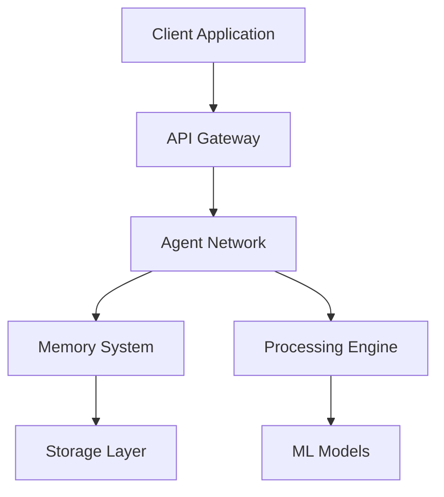

# Core Concepts

This section covers the fundamental concepts and architecture of deanmachines AI platform. Understanding these concepts will help you build more effective AI solutions.

## Platform Overview

deanmachines AI is built on several key pillars:

- **AI Agents**: Autonomous entities that can perceive, decide, and act
- **Memory Systems**: Sophisticated context management and learning capabilities
- **Deployment Infrastructure**: Cloud-native deployment and scaling solutions
- **Network Orchestration**: Management of agent networks and interactions

## Key Components

### AI Agents

[AI Agents](/docs/core-concepts/agents) are the building blocks of our platform. Each agent can:

- Process and understand natural language
- Maintain context across conversations
- Learn from interactions
- Integrate with external systems

### Memory Management

Our [Memory System](/docs/core-concepts/memory) provides:

- Persistent context storage
- Learning and adaptation capabilities
- State management across sessions
- Flexible storage options

### Deployment Options

The [Deployment](/docs/core-concepts/deployment) system offers:

- Multi-cloud deployment support
- Automatic scaling
- Load balancing
- High availability configurations

### Network Architecture

[Agent Networks](/docs/core-concepts/agent-networks) enable:

- Inter-agent communication
- Task distribution
- Resource sharing
- Coordinated decision making

## System Architecture

## Development Flow

1. **Design**: Plan your AI solution architecture
2. **Build**: Create and configure agents
3. **Test**: Validate behavior and performance
4. **Deploy**: Launch in production environment
5. **Monitor**: Track performance and usage
6. **Iterate**: Improve based on feedback

## Best Practices

- Follow the [Security Guidelines](/docs/security)
- Implement proper [Error Handling](/docs/core-concepts/error-handling)
- Use [Monitoring Tools](/docs/core-concepts/monitoring)
- Structure your [Agent Communication](/docs/core-concepts/agent-communication)

## Further Reading

- [Advanced Features](/docs/advanced-features)
- [API Reference](/docs/api-reference)
- [Example Projects](/docs/examples)

<Callout type="info">
  Each concept has its own detailed documentation page. Use the navigation to explore specific topics in depth.
</Callout>
